## QoS

- The Need for QoS

- QoS models

- Classification and Marking

- Policing and Shaping

- Congestion Management and Avoidance

- QoS is a network infrastructure technology that relies on a set of tools and and mechanisms to assign different levels of priority to different IP traffic flows and provides special treatment to higher priority IP traffic flows

- For higher priority IP traffic flows, it reduces packet loss during times of network congestion and also helps control delay (latency) and delay variation (jitter); for low-priority IP traffic flows, it provides a best-effort delivery service

- This is analogous to how a high-occupancy vehicle (HOV) lane, also referred to as a carpool lane works: A special high priority lane is reserved for use of carpools (high-priority traffic), and those who carpool can now freely by bypassing the heavy traffic congestion in the adjacent general-purpose lanes

- Primary goals of implementing QoS on a network:

    - Expediting delivery for real-time applications

    - Ensuring business continuance for business-critical applications

    - Providing fairness for non-business-critical applications when congestion occurs

    - Establishing a trust boundary across the network edge to either accept or reject traffic markings injected by the endpoints

- Tools used by QoS to achieve the goals mentioned above:

    - Classification and marking

    - Policing and shaping

    - Congestion management and avoidance

### The Need for QoS

- Modern real-time multimedia applications such as IP telephony, telepresence, broadcast video, Cisco Webex and IP video surveillance are extremely sensitive to delivery delays and create unique quality of service (QoS) demands on a network

- When packets are delivered using a best-effort delivery model, they may not arrive in order or in a timely manner, and they may be dropped

- For video, this can result in pixelization of the image, pausing choppy video, audio and video being out of sync, or no video at all

- For audio, it could cause echo talker overlap (a walkie-talkie effect where only one person can speak at a time), uninteligible and disorted speech, voice breakups, longs silence gaps, and call drops

- The following are the leading causes of quality issues:

    - Lack of bandwidth

    - Latency and jitter

    - Packet loss

#### Lack of Bandidth

- The available bandwidth on the data path from the source to a destination equals the capacity of the lowest bandwidth link

- When the maximum capacity of the lowest bandwidth link is surpassed, link congestion takes place, resulting in traffic drops

- The obvious solution to this type of problem is to increase the link bandwidth capacity, but this is not always possible, due to budgetarry or technological constraints

- Another option is to implement QoS mechanisms such as policing and queuing to prioritize traffic according to level of importance

- Voice, video and business-critical traffic should get prioritized forwarding and sufficient bandwidth to support their application requirements, and the least important traffic should be allocated the remaining bandwidth

#### Latency and Jitter

- One-way end-to-end delay, also referred to as network latency, is the time it takes for packets to travel across a network from a source to a destination

- ITU Recommendation G.114 recommends that, regardless of the application type, a network latency of 400 ms should not be exceeded, and for real-time traffic network latency should be less than 150 ms; however, ITU and Cisco have demonstrated that real-time traffic quality does not begin to significantly degrade until network latency exceeds 200 ms

- To be able to implement these recommendations, it is important to understand what causes network latency

- Network latency can be broken down into fixed and variable latency:

    - Propagation delay (fixed)

    - Serialization delay (fixed)

    - Processing delay (fixed)

    - Delay variation (variable)

##### Propagation Delay

- Propagation delay is the time it takes for a packet to travel from source to a destination at the speed of light over a medium such as fiber-optic cables or copper wires

- The speed of light is 299,792,458 meters per second in a vacuum

- The lack of vacuum conditions in a fiber-optic cable or a copper wire slows down the speed of light by a ratio known as the refractive index; the larger the refractive index value, the slower light travels

- The average refractive index value of an optical fiber is about 1.5

- The speed of light through a medium v is equal to the speed of light in a vacuum c divided by the refractive index n or v = c / n

- This means that the speed of light through a fiber-optic cable with a refractive index of 1.5 is aproximatively 200,000,000 meters per second (that is 300,000,000 / 1.5)

- In a single fiber-optic cable with a refractive index of 1.5, were laid out around the equatorial circumference of Earth, which is about 40,075 km, the propagation delay would be equal to the equatorial circumference of earth divided by 200,000,000 meters per second

- This is aproximatively 200 ms, which would be an acceptable value even for real-time traffic

- Keep in mind that optical fibers are not always placed over the shortest path between two points

- Fiber-optic cables can be hundreds or even thousands of miles longer than expected

- In addition, other components required by fiber-optic cables, such as repeaters and amplifiers, may introduce additional delay

- A provider's service level agreement (SLA) can be reviewed to estimate and plan for the minimum, maximum and average latency for a circuit

- Sometimes it is necessary to use satellite communication for hard-to-reach locations

- The propagation delay for satellite circuits is the time it takes a radio wave travelling at the speed of light from the Earth's surface to a satellite (which could mean multiple satellite hops) and back to the Earth's surface; depending on the number of hops, this may surpass the recommended 400 ms

- For cases like this there is nothing that can be done to reduce the delay other than to try to find a satellite provider that offers lower propagation delays

#### Serialization Delay

- Serialization delay is the time it takes to place all the bits of a packet onto a link

- It is a fixed value that depends on the link speed; the higher the link speed the lower the delay

- The serialization delay s is equal to the packet size in bits divided by the line speed in bits per second

- For example the serialization delay for a 1500-bytes packet over an 1Gbps interface is 12 us and can be calculated as follows:

    - s = packet size in bits / line speed in bps

    - s = (1500 bytes x 8) / 1Gbps

    - 12,000 bits / 1000.000.000 bps = 0.000012 s x 1000 = .012 ms x 1000 = 12 us

#### Processing Delay

- Processing delay is the fixed ammount of time it takes for a networking device to take the packet from an input interface and place the packet into the output queue of the output interface

- The processing delay depends on factors such as the following:

    - CPU speed (for software-based platforms)

    - CPU utilization (load)

    - IP packet switching mode (process switching, software CEF or hardware CEF)

    - Router architecture (centralized or distributed)

    - Configured features on both input and output interfaces

#### Delay Variation

- Delay variation, also referred to as jitter, is the diference in latency between the packets in a single flow

- For example if one packet takes 50 ms to traverse the network from the source to destination, and the following packet takes 70 ms, the jitter is 20 ms

- The major factors affecting variable delays are queuing delay, dejitter buffers and variable packet sizes

- Jitter is experienced due to queuing delay experienced by packets during periods of network congestion

- Queuing delay depends on the number and sizes of packets already in the queue, the link speeds and the queuing mechanisms

- Queuing introduces unequal delays for packets of the same flow, thus producing jitter

- Voice and video endpoints typically come equipped with de-jitter buffers that can help smooth out changes in packet arrival due to jitter

- A de-jitter buffer is often dynamic and  can adjust for aproximatively 30 ms changes in arrival times of packets

- If a packet is not received within the 30 ms window allowed for by the de-jitter buffer, the packet is dropped, and this affects the overall voice or video quality

- To prevent jitter for high-priority real-time traffic, it is recommended to use queuing mechanisms such as low-latency queuing (LLQ) that allow matching packets to be forwarded prior to any other low priority traffic during periods of network congestion

#### Packet Loss

- Packet loss is usually a result of congestion on an interface

- Packet loss can be prevented by implementing one of the following approaches:

    - Increase link speed

    - Implement QoS congestion-avoidance and congestion-management mechanisms

    - Implement traffic policing to drop low-priority packets and allow high-priority traffic through

    - Implement traffic shaping to delay packets instead of dropping them since traffic may burst and exceed the capacity of an interface buffer. Traffic shaping is not recommended for real-time traffic because it relies on queuing that can cause jitter

- Standard traffic shaping is unable to handle data bursts that occur on a microsecond time interval (that is, micro-bursts)

- Microsecond or low-burst shaping is required for cases where micro-bursts need to be smoothed out by a shaper

### QoS Models

- There are three different QoS implementation models:

    - **Best effort**: QoS is not enabled for this model. It is used for traffic that does not require any special threatment

    - **Intergrated Services (IntServ)**: Applications signal the network to make a bandwidth reservation and to indicate that they require special QoS treatment

    - **Differentiated Services (DiffServ)**: The network identifies classes that require special QoS treatment

- **The IntServ model** was created for real-time applications such as voice and video that require bandwidth, delay and packet-loss guarantees to ensure both predictable and guaranteed service levels

- In this model, applications signal they requirements to the network to reserve end-to-end resources (such as bandwidth) they require to provide an acceptable user experience

- IntServ uses Resource Reservation Protocol (RSVP) to reserve resources throughout a network for a specific application and to provide call admission control (CAC) to guarantee that no other IP traffic can use the reserved bandwidth

- The bandwidth by an application that is not used is wasted

- To be able to provide end-to-end QoS, all nodes, including the endpoints running the applications, need to support, build and maintain RSVP path state for every single flow

- This is the biggest drawback of IntServ because it means it cannot scale well on large networks that might have thousands or milions of flows due to large number of RSVP flows that would need to be maintained

- In the below figure we can see how RSVP issue bandwidth reservations

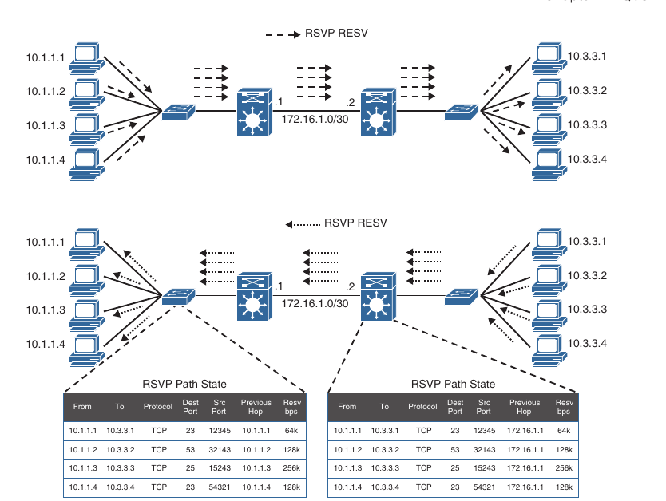

- On the above scheme each of the hosts in the left side (senders) are attempting to establish a one-to-one bandwidth reservation to each of the hosts on the right side (receivers)

- The senders start by sending RSVP PATH messages to the receivers along the same path used by regular data packets

- RSVP PATH messages carry the receiver source address, the destination address, and the bandwidth they wish to reserve

- This information is stored in RSVP path state for each node

- Once the RSVP PATH messages reach the receivers, each receiver sends RSVP reservation request (RESV) messages in the reverse path of the data flow toward the receivers, hop-by-hop

- At each hop, the IP destination address of a RESV message is the IP address of the previous-hop node obtained from the RSVP path state of each node

- As RSVP RESV messages cross each hop, they reserve bandwidth on each of the links for the traffic flowing from the receiver to the sender hosts

- If bandwidth reservations are required from the hosts on the right side to the hosts on the left side, the hosts on the right side need to follow the same procedure of sending RSVP PATH messages, which doubles the RSVP state on each networking device in the data path

- This demonstrates how RSVP state can increase quickly as more hosts reserve bandwidth

- Apart from the scalability issues, long distances between hosts could also trigger long bandwidth reservation delays

- **DiffServ** was designed to address the limitations of the best-effort and IntServ models

- With this model there is no need for a signalling protocol, and there is no RSVP flow state to maintain on every single node, which makes it highly scalable; QoS characteristics (such as bandwidth and delay) are managed on an hop-by-hop basis with QoS policies that are defined independently at each device in the network

- DiffServ is not considered an end-to-end QoS solution because end-to-end QoS guarantees cannot be enforced

- DiffServ divides IP classes and marks it based on business requirements so that each of the classes can be assigned a different level of service

- As IP traffic traverses a network, each of the network devices identifies the packet class by it's marking and services the packets according to it's class

- Many levels of service can be chosen with DiffServ

- For example, IP phone voice traffic is very sensitive to latency and jitter, so it should always been given preferential treatment over all other application traffic

- Email, on the other hand can withstand a great deal of delay and could be given best-effort service, and non-bussiness, non critical scavenger traffic (such as from YouTube) can either be heavily rate-limited or blocked entirely

- The DiffServ model is the most popular and most widely deployed QoS model

### Classification and Marking

- Before any QoS mechanism can be applied, IP traffic must be identified and categorized into different classes based on business requirements

- Network devices use classification to identify IP traffic as belonging to a specific class

- After the IP traffic is classified, marking can be used to mark or color individual packets so that other network devices can apply QoS mechanisms to those packets as they traverse the network

#### Classification

- Packet classification is a QoS mechanism responsible for distinguishing between different traffic streams

- It uses traffic descriptors to categorize an IP packet within a specific class

- Packet classification should take place at the network edge, as close to the source of the traffic as possible

- Once an IP packet is classified, packets can then be marked/remarked, queued, policed, shaped or any combination of these and other actions

- The following traffic descriptors are typically used for classification:

    - **Internal**: QoS groups (logically significant to a router)

    - **Layer 1**: Physical interface, subinterface or port

    - **Layer 2**: MAC address and 802.1Q/p class of service (COS) bits

    - **Layer 2.5**: MPLS experimental (exp) bits

    - **Layer 3**: Differentiated Services Code Points (DSCP), IP Precedence (IPP), and source/destination IP address

    - **Layer 4**: TCP or UDP ports

    - **Layer 7**: Next Generation Network-Based Application Recognition (NBAR2)

- For enterprise networks, the most commonly used traffic descriptors used for classification include the Layer 2, Layer 3, Layer 4 and Layer 7 traffic descriptors

##### Layer 7 Classification

- NBAR2 is a deep packet inspection engine that can classify and identify a wide variety of protocols and applications using Layer 3 to Layer 7 data, including difficult-to-classify applications that dynamically assign Transmission Control Protocol (TCP) or User Datagram Protocol (UDP) port numbers

- NBAR2 can recognize more than 1000 applications, and monthly protocol packs are provided for recognition of new and emerging applications, without requiring an IOS upgrade or router reload

- NBAR2 has two modes of operation:

    - **Protocol Discovery**: Protocol Discovery enables NBAR2 to discover and get real-time statistics on applications currently running on the network. These statistics from the protocol discovery mode can be used to define QoS classes and policies using MQC configuration

    - **Modular QoS CLI (MQC)**: Using MQC network traffic matching a specific application such as Cisco Webex can be placed into one traffic class, while traffic that matches a different network protocol, such as YouTube can be placed into another traffic class. After traffic has been classified in this way, different QoS policies can be applied to different classes of traffic

#### Marking

- Packet marking is a QoS mechanism that colors a packet by changing a field within a packet or a frame header with a traffic descriptor so it is destinguished from other packets during the application of other QoS mechanisms (such as re-marking, policing, queuing or congestion avoidance)

- The following traffic descriptors are used for marking traffic:

    - **Internal**: QoS groups

    - **Layer 2**: 802.1Q/p Class of Service (CoS) bits

    - **Layer 2.5**: MPLS Experimental (EXP) bits

    - **Layer 3**: Differentiated Services Code Points (DSCP) and IP Precedence (IPP
    
- QoS groups are used to mark packets as they are received and processed internally within the router and are automatically removed when packets egress the router

- They are used only in special cases in which traffic descriptors marked or received on an ingress interface would not be visible for packet classification on egress interfaces due to encapsulation or de-encapsulation

- For enterprise networks, the most commonly used traffic descriptors include the Layer 2 and Layer 3 traffic descriptors

##### Layer 2 Marking

- The 802.1Q standard is an IEEE specification for implementing VLANs in Layer 2 switched networks

- The 802.1Q specification defines 2 2-byte fields: Tag Protocol Identifier (TPID) and Tag Control Information (TCI), which are inserted into an Ethernet frame, following the Source Address Field.

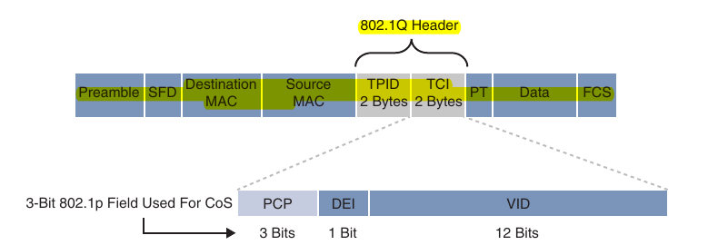

- The TPID value is a 16-bit field assigned the value 0x8100 that identifies it as an 802.1q tagged frame

- The TCI field is a 16-bit field composed of the following three fields:

    - Priority Code Point (PCP) field - 3 bits

    - Drop Eligible Indicator (DEI) field - 1 bit

    - VLAN identifier (VLAN ID) field - 12 bits

- Priority Code Point (PCP):

    - The specifications of the 3-bit PCP field are defined by IEEE 802.1p specification

    - This field is used to mark packets as belonging to a specific COS

    - The COS marking allows a Layer 2 Ethernet Frame to be marked with 8 different levels of priority values, 0 to 7, where 0 is the lowest priority and 7 is the highest

    - 802.1p specification standard definition for each COS:

    ```
    PCP value priority      Acronym         Traffic type
    0 (lowest)              BK              Background
    1 (Default)             BE              Best Effort
    2                       EE              Excellent Effort
    3                       CA              Critical Applications
    4                       VI              Video with < 100 ms latency and jitter
    5                       VO              Voice with < 10 ms latency and jitter
    6                       IC              Internetwork Control
    7 (highest)             NC              Network control                       
    ```

    - One drawback of using CoS markings is that frames lose their CoS markings when traversing a non 802.1Q link or a Layer 3 network

    - For this reason the packets should be marked with other higher-layer markings whenever possible so the marking values can be preserved end-to-end

    - This is typically accomplished by mapping a CoS marking into another marking 

    - For example the CoS priority levels correspond directly to IPv4's IP precedence Type of service (TOS) values so they can be mapped directly to each other

- Drop Eligible Indicator (DEI)

    - The DEI field is a 1-bit field that can be used independently or in conjunction with PCP to indicate frames that are eligible to be dropped during times of congestion

    - The default value for this field is 0, and it indicates that this frame is not drop eligible; it can be set to 1 to indicate that the frame is drop eligible

- VLAN Identifier (VLAN ID)

    - The VLAN ID field is a 12-bit field that defines the VLAN used by 802.1Q

    - Since this field is 12-bits, it restricts the number of VLANs supported by 802.1Q by 4096, which may not be sufficient for large enterprise and service provider networks

##### Layer 3 marking

- As a packet travels from it's source to it's destination it might traverse non 802.1Q trunked or non-Ethernet links that do not support the CoS field

- Using marking at Layer 3 provides a more persistent marker that is preserved end-to-end

- The ToS/DiffServ field within an IPv4 header can be seen below

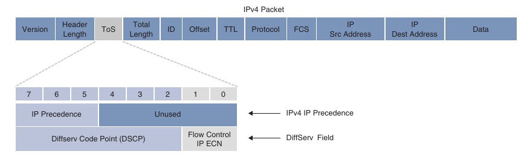

- The ToS field is a 8-bit field where only the first 3 bits of the ToS field, referred to as IP Precedence (IPP), are used for marking, and the rest of the bits are unused

- IPP values, which ranges from 0 to 7, allow traffic to be partitioned in up to 6 usable classes of service; IPP 6 and 7 are reserved for internal network use

- Newer standards redefined the IPv4 ToS and the IPv6 Traffic Class fields as an 8-bit Differentiated Services (DiffServ) field

- The DiffServ field uses the same 8 bits that were previously used for IPv4 ToS and IPv6 Traffic Class fields, and this allows it to be backward compatible with IP Precedence

- The DiffServ field is composed of a 6-bit Differentiated Services Code Point (DSCP) field that allows for classification of up to 64 values (0 to 63) and 2-bit Explicit Congestion Notification (ECN) field

#### DSCP Per-hop Behaviours

- Packets are classified and marked to receive a particular per-hop forwarding behaviour (that is expedited, delayed or dropped) on network nodes along their path to the destination

- The DiffServ field is used to mark packets according to their classification into DiffServ Behavior Aggregates (BAs)

- A DiffServ BA is a collection of packets with the same DiffServ value crossing a link in a particular direction

- Per-hop behavior (PHB) is the externally observable behavior (forwarding treatment) applied to a DiffServ compliant node to a collection of packets with the same DiffServ value crossing a link in a particular direction (DiffServ BA)

- In other words, PHB is expediting, delaying or dropping a collection of packets by one or multiple QoS mechanisms on a per-hop basis based on the DSCP value

- A DiffServ BA could be multiple applications, for example Telnet, SSH, and SNMP, all aggregated together and marked with the same DSCP value

- This way the core of the network performs only one PHB, based on DiffServ BAs while the network edge performs classification, marking, policing and shaping operations

- This makes the DiffServ QoS model very scalable

- Four PHBs have been defined and characterized for general use:

    - **Class Selector (CS) PHB**: The first 3 bits of the DSCP field are used as CS bits. The CS bits make DSCP compatible with IP Precedence, because IP Precedence uses the same 3 bits to determine class

    - **Default Forwarding (DF) PHB**: Used for best-effort service

    - **Assured Forwarding (AF) PHB**: Used for guaranteed bandwidth service

    - **Expedited Forwarding (AF) PHB**: Used for low-delay service

##### Class Selector (CS) PHB

- RFC 2474 made the ToS field obsolete by introducing the DiffServ field, and the Class Selector (CS) PHB was defined to provide backward compatibility with IP Precedence (IPP)

```
|7|6|5|4|3|2|1|0|

7 + 6 + 5 + 4 + 3 + 2 => DSCP field

7 + 6 + 5 => Class Selector bits (IP Precedence)

4 + 3 + 2 = 000 => Class Selector (CS)
```

- Packets with higher IP Precedence should be forwarded in less time than packets with lower IP Precedence

- The last 3 bits of the DSCP (bits 2 to 4), when set to 0, identify a Class Selector PHB, but the Class Selector bits 5 to 7 are the ones where IP Precedence is set

- Bits 2 to 4 are ignored by non-DiffServ-compliant devices performing classification based on IP Precedence

- There are 8 CS classes, ranging from CS0 to CS7, that correspond directly with the eight IP Precedence values

##### Default Forwarding (DF) PHB

- Default Forwarding (DF) and Class Selector 0 (CS0) provide best-effort behavior and use the DS value 000000

```
|7|6|5|4|3|2|1|0|

7 + 6 + 5 + 4 + 3 + 2 => DSCP field

7 + 6 + 5 + 4 + 3 + 2 = 000000 => Default Forwarding (DF)
```

- Default Best Effort forwarding is also applied to packets that cannot be classified by a QoS mechanism such as Queuing, Shaping or Policing

- This usually happens when a QoS policy on the node is incomplete or when DSCP values are outside the ones that have been defined for the CS, AF and EF PHBs

##### Assured Forwarding (AF) PHB

- The AF PHB guarantees a certain amount of bandwidth to an AF class and allows access to extra bandwidth, if available

- Packets requiring AF PHB should be marked with DSCP value aaadd00, where aaa is the binary value of the AF class (bits 5 to 7), and dd (bits 2 to 4) is the drop probability where bit 2 is used and always set to 0

```
|7|6|5|4|3|2|1|0|

7 + 6 + 5 + 4 + 3 + 2 => DSCP field

7 + 6 + 5 => aaa

4 + 3 + 2 => dd

AF class name           AF IP Precedence(bin)               AF IP Precedence dec(x)

AF1                         001                                 1

AF2                         010                                 2

AF3                         011                                 3

AF4                         100                                 4


Drop Probability Dec (y)            Drop Probability Bin

    1                                   01

    2                                   10

    3                                   11
```

- There are 4 standard defined AF classes: AF1, AF2, AF3, and AF4

- The AF class number does not represent precedence; AF4 does not get any preferential treatment over AF1

- Each class should be threated independently and placed into different queues

- Below we can see how each EF class is assigned an IP Precedence (under AF class value Bin) and has three drop probabilities: low, medium and high

- The AF name (AFxy) is composed of AF IP Precedence value in decimal (x) and the Drop Probability value in decimal (y)

- For example AF41 is a combination of IP Precedence 4 and Drop Probability 1

- To quickly convert the AF name to a DSCP value in decimal, use the formula 8x + 2y

- For example, the DSCP value AF41 is 8 * (4) + 2 * (1) = 34

- AF PHB with decimal and binary equivalents

```
AF class name   AF IP Precedence    AF IP Precedence    Drop Probability    Drop Probability    Drop Probability    AF name     DSCP value      DSCP value
                    decimal (x)         bin                                     value(bin)          value(dec) (y)      xy          bin             dec

AF1                 1                   001                 Low                 01                      1           AF11            001010          10

AF1                 1                   001                 Medium              10                      2           AF12            001100          12

AF1                 1                   001                 High                11                      3           AF13            001110          14

AF2                 2                   010                 Low                 01                      1           AF21            010010          18

AF2                 2                   010                 Medium              10                      2           AF22            010100          20

AF2                 2                   010                 High                11                      3           AF23            010110          22

AF3                 3                   011                 Low                 01                      1           AF31            011010          26

AF3                 3                   011                 Medium              10                      2           AF32            011100          28

AF3                 3                   011                 High                11                      3           AF33            011110          30

AF4                 4                   100                 Low                 01                      1           AF41            100010          34

AF4                 4                   100                 Medium              10                      2           AF42            100100          36

AF4                 4                   100                 High                11                      3           AF43            100110          38

```

- In RFC 2597, drop probability is referred to as drop precedence

- An AF implementation must detect and respond to long-term congestion with each class by dropping packets using a congestion-avoidance algorithm such as weighted random early detection (WRED)

- WRED uses the AF drop probability value within each class - where 1 is the lowest possible value, and 3 is the highest possible value - to determine which packets should be dropped first during periods of congestion

- It should also be able to handle short-term congestion resulting from bursts if each class is placed in a separate queue, using a queuing algorithm such as CBWFQ (Class Based Weighted Fair Queuing)

- The AF specification does not define the use of any particular algorithms for queuing and congestion avoidance, but it does specify the requirements and properties of such algorithms

##### Expedited Forwarding (EF) PHB

- The EF PHB can be used to build a low-loss, low-latency, low-jitter, assured bandwidth end-to-end service

- The EF PHB guarantees bandwidth by ensuring a minimum departure rate and provides the lowest possible delay to delay-sensitive applications by implementing low-latency queuing

- It also prevents starvation of other applications or classes that are not using the EF PHB by policing EF traffic when congestion occurs

- Packets requiring EF should be marked with DSCP binary value 101110 (46 in decimal)

- Bits 5 to 7 (101) of the EF DSCP value map directly to IP Precedence 5 (for backward compatibility with non-DiffServ-compliant devices)

- IP Precedence 5 is the highest user-definable IP Precedence value and is used for real-time delay-sensitive traffic (such as VoIP)

- Below are included all the DSCP PHB (DF, CS, AF and EF) with their decimal and binary equivalents 

```
DSCP Class          DSCP Value          DSCP Value              Drop Propability            Equivalent IP Precedence
                        bin                 dec                                                 value

DF(CS0)             000000              0                                                       0

CS1                 001000              8                                                       1

AF11                001010              10                          Low                         1

AF12                001100              12                          Medium                      1

AF13                001110              14                          High                        1

CS2                 010000              16                                                      2

AF21                010010              18                          Low                         2

AF22                010100              20                          Medium                      2

AF23                010110              22                          High                        2

CS3                 010000              24                                                      3

AF31                010010              26                          Low                         3

AF32                010100              28                          Medium                      3

AF33                010110              30                          High                        3

CS4                 100000              32                                                      4

AF41                100010              34                          Low                         4

AF42                100100              36                          Medium                      4

AF43                100110              38                          High                        4

CS5                 101000              40                                                      5

EF                  101110              46                                                      5

CS6                 110000              48                                                      6

CS7                 111000              56                                                      7
```

#### Scavenger Class

- The scavenger class is intended to provide less than best-effort services

- Applications assigned to the scavenger class have little or no contribution to the business objectives of an organization and are typically entertainment-related applications

- These include Peer-to-peer applications (such as torrent), gaming applications (such as Minecraft, Fortnite), and entertainment video applications (YouTube, Vimeo, Netflix)

- These types of applications are usually heavy rate limited or blocked entirely

- Something very peculiar about the scavenger class is that it is intended to be lower in priority than a best-effort service

- Best-effort traffic uses a DF PHB with a DSCP value of 000000 (CS0)

- Since there are no negative DSCP values, it was decided to use CS1 as the marking for scavenger traffic (defined in RFC 4594)

#### Trust Boundary

- To provide an end-to-end and scalable QoS experience, packets should be marked by the endpoint or as close to the endpoint as possible

- When an endpoint marks a frame or a packet with a COS or DSCP value, the switch port it is attached to can be configured to accept to reject the COS or DSCP values

- If the switch accepts the values, it means it trusts the endpoint and does not need to do any packet reclassification and remarking for the received endpoint's packets

- If the switch does not trust the endpoint, it rejects the markings and reclassifies and re-marks the received packets with the appropriate CoS or DSCP value

- For example, in a campus network with IP telephony and host endpoints, the IP Phones by default mark voice traffic with a CoS value of 5 and DSCP value of 46 (EF), while incoming traffic from an endpoint (such as PC) attached to the IP Phone's switch port is remarked to a CoS value of 0 and DSCP value of 0

- Even if the endpoint is sending tagged frames with a specific CoS or DSCP values, the default behavior of Cisco IP Phones is to not trust the endpoint and 0 out the CoS and DSCP values before sending the frames to the switch

- When the IP Phone sends voice and data traffic to the switch, the switch can classify voice traffic as higher priority than the data traffic, thanks to the high-priority CoS and DSCP markings for voice traffic

- For scalability, trust boundary should be done as close to the endpoint as possible

- Below the trust boundaries are illustrated at different points on the campus network, where 1 and 2 are optimal, and 3 is acceptable only when the access switch is not capable of performing classification

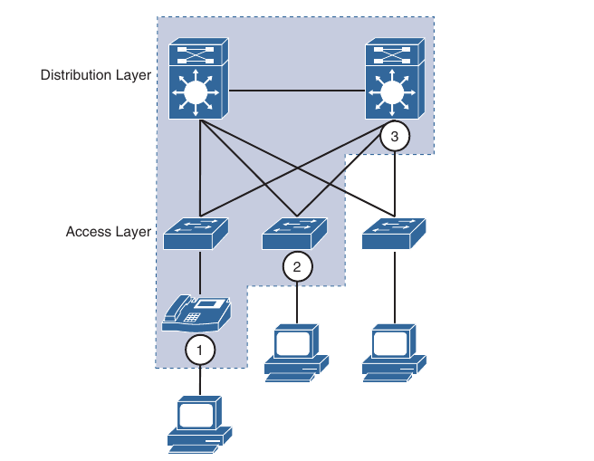

#### A Practical Example: Wireless QoS

- A wireless network can be configured to leverage QoS mechanisms

- For example, a wireless LAN controller (WLC) sits at the boundary between wireless and wired networks, so it becomes a natural location for a QoS trust boundary

- Traffic entering and exiting the WLC can be classified and marked so that it can be handled appropriately as it is transmitted over the air and onto the wired network

- Wireless QoS can be uniquely defined on each LAN (WLAN), using the following 4 traffic categories listed below

- Notice that the category names are human-readable words that translate to specific 802.1p and DSCP values

```
QoS Category            Traffic Type            802.1p Tag              DSCP Value

Platinum                Voice                   5                       46 (EF)

Gold                    Video                   4                       34 (AF41)

Silver                  Best Effort (default)   0                       0

Bronze                  Background              1                       12 (AF11)
```

- When you create a new WLAN, it's QoS policy defaults to Silver, or best-effort handling

- For a WLAN named "voice", that need to carry voice traffic, it's QoS policy should be set to Platinum

- Wireless voice traffic will then be classified for low latency and low jitter and marked with an 802.1p CoS value of 5 and a DSCP value of 46 (EF)

- On old WLC versions:

- WLANs -> Edit/add WLAN -> QoS -> Set the QoS category

- Newer WLC (9800)

- Configuration ->Wireless setup -> Basic -> Add/Edit WLAN -> QoS (select QoS profile)

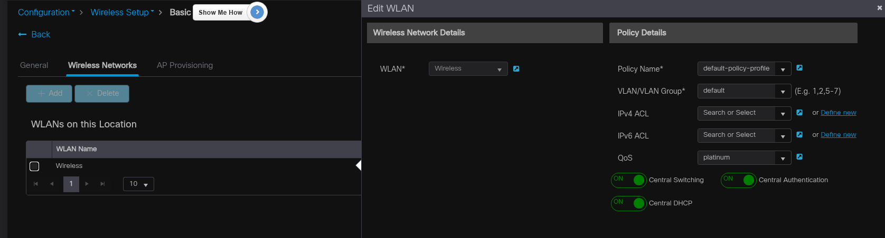

### Policing and Shaping

- Traffic policers and shapers are traffic-conditioning QoS mechanisms used to classify traffic and enforce other QoS mechanisms such as rate-limiting

- They classify traffic in an identical manner but differ in their implementation:

    - **Policers**: Drop or re-mark incoming and outgoing traffic that goes beyond a desired traffic rate

    - **Shapers**: Buffer and delay egress traffic rates that momentarily peak above the desired rate until the egress traffic rate drops below the defined traffic rate. If the egress traffic rate is below the desired rate, the traffic is sent immediately

- Below we can see the difference between traffic policing and shaping

- Policers drop or remark excess traffic, while shapers buffer and delay excess traffic

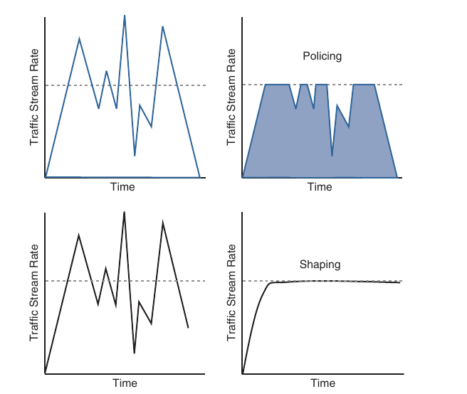

#### Placing Policers and Shapers on the network

- Policers for incoming traffic are most optimally deployed at the edge of the network to keep traffic from wasting valuable bandwidth in the core of the network

- Policers for outbound traffic are most optimally deployed at the edge of the network or core-facing interfaces on network edge devices

- A downside of policing is that it causes TCP retransmissions when it drops traffic

- Shapers are used for egress traffic and typically deployed by enterprise networks on service provider (SP)-facing interfaces

- Shaping is useful in cases where SPs are policing incoming traffic or when SPs are not policing traffic but do have a maximum traffic rate SLA, which, if violated could incur monetary penalties

- Shaping buffers and delays traffic rather than dropping it, and this causes fewer TCP retransmissions compared to policing

#### Markdown

- When a desired traffic rate is exceeded, a policer can take one of the following actions:

    - Drop the traffic

    - Mark down the excess traffic with a lower priority

- Marking down the excess traffic involves re-marking the packets with a lower priority class value; for example excess traffic marked with AFx1 should be marked down to AFx2 (or AFx3 if using two-rate policing)

- After marking down the traffic, congestion-avoidance mechanisms, such as DSCP-based weighted random early detection (WRED), should be configured throughout the network to drop AFx3 more aggresively than AFx2 and drop AFx2 more agressively than AFx1

#### Tocken Bucket Algorithms

- Cisco IOS policers and shapers are based on tocken-bucket algorithms

- Definitions used to explain how tocken bucket algorithms operate:

    - **Commited Information Rate (CIR)**: The policed traffic rate, in bits per second (bps), defined in the traffic contract

    - **Commited Time Interval (Tc)**: The time interval, in miliseconds (ms), over which the commited burst (Bc) is sent. Tc can be calculated with the formula Tc = (Bc [bits] / CIR [bps]) * 1000

    - **Commited Burst Size (Bc)**: The maximum size of the CIR tocken bucket, measured in bytes, and the maximum amount of traffic that can be sent within a Tc. Bc can be calculated with the formula Bc = CIR * (Tc / 1000)

    - **Token**: A single token represents 1 byte or 8 bits

    - **Token bucket**: A bucket that accumulates tokens until a maximum predefined number of tokens is reached (such as the Bc when using a single token bucket); these tokens are added into the bucket at a fixed rate (the CIR). Each packet is checked for conformance to the defined rate and takes tokens from the bucket equal to it's packet size; for example if the packet size is 1500 bytes, it takes 12.000 bits (1500 * 8) from the bucket

    - If there are not enough tokens in the token bucket to send the packet, the traffic conditioning mechanism can take one of the following actions:

        - Buffer the packets while waiting for enough tokens to accumulate in the token bucket (traffic shaping)

        - Drop the packets (traffic policing)

        - Mark down the packets (traffic policing)

- It is recommended for the Bc value to be larger than or equal to the size of the largest possible IP packet in a traffic stream

- Otherwise there will never be enough tokens in the tocken bucket for larger packets, and they will always exceed the defined rate

- If the bucket fills up to the maximum capacity, newly added tokens are discarded

- Discarded tokens are not available for use in future packets

- Token bucket algorithms may use one or multiple token buckets

- For single token bucket algorithms, the measured traffic rate can conform to or exceed the defined traffic rate

- The measured traffic rate is conforming if there are enough tokens in the token bucket to transmit the traffic

- The measured traffic rate is exceeding if there are not enough tokens in the token bucket to transmit the traffic

- The concept of single token bucket algorithm

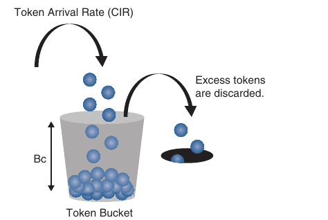

- To understand how the single token bucket algorithms operate in more detail, assume that a 1 Gbps interface is configured with a policer defined with a CIR of 120 Mbps and a Bc of 12 Mb

- The Tc value cannot be explicitly defined in IOS, but it can be calculated as follows:

    - Tc = (Bc [bits] / CIR [bps]) * 1000

    - Tc = (12 Mb / 120 Mbps) * 1000

    - TC = (12.000.000 bits / 120.000.000 bps) * 1000 = 100 Ms

- Once the Tc value is known, the number of Tcs within a second can be calculated as follows:

    - TCs per second = 1000 / Tc

    - TCs per second = 1000 / 100 Ms = 10 Tcs

- If a continuous stream of 1500 byte (12.000-bit) packets is processed by the token algorithm, only a Bc of 12 Mb can be taken by the packets within each Tc (100 ms)

- The number of packets that conform to the traffic rate and are allowed to be transmitted can be calculated as follows:

    - Number of packets that conform within each Tc = Bc / packet size in bits (rounded down)

    - Number of packets that conform within each TC = 12.000.000 bits / 12.000 bits = 1000 packets

- Any aditional packets beyond 1000 will either be dropped or marked down

- To figure out how many packets will be sent in one second, the following formula can be used:

    - Packets per second = Number of packets that conform within each Tc * Tcs per second

    - Packets per second = 1.000 packets * 10 intervals = 10.000 packets

- To calculate the CIR for the 10.000 packets the following formula can be used:

    - CIR = Packets per second * Packet size in bits

    - CIR = 10000 * 12.000 bits = 120.000.000 bps = 120 Mbps

- To calculate the time interval it would take for the 1000 packets to be sent at interface line rate the following formula can be used:

    - Time interval at line rate = (Bc [bits] / Interface speed [bps]) * 1000

    - Time interval at line rate = (12 Mb / 1Gb) * 1000

    - Time interval at line rate = (12.000.000 bits / 1.000.000.000 bps) * 1000 = 12 ms

- Below we can see how the Bc (1000 packets at 1500 bytes each, or 12 Mb) is sent every Tc interval

- After the Bc is sent, there is an interpret delay of 113 ms (125 ms - 12 ms) within the Tc where there is no data transmitted

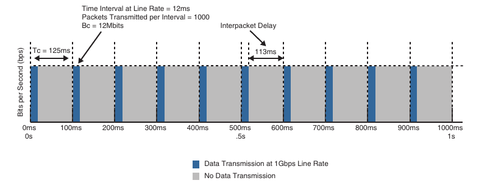

- The recommended values for Tc range from 8 ms to 125 ms

- Shorter Tcs, such as 8 ms to 10 ms, are necessary to reduce interpacket delay for real-time traffic such as voice

- Tcs longer than 125 ms are not recommended for most networks because the interpacket delay becomes too large

#### Types of Policers

- There are different policing algorithms including the following:

    - Single-rate two-color marker/policer

    - Single-rate three-color marker/policer (srTCM)

    - Two-rate three-color marker/policer (trTCM)

##### Single-rate Two-color Markers/Policers

- The first policers implemented use a single-rate two-color model based on the single token bucket algorithm

- For this type of policer, traffic can be either conforming to or exceeding the CIR

- Marking down or dropping actions can be performed for each of the two states

- Below we can see different actions that the single-rate two-color policer can take

- The part above the dotted line on the left side's figure represent traffic that exceeded the CIR and was marked down

- The section above the dotted line on the right side of the figure represents traffic that exceeded the CIR and was dropped

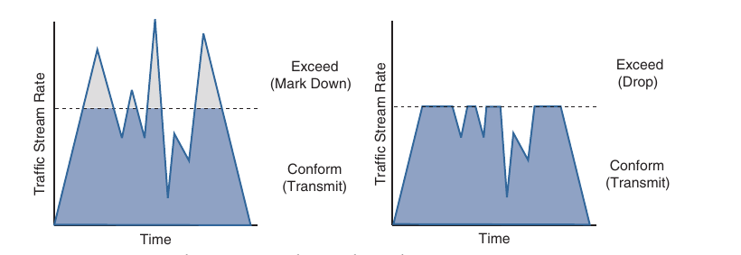

##### Single-rate Three-color Markers/Policers (srTCM)

- Single-rate three-color policer algorithms are based on RFC 2697

- This type of policer uses two token buckets, and the traffic can be classified as either conforming to, exceeding or violating the CIR

- Marking down or dropping actions are performed for each of the three states of the traffic

- The first token bucket operates very similarly to the single-rate two-color system; the difference is that if there are any tokens left over in the bucket after each time period due to low or no activity, instead of discarding the access tokens (overflow), the algorithm places them in a second bucket to be used later for temporary bursts that may exceed the CIR

- Tokens placed in this second bucket are referred to as the exceed burst (Be), and Be is the maximum number of bits that can exceed the Bc burst size

- With the two token bucket mechanism, traffic can be classified in three colors or states, as follows:

    - **Conform**: Traffic under Bc is classified as conforming and green. Conforming traffic is usually transmitted and can optionally be re-marked

    - **Excess**: Traffic under Bc but Be is classified as exceeding and yellow. Exceeding traffic can be dropped or marked down and transmitted

    - **Violate**: Traffic over Be is classified as violating and red. This type of traffic is usually dropped but can be optionalled marked down and transmitted

- Below we can see different actions that single-rate three-rate policer can take

- The section below the dotted line of the left side of the figure represents the traffic that conformed to the CIR, the section right above the straight dotted line represents the exceeding traffic that was marked down, and the top section represents the violating traffic that was also marked down

- The exceeding and violating traffic rates vary because they rely on random tokens splitting over from the Bc bucket into the Be

- The section right above the straight dotted line on the right side of the figure represents traffic that exceeded the CIR and was marked down, and the top section represents traffic that violated the CIR and was dropped

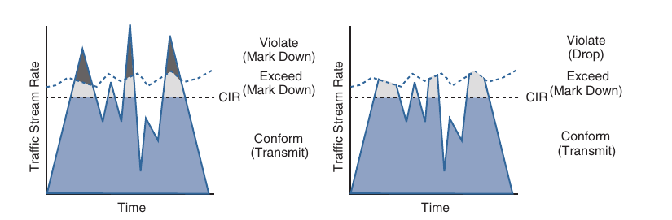

- The single-rate three-color marker/policer uses the following parameters to meter the traffic stream:

    - **Commited Information Rate (CIR)**: The policed rate

    - **Commited Burst Size (Bc)**: The maximum size of CIR token bucket, measured in bytes. Referred to as Commited Burst Size (CBS) in RFC 2697 

    - **Excess Burst Size (Be)**: The maximum size of the excess token bucket, measured in bytes. Referred to as Excess Burst Size (EBS) in RFC 2697

    - **Bc Bucket Token Count (Tc)**: The number of tokens in the Bc bucket. Not to be confuses with the commited time interval (Tc)

    - **Be Bucket Token Count (Te)**: The number of tokens in the Be bucket

    - **Incoming packet length**: The packet length of the incoming packet in bits

- Below we can see the logical flow of the single-rate three-color marker/policer two-bucket algorithm

- The single-rate three-color policer's two-bucket algorithm causes fewer TCP retransmissions and is more efficient for bandwidth utilization

- It is the perfect policer to be used with AF classes (AFx1, AFx2 and AFx3)

- Using a three-color policer makes sense only if the actions taken for each color differ

- If the actions for two or more colors are the same, for example, conform and exceed both transmit without re-marking, the single-rate two-policer policer is recommended to keep things simple

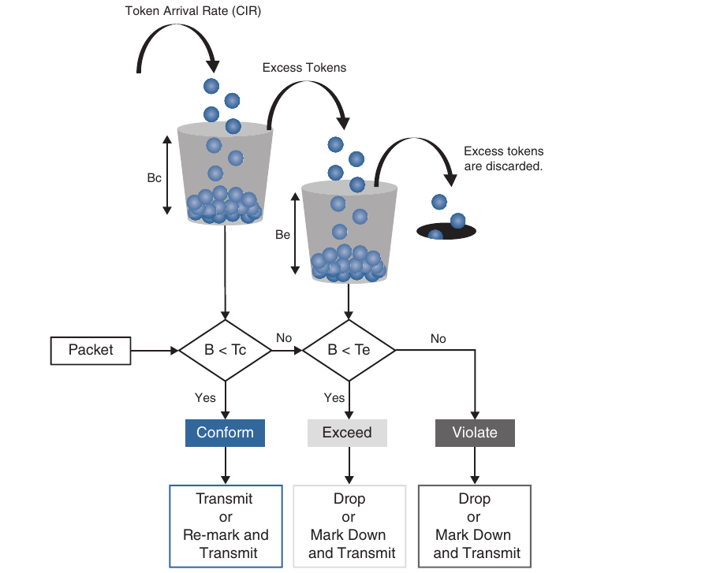

##### Two-Rate Three-Color markers/policers

- The two-rate three-color marker/policer is based on RFC 2698 and is similar to the single-rate three-color policer

- The difference is that single-rate three-policers rely on excess tokens from the Bc bucket, which introduces a certain level of variability and unpredictability in traffic flows; the two-rate three-color markers/policers address this issue by using two distinct rates, the CIR and the Peek Information Rate (PIR)

- The two-rate three-color marker/policer allows for a sustained excess rate based on the PIR that allows for different actions for traffic exceeding the different burst values; for example violating traffic can be dropped at a defined rate, and this is something that is not possible with the single-rate three-color policer

- The image below illustrates how violating traffic that exceeds the PIR can either be marked down (on the left side of the figure) or dropped (on the right side of the figure)

- Comparing the next figure with the above one to see the difference between the two-rate three-color policer and the one-rate three-color policer

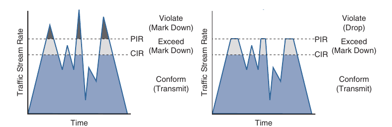

- The two-rate three-color marker/policer uses the following parameters to meter the traffic stream:

    - **Commited Information Rate (CIR)**: The policed rate

    - **Peak Information Rate (PIR)**: The maximum rate of traffic allowed. PIR should be equal to or greater than the CIR

    - **Commited Burst Size (Bc)**: The maximum size of the second token bucket, measured in bytes. Referred to as Commited Burst Size (CBS) in RFC 2698

    - **Peak Burst Size (Be)**: The maximum size of the PIR token bucket measured in bytes. Referred to as Peak Burst Size (PBS) in RFC 2698. Be should be equal or greater than Bc

    - **Bc Bucket Token Count (Tc)**: The number of tokens in the Bc bucket. Not to be confused with the commited time interval (Tc)

    - **Bp Bucket Token Count (Tp)**: The number of tokens in the Bp bucket

    - **Incoming Packet Length (B)**: The packet length of the incoming packet in bits

- The two-rate three-color policer also use two token buckets, but the logic varies from that of the single-rate three-color policer

- Instead of transferring unused tokens from the Bc bucket to the Be bucket, this policer has two separate buckets that are filled with two separate token rates

- The Be bucket is filled with the PIR tokens and the Bc bucket is filled with the CIR tokens

- Be represents the peak limit of traffic that can be sent during a subsecond interval

- The logic varies further in that the initial check is to see whether the traffic is within the PIR

- Only then the traffic is compared against the CIR

- In other words, a violate condition is checked first, then an exceed condition, and finally a conform condition, which is the reverse of the logic of the single-rate three-color policer

- The above figure illustrates the token bucket algorithm for the two-rate three-color marker/policer

- Compare it with the figure from above to see the differences between the two

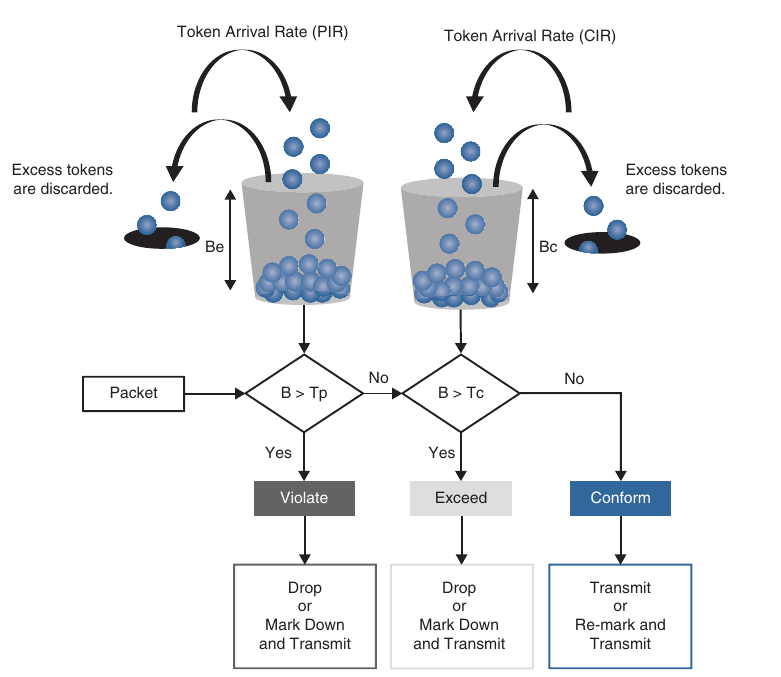

### Congestion Management and Avoidance

- Queuing algorithms used for congestion management as well as packet-drop techniques that can be used for congestion avoidance

- These tools provide a way for managing excessive traffic during periods of congestion

#### Congestion Management

- Congestion management involves a combination of queuing and scheduling

- Queuing (also known as buffering) is the temporary storage of excess packets

- Queuing is activated when an output interface is experiencing congestion and deactivated when congestion clears

- Congestion is detected by the queuing algorithm when a Layer 1 hardware queue present on physical interface, known as the transmit ring (Tx-Ring or TxQ), is full

- When the Tx-ring is not full anymore, this indicates that there is no congestion on the interface, and queuing is deactivated

- Congestion can occur for one of these two reasons:

    - The input interface is faster than the output interface

    - The output interface is receiving packets from multiple input interfaces

- When congestion is taking place, the queues fill up, and packets can be reordered by some of the queuing algorithms so that higher-priority packets exit the output interface sooner than lower-priority ones

- At this point, a scheduling algoritm decides which packet to transmit next

- Scheduling is always active, regardless of whether the interface is experiencing congestion

- There are many queuing algorithms available, but most of them are not adequate for modern rich-media networks carrying voice and high-definition video traffic because they were designed before these traffic types came to be

- The legacy queuing algorithms in the MQC architecture include the following:

    - **First-in, first-out queuing (FIFO)**: FIFO involves a single queue where the first packet to be placed on the output interface queue is the first packet to leave the interface (first come, first served). In FIFO queuing, all traffic belong to the same class

    - **Round robin**: With round-robin, queues are serviced in sequence one after the other, and each queue processes one packet only. No queues starve with round robin because every queue gets an opportunity to send one packet every round. No queue has priority over the others, and if packet sizes from all queues are about the same, the interface bandwidth is shared equally across the round robin queues. A limitation of round robin is that it does not include a mechanism to prioritize traffic

    - **Weighted round robin (WRR)**: WRR was developed to provide prioritization capabilities for round robin. It allows a weight to be assigned to each queue, and based on that weight, each queue effectively receives a portion of the interface bandwidth that is not necessarily equal to the other queue's portions

    - **Custon queuing (CQ)**: CQ is a Cisco implementation of WRR that involves a set of 16 queues with a round-robin scheduler and FIFO queuing within each queue. Each queue can be customized with a portion of link bandwidth for each selected traffic type. If a particular type of traffic is not using the bandwidth reserved for it, other traffic types may use the unused bandwidth. CQ causes long delays and also suffers from all the same problems as FIFO within each of the 16 queues that it uses for traffic classification

    - **Priority queuing (PQ)**: With PQ, a set of four queues (high, medium, normal and low) are served in strict-priority order, with FIFO queuing within each queue. The high-priority queue is always serviced first, and lower-priority queues are serviced only when all higher-priority queues are empty. For example, the medium queue is serviced only when the high-priority queue is empty. The normal queue is serviced only when the high and medium queues are empty; finally the low queue is serviced only when all other queues are empty. At any point in time, if a packet arrives for a higher queue, the packet from the higher queue is processed before any packets in lower-level queues. For this reason, if the higher priority queues are continuously being serviced, the lower-priority queues are starved

    - **Weighted fair queuing (WFQ)**: The WFQ algorithm automatically divides the interface bandwidth by the number of flows (weighted by IP Precedence) to allocate bandwidth fairly among all flows. This method provides better service for high-priority real-time flows but can't provide a fixed-bandwidth guarantee for any particular flow

- The current queuing algorithms recommended for rich-media networks (and supported by MQC) combines the best features of the legacy algorithms

- These algorithms provide real-time, delay-sensitive traffic bandwidth and delay guarantees while not starving other types of traffic

- The recommended queuing algorithms include the following:

    - **Class-based weithted fair queuing (CBWFQ)**: CBWFQ enables the creation of up to 256 queues, serving up to 256 traffic classes. Each queue is serviced based on the bandwidth assigned to that class. It extends WFQ functionality to provide support for user-defined traffic classes. With CBWFQ, packet classification is done based on traffic descriptors such as QoS markings, protocols, ACLs and input interfaces. After a packet is classified as belonging to a specific class, it is possible to assign bandwidth, weight, queue limit and maximum packet limit to it. The bandwidth assigned to a class is the minimum bandwidth delivered to the class during congestion. The queue limit for that class is the maximum number of packes allowed to be buffered in the class queue. After a queue has reached the configured queue limit, excess packets are dropped. CBWFQ by itself does not provide a latency guarantee and is only suitable for non-real time data traffic

    - **Low-latency queuing (LLQ)**: LLQ is CBWFQ combined with priority queuing (PQ) and it was developed to meet the requirements of real-time traffic, such as voice. Traffic assigned to the strict-priority queue is serviced up to it's assigned bandwidth before other CBWFQ queues are serviced. All real-time traffic should be configured to be serviced by the priority queue. Multiple classes of real-time traffic can be defined, and separate bandwidth guarantees can be given to each, but a single priority queue schedules all the combined traffic. If a traffic class is not using the bandwidth assigned to it, it is shared among the other classes. This algorithm is suitable for combinations of real-time and non-real-time traffic. It provides both latency and bandwidth guarantees to high-priority real-time traffic. In the event of congestion, real-time traffic that goes beyond the assigned bandwidth guarantee is policed by a congestion-aware policer to ensure that non-priority traffic is not starved

- Below we can see the architecture of CBWFQ in combination with LLQ

- CBWFQ in combination with LLQ create queues into which traffic classes are classified

- The CBWFQ queues are scheduled with a CBWFQ scheduler that guarantees bandwidth to each class

- LLQ creates a high-priority queue that is always serviced first

- During times of congestion, LLQ priority classes are policed to prevent the PQ from starving the CBWFQ non-priority classes (as legacy PQ does)

- When LLQ is configured, the policing rate must be specified as either a fixed amount of bandwidth or as a percentage of the interface bandwidth

- LLQ allows for two different traffic classes to be assigned to it so that different policing rates can be applied to different types of high-priority traffic

- For example, voice traffic could be policed during times of congestion to 10 Mbps, while video could be policed to 100 Mbps

- This would not be possible with only one traffic class and a single policer

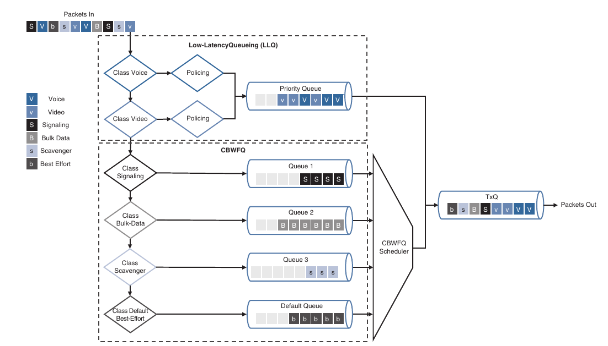

#### Congestion-Avoidance Tools

- Congestion-avoidance techniques monitor network traffic loads to anticipate and avoid congestion by dropping packets

- The default packet dropping mechanism is tail drop

- Tail drop treats all traffic equally and does not differentiate between classes of service

- With tail drop, when the output queue buffers are full, all packets trying to enter the queue are dropped, regardless of their priority, until congestion clears up and the queue is no longer full

- Tail drop should be avoided for TCP traffic because it can cause TCP global synchronization, which result in significant link underutilization

- A better approach is to use a mechanism known as random early detect (RED)

- RED provies congestion avoidance by randomly dropping packets before the queue buffers are full

- Randomly dropping packets instead as dropping them all at once, as with tail drop, avoids global synchronization of TCP streams

- RED monitors the buffer depth and performs early drops on random packets when the minimum defined queue threshold is exceeded

- The Cisco implementation of RED is known as weighted RED (WRED)

- The difference between RED and WRED is that the randomness of packet drops can be manipulated by traffic weithts denoted by either IP Precedence (IPP) or DSCP

- Packets with a lower IPP value are dropped more aggresively than are higher IPP values; for example IPP 3 would be dropped more aggressively than IPP 5 or DSCP, AFx3 would be dropped more aggresively than AFx2 and AFx2 would be dropped more aggresively than AFx1

- WRED can also be used to set the IP Explicit Congestion Notification (ECN) bits to indicate that congestion was experienced in transit

- ECN is an extension to WRED that allows for signalling to be sent to ECN-enabled endopints, instructing them to reduce their packet transmission rates

### QoS configuration - wired networks


