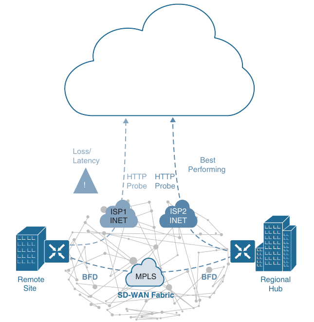

## Software-Defined WAN (SD-WAN)

- Managing enterprise networks is becoming more complex, with customers embracing multicloud approach, application moving to the cloud, mobile and IOT devices growing exponentially in the network, and the Internet edge moving to the branch

- This digital transformation is powering the adoption of SD-WAN by customers looking to do the following:

    1. Centralize device configuration and network management

    2. Lower costs and reduce risks with SD-WAN automation and orchestration

    3. Extend their enterprise networks (such as branch or on-premises) seamlessly into the public cloud

    4. Provide optimal user experience for SaaS application

    5. Leverage a transport independent WAN for lower cost and higher diversity. This means the underlay network can be any type of IP-based network, such as the Internet, MPLS, 3G/4G LTE, satellite, or dedicated circuits

    6. Enhance application visibility and use that visibility to improve performance with intelligent path control to meet SLAs for business-critical and real-time applications

    7. Provide end-to-end WAN traffic segmentation and encryption for protecting critical enterprise compute resources

- Cisco currently offers two SD-WAN solutions:

    - **Cisco SD-WAN (based on Viptela)**: This is the preferred solution for organizations that require an SD-WAN solution with cloud-based initiatives that provide granular segmentation, advanced routing, advanced security, and complex topologies while connecting to cloud instances

    - **Meraki SD-WAN**: This is the recommended solution for organizations that require unified thread management (UTM) solutions with SD-WAN functionality or that are existing Cisco Meraki customers looking to expand to SD-WAN

    - UTM is an all-in-one security solution delivered in a single appliance and typically includes the following security features: firewall, VPN, intrusion prevention, antivirus, antispam and web content filtering

- The two SD-WAN solutions can achieve similar design goals

### Cisco SD-WAN Architecture

- Cisco SD-WAN (based on Viptela) is a cloud-delivered overlay WAN architecture that facilitates digital and cloud transformation for enterprises, and it addresses all the customer requirements listed earlier

- Below is illustrated the Cisco SD-WAN solution architecture

- We can see above how SD-WAN can be used to provide secure connectivity to remote offices, branch offices, campus networks, data centers, and the cloud over any type of IP-based underlay transport network, such as the Internet, 3G/4G LTE, and MPLS

- It also illustrates how some of the components to manage the SD-WAN fabric can be deployed on a data center, private cloud, or public cloud

- The Cisco SD-WAN solution has four main components and an optional analytics service:

    - **SD-WAN edge devices**: These physical or virtual devices forward traffic across transports (that is WAN circuits/media) between locations

    - **vManage Network Management System (NMS)**: This SD-WAN controller persona provides a single pane of glass (GUI) for managing and monitoring the SD-WAN solution

    - **vSmart controller**: This SD-WAN controller persona is responsible for advertising routes and data policies to edge devices

    - **vBond orchestrator**: This SD-WAN controller persona authenticates and orchestrates connectivity between edge devices, vManage, and vSmart controllers

    - **vAnalytics**: This is an optional analytics and assurance service

- The vManage, vSmart and vBond are independent and operate as separate devices or virtual machines

- They can be hosted by Cisco, select Cisco partners, or under the control of customers in their own environments

- Ensuring that edge devices can communicate with the three controller personas across all the underlay circuits is an important design topic

#### vBond Orchestrator

- The vBond Orchestrator is a virtualized vEdge running a dedicated function of the vBond persona

- Devices can locate the vBond through specific IP addresses or fully qualified domain names (FQDNs)

- Using an FQDN is preferred because it allows for horizontal scalling of vBond devices and flexibility if a vBond ever needs to change it's IP address

- The major components of the vBond orchestrator are:

    - **Authentication**: The vBond is responsible for authenticating every device in the fabric

    - As a device comes online, it must authenticate to the vBond, which determines the eligibility to join the SD-WAN fabric

    - Basic authentication of an SD-WAN router is done using certificates and RSA cryptography

    - **NAT detection**: The vBond can detect when devices are being placed behind NAT devices using Session Traversal Utilities for NAT (STUN) [RFC5389 mechanisms] 

    - Placing a vBond behind a NAT device is not recommended but requires a 1:1 static NAT if it is placed behind a NAT device

    - **Load Balancing**: The vBond provides load balancing of sessions to fabrics that have multiple vSmart or vManage controllers

- Every vBond has a permanent control plane connection over a **Datagram Transport Layer Security (DTLS)** tunnel with every vSmart controller

- As edge devices authenticaste with the vBond, they are directed to the appropriate vSmart and vManage device

- NAT is detected and then the edge device session is torn down

- A session with vBond is formed across all edge device transports so that NAT detection can take place for every circuit

#### vManage NMS

- The vManage NMS is a single pane of glass network management system (NMS) GUI that is used to configure and manage the full SD-WAN solution

- It contains all of the edge device configurations controls software updates, and should be used for control and data plane policy creation

- The vManage NMS also provides a method of configuring the SD-WAN fabric via APIs

#### vSmart Controller

- vSmart controllers uses DTLS tunnels with edge devices to establish Overlay Management Protocol (OMP) neighborships

- OMP is a proprietary routing protocol similar to BGP that can advertise routes, next hops, keys, and policy information needed to establish and maintain the SD-WAN fabric

- The vSmart controller processes the OMP routes learned from the SD-WAN edge devices (or other vSmart controllers) and then advertises reachability information learned from these routes to the edge devices in the SD-WAN fabric

- vSmart controllers also implement all the control plane policies created on vManage such as logical tunnel topologies (such as hub and spoke, regional, and partial mesh), service chaining, traffic engineering, and segmentation per VPN topology

- For example, when a policy is created on vManage for an application (such as YouTube) that requires no more than 1% loss and 150 ms latency, that policy is downloaded to the vSmart controller

- vSmart converts the policy into a format that all the edge devices in the fabric can understand and sends the data plane policy to the appliable edge devices without the need to log to the edge devices to configure the policy via a CLI

#### Cisco SD-WAN Edge Devices

- Cisco SD-WAN edge devices (that is, routers) delivers the essential WAN, security, and multicloud capabilities of the Cisco SD-WAN solution, and they are available as physical hardware, or in software with virtualized routers that sit of a perimeter of a site, such as a remote office, branch office, campus, data center or cloud provider

- SD-WAN edge devices support standard router features, such as OSPF, EIGRP, BGP, ACLs, QoS, and routing policies, in addition to the SD-WAN overlay control and data plane functions

- Each SD-WAN router automatically establishes a secure DTLS connection with the vSmart controller and forms an OMP neighborship over the tunnel to exchange routing information

- It also establishes standard IPsec sessions with other SD-WAN routers in the fabric

- SD-WAN routers have local intelligence to make site-local decisions regarding routing, high availability (HA), interfaces, ARP management, and ACLs

- The vSmart controller provides remote site routes and the reachability information necessary to build the SD-WAN fabric

- The original Viptela hardware platforms running a dedicated Viptela OS are referred to as vEdge routers

- vEdge router platforms are considered legacy platforms, because they do not provide some of the security features enabled on Cisco IOS-XE platforms

- The Cisco IOS XE platform devices are referred to as cEdge routers, and use an unified image with autonomous features starting with 17.2 version of software

- vManage enables provisioning, configuration, and troubleshooting of cEdge and vEdge routers exactly the same way

- URL filtering and IPS are not supported on vEdge platforms and may not be present on some cEdge platforms because they operate outside of the operating system and process in IOS-XE containers

- Some platforms, such as the ASR1K do not provide that capability

#### vAnalytics

- vAnalytics is an optional analytics and assurance service that has many advanced capabilities such as the following:

    - Visibility into applications and infrastructure across the WAN

    - Forecasting and what-if analysis

    - Intelligent recommendations

- These capabilities can bring many benefits to SD-WAN that are not possible without vAnalytics

- vAnalytics detects this, and it compares that loss or latency with information on other organizations in the area that it is also monitoring to see if they are also having the same loss and latency in their circuits

- If they are, vAnalytics can then report the issue with confidence to the SPs

- vAnalytics can also help predict how much bandwidth is truly required for any location, and this capability is useful in deciding whether a circuit can be downgraded to a lower bandwidth to reduce costs

### Cisco SD-WAN Cloud OnRamp

- Traditional enterprise WAN architectures are not designed for the cloud

- As organizations adopt more SaaS applications such as Office 365 and public cloud infrastructures such as AWS and Microsoft Azure, the current network infrastructure poses major problems related to the level of complexity and end-user experience

- The Cisco SD-WAN solution includes a set of functionalities addressing optimal cloud SaaS application access and IaaS connectivity, called Cloud OnRamp (CoR)

- CoR delivers the best application quality of experience (QoE) for SaaS applications by continuously monitoring SaaS performance across diverse paths by selecting the best-performing path based on performance metrics (jitter, loss and delay)

- In addition it simplifies hybrid cloud and multicloud IaaS connectivity by extending the SD-WAN fabric to the public cloud while at the same time increasing high availability and scale

#### SD-WAN Policy

- The most powerful component of Cisco SD-WAN is the ability to push a unified policy across the fabric

- The policy can modify the topology, influence traffic forwarding decisions, or be used to filter traffic

- Configuring the SD-WAN policy on a vManage allows for changes in the network to be pushed out to thousands of devices in a matter of minutes

- Policies are further classified as:

    - **Local Policy**: Local policies are part of the configuration that is pushed to the edge device by vManage

    - Local policies would include ACLs, QoS policies, and routing policies

    - Centralized policies would also include configuration of the on-device security stack

    - **Centralized Policy**: Centralized policies contain configuration changes to the vSmarts, where control plane functions are processed before OMP routes are advertised to edge devices

    - Data plane functionality is transmitted to edge devices' volatile memory for enforcement

    - Centralized policies can contain the following component policies:

        1. **Topology**: A control plane policy to drop or modify routing behaviors by changing path metrics or even the next-hop

        2. **VPN Membership**: A control plane policy to control the advertisement of specific VPN prefixes to a specific site

        3. **Application-Aware Routing (AAR)**: A data plane policy that enhances the forwarding of packets on an application-by-application basis, based on the characteristics of a tunnel

        4. **Traffic Data**: A data plane policy that can filter traffic on an application-by-application basis (or more general characteristics), modify traffic flows (change the next-hop, service-chaining, or even NAT), QoS functions and/or implement packet loss protection mechanisms

#### Application-Aware Routing

- Application-aware routing (AAR) utilizes the *Bidirectional Forwarding Detection (BFD)* probes in the SD-WAN tunnels to track a tunnel's packet loss, latency and jitter

- BFD is a detection protocol originally designed to provide fast forwarding path failure detection times between two adjacent routers

- For SD-WAN it is leveraged to detect path liveliness (up/down) and to measure quality (loss, latency, jitter and IPsec tunnel MTU)

- AAR provides the ability to consider factors in path selection outside of those used by standard routing protocols (such as interface bandwidth, interface delay, and hop count)

- An AAR policy can ensure that edge devices forward an application's traffic across a path that meets the needs defined for that application

- AAR can be used to prefer one transport over another, but if the preferred transport exceeds the thresholds defined (packet loss, latency, and/or jitter) for that application, AAR will forward traffic across a different transport that meets it's defined requirements

- AAR provides network engineers the capability to ensure their business-critical applications are taking the best available path when network brownouts or soft failures occur

#### Cloud OnRamp for SaaS

- SaaS applications reside mainly on the Internet, and to be able to achieve optimal SaaS application performance, the best performing Internet exit point needs to be selected

- In CoR SaaS, BFD is not used because there is no SD-WAN edge device on the SaaS side to form a BFD session with

- When CoR for SaaS is configured on a SaaS application on vManage, the edge device at a remote site starts sending small HTTP probes to the SaaS application through both Internet circuits to measure latency and loss

- Below is illustrated a remote site with dual Internet circuits from two different Internet service providers (ISP1 and ISP2)

- The remote site plans on forwarding SaaS applications directly out of both Internet circuits

- A site that plans on forwarding SaaS traffic directly to the Internet is classified as CoR DIA site

- CoR for SaaS does support load balancing across Internet circuits that are providing similar scores

- The variations for packet loss and latency can be configured to increase or decrease the ability to load balance traffic at a site

- The quality of cloud SaaS application connection is quantified as a Viptela Quality of Experience (vQoE) score on a scale from 0 to 10, with 0 being the worst quality and 10 being the best

- vQoE can be observed in the vManage GUI

- Based on the results, ISP2 circuit is selected for that specific application

- The remote site edge device will use the circuit with the highest QoE score for that application

- The forwarding decision is made on an application-by-application basis

- The process of probing continues, and if a change in performance characteristics of ISP's Internet circuit occurs (for example due to extreme latency), the remote site edge device makes a change to the circuit used

- Below is illustrated another example of CoR for SaaS

- In this case, the remote site has a single Internet circuit to ISP1 and an MPLS circuit providing connectivity to the regional hub

- Much as the previous case, CoR for SaaS can be configured on the vManage and can become active on the remote site edge device

- However, in this case, CoR for SaaS also gets enabled on the regional hub edge device and is designated as a gateway node

- Quality probing service via HTTP toward the cloud SaaS application of interest starts on both the remote site SD-WAN and the regional hub SD-WAN

- The regional hub's edge device (gateway) reports it's HTTP connection loss and latency characteristics to the remote site edge device in an Overlay Management Protocol (OMP) message exchange through the vSmart controllers

- At this time, the remote site edge device can evaluate the performance characteristics of it's local Internet circuit compared to the performance characteristics reported by the regional hub SD-WAN

- It also takes into consideration the loss and latency incurred by traversing the SD-WAN fabric between the remote site and the hub site (calculated using BFD) and then makes an appropriate forwarding decision, sending application traffic down the best-performing path toward cloud SaaS application of choice

- A third scenario for CoR for SaaS involves customers who use solely private transports (such as two MPLS VPN providers)

- The remote site is classified as a client site

- Client sites will identify which pattern between two different gateways is best for a specific application based on the QoE score

- Traffic is then forwarded to the appropriate gateway site

#### Cloud OnRamp for IaaS

- Multicloud is now the new norm for enterprises

- With multicloud, certain enterprise workloads remain within the boundaries of the private data centers, while others are hosted in the public cloud environments, such as AWS and Microsoft Azure

- This approach provides enterprises the greatest flexibility in consuming compute infrastructure, as required

- With the Cisco SD-WAN solution, ubiquitous connectivity, zero-trust security, end-to-end segmentation, and application-aware QoS policies can be extended into the IaaS environments by using SD-WAN cloud routers, as seen below

- The trandport-independent capability of the Cisco SD-WAN solution allows the use of a variety of connectivity methods by securely extending the SD-WAN fabric into the public cloud environment across any underlay transport network

- These include the Internet, MPLS, 3G/4G LTE, satellite, and dedicated circuits such as AWS's DX and Microsoft Azure's ER

