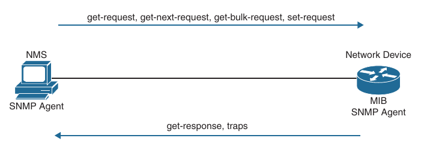

## Simple Network Management Protocol (SNMP)

- Network operations teams often have to rely on reactive allerting from network devices to be notified when something is happening - such as something failing or certain events happening on a device

- The typical tool for this is **Simple Network Management Protocol (SNMP)**

- SNMP can also be used to configure devices, although this use is less common

- More often when network engineering teams need to configure devices, configuration management tools such as Cisco Prime Infrastructure are used

- SNMP from an alerting perspective and some configuration examples for enabling SNMP and some basic functionality of the protocol

- SNMP sends unsolicited traps to a SNMP collector or network management system (NMS)

- These traps are in response to something that happened in the network

- For example, traps may be generated for link status events, improper user authentication, and power supply failures

- These events are defined in the SNMP Management Information Base (MIB)

- The MIB can be thought of as a repository of device parameters that can be used to trigger alerts

- There are currently three versions of SNMP

- Below are listed their versions and their differences

```
Version         Level               Authentication              Encryption                          Result

SNMPv1          noAuthNoPriv        Community string            No                                  Uses a community string match for authentication

SNNPv2c         noAuthNoPriv        Community string            No                                  Uses a community string match for authentication

SNMPv3          noAuthNoPriv        Username                    No                                  Uses a username match for authentication

SNMPv3          authNoPriv          Message Diggest 5 (MD5)     No                                  Provides authentication based on the HMAC-MD5 or HMAC-SHA
                                    or Secure Hash Algorithm                                        algorithms
                                    (SHA)

SNMPv3          authPriv            MD5 or SHA                  Data Encryption Standard (DES)      Provides authentication based on the HMAC-MD5 or HMAC-SHA
                (requires the                                   or Advanced Encryption Standard     algorithms.
                cryptographic                                   (AES)                               Allows specifying the User-Based Security Model (USM) with
                image)                                                                              these encryption algorithms.
                                                                                                    DES-56 encryption in addition to authentication based on the CBS-DES (DES-56) standard.
                                                                                                    3DES 168-bit encryption, AES 128-bit, 192-bit or 256-bit encryption
```

- SNMPv3 provides the most security options and encryption capabilities

- SNMPv3 uses usernames and SHA or MD5 for authentication, which makes SNMPv3 very secure compared to SNMPv1 and SNMPv2c

- Using SNMPv3 is considered best practice in production

- Below examples are for SNMPv2c for simplicity

- SNMPv1 and SNMPv2c use access lists and a community password or string to control what SNMP managers can talk to the devices via SNMP

- These community strings can be read-only (RO) or read/write (RW)

- As the names imply, read-only allows the polling of devices to get information from them

- Read/write allows pushing of information to a device or configuration to a device

- It is critical to limit SNMP access to these devices by using access lists, as mentioned above

- Without access lists, there is a potential risk because the devices could be attacked by unauthorized users

- SNMPv2c also has improved error handling and expanded error code information, which makes it a much better option than SNMPv1

- By default, if no version is specified in configuration, SNMPv1 is used

- SNMPv2c operations are listed below

```
Operation                                   Description

get-request                                 Retrieves a value from a specific variable

get-next-request                            Retrieves a value from a variable within a table

get-bulk-request                            Retrieves large blocks of data, such as multiple rows in a table,
                                            that would otherwise require the transmission of many small blocks of data

get-response                                Reply to a get request, get next request, and set request sent by an NMS

set-request                                 Stores a value in a specific variable

trap                                        Sends an unsolicited message from a SNMP agent to an SNMP manager when some event has occured
```



- Now that the basic SNMP operations have been listed, it is important to look at an MIB to understand some of the information or values that can be polled or send traps from SNMP

- Below is shown the content of the SNMPv2-MIB.my file

- This file is publicly available on the Cisco website and shows what values can be polled in the MIB and to illustrate sending traps from SNMP

- To see a list of Cisco available mibs: [Cisco-MIBs](https://cfnng.cisco.com/mibs)

- Example of the MIBs from SNMPv2-MIB: sysDescr, sysObjectID, sysUpTime, sysContact, sysName, sysLocation etc...

- The structure of this MIB file is well documented and human readable

- These portions of the MIB file will be used in the configuration examples, as well as to make it easier to tie back what is configured on a device to what it corresponds to inside a MIB file

- The following configuration steps are involved in setting up SNMP on a device and allow and allow the device to be polled and send traps to an NMS:

    - Define the SNMP host or the NMS to send traps to

    - Create an access list to restrict access via SNMP

    - Define the read-only community string

    - Define the read/write community string

    - Define the SNMP location

    - Define the SNMP contact

- These settings do not need to be configured in any particular order

- However, it makes sense to configure the access list first and then the read-only and read/write strings

- That way, when the device is accessible via SNMP, it is already locked down to only the allowed hosts within the access list

- On R1 a standard access list is configured to permit access only from an NMS host on the 172.16.29.0/24 subnet

- The host IP address is 192.168.14.100

- After the access list is configured, the read-only and read/write community strings are configured and bound to that access list

- Below is illustrated this on R1

- It is important to try to use community strings that are not easy to guess from a security perspective

- R1:

```
R1(config)#access-list 99 permit 172.16.29.0 0.0.0.255 

R1(config)#snmp-server community READONLY ro 99

R1(config)#snmp-server community READWRITE rw 99
```

- At this point, the device is configured to be polled from an NMS host with IP address in range 172.16.29.0/24 (Example:zabbix)

- If additional hosts need to be added, you simply add the new IP addresses to the access list

- It is also possible to permit the whole subnet

- However, this is more of a security risk than specifying only the necessary hosts

- If a network operations team wants to send SNMP traps to an NMS, traps first need to be enabled on the device

- All available traps can be enabled by issuing the following command:

```
R1(config)#snmp-server enable traps
```

- However, this may enable unnecessary traps that have no significance to the network operations team

- It might be more appropriate to be selective about which traps to enable

- The traps that are available to be enabled are platform specific

- A common approach to determining what traps are available is to look at the documentation for the device

- It may be easier to to simply issue the `snmp-server enable traps` command followed by `?` to leverage the context-sensitive help and determine what traps are available on the device

- Below is shown a partial list of traps that are available on R1:

```
R1(config)#snmp-server enable traps ?
  aaa_server       Enable SNMP AAA Server traps
  atm              Enable SNMP atm traps
  auth-framework   Enable SNMP CISCO-AUTH-FRAMEWORK-MIB traps
  bfd              Allow SNMP BFD traps
  bgp              Enable BGP traps
  bstun            Enable SNMP BSTUN traps
  bulkstat         Enable Data-Collection-MIB Collection notifications
  cef              Enable SNMP CEF traps
  cnpd             Enable NBAR Protocol Discovery traps
  config           Enable SNMP config traps
  config-copy      Enable SNMP config-copy traps
  config-ctid      Enable SNMP config-ctid traps
  cpu              Allow cpu related traps
  diameter         Allow Diameter related traps
  dlsw             Enable SNMP dlsw traps
  dsp              Enable SNMP dsp traps
  eigrp            Enable SNMP EIGRP traps
  entity           Enable SNMP entity traps
  entity-ext       Enable SNMP entity extension traps
  ethernet         Enable SNMP Ethernet traps
  event-manager    Enable SNMP Embedded Event Manager traps
  firewall         Enable SNMP Firewall traps
  flowmon          Enabel SNMP flowmon notifications
  frame-relay      Enable SNMP frame-relay traps
  fru-ctrl         Enable SNMP entity FRU control traps
  gdoi             Enable SNMP GDOI traps
  hsrp             Enable SNMP HSRP traps
  ike              Enable IKE traps
  ipmobile         Enable SNMP ipmobile traps
  ipmulticast      Enable SNMP ipmulticast traps
  ipsec            Enable IPsec traps
  ipsla            Enable SNMP IP SLA traps
  isis             Enable IS-IS traps
  l2tun            Enable SNMP L2 tunnel protocol traps
  lisp             Enable SNMP LISP MIB traps
  memory           Enable SNMP Memory traps
  mempool          Enable SNMP memory pool traps
  mpls             Enable SNMP MPLS traps
  msdp             Enable SNMP MSDP traps
  mvpn             Enable Multicast Virtual Private Networks traps
  nhrp             Enable SNMP NHRP traps
  ospf             Enable OSPF traps
  ospfv3           Enable OSPFv3 traps
  pfr              Enable SNMP PfR traps
  pim              Enable SNMP PIM traps
  pki              Enable SNMP PKI Traps
  pppoe            Enable SNMP pppoe traps
  pw               Enable SNMP PW traps
  resource-policy  Enable CISCO-ERM-MIB notifications
  rf               Enable all SNMP traps defined in CISCO-RF-MIB
  rsvp             Enable RSVP flow change traps
  snmp             Enable SNMP traps
  stun             Enable SNMP STUN traps
  syslog           Enable SNMP syslog traps
  trustsec-sxp     Enable SNMP CISCO-TRUSTSEC-SXP-MIB traps
  tty              Enable TCP connection traps
  vrfmib           Allow SNMP vrfmib traps
  vrrp             Enable SNMP vrrp traps
  waas             Enable WAAS traps
  <cr>             <cr>
```

- A significant number of traps can be enabled to send to a NMS

- Below, the config trap will be enabled

- To configure this trap, the `snmp-server enable traps config` command must be issued

- Below is shown the command used to enable the config trap on R1 to be sent to the NMS host at 172.16.29.16

```
snmp-server enable traps config

snmp-server host 172.16.29.16 traps READONLY
```
