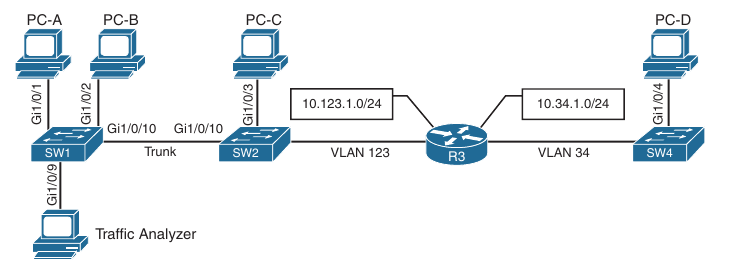
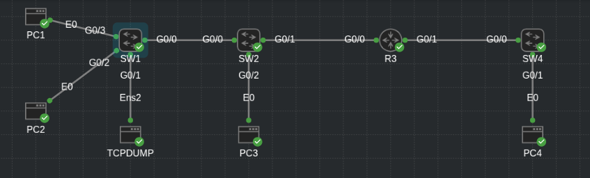

## Switched Port Analyzer (SPAN) Technologies

1. SPAN

2. RSPAN

3. ERSPAN

- The famous saying about "three sides to every story" holds true when troubleshooting network-based issues, where there are the perspectives of the local device, the remote device and what is transmitted on the wire

- Regrardless of whether one device is a router, a firewall, a load balancer, or a computer there are often tools that allow for troubleshooting processes locally on the device

- Understanding what was transmitted on the wire can help pinpoint problems

- Gaining the perspective of what happens on the wire can be more complicated

- When the problem appears to be a Layer 2 issue, there are a few options:

    1. Insert a splitter between the devices
    
    Splitters are generally applicable to optical connections because they split the light across a prism

    The original source stays intact, and the second stream can be sent to a traffic analyzer

    2. Configure the network device to mirror the packets at the data plane level to an additional destination

    The destination can be a local port or a remote port that is connected to a traffic analyzer

    3. Insert a switch between the two devices and then configure the switch to mirror the transient traffic to a traffic analyzer

- Catalyst switches provide the Switched Port Analyzer (SPAN), which makes it possible to capture packets using the second two options in the preceeding list by using the following techniques:

    - **Local Switched Port Analyzer**: You can capture local network traffic on a switch and send a copy of the network traffic to a local port attached to some sort of traffic analyzer

    - **Remote Switched Port Analyzer (RSPAN)**: You can capture network traffic on a remote switch and send  a copy of it to the local switch throughout Layer 2 (switching) toward a local port attached to some sort of traffic analyzer

    - **Encapsulated Remote Switched Port Analyzer (ERSPAN)**: You can capture network traffic on a remote device and send the traffic to the local system through Layer 3 (routing) toward a local port attached to some sort of traffic analyzer

- Below is shown a sample topology with four computers (PC-A, PC-B, PC-C and PC-D) spread across three switches and a traffic analyzer connected to SW1

- PC-A, PC-B and PC-C are all connected to VLAN 123 on the 10.123.1.0/24 network, and PC-D is connected to VLAN 34, which is on the 10.34.1.0/24 network

- Topology used to demonstrate the concepts of SPAN, RSPAN and ERSPAN



- Lab topology:



### Local SPAN

- A local SPAN session is the most basic form of packet capture because all the configuration occurs on a single switch

- The destination of the mirrored traffic can be one or more local ports

- The source of the packet capture can be only one of the following:

    - One or more specific source ports

    - A port channel (also known as an EtherChannel)

    - A VLAN (To be more explicit, this is the traffic received by the switch for all the hosts associated with the VLAN specified. This does not include an SVI interface)

- Also consider the following:

    - Most switches support at least two SPAN sessions, but newer hardware can support more than two sessions

    - The source port can be reused between two different SPAN sessions

    - Source ports can be switched or routed ports

    - The destination cannot be reused between two different SPAN sessions

    - It is possible to saturate the destination port if the source ports are receiving more data than the destination port can transmit

    - In other words, if the source ports are 10Gigabit ports and the destination port is just Gigabit, it is possible that packet loss will occur on the destination port

#### Specifying the Source Ports

- The source ports are defined with the global configuration command:

```
conf t
 monitor session <session-id> source [interface interface-id | vlan vlan-id] [tx | rx | both]
```

- SW1:

```
conf t
 monitor session 1 source interface g0/3 both
```

- The SPAN session-id allows for the switch to corelate the source ports to specific destination ports

- One or more interfaces or VLANs can be entered by entering either a comma (for delimiting multiple interfaces) or a hyphen (for setting a range)

```
SW1(config)#monitor session 1 source interface g0/3 ?
  ,     Specify another range of interfaces
  -     Specify a range of interfaces
  both  Monitor received and transmitted traffic
  rx    Monitor received traffic only
  tx    Monitor transmitted traffic only
  <cr>
```

- Another option is to repeat the command with a different value and let the system update the source range accordingly

- The direction of the traffic can be specified as part of the configuration

- With the optional **rx** keyword, you can capture only traffic received on that source

- With the optional **tx** keyword, you can capture traffic sent by that source

- With the **both** keyword you capture all traffic

- By default, traffic is captured for both

- You can specify a trunk port as a source port to capture traffic for all VLANs that traverse that port

- This might provide too much data and add noise to the traffic analysis tool

- The VLANs can be filtered on the capture with the command:

```
conf t
 monitor session <session-id> filter vlan <vlan-range>
```

- SW1:

```
conf t
 monitor session 1 filter vlan 1 - 4094
```

```
SW1(config)#do sh monitor session 1
Session 1
---------
Type                     : Local Session
Source Ports             : 
    Both                 : Gi0/3
Filter VLANs           : 1-4094

```

#### Specifying the Destination Ports

- The destination port is specified with the global configuration command:

```
conf t
 monitor session <session-id> destination interface <interface-id> [encapsulation { dot1q [ ingress {dot1q vlan vlan-id | untagged vlan vlan-id | vlan vlan-id} ] } | replicate [ingress { dot1q vlan vlan-id | untagged vlan vlan-id}] | ingress { dot1q vlan vlan-id | untagged vlan vlan-id | vlan vlan-id}]
```

- As you can see, there are a lot of different nested options

- The main options involve the choice between `encapsulation` and `ingress` (which is the last optional selection in the command)

- A SPAN session normally copies the packets without including any 802.1Q VLAN tags or Layer 2 protocols, like Spanning Tree Protocol (STP) bridge protocol data units (BPDUs), CDP, DTP, VTP, Port Aggregation Control Protocol (PAgP), or Link Aggregation Control Protocol (LACP)

- Using the `encapsulation replicate` keywords include that information

- The full global configuration command is:

```
conf t 
 monitor session <session-id> destination interface <interface-id> [encapsulation replicate]
```

- SW1:

```
conf t
 monitor session 1 destination interface g0/1 encapsulation replicate
```

```
SW1(config)#do sh monitor session 1
Session 1
---------
Type                     : Local Session
Source Ports             : 
    Both                 : Gi0/3
Destination Ports      : Gi0/1
    Encapsulation      : Replicate
Filter VLANs           : 1-4094
```

- Normally, the SPAN destination port only receives traffic and drops ingress traffic

- However, in some scenarios, connectivity to the traffic analyzer might be required

- For example, if the traffic analyzer is a Windows PC and is accessed using RDP, the port must be able to send and receive traffic for the Windows PC, in addition to the traffic for the SPAN session

- Situations like this require the following global configuration command:

```
conf t
 monitor session <session-id> destination interface <interface-id> ingress { dot1q vlan <vlan-id> | untagged vlan <vlan-id>}
```

- Selecting the `dot1q` keyword requires the packets to be encapsulated with the specified VLAN ID

- Selecting the `untagged` keyword accepts incoming packets and associates them to the specified VLAN ID

- STP is disabled on the destination port to prevent extra BPDUs from being included in the network analysis

- Great care should be taken to prevent a forwarding loop on this port

#### Local SPAN Configuration Examples

- Below is shown how to monitor both PC-A's and PC-B's communication on SW1 and send it toward the local traffic analyzer

```
conf t
 monitor session 1 source interface g0/2 - 3
 monitor session 1 destination interface g0/1
```

- The session information can be viewed with the command `show monitor session <session-id> [detail | local [detail]]`

- A specific SPAN session can be viewed, or the output can be restricted to the local SPAN session

```
SW1#show monitor session local 
Session 1
---------
Type                     : Local Session
Source Ports             : 
    Both                 : Gi0/2-3
Destination Ports      : Gi0/1
    Encapsulation      : Native
Filter VLANs           : 1-4094
```

- The next example illustrates monitoring the trunk port g0/0 and provides the output to PC2, for  PC1 and PC2 communication on SW1 and sending it toward the local traffic analyzer

- The source port is a trunk port, and it is important to restrict traffic to VLAN 123 and capture Layer 2 QoS markings

- Commands on SW1:

```
conf t
 monitor session 1 source interface g0/0
 monitor session 1 destination interface g0/1 encapsulation replicate
 monitor session 1 filter vlan 123
```

```
SW1(config)#do sh monitor session 1
Session 1
---------
Type                     : Local Session
Source Ports             : 
    Both                 : Gi0/0
Destination Ports      : Gi0/1
    Encapsulation      : Replicate
Filter VLANs           : 123

```

- In the last scenario, the switch is configured to monitor PC1's traffic, and it uses an already installed network traffic analysis tool on PC2

- When the switch is configured, PC2 can be accessed remotely to view the network traffic by using RDP

- SW1 configuration:

```
conf t
 monitor session 1 source interface g0/3
 monitor session 1 destination interface g0/2 ingress untagged vlan 123
```

- IOSv-L2 switch does not support ingress untagged vlan configuration

### Remote SPAN (RSPAN)

- In large environments, it might not be possible to move a network analyzer to other parts of the network

- The **RSPAN** function allows the source ports to be located on one switch and the destination port on a different switch

- The mirror traffic is placed on a special VLAN called the RSPAN VLAN, which is designated for SPAN traffic only

- A switch with the RSPAN vlan operates differently from a typical switch:

    - MAC addresses are not learned on ports associated with the RSPAN VLAN. This ensures that the switch does not try to use the port associated with the RSPAN VLAN to transmit data to the end host, which in turn ensures that the normal forwarding path is maintained

    - Traffic is flooded out all the ports associated with the RSPAN VLAN. The RSPAN VLAN should not be associated with ports that are not trunk ports between the source and the destination switches

- The configuration for RSPAN is straightforward:

- A VLAN is created and then identified as an RSPAN VLAN with the command `remote-span` 

- SW1 + SW2:

```
conf t
 vlan 99
  remote-span
 interface g0/0
  switchport trunk allowed vlan add 99
```

- The VLAN needs to be the same on all switches for that RSPAN session

- On the source port switch, the source ports are selected just as explained earlier for local SPAN

- However, the destination is the RSPAN VLAN, which is set as follows:

```
conf t
 monitor session <session-id> destination remote vlan <rspan-vlan-id>
```

- While the `session-id` is locally significant, keeping it the same on both the source and destination switches prevents confusion

- Traffic from PC3 will be sent to SW1 for analysis

- Configuration of the RSPAN on the source switch:

```
conf t
 monitor session 1 source interface g0/2
 monitor session 1 destination remote vlan 99
```

- On the destination port switch, the destination ports are selected just as explained earlier for local SPAN

- However, the source is the RSPAN VLAN, and this is set as follows:

```
conf t
 monitor session <session-id> source remote vlan <remote-vlan-id> 
```

- Configuration of the RSPAN on the destination switch SW1:

```
conf t
 monitor session 1 source remote vlan 99
 monitor session 1 destination interface g0/1
```

- SW1:

```
SW1(config)#do sh monitor session 1
Session 1
---------
Type                     : Remote Destination Session
Source RSPAN VLAN      : 99
Destination Ports      : Gi0/1
    Encapsulation      : Native
```

- SW2:

```
SW2#show monitor session remote 
Session 1
---------
Type                     : Remote Source Session
Source Ports             : 
    Both                 : Gi0/2
Dest RSPAN VLAN        : 99
```

- Just as with a local SPAN session, traffic is duplicated with a RSPAN

- This is significant in that additional traffic must traverse the trunk link and could starve out normal traffic

- Because a trunk link is used to carry the RSPAN VLAN, STP operates on the RSPAN VLAN, and STP BPDUs cannot be filtered because filtering could introduce a forwarding loop

### Enacapsulated Remote SPAN (ERSPAN)

- In large environments, it might not be possible to move a network analyzer to other parts of the network

- **ERSPAN** provides the ability to monitor traffic in one area of the network and route the SPAN traffic to a traffic analyzer in another area of the network through Layer 3 routing

- Think of a large scale WAN with multiple remote sites and being able to do packet captures from anywhere that has IP connectivity

- That is a powerful use case for ERSPAN

- The configuration commands are similar in nature to those for SPAN and RSPAN

- However, because the traffic is routed to another portion of the network, some additional configuration settings must take place to enable this capability

#### Specifying the Source Ports

- A source and destination must be configured

- To configure a source, you can use the following command:

```
conf t
 monitor session <span-session-nr> type erspan-source
```

- This command defines the session number, as well as the session type, `erspan-source`

- Equally important as configuring the session is setting a useful description to document the purpose of the ERSPAN session

- You can use the `description <description>` command for this purpose

- After the initial session is created, the source must be defined in the session

- You can do this using the following command:

```
  source {interface-type/number | vlan vlan-id , - [both | tx | rx] }
```

- If a source is a trunk port, it is important to filter based on the specific VLAN to be used as source

- You can do this by using the command:

```
  filter [ip standard acl | ip extended acl | acl-name] | [ipv6 access-group acl-name | vlan <vlan-id>]
```

- When all the settings have been configured, the session must be enabled with the `no shutdown` command to ensure that the session is active

#### Specifying the Destination

- When the source has been configured, it is necessary to configure the destination of the ERSPAN session

- To enter the destination configuration submode, you use the `destination` command

- The rest of the commands will be issued in the destination subconfiguration mode to specify the destination of the ERSPAN session as well as any parameters associated with the configuration of the destination

- The next step is to identify the IP address of the destination for the ERSPAN session

- Because this is a Layer 3 SPAN session, this IP address is where the traffic will be sent to be analyzed

- The command to configure this is:

```
   ip address <ip-address>
```

- Much like the source session, the destination session must have a unique identifier

- To configure it:

```
   erspan-id <session-id>
```

- After this is configured, the source IP address or origin of the ERSPAN traffic must be specified

- You can do it like this:

```
   origin ip address <ip-address>
```

- The final step is to assign a ToS or TTL to the ERSPAN traffic

- You can do this from global configuration mode:

```
conf t
 erspan [tos <tos-value> | ttl <ttl-value>]
```

- Below we can see this whole process:

```
conf t
 monitor session 1 type erspan-source
  description SOURCE-PC3-TRAFFIC
  source interface g0/1 tx
  filter vlan 34
  no shutdown
  destination
   ip address 10.123.1.11
   erspan-id 2
   origin ip address 10.34.1.11
   exit
 erspan ttl 
```

- Verifying the session

```
show monitor session erspan-source session
```