## Spanning Tree Protocol

1. Spanning Tree Protocol Fundamentals

2. Rapid Spanning Tree Protocol

3. Advanced STP tunning

4. Multiple Spanning Tree Protocol


### Spanning Tree Protocol Fundamentals

- Spanning Tree Protocol (STP) enables switches to become aware of other switches through the advertisement and receipt of Bridge Protocol Data Units (BPDUs)

- STP builds a Layer 2 loop-free topology in an environment by temporarly blocking traffic on redundant ports.

- STP operates by selecting a specific switch as the master switch and running a tree-based algorithm to identify which redundant ports should not forward traffic

- STP iterations:

	- 802.1D - the original specification
	
	- Per-VLAN Spanning Tree (PVST)
	
	- Per-VLAN Spanning Tree Plus (PVST+)
	
	- 802.1W - Rapid Spanning Tree Protocol (RSTP)

	- 802.1S - Multiple Spanning Tree Protocol (MST)

- Catalyst switches operate in PVST+, RSTP, and MST modes. All three of these modes are backwards compatible with 802.1D

### 802.1D STP

- 802.1D STP provides support for ensuring a loop-free topology for one VLAN. 

- In 802.1D standard every port transitions through the following states:

	- **Disabled**: The port is in an administratively off position (Shut down)
	
	- **Blocking**: The switch port is enabled, but the port does not forward any traffic to ensure that a loop is not created.
		
		- The switch does not modify the MAC address table
		
		- It can only receive BPDUs from other switches
	
	- **Listening**: The switch port has transitioned from a blocked state and now can send or receive BPDUs
		
		- It cannot forward any other network traffic
		
		- The MAC address table cannot be modified 
		
		- The duration of the state is correlated to STP forwarding time
		
	- **Learning**: The switch can now modify the MAC address table with any network traffic that it receives
	
		- The switch does not forward any other network traffic besides BPDUs
		
		- The duration of the state correlates with STP forwarding time
		
	- **Forwarding**: The switch can forward all network traffic and can update the MAC address table as expected
	
		- Thid is the final state of a switch port to forward network traffic
		
	- **Broken**: The switch has detected a configuration or an operational problem that can have major effects.
	
		- The port discards packets as long as the problem continues to exist
		
- The entire 802.1D STP initialization time takes about 30 seconds for a port to enter the forwarding state using default timers

- 802.1D Port Types:

	- **Root Port**(RP): A port that connects to the root bridge or an upstream switch in the spanning-tree topology
	
		- There should be only one Root port per VLAN on a switch
		
	- **Designated Port**(DP): A port that receives and forwards BPDU frames to other switches
	
		- Designated ports provide connectivity to downstream devices and switches 
		
		- There should be only one active designated port on a link
		
	- **Blocking Port**(BP): A port that is not forwarding traffic because of STP calculations

- STP terminology

	- **Root Bridge**: The root bridge is the most important switch in the Layer 2 topology
	
		- All ports are in a forwarding state on root bridge
		
		- The switch is considered the top of the spanning tree for all path calculations by other switches
		
		- All ports on the Root Bridge are categorized as Designated ports
		
	- **Bridge Protocol Data Unit**(BPDU): This network packet is used for network switches to identify a hierarchy and notify of changes in the topology
	
		- A BPDU uses destination MAC address 01:80:c2:00:00:00
		
		- There are 2 types of BPDUs:
		
			- **Configuration BPDU**: This type of BPDU is used to identify the root bridge, root ports, designated ports and blocking ports
			
				- The configuraton BPDU consist of the following fields: STP type, root path cost, root bridge identifier, local bridge identifier, max age, hello time and forward delay
				
			- **Topology change notification(TCN) BPDU**: This type of BPDU is used to communicate changes in the layer 2 topology to other switches
			
	- **Root path cost**: This is the combined cost for a specific path towards the root switch
	
	- **System priority**: This 4-bit value indicates the preference for a switch to be the root bridge. The default value is 32768.
	
	- **System ID extension**: This 12-bit value indicates the VLAN that the BPDU correlates to. The system priority and system ID extension are combined as part of the switch's identification as the root bridge.
	
	- **Root Bridge Identifier**: This is a combination of root bridge system MAC address, system ID extension, and system priority of the root bridge
	
	- **Local Bridge Identifier**: This is a combination of local switch's bridge system MAC address, system ID extension, and system priority of the root bridge
	
	- **Max Age**: This is the maximum length of time that passes before a bridge port saves it's BPDU information. 
	
		- The default value is 20 seconds
		
		- This can be configured with the command:
		```
		conf t
		 spanning-tree vlan <id> max-age <maxage>
		```
		
		- If a switch loses contact with the BPDU's source, it assumes it assumes the BPDU information is still valid for the duration of Max Age timer
		
	- **Hello Time**: This is the time that a BPDU is avertised out of a port
	
		- The default value is 2 seconds
		
		- Can be configured from 1 to 10 seconds with the command:
		```
		conf t
		 spanning-tree vlan <id> hello-time <hello-time>
		```
	- **Forward delay**: This is the ammount of time that a port stays in listening and learning state
	
		- The default value is 15 seconds
		
		- Can be changed to a value between 15 to 30 seconds with the command:
		```
		conf t
		 spanning-tree vlan <id> forward-time <forward-time>
		```

### Spanning Tree Path cost

- The interface cost is an essential component for root path calculation because root path is found based on cummulative interface STP cost to reach the root bridge

- The interface STP cost was originally stored as 16-bit value with a reference value of 20 Gbps. As swithes have developed with higher-speed interfaces, 10Gbps may not be enough

- Another method, called long mode, uses a 32-bit value and uses a reference speed of 20 Tbps.

- The original method, called short mode is the default mode

- Path cost chart

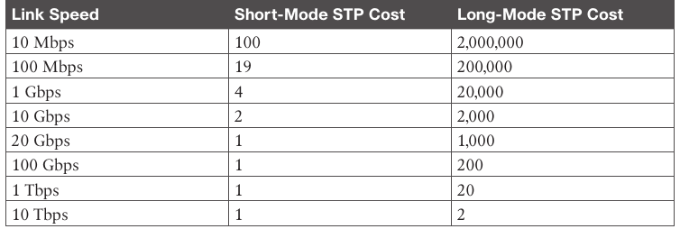

- Devices can be configured with the long-mode interface cost with the command:

```
conf t
 spanning-tree pathcost method long
```

- The entire Layer 2 topology SHOULD use the same setting for every device in the environment to ensure a consistent topology.

### Building the STP topology

- In the topology the configuration of all switches does not include any customizations for STP

- The focus is primarly for VLAN 1 but VLANs 10, 20 and 99 also exist in the topology

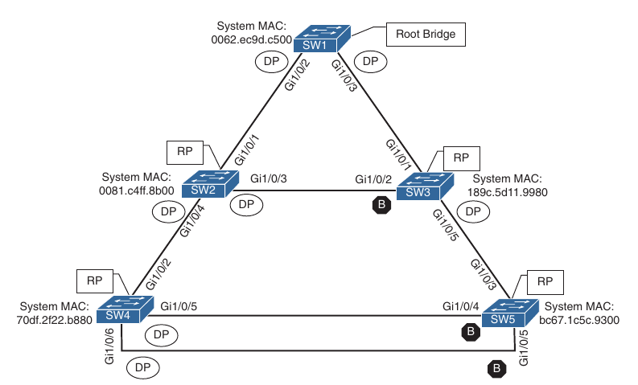

### Root bridge election

- The first step with STP is to identify the root bridge

- As a switch initializes, it assumes that it is the root bridge and uses the local bridge identifier and the root bridge identifier

- Then it listens to it's neighbor's configuration BPDU and does the following:

	- If the neighbor's configuration BPDU is inferior to it's own BPDU, the switch ignores that BPDU
	
	- If the neighbor's configuration BPDU is preferred to it's own BPDU, the switch updates it's BPDUs to include the new root bridge identifier along with a new root path cost that correlates to the total path cost to reach the new root bridge. This process continues until all switches in a topology have identified the new root bridge switch.
	
- STP deems a switch more preferrable if the priority of the bridge identifier is lower than the priority of other switch's configuration BPDUs

- If the priority is the same, then the switch prefers the BPDU with the lowest system MAC

- Generally older switches have a lower MAC address and are considered more preferable 

- Configuration changes can be made for optimizing placement of the root switch in a Layer 2 topology

- In our topology. SW1 can be identified as root bridge because it's system MAC address (0062.ec9d.c500) is the lowest in the topology

- You can verify which is the spanning tree root using the following command:

```
show spanning-tree root
```

- The output includes the VLAN number, root bridge identifier, root path cost, hello time, max age time, and forwarding delay

- Because SW1 is the root bridge, all ports are designated ports so the Root Port field is empty

- This is one way to verify that the connected switch is the root switch for the VLAN

- Root bridge priority for VLAN 1 is 32769 and not 32768. The priority in the configuration BPDU packets is actually the priority plus the value of sys_id_ext(which is the VLAN number)

- Can be confirmed by looking at VLAN 10 which haves priority 32778, which is 10 higher than 32768

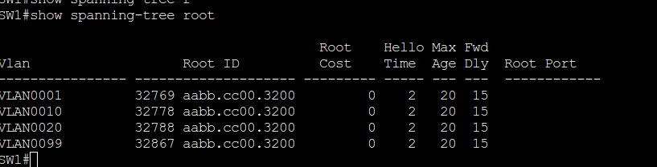

- The advertised root path cost is always the value calculated on the local switch

- As the BPDU is received, the local root path cost is the advertised root path cost plus the local interface port cost

- The root path cost is always 0 on the root bridge

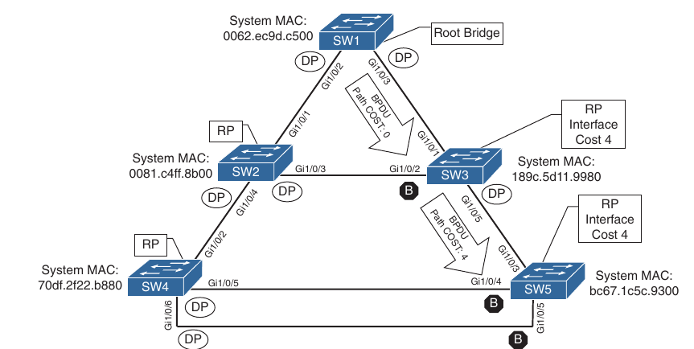

### Locating root ports

- After the switches have identified the root bridge they must determine their root ports (RP)

- The root bridge continue to advertise configuration BPDUs out of all it's ports

- The switch compares the BPDU information to identify the root port(RP)

- RP selection logic (the next criterion is used in the event of a tie)

	1. The interface associated with the **lowest path cost** to the root bridge is more preferred
	
	2. The interface associated to the **lowest system priority of the advertising(neighbor)** switch is preferred next
	
	3. The interface associated to the **lowest system MAC address of the advertising(neighbor)** switch is preferred next
	
	4. When multiple links are associated to the same switch, the **lowest port priority from the advertising(neighbor)** switch is preffered (lowest neighbor port priority)
	
	5. When multiple links are associated to the same switch, the **lowest port number from the advertising(neighbor)** switch is preferred
	
- The root bridge can be identified for a specific VLAN using the command `show spanning-tree root` and examining the CDP or LLDP neighbor information to identify the host name of the RP switch

- Port costs are derived from interfaces bandwidth, so manipulating the interface bandwidth can help influencing the root costs:

```
conf t
 interface G1/0/10
  speed <in kbps>
  bandwidth <in kbps>
```

- By default the bandwidth is deducted from interface speed

- The bandwidth value does not affect the port's actual operating speed, but influences cost calculations for STP, OSPF, etc.

### Locating Blocked Designated Switch Ports

- Now that the root bridge and RPs have been identified, all other ports are considered designated ports

- However if two non-root switches are connected to each-other on their designated ports, one of these switch ports must be set to a blocking state to prevent a forwarding loop

- In our topology there will be the following links:

	- SW2 Gi1/0/3 -> SW3 Gi1/0/2
	
	- SW4 Gi1/0/5 -> SW3 Gi1/0/4
	
	- SW4 Gi1/0/6 -> SW5 Gi1/0/5
	
- The logic to calculate which ports should be blocked between two non-root switches is the following:

	1. The interface is a designated port and must not be considered an RP
	
	2. The switch with the **lowest path cost** to the root bridge forwards packets and the one with the higher path cost blocks
	
	3. The **system priority of the local switch** is compared with the **system priority of the remote switch**. The local port is moved to a blocked state if the **remote system priority is lower** than that of the local switch
	
	4. The **system MAC address of the local switch** is compared to the **system MAC address of the remote switch**. The local designated port is moved to a blocked state if the remote system MAC address is lower than that of the local switch. If the links are connected to the same switch they move on to the next step (lowest port number of the neighbor switch)
	
- All three links (SW2 Gi10/3 -> SW3 Gi1/0/2, SW4 Gi1/0/5 -> SW5 Gi1/0/4, SW4 Gi1/0/6 -> SW5 Gi1/0/5) would use step 4 of the process just listed to identify which ports will move to a blocking state

- SW3 Gi1/0/2, SW5 Gi1/0/5 and SW5 Gi1/0/6 ports will all transition to a blocking state because the MAC addresses are lower for SW2 and SW4

- The command `show spanning-tree vlan <id>` provides useful information for locating the port states

- These port types are expected on Catalyst switches:

	- **Point-to-point (P2P)**: This port type connects to another network device (PC or RSTP switch)
	
	- **P2P edge**: This port type specifies that portfast is enabled on this port
	
- If on the command `show spanning-tree vlan <id>`, the type field includes *TYPE_Inc-, this indicates a port configuration mismatch between the Catalyst switch and the switch it is connected to.

- Common issues are the port type being incorrect and the port mode (access vs trunk) being misconfigured


- Assigning a port type for a interface

```
conf t
 interface e0/2
  spanning-tree link-type point-to-point # or
  spanning-tree link-type shared # usually shared is used if the port is connected to a hub
```

- In our topology all ports on SW2 are in a forwarding state, but port Gi1/0/2 on SW3 is in a blocking (BLK) state

- Specifically SW3's G1/0/2 has been designated as an alternate port to reach the root in the event that Gi1/0/1 connection fails

- The reason that SW3's Gi1/0/2 port rather than SW2 Gi1/0/3 was placed into a blocking state is that SW2's system MAC address(0081.c4ff.8d00) is lower than SW3's system MAC address(189c.5d11.9980) 

- This can be deduced by looking at the system MAC address in the output of `show spanning-tree vlan 1` command

### Verification of VLANs on trunk links

- All interfaces that participate in a VLAN are listed in the output of the command `show spanning-tree`.

- Using this command can be a daunting task for trunk ports that carry multiple VLANs

- The output includes the STP state for every VLAN on an interface for every switch interface

- The command `show spanning-tree interface <interface_id> <detail>` reduces the output to the STP state for the specified interface

- The optional `detail` keyword provides information on port cost, port priority, number of transitions, link type and count of BPDUs send or received for every VLAN supported on that interface

- If a VLAN is missing from a trunk port you can check the trunk port configuration for accuracy: `show interfaces trunk`

- A common problem is that a VLAN may be missing from the allowed VLANs list on that trunk interface

### STP topology changes

- In a stable Layer2 topology, configuration BPDUs always flow from the root bridge towards the edge switches

- Changes in the topology (for example switch failure, link failure or links becoming active) have an impact on all switches in the Layer 2 topology

- The switch that detects link status change sends a topology change notification(TCN) BPDU towards the root bridge out of it's RP(root port)

- If an upstream switch receives the TCN, it sends out an acknowledgement and forwards the TCN out of it's RP to the root bridge

- Upon receipt of the TCN, the root bridge creates a new Configuration BPDU, with the Topology Change flag set, and it is then flooded to all the switches

- When a switch receives a configuration BPDU with Topology Change flag set, all switches change their MAC address timer to the forwarding delay timer(with a default of 15 seconds)

- This flushes out the MAC addresses for devices that have not communicated in that 15-second window but maintains the MAC addresses for devices that are actively communicating

- Flushing the MAC address table prevents the switch from sending traffic to a host that is no longer reachable by that port

- A side effect of flushing the MAC address table is that it temporarly increases the unknown unicast flooding while it is rebuild

- This can impact hosts because of their CSMA/CD behaviour

- The MAC address timer is then reset to normal (300 seconds by default) after the second configuration BPDU is received

- TCNs are generated on a VLAN basis, so the impact of TCNs directly correlates to the number of hosts in a VLAN

- As the number of hosts increase, the most likely TCN generation is to occur and the more hosts are impacted by the broadcasts

- Topology changes should be checked as part of the troubleshooting process

- Seeing the Topology changes:

```
show spanning-tree vlan <id> detail
```

- The output of this command shows the topology change count and time since the last change has occured

- A sudden or continuous increase of TCNs indicates a potential problem and should be investigated further for flapping ports or events on a connected switch

- The process of determining why TCNs are occuring involves checking a port to see whether it is connected to a host or another switch

- If it is connected to another switch you need to connect to that switch and repeat the process of examining the STP details

- You may need to examine CDP tables or the network documentation

- You can execute the `show spanning-tree vlan <id> detail` command again to find the last switch in the topology to identify the problematic port

- Topology change schema

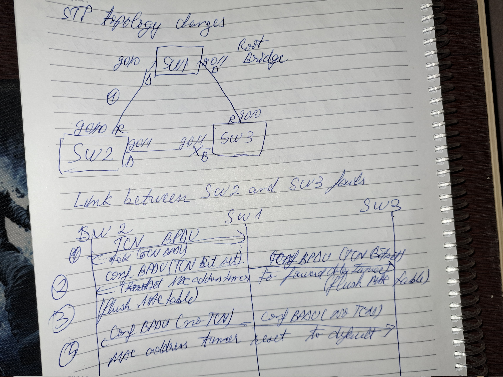


### Converging with direct link failures

- When a switch loses power or reboots, or when a cable is removed from a port, the Layer 1 signalling places the port into a down state, which can notify other processes(such as STP)

- STP considers such an event a direct link failure and can react in one of three ways depending on the topology

- Topology for direct link failure convergence scenarios:

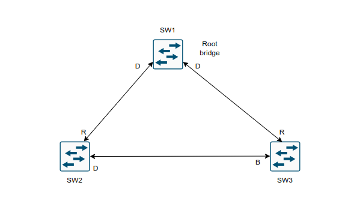

#### Direct link failure scenario 1

- In the first scenario the link between SW2 and SW3 fails. SW2's Gi1/0/3 is the DP, and SW3 Gi1/0/2 port is in a blocking state

- Because SW3's Gi1/0/2 is already in the blocking state, there is no impact to traffic between the two switches as they both transmit data through SW1

- Both SW2 and SW3 will advertise a TCN towards the root switch, which results in the Layer 2 Topology flushing it's MAC address table (Same scenario as topology change schema)

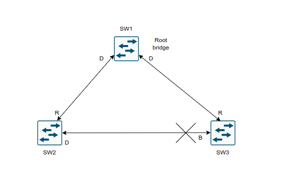

#### Direct link failure scenario 2

- The link between SW1 and SW3 fails. Network traffic from SW1 or SW2 towards SW3 is affected because SW3's G1/0/2 port is in a blocking state

- Failure scenario and events that occur to stabilize STP topology

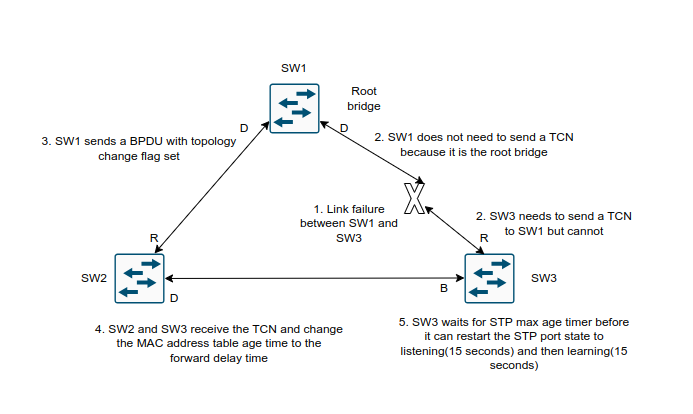

- **Phase1**: SW1 detects a link failure on it's Gi1/0/3 interface and SW3 detects a link failure on it's Gi1/0/1 interface

- **Phase2**: Normally SW1 would generate a TCN flag out of it's root port but it is the root bridge so it does not. SW1 would advertise a TCN if it were not the root bridge

	- SW3 removes it's best BPDU received from SW1 on it's Gi1/0/1 interface because it is now in a down state
	
	- At this point SW3 would attempt to send a TCN towards the root switch to notify it of a topology change. However it's root port is down
	
- **Phase3**: SW1 advertises a configuration BPDU with Topology Change flag out of all it's ports

	- This BPDU is received and relayed to all switches in the environment
	
	- If other switches were connected to SW1, they would receive a configuration BPDU with the Topology Change Flag set as well. These packets have an impact for all switches in the same Layer 2 domain
	
- **Phase4**: SW2 and SW3 receive the configuration BPDU with the Topology Change flag

	- These switches then reduce the MAC address age timer to the forward delay timer to flush out older MAC entries
	
	- In this phase, SW2 does not know what changed in the topology
	
- **Phase5**: SW3 must wait until it hears from the root bridge again or the Max Age timer expires before it can reset the port state and start to listen for BPDUs on it's Gi1/0/2 interface(which was in the blocking state previously)

- The total convergence time for SW3 is 30 seconds: 15 seconds for the listening state and 15 seconds for the learning state before SW3 Gi1/0/2 can be made the RP

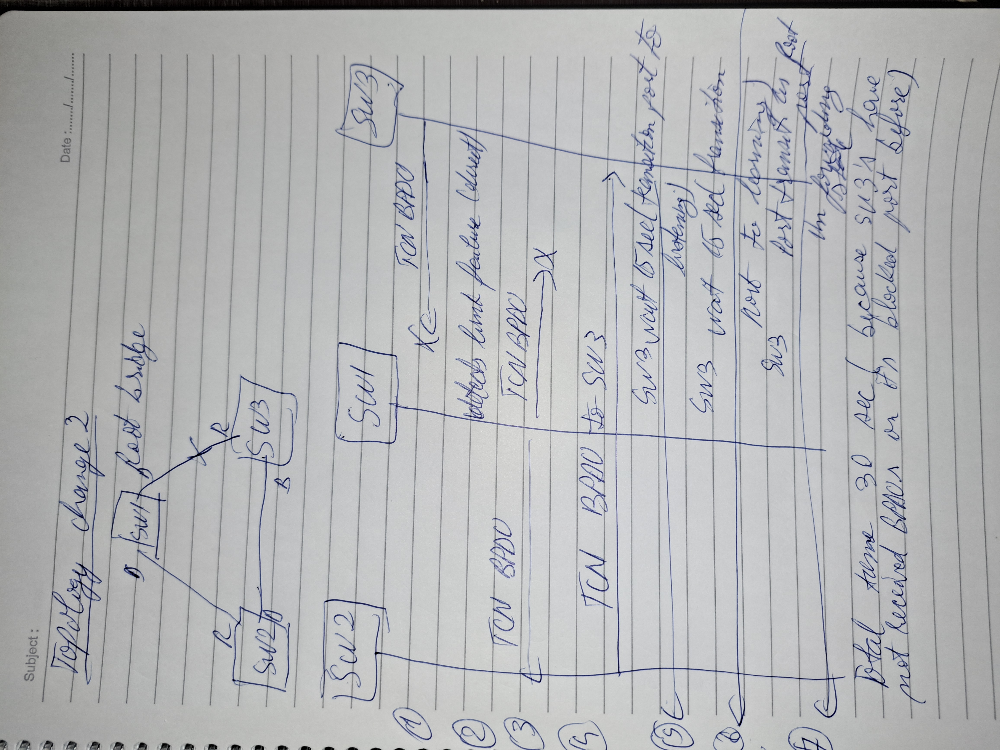


#### Direct link failure scenario 3

- In the third scenario the link between SW1 and SW2 fails

- Network traffic from SW1 or SW3 towards SW2 is impacted because SW3 Gi1/0/2 is in a blocking state

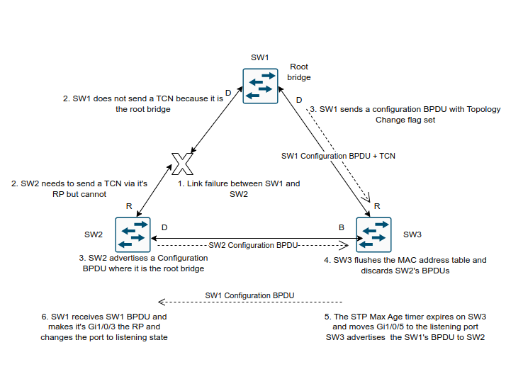

- **Phase1**: SW1 detects a link failure on it's Gi1/0/1 interface. SW2 detects failure on it's Gi1/0/3 interface

- **Phase2**: Normally SW1 would generate a TCN flag out of it's Root Port, but it is the root bridge, so it does . SW1 would advertise a TCN if it were not the root bridge

	- SW2 removes it's best BPDU received from SW1 on it's Gi1/0/1 interface as it is now in a down state
	
	- At this point, SW2 would attempt to send a TCN towards the root switch to notify it of a topology change; however it's root port is down
	
- **Phase3**: SW1 advertises a configuration BPDU with the Topology Change flag out of all it's ports

	- This BPDU is then received and relayed to SW3
	
	- SW3 cannot relay this to SW2 as it's Gi1/0/2 port is still in blocking state
	
	- SW2 assumes that it is now the root bridge and advertises configuration BPDUs with itself as the root 
	
- **Phase4**: SW3 receives the configuration BPDU with Topology Change from SW1

	- SW3 reduces the MAC address age timer to the forward delay to flush out older MAC entries
	
	- SW3 receives SW2 inferior BPDUs and discards them as it is still receiving superior BPDUs from SW1
	
- **Phase5**: The Max Age timer on SW3 expires, and now SW3's Gi1/0/2 port transitions from blocking to listening state

	- SW3 can now forward the next configuration BPDU it receives from SW1 to SW2
	
- **Phase6**: SW2 receives SW1's configuration BPDU via SW3 and recognizes it as superior

	- It marks it's Gi1/0/3 interface as the root port and transitions it to the listening state
	
- The total convergence time on SW3 is 52 seconds: 
	
	- 20 seconds for the Max Age timer on SW3
	
	- 2 seconds for the configuration BPDU from SW3
	
	- 15 seconds for the listening state
	
	- 15 seconds for the learning state
	
- The steps scheme:

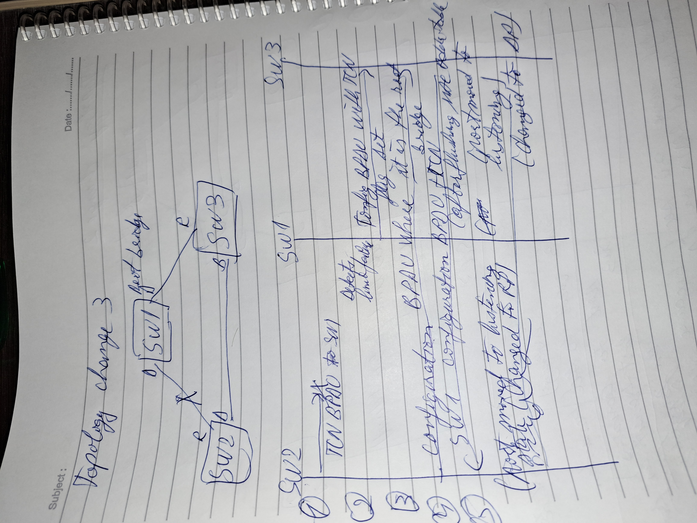

	
#### Indirect failures

- There are some failure scenarios where STP communication between switches is impaired or filtered while the network link remains up

- The situation is known as *indirect link failure*, and timers are required to detect and remediate the topology

- Impediment or data corruption on the link between SW1 and SW3 along with the logic to resolve the loss of network traffic:

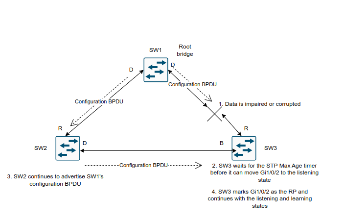

- Convergence with indirect link failure:

- **Phase1**: An event occurs that impairs or corrupts data on the link. SW1 and SW3 still report a linkup condition

- **Phase2**: SW3 stops receiving configuration BPDUs on it's RP. It keeps a cached entry for the RP on Gi1/0/1

	- SW1's configuration BPDUs that are being transmitted via SW2 are discarded as it's Gi1/0/2 interface is in a blocking state
	
	- Once SW3's Max Age timer expires and flushes the RP's cached entry, SW3 transition Gi1/0/2 from blocking to listening state
	
- **Phase3**: SW2 continues to advertise SW1's configuration BPDUs towards SW3

- **Phase4**: SW3 receives SW1's configuration BPDU via SW2 on it's Gi1/0/2 interface. This port is now marked as the RP and continues to transition to the listening and learning states

- The total time for reconvergence on SW2 is 52 seconds:

	- 20 seconds for the Max Age timer on SW3
	
	- 2 seconds for the configuration BPDU advertisement on SW2
	
	- 15 seconds for the listening state on SW3
	
	- 15 seconds for the learning state on SW3
	
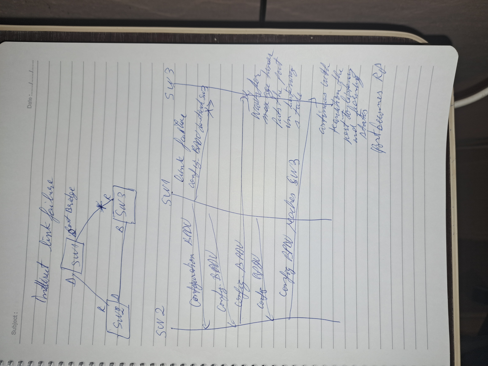

### Rapid Spanning Tree Protocol

- 802.1D did a decent job in preventing Layer 2 loops, but it used only one topology tree which introduced scalability issues

- Some larger environments with multiple VLANs need different STP topologies for traffic engineering purposes(for example load balancing, traffic steering)

- Cisco created Per-VLAN Spanning-Tree(PVST) and Per-VLAN Spanning-Tree plus (PVST+) to allow more flexibility

- PVST and PVST+ were proprietary spanning protocols

- The concepts in these protocols were incorporated with other enhancements to provide faster convergence into the IEEE 802.1W specification, known as Rapid Spanning Tree Protocol (RSTP)

- RSTP (802.1W) Port States:

	- **Discarding**: The switch port is enabled, but the port does not forward any traffic to ensure that a loop is not created
	
		- This state combines traditional STP states disabled, listening and blocking
	
	- **Learning**: The switch port modifies the MAC address table with any network traffic it receives. The switch does not forward any network traffic besides BPDUs
	
	- **Forwarding**:The switch port forwards all traffic and updates the MAC address table as expected
	
		- This is the final state for a switch port to forward network traffic
		
- A switch tries to establish a RSTP handshake with the device connected to the other end of the cable

- If a handshake does not occur, the other device is assumed to be non-RSTP compatible, and the port defaults to regular 802.1D behaviour

- This means that host devices such as computers, printers and so on still encounder a significant transmission delay(30 seconds) after the network link is established

- RSTP (802.1W) Port Roles:

	- **Root Port**(RP): A network port that connects to the root switch or an upstream switch in the spanning-tree topology
	
		- There should be only one Root Port per VLAN on a switch
	
	- **Designated Port**(DP): A network port that receives and forwards frames to other switches 
	
		- Designated Ports provide connectivity to downstream devices and switches
		
		- There should be only one active designated port on a link
	
	- **Alternate Port**(AP): A network port that provides alternate connectivity toward the root switch through a different switch
	
	- **Backup Port**(BP): A network port that provides link redundancy towards the current root switch.
	
		- The backup port cannot guarantee connectivity to the root bridge in the event that the upstream switch fails
		
		- A backup port only exists only when multiple links connect to the same switches
		
- RSTP (802.1W) Port Types:

	- **Edge port**: A port at the edge of the network where hosts connect to the Layer2 Topology
	
		- These ports dirrectly correlate to ports that have portfast feature enabled
		
	- **Root Port**: A port that haves the best path cost toward the root bridge. There can be only one root port on a switch
	
	- **Point-to-point port**: Any port that connects to another RSTP switch with full duplex 
	
		- Full-duplex links do not permit more that two devices on a network segment, so determining whether a link is full duplex is the fastest way to check the feasibility of being connected to a switch
		
		- Multi-access Layer 2 devices such as hubs can only connect at half duplex. If a port can only connect via half duplex, it must operate under traditional 802.1D forwarding states
		
### Building the RSTP topology

- With RSTP, switches exchange handshakes with other RSTP switches to transition through the following STP states faster

- When two switches first connect, they establish a bidirectional handshake across the shared link to identify the root bridge

- This is straightforward for an environment with only two switches; however, large environments require greater care to avoid creating a forwarding loop

- RSTP used a synchronization process to add a switch to the RSTP topology without introducing a forwarding loop

- The synchronization process starts when two switches (such as SW1 and SW2) are first connected

- Same topology (the one with 5 switches) is used for RSTP election process

- The process proceeds as follows

	1. As the first two switches connect to each-other, they verify that they are connected to a point-to-point link by checking the full-duplex status
	
	2. They establish a handshake with each-other to advertise a proposal(in configuration BPDUs) that their interface should be the DP for that port
	
	3. There can be only one DP per segment, so each switch identifies whether it is the superior or inferior switch, using the same logic as 802.1D for the system identifier (that is the lowest priority and then the lowest MAC address). SW1(0062.ec9d.c500) is the superior switch to SW2(0081.c4ff.8b00)
	
	4. The inferior switch (SW2) recognizes that it is inferior and mark it's local port Gi1/0/1 as the RP. At the same time, it moves all non-edge ports to a discarding state. At this point in time, the switch has stopped all local switching for non-edge ports.
	
	5. The inferior switch (SW2) sends an agreement(configuration BPDU) to the root bridge (SW1), which signinfies to the root bridge (SW1) that synchronization is ocurring on that switch
	
	6. The inferior switch (SW2) moves it's RP (Gi1/0/1) to a forwarding state. The superior switch moves it's DP (Gi1/0/2) to a forwarding state too
	
	7. The inferior switch (SW2) repeats the process for any downstream switches connected to it
	
- The RSTP convergence process can occur quickly, but if a downstream switch fails to acknowledge the proposal, the RSTP must default to 802.1D behaviour to prevent a forwarding loop

## Advanced STP tuning 

	1. STP Topology Tuning
	
	2. Additional STP Protection Mechanisms

### STP Topology Tuning

- A properly designed network strategically places the root bridge on a specific switch and modifies which ports should be the designated ports (that is in forwarding state) and which ports should be alternate ports (that is, discarding/blocking state)

- Design considerations factor in hardware platform, resiliency and network topology

- Topology

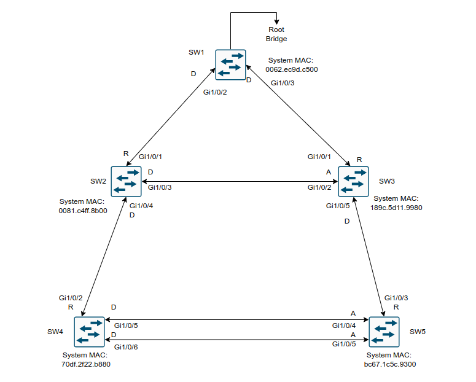

- **Root Bridge Placement**

- Ideally the root bridge is placed on a core switch, and a secondary root bridge is designated to minimize changes to the overall spanning tree

- Root bridge placement is accomplished by lowering the system priority of the root bridge to the lowest value possible, raising the secondary root bridge to a value slighly higher than that of the root bridge, and (ideally) increasing the system priority on all other switches

- This ensures consistent placement of the root bridge

- Configuring the system priority:

- Method 1

```ios
conf t
 spanning-tree vlan <id> priority <priority> in increments of 4096
```

- The priority is a value between 0 and 61440

- Method 2

```ios
conf t
 spanning-tree vlan <id> root <primary|secondary> diameter <diameter>
```

- Showing the spanning-tree topology:

```ios
show spanning-tree vlan 1

show spanning-tree
```

- Debugging some STP messages:

```ios
debug spanning-tree events
```

- This command executes a script that sets the priority to certain values

	- Primary sets the priority to 24576 (If you already have a switch with a lower priority the primary keyword is going to set the priority with 4096 less than the actual root bridge)
	
	- Secondary sets the priority to 28672 (It does not look at already assigned priorities)
	
- The optional diameter keyword makes it possible to tune the Spanning Tree Protocol (STP) convergence and modifies the timers

- It should reference the maximum number of Layer 2 hops between each switch and the root bridge

- The timers do not need to be modified on other switches because they are carried throughout the topology the root bridge's bridge protocol data units (BPDUs)

- The placement of the root bridge is an important decision design and often should be chosen to minimize the number of hosts to the furthest switch in the topology

- The design should consider where redundant connections exist, connections that will be blocked, and the ability(performance) for the root switch to handle cross-switch traffic

- Generally, root switches are at Layer 2/Layer 3 boundary

- The best way to prevent errorneous devices for taking over the STP root role is to set the priority to 0 for the primary root switch and to 4096 for the secondary root switch

- In addition, root guard should be used

#### Modifying STP Root Port and Blocked Switch Port locations

- The STP port cost is used in calculating the STP tree

- When a switch generates the BPDUs, the total path cost includes only the calculated metric to the root and does not include cost of the port out which the BPDU is advertised

- The receiving switch adds the port cost for the interface on which the BPDU was received in conjunction with the value of the total path cost in the BPDU

- SW1 advertises it's BPDU to SW3 with a total path cost of 0. SW3 receives the BPDU and adds it's STP port cost of 4 to the local path cost of the BPDU(0), resulting in a value of 4

- SW3 then advertises the BPDU towards SW5 with a total path cost of 4, to which SW5 then adds it's STP port cost of 4

- SW5 therefore reports a total path cost of 8 to reach the root bridge via SW3

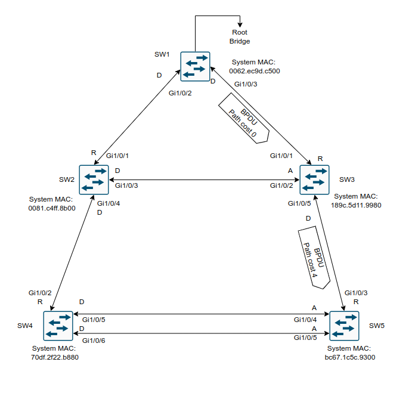

- SW1 being the root bridge there is no cost reported in the output of `show spanning-tree vlan 1` output 

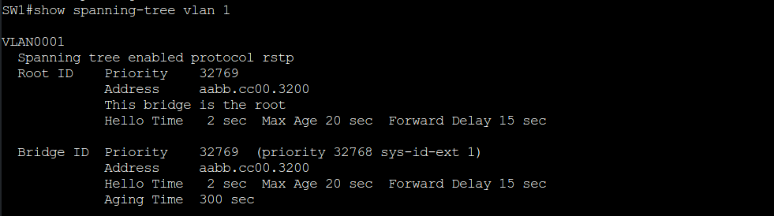

- SW3 output (using ethernet interfaces in the lab)

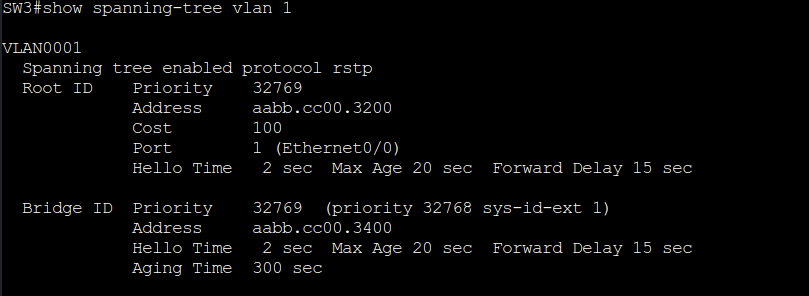

- SW5 output (using ethernet interfaces in the lab)

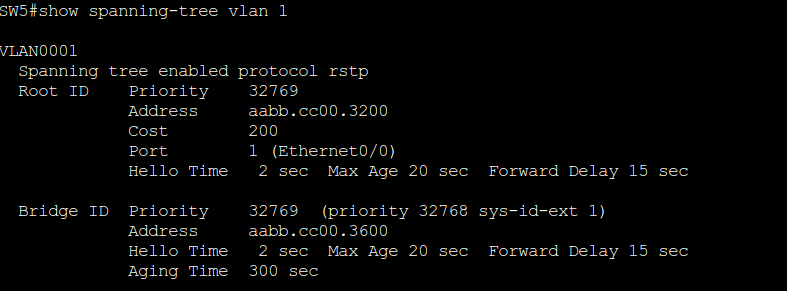

- By changing the STP port costs for a specific VLAN (per interface) you can modify the STP forwarding path

- Modifying STP port cost

```ios
conf t
 int g1/0/1
  spanning-tree [vlan <id>] cost <cost>
```

- You can lower a path that is currently an alternate port while making it designated, or you can raise the cost on a port that is designated to turn it into a blocking port

- The spanning-tree command modifies the cost for all VLANs unless the optional VLAN keyword is used to specify a VLAN

- Set the cost for a port in our topology on SW3

```ios
conf t
 interface gi1/0/1
  spanning-tree cost 1
```

- Modifying the port cost to 1 on SW3's port gi1/0/1 impacts the port state between SW2 and SW3

- SW2 receives a BPDU from SW3 with a cost of 5, and SW3 receives a BPDU from SW2 with a cost of 8

- Now SW3's Gi1/0/2 is no longer an alternate port but is now a designated port

- SW2's Gi1/0/3 was changed from a designated port to an alternate port

#### Modifying STP Port Priority

- The STP port priority impacts which port is used as alternate port when multiple links are used between switches

- In out topology, shutting down the link between SW3 and SW5 forces SW5 to choose one of the links connected to SW4 as a root port

- This change makes SW5's Gi1/0/4 port RP (root port) towards SW4

- Remember that system ID and port cost are the same, so the next check is port priority followed by port number

- Both the port priority and port number are controlled by the upstream switch

- You can modify the port priority on SW4's Gi1/0/6 (towards SW5's Gi1/0/5 port) with the command

- SW4

```ios
conf t
 int gi1/0/6
  spanning-tree [vlan <id>] port-priority <priority>
  spanning-tree port-priority 64
```

- The optional vlan keyword allows you to change the port-priority on a VLAN-by-VLAN basis

- Now SW4's Gi1/0/6 port has a value of 64, which is lower than the value of it's Gi1/0/5 port, which is using a default value of 128

- SW4's Gi1/0/6 is now preferred and will impact the RP on SW5

#### Additional STP Protection Mechanisms

- Network packets do not decrement the time-to-live portion of the header as a packet forwarded in a Layer 2 topology

- A network forwarding loop occurs when the logical topology allows for multiple active paths between two devices

- Broadcast and multicast traffic wreak havoc as they are forwarded out of every switch port and continue the forwarding loop

- High CPU consumption and low free memory space are common simptoms of a Layer 2 forwarding loop

- In Layer 2 forwarding loops, in addition to constantly consuming switch bandwidth, the CPU spikes

- Because the packet is received on a different interface, the switch must move the media access control (MAC) address from one interface to the next

- The network throughput is impacted drastically; users are likely to notice a slowdown on their network applications, and the switches may crash due to exhausted CPU and memory resources

- Common scenarios for Layer 2 forwarding loops:

	- STP disabled on the switch
	
	- A misconfigured load-balancer that transmit traffic out multiple ports with the same MAC address
	
	- A misconfigured virtual switch that bridges two physical ports (Virtual switches typically does not participate in STP)
	
	- End users using a dumb switch or hub
	
- Catalyst switches detect a MAC address that is flapping between interfaces and notify via syslog with the MAC address of the host, VLAN, and ports between which the MAC address is flapping

- These messages must be investigated to ensure that a forwarding loop does not exist

- Syslog message for a flapping MAC address which have been removed from the topology

```
%SW_MATM-4-MACFLAP_NOTIF: Host 70df.2f22.b8c7 in vlan 1 is flapping between port Gi1/0/3 and port Gi1/0/2
```

- In this scenario, STP must be checked for all the switches hosting this VLAN mentioned in the syslog message to ensure that spanning-tree is enabled and working properly

#### Root Guard

- Root Guard is a STP feature that is enabled on a port-by-port basis; it prevents a configured port from becoming a root port

- Root Guard prevents a downstream switch(often misconfigured or rogue) from becoming a root bridge on the topology

- Root Guard functions by placing a port in an ErrDisabled state if a superior BPDU is received on a configured port

- This prevents the configured DP with root guard from becoming an RP

- Root guard is enabled per interface

```ios
conf t
 interface gi1/0/2
  spanning-tree guard root
```

- Root Guard is placed on designated ports toward other switches that should never become root bridges

- In our topology for STP, root guard should be placed on SW2's Gi1/0/4 port toward SW4 and on SW3's Gi1/0/5 port toward SW5

- This prevents SW4 and SW5 from ever becoming root bridges but still allows for SW2 to maintain connectivity to SW1 via SW3 if the link between SW1 to SW2 fails

#### STP Portfast

- The generation of TCN for hosts does not make sense as a host generally has only one connection to the network

- Restricting TCN creation to only ports that connect to other switches and network devices increase L2 network's stability and efficiency

- The STP portfast feature disables TCN generation for access ports

- Another major benefit of the STP portfast feature is that the access ports bypass the earlier 802.1D states (listening and learning) and forward traffic immediately

- This is beneficial in environments where computers use Dynamic Host Configuration Protocol (DHCP) or Preboot Execution Environment (PXE)

- If a BPDU is received on a portfast-enabled port, the portfast functionality is removed from that port

- Enabling portfast on an access port:

```ios
conf t
 interface Gi1/0/7
  spanning-tree portfast
```

- Enabling portfast globally on all access ports:

```ios
conf t
 spanning-tree portfast default
```

- Disabling portfast configuration on access ports when the global configuration for portfast is enabled

```
conf t
 interface Gi1/0/8
  spanning-tree portfast disable 
```

- Enabling portfast on trunk links:

```
conf t
 interface Gi1/0/10
  spanning-tree portfast trunk
```

- This command should be enabled only with ports that are connected to a single host(such as a server with only one NIC that is running a hypervisor with VMs on different VLANs or an Wireless LAN Controller)

- Running this command on interfaces connected to other switches, bridges and so on can result in a bridging loop

- Verifying the portfast configuration can be done by examining STP for VLAN where the port is connected or looking at STP interface

```
show spanning-tree vlan 10
show spanning-tre interface Gi1/0/10 detail
```

- Portfast ports are displayed with P2P Edge

#### BPDU Guard

- BPDU Guard is a safety mechanism that shuts down ports configured with STP portfast upon receipt of a BPDU 

- Assuming all access ports have STP portfast enabled, this ensures that a loop cannot accidentally be created if an unauthorized switch is added to a topology

- Enabling BPDU Guard globally on all portfast-enabled ports

```ios
conf t
 spanning-tree portfast bdpuguard default
```

- BPDU Guard can be enabled or disabled on an interface:

```ios
conf t
 interface Gi1/0/10
  spanning-tree bpduguard [enable | disable]
```

- Verifying that BPDU Guard is enabled for a specified port:

```ios
show spanning-tree interface Gi1/0/10 detail
```

- BPDU Guard is typically configured with all host-facing ports that are enabled with portfast

- A syslog message appears when a BPDU is received on a BPDU guard-enabled port 

- The port is then placed into an ErrDisabled state

```
%SPANTREE-2-BLOCK_BPDUGUARD: Received BPDU on port GigabitEthernet1/0/10 with BPDU Guard enabled. Disabling port.

%PM-4-ERR_DISABLE: bpduguard error detected on Gi1/0/10, putting Gi1/0/10 in err-disable state

%LINEPROTO-5-UPDOWN: Line protocol on Interface GigabitEthernet1/0/10, changed state to down

%LINK-3-UPDOWN: Interface GigabitEthernet1/0/10, changed state to down
```

- Verifying the port status(it shows err-disabled for the port listed earlier):

```ios
show interfaces status
```

- By default, ports that are put in the ErrDisabled state because of BPDU guard do not automatically restore themselves

- The Error Recovery service can be used to reactivate ports that are shut down for a specific problem, thereby reducing administrative overhead

- Activating Error Recovery to recover ports that were shut down from BPDU Guard:

```ios
conf t
 errdisable recovery cause bpduguard
```

- Modifying the period that Error Recovery checks for ports:

```ios
conf t
 errdisable recovery interval <time-seconds>
```

- Verification of Error Disable recovery for BPDU Guard:

```ios
show errdisable recovery
```

- Syslog messages for ErrDisable recovery:

```
%PM-4-ERR_RECOVER: Attempting to recover from bpduguard err-disable state on Gi1/0/10

%SPANTREE-2-BLOCK_BPDUGUARD: Received BPDU on port Gigabit Ethernet1/0/10 with BPDU Guard enabled. Disabling port.

%PM-4-ERR_DISABLE: bpduguard error detected on Gi1/0/2, putting Gi1/0/10 in err-disable state
```

- The Error Recovery service operates every 300 seconds (5 minutes)

- This can be changed from 5 to 86400 seconds with the command:

```ios
conf t
 errdisable recovery interval <time>
```

#### BPDU Filter 

- BPDU filter simply blocks BPDUs from being transmitted out a port

- BPDU filter can be enabled globally or on a specific interface

- The behaviour changes depending on the configuration:

	- The global BPDU filter configuration:
	```ios
	conf t
	 spanning-tree portfast bpdufilter default
	```
	- The port send a series of 10 to 12 BPDUs
	
	- If the switch receives any BPDUs it checks to see which switch is more preferred
	
		- The preferred switch does not process any BPDUs that it receives, but it still transmits BPDUs to inferior downstream switches
	
		- A switch that is not the preferred switch processes BPDUs that are received but it does not transmit BPDUs to the superior upstream switch
		
	- Enabling BPDU filter in interface config mode:
	
	```ios
	conf t
	 interface gi1/0/10
	  spanning-tree bpdufilter enable
	```
	- The port does not send any BPDUs on an ongoing basis
	
	- If the remote port has BPDU guard on it, it generally shuts down the port as a loop prevention mechanism
	
- Be careful with the deployment of BPDU filter as it could cause problems

- Most network designs do not require BPDU filter, which adds an unnecessary level of complexity and also introduces risk

- Verifying a BPDU filter

	- With interface-configuration enabled:
	```ios
	show spanning-tree interface Gi1/0/10 detail | in BPDU|Bpdu|Ethernet
	```
	
	- With global-configuration enabled:
	```ios
	show spanning-tree interface Gi1/0/10 detail | in BPDU|Bpdu|Ethenet 
	```
	
#### Problems with Unidirectional Links

- Fiber-optic cables consist of strands of glass/plastic that transmit light

- A cable typically consists of one strand for sending data and another strand for receiving data on one side; the order is directly opposite at the remote side

- Network devices that use fiber for connectivity can encounter unidirectional traffic flows if one strand is broken

- In such scenarios the interface still shows a line-protocol up state; however, BPDUs are not able to be transmitted, and the downstream switch eventually times out the existing root port and identifies a different port as the root port

- Traffic is then received on the new root port and forwarded out the strand that is still working, thereby creating a forwarding loop

- Solutions that can resolve this scenario:

	- STP loop guard
	
	- Unidirectional link detection

#### STP Loop Guard

- STP loop guard prevents any alternative or root ports from becoming designated ports (ports towards downstream switches) due to loss of BPDUs on the root port

- Loop Guard places the port in an ErrDisabled state while BPDUs are not being received

- When BPDU transmission starts again on that interface, the port recovers and begins to transition through the STP stated again

- Enabling loop guard globally:

```ios
spanning-tree loopguard default
```

- Enabling loop guard on a per-interface basis:

```ios
conf t
 interface gi1/0/10
  spanning-tree guard loop
```

- It is important to note that loop guard should not be enabled on portfast-enabled ports(because it directly conflicts with the root/alternate port logic)

- Enabling both loopguard and bpdufilter on the interface triggers loopguard as follows:

```ios
conf t
 interface gi1/0/10
  spanning-tree guard loop
  
  spanning-tree bpdufilter enabled
  
%SPANTREE-2-LOOPGUARD_BLOCK: Loop guard blocking port GigabitEthernet1/0/10 on VLAN0001
```

- Viewing the port state:

```ios
show spanning-tree vlan 1 | b Interface
```

- At this point the port is considered to be in an inconsistent state and does not forward any traffic

- Viewing inconsistent ports

```ios
show spanning-tree inconsistentports
```

- An entry exists for each VLANs carried along the trunk link (Gi1/0/10 port)

#### Unidirectional link detection (UDLD)

- Unidirectional link detection (UDLD) allows for bidirectional monitoring of fiber-optic cables

- UDLD operates by transmitting UDLD packets to the neighbor device that includes the system ID and the port ID of the interface transmitting the UDLD packet

- The receiving device then repeats that information, including it's system ID and port ID, back to the originating device

- The process continues infinitely

- UDLD operating modes

	- **Normal**: In normal mode if a frame is not acknowledged, the link is considered undetermined and the link remains active 
	
	- **Aggresive**: In aggresive mode if a frame is not acknowledged, the switch sends another 8 packets in 1-second intervals
	
		- If those packets are not acknowledged, the port is placed into an error state
		
- Enabling UDLD globally:

```ios
conf t
 udld enable [aggresive]
```

- This enables UDLD on any small form-factor pluggable (SFP)-based port 

- Disabling UDLD on the interface:

```ios
conf t
 interface gi1/0/10
  udld port disable
```

- Enabling UDLD recovery:

```ios
conf t
 udld recovery [interval <sec>]
```

- The optional `interval` keyword allows for the timer to be modified from the default value of 5 minutes

- Enabling UDLD on a port-by-port basis

```ios
conf t
 interface gi1/0/12
  udld port [aggresive]
```

- The optional `aggresive` keyword places the ports in UDLD aggresive mode

- UDLD must be enabled on the remote switch as well

- Once it is configured, the status of UDLD neighborship can be verified as follows:

```ios
show udld neighbors
```
- Viewing more detailed information:

```ios
show udld [<interface id>]
```
