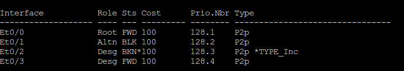

## Spanning Tree Protocol

1. Spanning Tree Protocol Fundamentals

2. Rapid Spanning Tree Protocol

3. Advanced STP tunning

4. Multiple Spanning Tree Protocol


### Spanning Tree Protocol Fundamentals

- Spanning Tree Protocol (STP) enables switches to become aware of other switches through the advertisement and receipt of Bridge Protocol Data Units (BPDUs)

- STP builds a Layer 2 loop-free topology in an environment by temporarly blocking traffic on redundant ports.

- STP operates by selecting a specific switch as the master switch and running a tree-based algorithm to identify which redundant ports should not forward traffic

- STP iterations:

	- 802.1D - the original specification
	
	- Per-VLAN Spanning Tree (PVST)
	
	- Per-VLAN Spanning Tree Plus (PVST+)
	
	- 802.1W - Rapid Spanning Tree Protocol (RSTP)

	- 802.1S - Multiple Spanning Tree Protocol (MST)

- Catalyst switches operate in PVST+, RSTP, and MST modes. All three of these modes are backwards compatible with 802.1D

### 802.1D STP

- 802.1D STP provides support for ensuring a loop-free topology for one VLAN. 

- In 802.1D standard every port transitions through the following states:

	- **Disabled**: The port is in an administratively off position (Shut down)
	
	- **Blocking**: The switch port is enabled, but the port does not forward any traffic to ensure that a loop is not created.
		
		- The switch does not modify the MAC address table
		
		- It can only receive BPDUs from other switches
	
	- **Listening**: The switch port has transitioned from a blocked state and now can send or receive BPDUs
		
		- It cannot forward any other network traffic
		
		- The MAC address table cannot be modified 
		
		- The duration of the state is correlated to STP forwarding time
		
	- **Learning**: The switch can now modify the MAC address table with any network traffic that it receives
	
		- The switch does not forward any other network traffic besides BPDUs
		
		- The duration of the state correlates with STP forwarding time
		
	- **Forwarding**: The switch can forward all network traffic and can update the MAC address table as expected
	
		- Thid is the final state of a switch port to forward network traffic
		
	- **Broken**: The switch has detected a configuration or an operational problem that can have major effects.
	
		- The port discards packets as long as the problem continues to exist
		
- The entire 802.1D STP initialization time takes about 30 seconds for a port to enter the forwarding state using default timers

- 802.1D Port Types:

	- **Root Port**(RP): A port that connects to the root bridge or an upstream switch in the spanning-tree topology
	
		- There should be only one Root port per VLAN on a switch
		
	- **Designated Port**(DP): A port that receives and forwards BPDU frames to other switches
	
		- Designated ports provide connectivity to downstream devices and switches 
		
		- There should be only one active designated port on a link
		
	- **Blocking Port**(BP): A port that is not forwarding traffic because of STP calculations

- STP terminology

	- **Root Bridge**: The root bridge is the most important switch in the Layer 2 topology
	
		- All ports are in a forwarding state on root bridge
		
		- The switch is considered the top of the spanning tree for all path calculations by other switches
		
		- All ports on the Root Bridge are categorized as Designated ports
		
	- **Bridge Protocol Data Unit**(BPDU): This network packet is used for network switches to identify a hierarchy and notify of changes in the topology
	
		- A BPDU uses destination MAC address 01:80:c2:00:00:00
		
		- There are 2 types of BPDUs:
		
			- **Configuration BPDU**: This type of BPDU is used to identify the root bridge, root ports, designated ports and blocking ports
			
				- The configuraton BPDU consist of the following fields: STP type, root path cost, root bridge identifier, local bridge identifier, max age, hello time and forward delay
				
			- **Topology change notification(TCN) BPDU**: This type of BPDU is used to communicate changes in the layer 2 topology to other switches
			
	- **Root path cost**: This is the combined cost for a specific path towards the root switch
	
	- **System priority**: This 4-bit value indicates the preference for a switch to be the root bridge. The default value is 32768.
	
	- **System ID extension**: This 12-bit value indicates the VLAN that the BPDU correlates to. The system priority and system ID extension are combined as part of the switch's identification as the root bridge.
	
	- **Root Bridge Identifier**: This is a combination of root bridge system MAC address, system ID extension, and system priority of the root bridge
	
	- **Local Bridge Identifier**: This is a combination of local switch's bridge system MAC address, system ID extension, and system priority of the root bridge
	
	- **Max Age**: This is the maximum length of time that passes before a bridge port saves it's BPDU information. 
	
		- The default value is 20 seconds
		
		- This can be configured with the command:
		```
		conf t
		 spanning-tree vlan <id> max-age <maxage>
		```
		
		- If a switch loses contact with the BPDU's source, it assumes it assumes the BPDU information is still valid for the duration of Max Age timer
		
	- **Hello Time**: This is the time that a BPDU is avertised out of a port
	
		- The default value is 2 seconds
		
		- Can be configured from 1 to 10 seconds with the command:
		```
		conf t
		 spanning-tree vlan <id> hello-time <hello-time>
		```
	- **Forward delay**: This is the ammount of time that a port stays in listening and learning state
	
		- The default value is 15 seconds
		
		- Can be changed to a value between 15 to 30 seconds with the command:
		```
		conf t
		 spanning-tree vlan <id> forward-time <forward-time>
		```

### Spanning Tree Path cost

- The interface cost is an essential component for root path calculation because root path is found based on cummulative interface STP cost to reach the root bridge

- The interface STP cost was originally stored as 16-bit value with a reference value of 20 Gbps. As swithes have developed with higher-speed interfaces, 10Gbps may not be enough

- Another method, called long mode, uses a 32-bit value and uses a reference speed of 20 Tbps.

- The original method, called short mode is the default mode

- Path cost chart


- Devices can be configured with the long-mode interface cost with the command:

```
conf t
 spanning-tree pathcost method long
```

- The entire Layer 2 topology SHOULD use the same setting for every device in the environment to ensure a consistent topology.

### Building the STP topology

- In the topology the configuration of all switches does not include any customizations for STP

- The focus is primarly for VLAN 1 but VLANs 10, 20 and 99 also exist in the topology


### Root bridge election

- The first step with STP is to identify the root bridge

- As a switch initializes, it assumes that it is the root bridge and uses the local bridge identifier and the root bridge identifier

- Then it listens to it's neighbor's configuration BPDU and does the following:

	- If the neighbor's configuration BPDU is inferior to it's own BPDU, the switch ignores that BPDU
	
	- If the neighbor's configuration BPDU is preferred to it's own BPDU, the switch updates it's BPDUs to include the new root bridge identifier along with a new root path cost that correlates to the total path cost to reach the new root bridge. This process continues until all switches in a topology have identified the new root bridge switch.
	
- STP deems a switch more preferrable if the priority of the bridge identifier is lower than the priority of other switch's configuration BPDUs

- If the priority is the same, then the switch prefers the BPDU with the lowest system MAC

- Generally older switches have a lower MAC address and are considered more preferable 

- Configuration changes can be made for optimizing placement of the root switch in a Layer 2 topology

- In our topology. SW1 can be identified as root bridge because it's system MAC address (0062.ec9d.c500) is the lowest in the topology

- You can verify which is the spanning tree root using the following command:

```
show spanning-tree root
```

- The output includes the VLAN number, root bridge identifier, root path cost, hello time, max age time, and forwarding delay

- Because SW1 is the root bridge, all ports are designated ports so the Root Port field is empty

- This is one way to verify that the connected switch is the root switch for the VLAN

- Root bridge priority for VLAN 1 is 32769 and not 32768. The priority in the configuration BPDU packets is actually the priority plus the value of sys_id_ext(which is the VLAN number)

- Can be confirmed by looking at VLAN 10 which haves priority 32778, which is 10 higher than 32768


- The advertised root path cost is always the value calculated on the local switch

- As the BPDU is received, the local root path cost is the advertised root path cost plus the local interface port cost

- The root path cost is always 0 on the root bridge


### Locating root ports

- After the switches have identified the root bridge they must determine their root ports (RP)

- The root bridge continue to advertise configuration BPDUs out of all it's ports

- The switch compares the BPDU information to identify the root port(RP)

- RP selection logic (the next criterion is used in the event of a tie)

	1. The interface associated with the **lowest path cost** to the root bridge is more preferred
	
	2. The interface associated to the **lowest system priority of the advertising(neighbor)** switch is preferred next
	
	3. The interface associated to the **lowest system MAC address of the advertising(neighbor)** switch is preferred next
	
	4. When multiple links are associated to the same switch, the **lowest port priority from the advertising(neighbor)** switch is preffered (lowest neighbor port priority)
	
	5. When multiple links are associated to the same switch, the **lowest port number from the advertising(neighbor)** switch is preferred
	
- The root bridge can be identified for a specific VLAN using the command `show spanning-tree root` and examining the CDP or LLDP neighbor information to identify the host name of the RP switch

### Locating Blocked Designated Switch Ports

- Now that the root bridge and RPs have been identified, all other ports are considered designated ports

- However if two non-root switches are connected to each-other on their designated ports, one of these switch ports must be set to a blocking state to prevent a forwarding loop

- In our topology there will be the following links:

	- SW2 Gi1/0/3 -> SW3 Gi1/0/2
	
	- SW4 Gi1/0/5 -> SW3 Gi1/0/4
	
	- SW4 Gi1/0/6 -> SW5 Gi1/0/5
	
- The logic to calculate which ports should be blocked between two non-root switches is the following:

	1. The interface is a designated port and must not be considered an RP
	
	2. The switch with the **lowest path cost** to the root bridge forwards packets and the one with the higher path cost blocks
	
	3. The **system priority of the local switch** is compared with the **system priority of the remote switch**. The local port is moved to a blocked state if the **remote system priority is lower** than that of the local switch
	
	4. The **system MAC address of the local switch** is compared to the **system MAC address of the remote switch**. The local designated port is moved to a blocked state if the remote system MAC address is lower than that of the local switch. If the links are connected to the same switch they move on to the next step (lowest port number of the neighbor switch)
	
- All three links (SW2 Gi10/3 -> SW3 Gi1/0/2, SW4 Gi1/0/5 -> SW5 Gi1/0/4, SW4 Gi1/0/6 -> SW5 Gi1/0/5) would use step 4 of the process just listed to identify which ports will move to a blocking state

- SW3 Gi1/0/2, SW5 Gi1/0/5 and SW5 Gi1/0/6 ports will all transition to a blocking state because the MAC addresses are lower for SW2 and SW4

- The command `show spanning-tree vlan <id>` provides useful information for locating the port states

- These port types are expected on Catalyst switches:

	- **Point-to-point (P2P)**: This port type connects to another network device (PC or RSTP switch)
	
	- **P2P edge**: This port type specifies that portfast is enabled on this port
	
- If on the command `show spanning-tree vlan <id>`, the type field includes *TYPE_Inc-, this indicates a port configuration mismatch between the Catalyst switch and the switch it is connected to.

- Common issues are the port type being incorrect and the port mode (access vs trunk) being misconfigured



- Assigning a port type for a interface

```
conf t
 interface e0/2
  spanning-tree link-type point-to-point # or
  spanning-tree link-type shared # usually shared is used if the port is connected to a hub
```

- In our topology all ports on SW2 are in a forwarding state, but port Gi1/0/2 on SW3 is in a blocking (BLK) state

- Specifically SW3's G1/0/2 has been designated as an alternate port to reach the root in the event that Gi1/0/1 connection fails

- The reason that SW3's Gi1/0/2 port rather than SW2 Gi1/0/3 was placed into a blocking state is that SW2's system MAC address(0081.c4ff.8d00) is lower than SW3's system MAC address(189c.5d11.9980) 

- This can be deduced by looking at the system MAC address in the output of `show spanning-tree vlan 1` command

### Verification of VLANs on trunk links

- All interfaces that participate in a VLAN are listed in the output of the command `show spanning-tree`.

- Using this command can be a daunting task for trunk ports that carry multiple VLANs

- The output includes the STP state for every VLAN on an interface for every switch interface

- The command `show spanning-tree interface <interface_id> <detail>` reduces the output to the STP state for the specified interface

- The optional `detail` keyword provides information on port cost, port priority, number of transitions, link type and count of BPDUs send or received for every VLAN supported on that interface

- If a VLAN is missing from a trunk port you can check the trunk port configuration for accuracy: `show interfaces trunk`

- A common problem is that a VLAN may be missing from the allowed VLANs list on that trunk interface

### STP topology changes

- In a stable Layer2 topology, configuration BPDUs always flow from the root bridge towards the edge switches

- Changes in the topology (for example switch failure, link failure or links becoming active) have an impact on all switches in the Layer 2 topology

- The switch that detects link status change sends a topology change notification(TCN) BPDU towards the root bridge out of it's RP(root port)

- If an upstream switch receives the TCN, it sends out an acknowledgement and forwards the TCN out of it's RP to the root bridge

- Upon receipt of the TCN, the root bridge creates a new Configuration BPDU, with the Topology Change flag set, and it is then flooded to all the switches

- When a switch receives a configuration BPDU with Topology Change flag set, all switches change their MAC address timer to the forwarding delay timer(with a default of 15 seconds)

- This flushes out the MAC addresses for devices that have not communicated in that 15-second window but maintains the MAC addresses for devices that are actively communicating

- Flushing the MAC address table prevents the switch from sending traffic to a host that is no longer reachable by that port

- A side effect of flushing the MAC address table is that it temporarly increases the unknown unicast flooding while it is rebuild

- This can impact hosts because of their CSMA/CD behaviour

- The MAC address timer is then reset to normal (300 seconds by default) after the second configuration BPDU is received

- TCNs are generated on a VLAN basis, so the impact of TCNs directly correlates to the number of hosts in a VLAN

- As the number of hosts increase, the most likely TCN generation is to occur and the more hosts are impacted by the broadcasts

- Topology changes should be checked as part of the troubleshooting process

- Seeing the Topology changes:

```
show spanning-tree vlan <id> detail
```

- The output of this command shows the topology change count and time since the last change has occured

- A sudden or continuous increase of TCNs indicates a potential problem and should be investigated further for flapping ports or events on a connected switch

- The process of determining why TCNs are occuring involves checking a port to see whether it is connected to a host or another switch

- If it is connected to another switch you need to connect to that switch and repeat the process of examining the STP details

- You may need to examine CDP tables or the network documentation

- You can execute the `show spanning-tree vlan <id> detail` command again to find the last switch in the topology to identify the problematic port

- Topology change schema


### Converging with direct link failures

- When a switch loses power or reboots, or when a cable is removed from a port, the Layer 1 signalling places the port into a down state, which can notify other processes(such as STP)

- STP considers such an event a direct link failure and can react in one of three ways depending on the topology

- Topology for direct link failure convergence scenarios:


#### Direct link failure scenario 1

- In the first scenario the link between SW2 and SW3 fails. SW2's Gi1/0/3 is the DP, and SW3 Gi1/0/2 port is in a blocking state

- Because SW3's Gi1/0/2 is already in the blocking state, there is no impact to traffic between the two switches as they both transmit data through SW1

- Both SW2 and SW3 will advertise a TCN towards the root switch, which results in the Layer 2 Topology flushing it's MAC address table (Same scenario as topology change schema)


#### Direct link failure scenario 2

- The link between SW1 and SW3 fails. Network traffic from SW1 or SW2 towards SW3 is affected because SW3's G1/0/2 port is in a blocking state

- Failure scenario and events that occur to stabilize STP topology


- **Phase1**: SW1 detects a link failure on it's Gi1/0/3 interface and SW3 detects a link failure on it's Gi1/0/1 interface

- **Phase2**: Normally SW1 would generate a TCN flag out of it's root port but it is the root bridge so it does not. SW1 would advertise a TCN if it were not the root bridge

	- SW3 removes it's best BPDU received from SW1 on it's Gi1/0/1 interface because it is now in a down state
	
	- At this point SW3 would attempt to send a TCN towards the root switch to notify it of a topology change. However it's root port is down
	
- **Phase3**: SW1 advertises a configuration BPDU with Topology Change flag out of all it's ports

	- This BPDU is received and relayed to all switches in the environment
	
	- If other switches were connected to SW1, they would receive a configuration BPDU with the Topology Change Flag set as well. These packets have an impact for all switches in the same Layer 2 domain
	
- **Phase4**: SW2 and SW3 receive the configuration BPDU with the Topology Change flag

	- These switches then reduce the MAC address age timer to the forward delay timer to flush out older MAC entries
	
	- In this phase, SW2 does not know what changed in the topology
	
- **Phase5**: SW3 must wait until it hears from the root bridge again or the Max Age timer expires before it can reset the port state and start to listen for BPDUs on it's Gi1/0/2 interface(which was in the blocking state previously)

- The total convergence time for SW3 is 30 seconds: 15 seconds for the listening state and 15 seconds for the learning state before SW3 Gi1/0/2 can be made the RP


#### Direct link failure scenario 3

- In the third scenario the link between SW1 and SW2 fails

- Network traffic from SW1 or SW3 towards SW2 is impacted because SW3 Gi1/0/2 is in a blocking state


- **Phase1**: SW1 detects a link failure on it's Gi1/0/1 interface. SW2 detects failure on it's Gi1/0/3 interface

- **Phase2**: Normally SW1 would generate a TCN flag out of it's Root Port, but it is the root bridge, so it does . SW1 would advertise a TCN if it were not the root bridge

	- SW2 removes it's best BPDU received from SW1 on it's Gi1/0/1 interface as it is now in a down state
	
	- At this point, SW2 would attempt to send a TCN towards the root switch to notify it of a topology change; however it's root port is down
	
- **Phase3**: SW1 advertises a configuration BPDU with the Topology Change flag out of all it's ports

	- This BPDU is then received and relayed to SW3
	
	- SW3 cannot relay this to SW2 as it's Gi1/0/2 port is still in blocking state
	
	- SW2 assumes that it is now the root bridge and advertises configuration BPDUs with itself as the root 
	
- **Phase4**: SW3 receives the configuration BPDU with Topology Change from SW1

	- SW3 reduces the MAC address age timer to the forward delay to flush out older MAC entries
	
	- SW3 receives SW2 inferior BPDUs and discards them as it is still receiving superior BPDUs from SW1
	
- **Phase5**: The Max Age timer on SW3 expires, and now SW3's Gi1/0/2 port transitions from blocking to listening state

	- SW3 can now forward the next configuration BPDU it receives from SW1 to SW2
	
- **Phase6**: SW2 receives SW1's configuration BPDU via SW3 and recognizes it as superior

	- It marks it's Gi1/0/3 interface as the root port and transitions it to the listening state
	
- The total convergence time on SW3 is 52 seconds: 
	
	- 20 seconds for the Max Age timer on SW3
	
	- 2 seconds for the configuration BPDU from SW3
	
	- 15 seconds for the listening state
	
	- 15 seconds for the learning state
	
- The steps scheme:


	
#### Indirect failures

- There are some failure scenarios where STP communication between switches is impaired or filtered while the network link remains up

- The situation is known as *indirect link failure*, and timers are required to detect and remediate the topology

- Impediment or data corruption on the link between SW1 and SW3 along with the logic to resolve the loss of network traffic:


