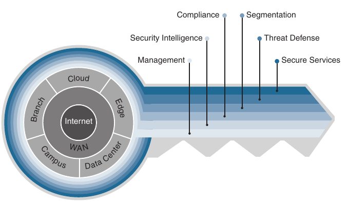
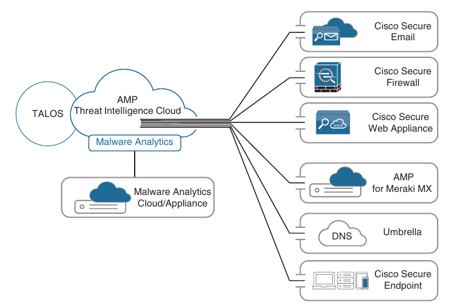
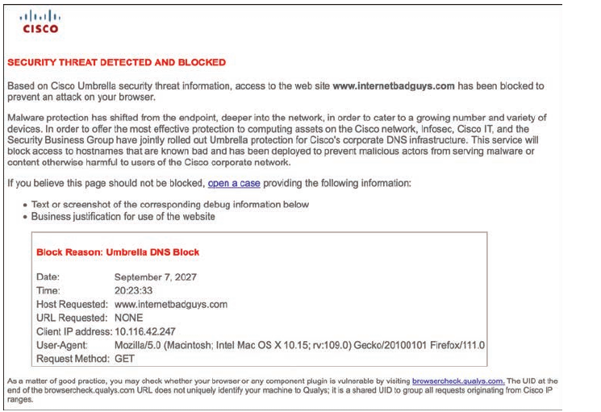
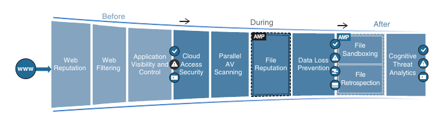

## Secure Network Access Control

1. Network Security Design for Threat Defense

2. Next-Generation Endpoint Security

3. Network Access Control (NAC)

- In campus networks, endpoints such as mobile devices and laptops are extremely vulnerable to security threats such as malware or ransomware, and they can become infected through various means, such as phishing, smishing, malicious websites and infected applications

- For this reason, a solid network security design is necessary to protect the endpoints from these types of security threats, and to enforce endpoint network access control, by validating the identities of end users to determine who and what they are allowed to access in the network before they are granted access

### Network Security Design for Threat Defense

- Evolving cybersecurity threats, such as phishing, smishing, malware, ransomware, and web-based exploits are very common

- There is no single product in the industry that can successfully secure organizations from all these threats

- To address this issue, Cisco created a Secure Architectural Platform (SAFE) that helps design secure solutions for the following places in the network (PINs)

    - **Branch**: Branches are typically less secure than the campus and data center PINs because the potentially large number of branches makes it cost prohibitive to try to apply on them all the security controls found in campus and data center PINs

    - Branch locations are therefore prime targets for security breaches

    - It is important to ensure that vital security capabilities are included in the design while keeping it cost effective

    - Top threats on branch PINs include endpoint malware (point-of-sale [POS] malware), wireless infrastructure exploits such as the use of rogue APs for man-in-the-middle (MitM) and/or denial-of-service (DoS) attacks, unauthorized/malicious client activity, and exploitation of trust

    - **Campus**: Campuses contain a large number of users, including employees, contractors, guests, and parteners

    - Campuses are easy targets for phishing, web-based exploits, unauthorized network access, malware propagation, and botnet infestations

    - **Data Center**: Data centers contain an organization's most critical information assets and intelectual capital, and they are therefore the primary goal of all targeted threats

    - Data centers typically contain hundreds or thousands of servers, which makes it very difficult to create and manage proper security rules to control network access

    - Tipical threats found in data centers are data extraction, malware propagation, unauthorized network access (application compromise), botnet infestation (scrumping), data loss, privilege escalation and reconnaissance

    - **Edge**: The edge is the primary ingress and egress point of traffic to and from the Internet, and for this reason, it is the highest-risk PIN and the most important for e-commerce

    - Typical threats seen on the edge include web server vulnerabilities, distributed denial-of-service (DDoS) attacks, data loss, and MitM attacks

    - **Cloud**: Security in the cloud is dictated by service-level agreements (SLAs) with the cloud service provider and requires independent certification audits and risk assessments

    - The primary threats are web server vulnerabilities, loss of access, data loss, malware and MitM attacks

    - **Wide area network (WAN)**: The WAN connects the PINs together

    - In a large organization with hundreds of branches, managing security in the WAN is very challenging

    - Typical threats seen in the WANs are malware propagation, unauthorized network access, WAN sniffing and MitM attacks

- **Cisco SAFE** focuses on the integration of security services within each of the PINs

- For information on the underlying networking design and infrastructure, see the Cisco Validated Designs (CVD) guides, which provides detailed networking design and implementation guidance

- CVDs can be found at [Cisco-CVD-guides](https://www.cisco.com/c/en/us/solutions/design-zone.html)

- Cisco SAFE also defines secure domains, which are operational areas used to protect the different PINs

- The following security concepts are used to evaluate each PIN:

    - **Management**: Management of devices and systems using centralized services is criticial for consistent policy deployment, workflow change management, and keeping systems patched

    - Management coordinates policies, objects, and alerting

    - **Security Intelligence**: Security intelligence provides detection of emerging malware and cyber threats

    - It enables an infrastructure to enforce policy dynamically, because reputiations are augmented by the context of new threats

    - This enables accurate and timely security protection

    - **Compliance**: Examples of compliance include PCI-DSS 3.0 and HIPA A

    - **Segmentation**: Segmentation involves establishing boundaries for both data and users

    - Traditional manual segmentation uses a combination of network addressing, VLANs, and ACLs for policy enforcement

    - Advanced segmentation using Cisco TrustSec software-defined segmentation reduces operational challenges by leveraging identity-aware infrastructure to enforce policies in an automated and scalable manner

    - **Threat Defense**: It is important to have visibility into the most dangerous cyber threats 

    - Threat defense provides this visibility through network traffic telemetry, file reputation, and contextual information (such as device types, locations, users, identities, roles, privilege levels, login status, posture status, and so on)

    - It enables assessment of the nature and the potential risk of suspicious activity so that the correct next steps for cyber threats can be taken

    - **Secure services**: These technologies include access control, virtual private networks (VPNs) and encryption

    - They include protection for insecure services (such as applications, collaboration, and wireless)

- The SAFE key, shown below, illustrate the PINs and security domains



- The Cisco SAFE framework is designed to be modular

- PINs that do not exist in a network can be removed

- Implementing the Cisco SAFE framework in an organization provides advanced threat defense protection that spans the full attack continuum before. during, and after an attack for all the PINs:

    - **Before**: In this phase, full knowledge of all the assets that need to be protected is required, and the types of threats that could target these assets need to be identified

    - This phase involves establishing policies and implementing prevention to reduce risk

    - Cisco solutions for this phase include Cisco Secure Firewalls, network access control, and identity services

    - **During**: This phase defines the abilities and actions that are required when an attack gets through

    - Threat analysis and incident response are some of the typical activities associated with this phase

    - For this phase, organizations can leverage next-generation intrusion prevention systems, next-generation firewalls, malware protection, and email and web security solutions that make it possible to detect, block, and defend against attacks that have penetrated the network and are in progress

    - **After**: This phase defines the ability to detect, contain, and remediate an attack

    - After a successful attack, any lessons learned need to be incorporated into the existing security solution

    - Organizations can leverage Cisco Advanced Malware Protection, next-generation firewalls, and malicious network behaviour analysis using Cisco Secure Network Analytics to quickly and effectively scope, contain and remediate an attack to minimize damage

### Next-Generation Endpoint Security

- Endpoints are easy targets for evolving threars, they are ubiquitous, and they come in many different forms, such as mobile devices, laptops, tablets, IP phones, personal computers (PCs), and Internet of Things (IOT) devices

- Thanks to the ubiquity of bring-your-own-device (BYOD) policies, any of them can be connected to a corporate network

- Organizations have used antivirus products to protect endpoints against malware for decades, and while these products have done a good job, they can't keep up with the rapidly evolving threat landscape

- Attackers have become very skilled at developing malware than can evade detection

- When the effectiveness of a specific type of malware declines, attackers create new variants

- Their approach is very dynamic and continuously changes at a pace that static point-in-time (for example antivirus) tools can't cope with

- Solutions to overcome these dynamic threats require a thorough understanding of how these attacks work and the evasion techniques that allow them to infiltrate networks

- To be able to detect the rapidly evolving threats, organizations should design their networks using a security framework such as that provided by Cisco SAFE

- Below are described the most critical components needed to implement the Cisco SAFE framework for a campus environment (or PIN, in Cisco SAFE terminology)

### Cisco Talos

- **Cisco Talos** is the Cisco threat intelligence organization, an elite team of security experts who are supported by sophisticated security systems to create threat intelligence that detects, analyzes, and protects against both known and emerging threats for Cisco products

- Cisco Talos was created from the combination of three security research teams:

    - IronPort Security Applications (SecApps)

    - The Sourcefire Vulnerability Research Team (VRT)

    - The Cisco Threat Research, Analysis, and Communications (TRAC) team

- Talos tracks threats across endpoints, networks, cloud environments, the web, and email, to provide a comprehensive understanding of cyber threats, their root causes, and scopes of outbreaks

- Every day Talos receives and analyzes nearly 16 billion web requests, 600 billion emails, and 1.5 million unique malware samples

- Talos also receives valuable intelligence that no other cybersecurity research team can match through the following intelligence feeds:

    - Advanced Microsoft and industry disclosures

    - The Advanced Malware Protection (AMP) community

    - ClamAV, Snort, Immunet, ScamCop, SenderBase, Cisco Secure Malware Analytics, and Talos user communities

    - Honeypots

    - The Sourcefire Awareness, Education, Guidance, and Intelligence Sharing (AEGIS) program

    - Private and public threat feeds

    - Dynamic analysis

- All this data is used to create comprehensive threat intelligence that is fed into a wide range of security products and solutions to provide protection against an extensive range of threats

### Cisco Secure Malware Analytics (Threat Grid)

- **Cisco Secure Malware Analytics** (formely Threat Grid), is a solution that can perform static file analysis (for example, checking filenames, MD5 checksums, file types, and so on) as well as dynamic file analysis (also known as behavioral analysis) by running the files in a controlled and monitored sandbox environment to observe and analyze the behavior against millions of samples and billions of malware artifacts to determine whether it is malware or not

- Behavioral analysis is combined with threat intelligence feeds from Talos as well as with existing security technologies to protect against known and unknown attacks

- If malware analytics identifies the file as malware, it begins to understand what it is doing or attempting to do, the scope of the threat it poses, and how to defend against it

- Malware typically includes code to detect whether it is being analyzed in a virtual sandbox environment, and if the malware detects that it is being executed in a sandbox, it won't run, rendering the analysis useless

- However, Malware Analytics evades being detected by malware by not having the typical instrumentation

- It is also possible to upload suspicious files into a sandbox environment called Glovebox to safely interact with them and observe malware behavior directly

- Malware Analytics is available as an appliance and in the cloud, and it is also integrated into existing Cisco Secure products and third-party solutions

- Automatic submission of suspicious files and samples is available for product and solutions integrated with Malware Analysis

- When automatic submission is not available, files can also be uploaded manually into Malware Analytics for analysis

### Cisco Advanced Malware Protection (AMP)

- **Cisco Advanced Malware Protection (AMP)** also referred to as malware defense, is a malware analytics and protection solution that goes beyond point-in-time detection

- Using targeted, context-aware malware, attackers have the resources, persistence, time, and expertise, to compromise any network relying solely on point-in-time detection mechanisms

- Point-of-time detection is completely blind to the scope and depth of a breath after it happens

- Cisco AMP provides comprehensive protection for organizations across the full attack continuum:

    - **Before**: Global threat intelligence from Cisco Talos and Cisco Secure Malware Analytics feeds into AMP to protect against known and new emerging threats

    - **During**: File reputation to determine whether a file is clean or malicious as well as as sandboxing is used to identify threats during an attack

    - **After**: Cisco AMP provides retrospection, indicators of compromise (IoCs), breach detection, tracking, analyisis, and surgical remediation after an attack, when advanced malware was slipped past other defenses

- The architecture of AMP can be broken down into the following components:

    - AMP Cloud (private or public)

    - AMP Connectors:

        - Cisco Secure Endpoint, formerly FireAMP or AMP for endpoints - supported on Microsoft Windows, macOS X, Google Android, Apple iOS, and Linux

        - Cisco Secure Email, formerly AMP for Email or Email Security Appliance (ESA)

        - Cisco Secure Web Appliance, formerly AMP for Web or Web Security Appliance (WSA)

        - **AMP for Networks** - supported on Cisco Secure Firewall appliances and Cisco AMP dedicated appliances

        - AMP for Meraki MX

    - Threat intelligence from Cisco Talos and Cisco Secure Malware Analytics

- The Cisco Secure Endpoint on Apple iOS is known as the Cisco Security Connector (CSC)

- The CSC incorporates Cisco Secure Endpoint and Cisco Umbrella

- Below is illustrated how all the AMP components come together to form the AMP/Malware Defense architecture

- The most important component of the AMP architecture is AMP cloud, which contains the database of files and their repudiations (malware, clean, unknown and custom), also referred to as *file dispositions*

- The file disposition in the AMP cloud can change based on data received from Talos or Malware Analytics

- If an AMP connector uploads a sample file to AMP cloud and the file's reputation is deemed to be malicious, it is stored in the cloud and reported to AMP connectors that see the same file

- If the file is unknown, it is sent to Malware Analytics, where it's behavior is analized in a secure sandbox environment

- AMP Cloud performs decision making in real time, evolving constantly based on the data that is received

- AMP Cloud can identify malware in files that were previously deemed to be clean

- Unlike traditional antivirus or malware protection software that uses a local database of signatures to match malicious software or a bad file, AMP connectors remain lightweight by instead sending a hash to the cloud and allowing the cloud to make the intelligent decisions and return a verdict (about reputation or file disposition) of clean, malicious, or unknown



### Cisco Secure Client (AnyConnect)

- The **Cisco Secure Client**, formerly Cisco AnyConnect Secure Mobility Client, is a modular endpoint software product that is not only a VPN client that provides VPN access through Transport Layer Security (TLS)/ Secure Sockets Layer (SSL) and IPsec IKEv2, but also offers enhanced security through various build-in modules, such as VPN posture (HostScan) module or an ISE Posture module

- These modules enable Cisco Secure Client to assess an endpoint's compliance for antivirus, antispyware, and firewall software installed on the host, for example

- If an endpoint is found to be noncompliant, network access can be restricted until the endpoint is in compliance

- Cisco Secure Client also includes web security through Cisco Cloud Web Security, network visibility into endpoint flows within Cisco Secure Network Analytics, and roaming protection with Cisco Umbrella - even while the Secure Client is not connected to the corporate network through a VPN

- Secure client is supported across a broad set of platforms, including Windows, macOS, iOS, Linux, Android, Windows Phone/Mobile, Blackberry, and Chrome OS

- TLS/SSL is often used to indicate that either protocol is being discussed

- The SSL protocol has been deprecated by the IETF in favor of more secure TLS protocol, so TLS/SSL can be interpreted as referring to TLS only

### Cisco Umbrella

- Cisco Umbrella, formmerly OpenDNS, provides the first line of defense against threats on the Internet by blocking requests to malicious Internet Destinations (domains, IPs, URLs) using the Domain Name System (DNS) before an IP connection is established or a file is downloaded

- It is 100% cloud delivered, with no hardware to install or software to maintain

- The Umbrella global network includes over 40 data centers around the world using Anycast DNS, which allows it to guarantee 100% uptime

- Thanks to it's Anycast DNS infrastrucure, it does not matter where each site is physically located: DNS traffic is routed to the closest location

- Security intelligence is gathered from an average of 500 billion daily DNS requests from more than 90 million users

- All this data is fed in real time into Umbrella's massive graph database, where statistical and machine learning models are continuously run against it

- This information is also constantly analyzed by the Umbrella security researchers and supplemented with intelligence from Cisco Talos

- Setting up Umbrella in the corporate network is as easy as changing the DHCP configuration on all Internet gateways (that is, routers, access points) so that all devices, including guest devices, forward their DNS traffic to Umbrella's global network

- For devices such as laptops that are off the corporate network, if they are using the Cisco Secure Client, there is an option to enable a roaming security module, which allows for all DNS requests to be sent to Umbrella's global network even when the VPN is turned off, and it does this without requiring an additional agent

- Another option is to deploy the Umbrella roaming client, which tags, encrypts, and forwards DNS queries bound for the Internet to the Umbrella roaming client, which tags, encrypts, and forwards DNS queries bound for the Internet to the Umbrella global network so per-device security policies can be enforced everywhere without latency or complexity



### Cisco Secure Web Appliance (WSA)

- The **Cisco Secure Web Appliance** is an all-in-one web gateway that includes a wide variety of protections that can block hidden malware from both suspicious and legitimate websites

- It leverages real-time threat intelligence from the AMP Threat Intelligence Cloud that allows it to stay one step ahead of the evolving threat landscape to prevent the latest exploits from infiltrating the network

- It also provides multiple layers of malware defense and vital data loss protection (DLP) capabilities across the full attack continuum



- Description of Secure Web Appliance involvement across the attack continuum before, during, and after an attack

- Before an attack:

    - **Before an attack**, the Secure Web Appliance actively detects and blocks potential threats before they happen by applying web reputation filters and URL filtering and by controlling web application usage:

        - **Web Reputation Files**: The Cisco Secure Web Appliance detects and correlates threats in real time by leveraging Cisco Talos

        - To discover where threats are hiding, Cisco Talos constantly refreshes web reputation filtering information every three to five minutes, adding intelligence to and receiving intelligence from the Cisco Secure Web Appliance and other network security devices

        - Web reputation filtering prevents client devices from accessing dangerous websites containing malware or phishing links

        - Cisco Secure Web appliance analyzes and categorizes unknown URLs and blocks those that fall below a defined security threshold

        - When a web request is made, web reputation filters analyze more than 200 different web traffic and network-related parameters to determine the level of risk associated with an website

        - After it checks the domain owner, the server where the site is hosted, the time the site was created, and the type of site, the site is assigned a reputation score, which ranges from -10 to +10, instead of the binary good or bad categorizations of most malware detection applications

        - Based on that reputation score and selected security policies, the site is blocked, allowed, or delivered with a warning

        - **Web Filtering**: Traditional URL filtering is combined with real-time dynamic content analysis

        - This process is used to shut down access to websites known to host malware with specific policies for URL filtering, which checks against a list of known websites from the Cisco URL filtering database of more than 50 million blocked websites

        - Inappropriate content is accurately identified in real time for 90% of unknown URLs using the Dynamic Content Analysis (DCA) engine

        - The DCA engine scans text, scores the text for relevancy, calculates model document proximity, and returns the closest category match

        - Every three to five minutes, Cisco Talos updates the URL filtering database with information from multiple vectors: firewall, IPS, the web, email, and VPNs

        - **Cisco Application Visibility and Control**(AVC): Cisco AVC identifies and classifies the most relevant and widely used web and mobile applications (such as Facebook) and more than 150.000 micro-applications (such as Facebook Messenger) to provide administrators with the most granular control over application and usage behavior

        - For example, AVC can be configured to permit users to access Facebook or YouTube while blocking users from activities such as clicking the "Like" button or viewing certain YouTube channels

    - **During an attack**

        - During an attack, the Secure Web Appliance uses security intelligence from cloud access security broker (CASB) providers, Talos and AMP for networks to identify and block zero-day threats that managed to infiltrate the network

            - **Cloud access security**: The Cisco Secure Web Appliance can protect against hidden threats in cloud apps by partenering with leading CASB providers (such as Cisco CloudLock) to monitor cloud app usage in real time to help combat evolving threats through intelligent protection powered by data science

            - **Parallel Antivirus (AV) Scanning**: The Cisco Secure Web Appliance enhances malware defense coverage with multiple anti-malware scanning engines running in parallel on a single appliance while maintaining high processing speeds and preventing traffic bottlenecks

            - **Layer 4 Traffic Monitoring**: Cisco Secure Web Appliance scans all traffic, ports, and protocols to detect and block spyware (phone-home) communications with an integrated Layer 4 traffic monitor

            - Based on this scanning, it identifies infected clients to help stop malware that attempts to bypass classic web security solutions

            - **File reputation and analysis with Cisco AMP**: With the Secure Web Appliance, files are assesed using the latest threat information from Cisco Talos, which, as mentioned before, is updated every three to five minutes

            - The Cisco Secure Web Appliance captures a fingerprint of each file as it traverses the gateway and sends it to AMP cloud for a reputation verdict checked against zero-day exploits

            - **Data Loss Prevention (DLP)**: The Cisco Secure Web Appliance uses Internet Content Adaptation Protocol (ICAP) to integrate with DLP solutions from leading third-party DLP vendors

            - When all outbound traffic is directed to the third-party DLP appliance, content is allowed or blocked based on the third-party rules and policies

            - Deep content inspection can be enabled for regulatory compliance and intellectual property protection

            - Powerful engines inspect outbound traffic and analyze it for content markers, such as confidential files, credit card numbers, customer personal data and so on, and prevent this data from being uploaded into cloud file-sharing services such as Box, iCloud and Dropbox

    - **After an attack**

        - After an attack, the Cisco Web Secure Appliance inspects the network continuously for instances of undetected malware and breaches

        - After an initial detection, using Cisco AMP retrospection capabilities, the Cisco Secure Web Appliance continues to scan files over an extended period of time, using the latest detection capabilities and collective threat intelligence from Talos and Malware Analytics

        - Alerts are sent when a file disposition changes (that is, is unknown to malware) to provide awareness and visibility into malware that evades initial defenses

        - Global Threat Analytics (GTA), formerly Cognitive Threat Analytics (CTA), analyzes web traffic, endpoint data from Cisco Secure Endpoint, and network data from Cisco Secure Network Analytics

        - It then uses machine learning to identify malicious activity before it can exfiltrate sensitive data

        - The Secure Web Appliance can be deployed in the cloud, as a virtual appliance, on-premises, or in a hybrid arrangement

        - All features are available across any deployment option

### Cisco Secure Email (ESA)

- For business organizations, email is the most important business communication tool, and at the same time, it is one of the top attack vectors for security breaches

- Cisco Secure Email enables users to communicate securely via email and helps organizations combat email security threats with a multilayered approach across the attack continuum

- Cisco Secure Email includes the following advanced threat protection capabilities that allow it to detect, block, and remediate threats across the attack continuum:

    - **Global Threat Intelligence**: It leverages real-time threat intelligence from Cisco Talos and Cisco Secure Malware Analytics

    - **Reputation Filtering**: Cisco Secure Email blocks unwanted email with reputation filtering, which is based on threat intelligence from Talos

    - **Spam Protection**: Cisco Secure Email use the Cisco Context Adaptive Scanning Engine (CASE) to block spam emails; it delivers a spam catch rate greater than 99% with a false-positive rate of less than 1 in 1 million

    - **Forged Email Detection**: Forged email detection protects high-value targets such as executives against business email compromise (BEC) attacks

    - **Cisco Advanced Phishing Protection (CAPP)**: CAPP combines Cisco Talos threat intelligence with local email intelligence and advanced machine learning techniques to model trust email behavior on the Internet, within organizations and between individuals

    - It uses this intelligence to stop identity deception-based attacks such as fraudulent senders, social engineering, and BEC attacks

    - **Cisco Domain Protection (CDP)**: CDP for external email helps prevent phishing emails from being sent using a customer domain

    - **Malware Defense**: Cisco Secure Email protects against malware

    - **Graymail detection and Safe Unsubscribe**: Cisco Secure Email detects and classifies graymail for administrator to take action on them if necessary

    - Graymail consists of marketing, social networking, and bulk messages (that is, mailing list emails)

    - This type of email typically comes with an unsubscribe link, which may be used for phishing

    - Safe unsubscribe protects against this type of physhing technique

    - **URL-related protection and control**: Cisco Secure Email protects against malicious URLs with URL filtering and scanning of URLs in attachments and shortened URLs

    - **Outbreak filters**: Outbreak filters defend against emerging threats and blended attacks by leveraging security intelligence information from Cisco Talos

    - Outbreak filters can rewrite URLs included in suspicious email messages

    - When clicked, the new rewritten URLs direct the email recipient to the Secure Web Appliance

    - The website content is then actively scanned, and outbreak filters display a block screen to the user if the site contains malware

    - **Web interaction tracking**: Cisco Secure Email generates reports to track the end users who click on URLs that have been rewritten by the outbreak filters

    - The reports include the following information:

        - Top users who clicked on malicious URLs

        - The top malicious URLs clicked by end users

        - Date and time, rewrite reason, and action taken on the URLs

    - **Data security for sensitive content in outgoing emails**: Confidential outbound messages that match one of the more than 100 expert policies, included with Cisco Secure Email are automatically protected by encryption, footers and disclaimers, blind carbon copies (BCCs), notifications and quarantinging

- Cisco Secure Email is available as a hardware appliance or as a cloud offering called Cisco Secure Email Threat Defense

### Cisco Secure IPS (FirePOWER NGIPS)

- A system that passively monitors and analyzes network traffic for potential network intrusion attacks and logs the intrussion attack data for security analysis is known as an *intrusion detection system (IDS)*

- A system that provides IDS functions and also automatically blocks intrusion attacks is known as *intrusion protection systems (IPS)*

- A next-generation IPS (NGIPS), according to Gartner, Inc., should include IPS functionality as well as the following capabilities:

    - Real-time contextual awareness

    - Advanced threat protection

    - Intelligent security automation

    - Unparalelled performance and scalability

    - Application visiibility and control (AVC) and URL filtering

- With the aquisition of Sourcefire in 2013, Cisco added to it's portfolio the FirePOWER NGIPS, which is now called Cisco Secure IPS

- Cisco Secure IPS exceeds the NGIPS requirements defined by Gartner

- Following are some of the most important capabilities included with Cisco Secure IPS

    - **Real-time contextual awareness**: Discovers and provdes contextual information such as applications, users, endpoints, operating systems, vulnerabilities, services, processes, network behaviors, files, and threats

    - **Advanced threat protection and remediation**: Rapidly detects, blocks, contains and remediates advanced threats through integrated AMP for Networks, and Secure Malware Analytics sandboxing solutions

    - **Intelligent Security Automation**: Automatically correlates threat events, contextual information, and network vulnerability data to perform the following:

    - Optimizing defenses by automating protection policy updates

    - Quickly identifying users affected by a client-side attack 

    - Receiving alerts when a host violates a configuration policy

    - Detecting the spread of malware by baselining normal network traffic and detecting network anomalies

    - Detecting and tagging hosts that might potentially be compromised by malicious means (exploit kit, malware, command-and-control) with an IoC

    - **Unparalleled performance and stability**: Purpose-built Cisco Secure Firewall and Cisco Secure Firewall ASA appliances incorporates a low-latency, single-pass design for unprecedented performance and scalability

    - **AVC**: Reduces threats through application detection of more than 4000 commercial applications, with support for custom applications

    - **URL filtering**: Provides access control to more than 80 categories of websites and covers more than 280 million individual URLs

- In addition, following are some of the capabilities available in the Cisco Secure IPS that exceed the requirements for the definition of NGIPS:

    - **Centralized management**: Centralized management by Cisco Secure Firewall Management Center (FMC), formerly Firepower Management Center, which is a single pane of glass for event collection and policy management

    - **Global Threat Intelligence from Cisco Talos**: Integration with Cisco Talos for up-to-the-minute IPS signature updates as well as URL filtering information to blocklist connections to or from IP addresses, URLs and/or domain names

    - **Snort IPS detection engine**: The detection engine is Snort, the world's most powerful open-source IPS engine

    - **Third-party and open-source ecosystem**: Open API for integration with third-party products

    - **Integration with Cisco ISE**: The FMC can use Cisco ISE to apply remediation on compromised hosts:

        - **Quarantine**: Limits or blocks an endpont's access to the network

        - **Unquarantine**: Removes the quarantine

        - **Shutdown**: Shuts down the port that a compromised account is attached to

### Cisco Secure Firewall (NGFW)

- A firewall is a network security device that monitors incoming and outgoing network traffic and allows or blocks traffic by performing simple packet filtering and stateful inspection based on ports and protocols

- A firewall essentially establishes a barrier between trusted internal networks and untrusted outside networks, such as the Internet

- In addition to providing standard firewall functionality, a **next-generation firewall (NGFW)** can block threats such as advanced malware and application-layer attacks

- According to Gartner, Inc's definition, an NGFW must include:

    - Standard firewall capabilities such as stateful inspection

    - An integrated IPS

    - Application-level inspection (to block malicious or risky apps)

    - The ability to leverage external security intelligence to address evolving security threats

- Cisco integrated ASA software with the Cisco Secure IPS services software, and the combination of the two far exceeds the NGFW definition set by Gartner

- This integration gave birth to the Cisco Firepower NGFW (now called Cisco Secure Firewall), which is the industry's first fully integrated, threat focused NGFW with unified management

- Cisco Secure Firewall is available in the following form factors:

    - Cisco Secure Firewall Appliances

    - Cisco Secure Industrial Security Appliance (ISA)

    - Cisco Secure Firewall Threat Defense Virtual

    - Cisco Secure Firewall Cloud Native

    - Cisco Secure Web Application Firewall (WAF) and bot protection

    - All ASA 5500-X appliances (except 5585-X)

- The Cisco Secure Firewall supports the following software:

    - **ASA software image**: Turns the appliance into a standard legacy firewall with no Cisco Secure IPS services

    - It is supported on all Cisco Secure Firewall and ASA appliances

    - **ASA software image with Cisco Secure IPS software image (FirePOWER NGIPS)**: Runs two software images in the same appliance, with each one requiring different management applications

    - Cisco Secure IPS (NGIPS) enables the ASA to be a NGFW

    - This type of configuration is supported only on 5500-X appliances (except the 5585-X)

    - **Firepower Threat Defense (FTD) software image**: Merges the ASA software image and the Cisco Secure IPS image into a single unified image

    - Supported on all Cisco Secure Firewall and ASA 5500-X appliances (except the 5585-X)

- In Cisco's documentation, FirePOWER (uppercase) refers to the Cisco Secure IPS (NGIPS) services image or the NGIPS services ASA module, while Firepower (lowercase) refers to the Cisco Secure Firewall or the FTD unified image

- FTD is also supported on the following platforms:

    - ISR modules

    - Cisco Secure Firewall Threat Defense Virtual and Cloud Native Appliances, supported in VMware, KVM, Amazon Web Services (AWS), Google Cloud Platform (GCP), Cisco Hyperflex, Nutanix, OpenStack, Alibaba Cloud, and Microsoft Azure Environments

- The following management options are available for Cisco Secure Firewalls:

    - For FTD or Cisco Secure IPS Services software:

        - Cisco SecureX

        - Cisco Secure Firewall Management Center (FMC), formerly Firepower management center

        - Cisco Secure Firewall Device Manager (FDM), formerly Firepower Device Manager, for small appliances

    - For ASA software:

        - The command-line interface (CLI)

        - Cisco Security Manager (CSM)

        - Cisco Secure Firewall Adaptive Security Device Manager(ASDM)

        - Cisco Defense Orchestrator

- FTD or Cisco Secure IPS Services software CLI configuration is not supported

- CLI is available only for initial setup and troubleshooting purposes

### Cisco Secure Firewall Management Center (FMC)

- The Cisco FMC is a centralized management platform that aggregates and correlates threat events, contextual information, and network performance data

- It can be used to monitor information that Cisco Secure Firewall devices are reporting to each other and examine the overall activity occuring in the network

- The FMC performs event and policy management for the following Cisco Secure Firewall security solutions:

    - Cisco Secure Firewall (physical) and Cisco Firewall Threat Defense (virtual)

    - Cisco FTD for ISR

    - Cisco ASA with FirePOWER services

### Cisco Secure Network Analytics (Stealthwatch enterprise)

- **Cisco Secure Network Analytics**, formerly *Stealthwatch Enterprise*, is a collector and aggregator of network telemetry data that performs network security analysis and monitoring to automatically detect threats that manage to infiltrate the network, as well as the ones that originate from within a network

- Using advanced security analytics, Cisco Secure Network Analytics can quickly and with high confidence detect threats such as command-and-control (C&C) attacks, ransomware, DDoS attacks, ilicit cryptomining, unknown malware, and inside threats

- It is an agentless solution that brings threat visibility that can be scaled into the cloud (when used in combination with Cisco Secure Cloud Analytics), across the network, to branch locations, in the data center, and down to the endpoints, and it can detect malware in encrypted traffic to ensure policy compliance without decryption

- At the core of Cisco Secure Network Analytics are the following components:

    - **Cisco Secure Network Analytics Manager, formerly Stealthwatch Manager Console (SMC)**: The Network Analysis Manager is the control center for Cisco Secure Network Analytics

    - It aggregates, organizes, and presents analysis from up to 25 Flow Collectors, Cisco ISE, and other sources

    - It offers a powerful yet simple-to-use web console that provides graphical representations of network traffic, identity information, customized summary reports, and integrated security and network intelligence for comprehensive analyisis
    
    - The Network Analysis Manager is available as a hardware appliance or a virtual machine

    - **Cisco Secure Network Analysis Flow Collectors**: The flow collectors collect and analyze enterprise telemetry data, such as NetFlow, IP Flow Information Export (IPFIX), and other types of flow data from routers, switches, firewalls, endpoints, and other network devices

    - The flow collectors can also collect telemetry from proxy data sources, which can be analyzed by Global Threat Analytics, formerly Cognitive Threat Analytics

    - It can also pinout malicious patterns in encrypted traffic using Encrypted Traffic Analysis (ETA), without having to decrypt it, to identify threats and accelerate response

    - Flow Collectors are available as hardware appliances and as virtual machines

    - **Cisco Secure Network Analytics Flow Rate License**: The Flow Rate License is required for the collection, management, and analysis of flow telemetry data and aggregates flows at the Network Analysis Manager as well as to define the volume of flows that can be collected

- Optional but recommended components include the following:

    - **Cisco Secure Network Analytics Flow Sensors**: Produce telemetry data for segments of the networking infrastructure that can't generate NetFlow data and also provides visibility into the application layer data

    - They are available as hardware appliances or as virtual machines

    - **Cisco Secure Network Analytics UDP (User Datagram Protocol) Director**: Receive essential network and security UDP data streams from multiple locations and then forwards them in a single UDP data stream to one or more destinations

    - For example, instead of having every router in the network configured with multiple NetFlow exports for multiple destinations such as Flow Collectors, Live Action, Arbor, and so on, every router could be configured with a single NetFlow export and send the data to the UDP Director

    - The UDP Director takes the data and replicates the NetFlow data from all routers to the multiple destinations in a single stream of data

    - It is available as a hardware appliance or a virtual machine

    - **Cisco Telemetry Broker**: Just like the UDP Director can take UDP data streams from multiple inputs and replicate them to multiple destinations, the Telemetry Broker can ingest telemetry data (for example, AWS VPC Flow Logs) from multiple inputs, filter unneded data, and transform it into a format (for example IPFIX) that can be understood by telemetry consumer of choice, such as Cisco Secure Network Analytics and Splunk

    - **Cisco Secure Network Analysis Data Store**: Used for centralized flow data and network telemetry storage instead of a distributed model across multiple Flow Collectors

    - The centralized model offers great storage capacity, greater flow rate, and increased resiliency versus the distributed model

    - The Data Store is composed of a minimum of three Data Node Appliances

    - **Cisco Secure Network Analytics Threat Feed License**: Enables a feed of threat intelligence from Cisco Talos

    - **Cisco Secure Network Analysis Endpoint License**: Extends visibility into endpoints

    - **Cisco Secure Cloud Analytics**: Can be used in combination with Cisco Secure Network Analytics to extend visibility into Amazon Web Services (AWS), Google Cloud Platform (GCP), and Microsoft Azure cloud infrastructures

- Cisco Secure Network Analytics offers the following benefits:

    - Real-time threat detection

    - Incident response and forensics

    - Network segmentation

    - Network performance and capacity planning

    - Ability to satisfy regulatory requirements

### Cisco Secure Cloud Analytics (Stealthwatch Cloud)

- *Cisco Secure Cloud Analytics* formerly Stealthwatch Cloud, provides the visibility and continuous threat detection required to secure on-premises, hybrid and multicloud environments

- It can accurately detect threats in real time, regardless of whether an attack is taking place on the network, in the cloud, or across both environments

- Cisco Secure Cloud Analytics is a cloud-based Software-as-a-Service (SaaS) solution

- It detects malware, ransomware, data exfiltration, network vulnerabilities, and role changes that indicate compromise

- Cisco Secure Cloud Analytics supports two deployment models:

    - Cisco Secure Cloud Analytics Public Cloud Monitoring, formerly Stealthwatch Cloud Public Cloud Monitoring

    - Cisco Secure Network Analytics SaaS, formerly Stealthwatch Cloud Private Network Monitoring

#### Cisco Secure Cloud Analytics Public Cloud Monitoring

- Public cloud monitoring provides visibility and threat detection in AWS, GCP, and Microsoft Azure cloud infrastructures

- It is an SaaS-based solution that can be deployed easily and quickly

- Public Cloud Monitoring can be deployed without software agents, instead relying on native sources of telemetry such as it's virtual private cloud (VPC) flow logs

- Cisco Secure Cloud Analytics models all IP traffic inside VPCs, between VPCs, or to external IP addresses generated by organization's resources and functions

- Cisco Secure Cloud Analytics is also integrated with additional AWS services such as Cloud Trail, Amazon Cloud watch, AWS Config, Inspector, Identity and Access Management (IAM), Lambda and more

- Public Cloud Monitoring can be used in combination with Cisco Secure Cloud Analytics or Cisco Secure Network Analytics SaaS to provide visibility and threat detection across the entire network, from the private network and branch offices to the public cloud

#### Cisco Secure Network Analytics SaaS

- Network Analytics SaaS provides visibility and threat detection for the on-premises network, delivered from a cloud-based SaaS solution

- It is a perfect solution for organizations that want better awareness and security in their on-premises environments while reducing capital expenditure and operational overhead

- A lightweight virtual appliance needs to be installed in a virtual machine or server that can consume a variety of native sources of telemetry data or extract metadata from network packet flow

- The collected metadata is encrypted and sent to the Cisco Secure Cloud Analytics platform for analysis

- Cisco Secure Cloud Analytics consumes metadata only. The actual packet payloads are never retained or transferred outside the network

### Cisco Identity Services Engine (ISE)

- **Cisco Identity Services Engine (ISE)** is a security policy management platform that provides highly secure network access (NAC) to users and devices across wired, wireless, and VPN solutions

- It allows for visibility into what is happening in the network, such as who is connected (endpoints, users and devices), which applications are installed and running on endpoints (for posture assessment), and much more

- Some of the most important features, benefits, services, and integrations supported by Cisco ISE include the following:

    - **Streamlined network visibility**: Through a simple web-based interface, ISE stores a detailed attribute history of all the devices, endpoints, and users (guests, employees, and contractors) on the network

    - **Cisco Digital Network Architecture (DNA) Center integration**: Cisco DNA center is the Cisco intent-based network controller and analytics platform

    - It makes it easy to design, provision, and apply policy across the network

    - Through it's integration with Cisco ISE, it can apply TrustSec software-defined segmentation through SGT tags and Security Group Access Control Lists (SGACLs)

    - **Centralized secure network access control**: Cisco ISE supports the RADIUS protocol, required to enable 802.1X/EAP, MAB, and local and centralized WebAuth for consistent access control into wired, wireless and VPN networks

    - **Centralized device access control**: Cisco ISE supports the TACACS+ protocol, which is required for AAA device access control services

    - **Cisco TrustSec**: Cisco ISE implements Cisco TrustSec policy for software-defined secure segmentation through SGT tags, SGACLS and SXT

    - **Guest Lifecycle Management**: It can be used to create customizable guest user web portals for WebAuth that can be branded with a company logo

    - **Streamlined device onboarding**: Cisco ISE automates 802.1X supplicant provisioning and certificate enrollment

    - It also integrates with mobile device management (MDM)/ enterprise mobility management (EMM) vendors for device compliance and enrollment

    - **Internal certificate authority**: Cisco ISE can act as internal certificate authority

    - **Device Profiling**: It automatically detects, classifies, and associates endpoints that connect to the network to endpoint-specific authorization policies based on device type

    - **Endpoint posture service**: Cisco ISE performs powerful posture audits on endpoints to make sure they are compliant

    - For example, it can check for the latest OS patch, see if the endpoint firewall is enabled, make sure anti-malware packages have the latest definitions, look for disk encryption, see a mobile PIN lock, determine rooted or jail-broken phone status, and much more

    - Devices that are not compliant can be remediated (prevented from accessing the network, applications, or services) until they become compliant

    - It also provides hardware inventory of every single device and endpoint connected to the network for full network visibility

    - **Active Directory Support**: Cisco ISE supports integration with Microsoft Active Directory 2012, 2012R2, 2016 and 2019

    - **Cisco Platform Exchange Grid (pxGrid)**: Cisco ISE shares contextual information using a single API between different Cisco platforms as well as more than 50 technology partners

    - pxGrid is an Internet Engineering Task Force (IETF) framework that makes it possible to automatically and quickly identify, contain, mitigate, and remediate security threats across the entire network

    - Cisco ISE is the central pxGrid controller (also referred to as pxGrid server), and all Cisco and third-party security platforms (referred to as pxGrid nodes) interface with it to publish, subscribe to, and query contextual information

    - There are two versions of pxGrid:

        - **pxGrid 1.0**: Released with ISE 1.3 and based on Extensible Messaging and Presence Protocol (XMPP)

        - Starting with ISE Release 3.1, all pxGrid connections must be based on pxGrid 2.0

        - **pxGrid 2.0**: Uses WebSocket and the RestAPI over Simple Text Oriented Message Protocol (STOMP) 1.2

- Below we can see the type of contextual information Cisco ISE can share with devices integrated with it through pxGrid

```
Session={ip=[192.168.1.2]
Audit Session Id=0A000001000000120001C0AC
UserName=dewey.hyde@corelab.com
ADUserDNSDomain=corelab.com
ADUserNetBIOSName=corelab,
ADUserResolvedIdentities=dewey.hyde@corelab.com
ADUserResolvedDNs=CN=Dewey Hyde
CN=Users
DC=corelab
DC=com
MacAddresses=[00:0C:C1:31:54:69]
State=STARTED
ANCstatus=ANC_Quarantine
SecurityGroup=Quarantined_Systems
EndpointProfile=VMWare-Device
NAS IP=192.168.1.1
NAS Port=GigabitEthernet0/0/1
RADIUSAVPairs=[ Acct-Session-Id=0000002F]
Posture Status=null
Posture Timestamp=
LastUpdateTime=Sat Aug 21 11:49:50 CST 2019
Session attributeName=Authorization_Profiles
Session attributeValue=Quarantined_Systems
Providers=[None]
EndpointCheckResult=none
IdentitySourceFirstPort=0
IdentitySourcePortStart=0}
```
