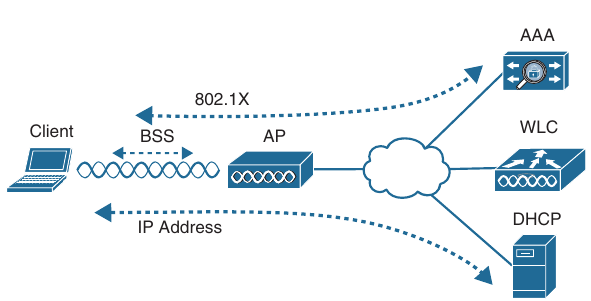
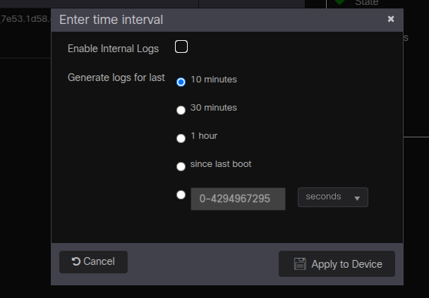

## Troubleshooting Wireless Connectivity

- Troubleshooting Client Connectivity from the WLC

- Troubleshooting Connectivity Problems at the AP

- When one or more network users report they are having problems, your first course of action should be to gather more information

- Begin with a broad perspective and then ask pointed questions to narrow the scope of possible causes

- You do not want to panic or waste time chassing irrelevant things

- Instead, ask questions and try to notice patterns or similarities in the answers you receive

- For example, if you get reports from many people in the same area, perhaps an AP is misconfigured or malfunctioning

- Reports from many areas or from a single service set identifier (SSID) may indicate problems with a controller configuration

- However, if you receive a report of only one wireless user having problems, it may not make sense to spend time troubleshooting a controller, where many users are supported

- Instead, you should focus on that one user's client device and it's interaction with an AP

- As you prepare to troubleshoot a single wireless client, think about all the things a client needs to join and use the network

- From below we can see that the following conditions must be met for a successful association:

    - The client is within RF range of an AP and asks to associate

    - The client authenticates

    - The client requests and receives an IP address

- Try to gather information from the end user to see what the client is experiencing

- "I cannot connect", or "The Wi-Fi is down" might actually mean that the user's device cannot associate, cannot get an IP address, or cannot authenticate

- A closer inspection of the device might reveal more clues

- Therefore, at a minimum you need the wireless adapter MAC address from the client device, as well as it's physical location

- The end user might try to tell you about a specific AP that is in the room or within view

- Record that information too, but remember that the client device selects which AP it wants to use - not the human user

- The device might well be using a completely different AP

- Start focusing on a single client device and then broaden outward, where multiple clients might be affected

### Troubleshoot Client Connectivity from the WLC

- Most of your time managing and monitoring a wireless network will be spent in the wireless LAN controller GUI

- As a wireless client probes and attempts to associate with an AP, it is essentially comunicating with the controller

- You can access a wealth of troubleshooting information from the controller as long as you know the client's MAC address

- Cisco WLCs based on IOS XE, such as Catalyst 9800, have a GUI presentation where you can access monitoring, configuration, administration, licensing, and troubleshooting functions

- When you open a browser to the WLC management address, you see the default screen that is shown below

- The default screen displays network summary dashboard information on the right portion and a menu of functions on the left

- If you know a specific wireless client's MAC address, you can enter it in the search bar at the top right of the screen

- For example, below 7e53.1d58.c022 is the target of the search

- Because the MAC address is known to a controller, a "Client MAC result" match is shown below the search bar as displayed

- You can select the client's MAC address to display detailed information about it

- Search for a client in WLC GUI

- Displaying client information

- The resulting details about the client are displayed in the Client 360 View screen, shown below

- From this output, you can see many details listed about the client device listed in the left portion of the screen, and you can see connectivity and application information displayed on the right

#### Checking the client's association and signal status

- In the 360 View screen, you can check the wireless client's username (if it is known), wireless MAC address, wireless Connection uptime, and the WLAN (SSID) name

- Usually the username is not known if the client did not authenticate itself with a username

- The client has been associated to the SSID named "radius-devices"

- The WLC also displays the AP name where the client is associated, along with the channel

- The signal strength at which each AP received the client is also shown, along with the signal quality (signal-to-noise-ratio) and the channel width

- In some cases (like with an apple device), the device type is also shown - but not in my case

- You can also see the client's wireless capabilities (802.11ac with one spatial stream)

- For troubleshooting purposes, you can find some important information next to Client performance

- In my case the client's signal has been received at -28 dBm, which is sufficiently strong

- The signal quality, or signal-to-noise-ratio (SNR) is 63 dB, which is very good

- The client's current channel width is 40 MHz

- Remember that the SNR measures how many decibels the signal is above the noise floor

- The SNR can be a low value for lower data rates to be successfully used, but it must be greater to leverage higher data rates

- Suppose that the same client moves to a different location and then complains of poor performance

- By searching the client's MAC address on the WLC again, you see some new information

- This time, the AP is receiving the client's signal strength at -75 dBm and the SNR at 18 dBm - both rather low values, most likely causing the client to use a low data rate

- It is safe to assume that the client has moved too far away from the AP where it is associated, causing the signal strength to to become to low to support faster performance

- This might indicate that you need to place a new AP in that area to boost the RF coverage

- Or it could indicate a client device that is not roaming soon enough to a new AP with a stronger signal

#### Checking the Client Properties

- Under the General -> Client Properties tab, as shown below, you can verify the client's MAC address, IP address, policy profile in use on the AP, the WLAN/SSID being used, the AP's BSSID, client connection's uptime, and session timeout

- Toward the bottom you can verify the current transmit rate set for modulation and coding scheme MCS being used, along with many other parameters like QoS and client's mobility or roaming activity

#### Checking the AP Properties

- By checking the General -> AP Properties tab, you can verify information about the client's AP as shown below

- You can quickly learn the AP's wired MAC address and name, along with the client's current status (associated or not), the 802.11 protocol in use, and the current channel number

#### Checking the Client Security

- Select the General -> Security Information tab to display parameters related to the client's wireless security

- Below, the client is using WPA3, CCMP (AES), 802.1x-SHA256, no EAP, a 28800-second session timeout

#### Troubleshooting the Client

- Sometimes a wireless client might be having problems connecting or comunicating, but the root cause won't be obvious

- In that case, you can collect detailed Radioactive Trace troubleshooting information about the client from the WLCs perspective

- There are two ways to navigate there:

    - Troubleshooting -> Radioactive Trace button on the main WLC screen

    - Select the small wrench icon underneath the client's MAC address in the Monitoring -> Wireless -> Clients page

- Navigate to Troubleshooting -> Radioactive Trace to access the troubleshooting controls, as shown below

- The client's MAC address has been already been populated

- You can select the "Add" button to add more clients to the list so that troubleshooting information will be collected for them too

- Select the Start button to begin collecting WLC logs involving the MAC addresses in the list

- Let the Radioactive Trace run until you feel the client has had a chance to try to join the network again or experienced some event that needs further investigation

- Select the Stop button to end the data collection; then select the green Generate button next to the client's MAC address to create a readable debug trace file

- In a pop-up window you will choose the time interval of logs to collect: the last 10 minutes, last 30 minutes, last 1 hour, or since the last WLC reboot

- Check the Enable internal logs to use the logs collected by the WLC

- Once the debug trace has been generated, two small blue icons will appear in the list next to the client's MAC address

- You can select the icon with a downward arrow, as shown below, to download the file to your local machine, or select the document icon to display the trace file contents in the bottom of the Radioactive Trace page

### Troubleshooting Connectivity Problems at the AP

- In cases where you get reports from multiple users who are all having problems in the same general area, you might need to focus your efforts on an AP

- The problem could be as simple as a deffective radio, where no clients are receiving a signal

- In that case, you might have to go onsite to confirm that the transmitter is not working correctly

- Otherwise, the split-MAC architecture creates several different points where you can troubleshoot

- Successfully operating the lightweight AP and providing a working BSS require the following:

    - The AP must have connectivity to it's access layer switch

    - The AP must have connectivity to the WLC, unless it is operating in FlexConnect mode

- First verify the connectivity between an AP and a controller

- Usually, you do this when a new AP is installed, to make sure it is able to discover and join a controller before clients arrive and try to use the wireless network

- You can also do this at any time as a quick check of the APs health

- The easiest approach is to simply look for the AP in the list of live APs that have joined the controller

- Enter the AP's name in the search bar 

- If the search reveals a live AP that is joined to the controller, you can select it to display some basic AP statistics

- Below is shown the result of searching for "ap-500" in the AP's name

- From this information you can verify that the "AP500f.8058.4418" is up (Admin status is a green checkmark) and joined to the controller

- It is model "AIR-CAP2702I-E-K9", is Registered and Healthy and has a valid IP address

- You can select the "Join Statistics" tab to display some basic information about the last known events when the AP tried to join or leave the controller

- The AP's status is up and there and the last reboot reason is "Reboot command from AP console"

- However, the APs can disconnect from the controllers due to a tag being modified

- That is usually the expected behaviour because the AP's tag causes it to refresh it's connection to the controller or cycle it's radios or WLANs to commit changes to it's operation

- To see more information about the AP, select it's name from the AP name column of the AP statistics page

- The top portion of the 360 View tab displays AP's location, ip address, model, serial number, PoE status, and country code

- You can also determine if the AP is capable of using WPA3, the VLAN tag number, software version and connection uptime

- There is also displayed the operational summary for AP's radios, as shown above

- From this information, you can verify that both of the AP's radios are enabled, the number of wireless clients currently connected to each, and which channel is being used

- The transmit power level is shown, along with indicators of channel, transmit and receive utilizations

- If channel utilization values are high, you can assume that the channel is heavily used, probably slowing communication and making it difficult for wireless stations to have an opportunity to transmit

- Recall that each AP must be mapped to three tags, each mapping to one or more types of profiles

- Sometimes you might have trouble remembering the profile and tag associations, especially if you have several of them configured to match unique requirements in various parts of your campus network

- This information can be important when you're troubleshooting a problem that might be caused by unexpected or misconfigured profiles or tags

- Fortunately, the WLC offers a quick and easy way to view the entire profile and tag hierarchy that has been appied to an AP

- You can display the AP's operational configuration by selecting the small hierarchy icon next to the AP's name, as shown below

- Below is shown the configuration in hierarchical form

- You can quickly verify what policy tag, site tag, and RF tag is the AP using

- You can also see the individual profiles referenced by each tag and some basic operational information to be used by each profile
