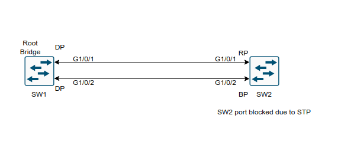
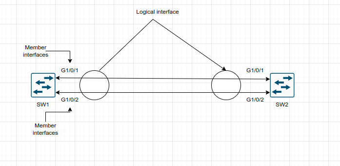
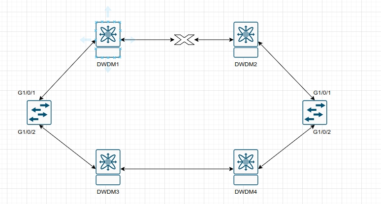

## VLAN Trunks and EtherChannel bundles

1. VLAN Trunking Protocol(VTP)

2. Dynamic Trunking Protocol(DTP)

3. EtherChannel bundle

## VLAN Trunking Protocol

- Before APIs were available on the Cisco platforms, configuring a switch was a manual process 

- Cisco created the proprietary protocol, VLAN Trunking Protocol (VTP) to reduce the burden of configuring VLANs on switches

- Adding a VLAN may seem like a simple task, but in an environment with 100 switches, adding a VLAN required logging into 100 switches to provision one VLAN

- Thanks to VTP, switches that participate in the same VTP domain can have a VLAN created once on a VTP server and propagated to other VTP client switches in the same VTP domain

- There are four roles in a VTP architecture:

	- **Server**: The server switch is responsible for creation, modification, and deletion of VLANs within the VTP domain

	- VTP servers advertise their VLAN configuration to other switches based on advertisements received over **trunk links**
	
	- **Client**: The client switch receives VTP advertisements and modify the VLANs on that switch. VLANs cannot be configured locally on a VTP client
	
	- **Transparent**: VTP transparent switches receive and forward VTP advertisements but do not modify the local VLAN database. VLANs are configured only locally

	- They forward the VTP advertisements to other switches in VTP version 2
	
	- **Off**: A switch does not participate in VTP advertisements and does not forward them out of any ports either. VLANs are configured only locally
	


- In the above topology SW1 is the VTP Server

- SW2, SW4, SW5 and SW6 are VTP Clients

- SW3 is in transparent mode and and does not update it's VLAN database as changes are propagated through the VTP domain

- SW3 forwards the VTP changes to SW6

- There are three versions of VTP, and Version 1 is the default. At its simplest, VTP Version 1 and 2 limited propagation to VLANs numbered 1 - 1005

- VTP version 3 allows for the full range of VLANs: 1 to 4094. Most switches should be capable of running VTP Version 3

- VTP supports having multiple VTP servers in a domain

- These servers process updates from other VTP servers just as a client does

- If a VTP domain is Version 3, the VTP primary server must be set with the privileged exec mode command:

```
vtp primary
```

### VTP Communication

- VTP advertises updates by using a multicast address across the trunk links for advertising updates to all the switches in the VTP domain (01:00:0c:cc:cc:cc)

- There are three main types of advertisements:

	- **Summary**: This advertisement occurs every 300 seconds or when a VLAN is added, removed, or changed
	
	- It includes VTP version, domain, configuration revision number, and timestamp
	
	- When a switch receives a summary advertisement packet, the switch compares the VTP domain name to it's own domain name 
	
	- If the name is different, the switch simply ignores the packet
	
	- If the name is the same, the switch then compares the the configuration revision to it's own revision
	
	- If it's own configuration revision is higher or equal, the packet is ignored
	
	- If it is lower, an advertisement request is send

	- Summary advertisement packet format:

	

	- The `Followers` field indicates that this packet is followed by a Subset Advertisement packet

	- The `Updater Identity` is the IP address of the switch that is the last to have incremented the configuration revision

	- The `Update Timestamp` is the date and time of the last increment of the configuration revision

	- `Message digest 5` (MD5) carries VTP password, if MD5 is comnfigured and used to authenticate the validation of a VTP packet
	
	- **Subset**: This advertisement occurs after a VLAN configuration change occurs 
	
	- It contains all the information for the switches to make changes to the VLANs on them

	- One or several subset advertisements go with the summary advertisement

	- A subset advertisement contains a list of VLAN information

	- If there are several VLANs, more than one subset advertisement can be required in order to advertise all the VLANs

	- Subset advertisement packet format:

	

	- Each VLAN information field contains information for a different VLAN

	- It is ordered so that lowered-valued ISL VLANs occur first

	

	- Subset packet fields:

	- `Code` - The format is 0x02 for subset advertisement

	- `Sequence number` - This is the sequence of the packet in the stream of packets that go with a summary advertisement. The sequence starts with 1

	- **Client requests**(Advertisement requests): This advertisement is a request by a client to receive the more detailed subset advertisement
	
	- Typically, this occurs when a switch with a lower revision number joins the VTP domain and observes summary advertisement with a higher revision that it haves stored locally

	- It also is send when the switch resets or when the VTP domain name was changed

	- When an Advertisement request is received, a VTP device sends a summary advertisement

	- One or more subset advertisements go with the summary advertisement

	- Structure of the advertisement request message:

	

	- `Code` - The format 0x03 is for an advertisement request

	- `Start-Value` - This is used in cases in which there are several subsequent advertisements

	- If the first (n) subset advertisement has been received and the subsequent one (n+1) has not be received, the switch only requests advertisements from the (n+1)-th one
	
	- **VTP join**: 

- Configuration revision number is a 32-bit value that indicates the level of revision for the VTP packet

- Each VTP device tracks the VTP configuration revision number that is assigned to it

- Most of the VTP packets contain the VTP configuration revision number of the sender

- This information is used in order to determine wether the received information is more recent than the current version

- Each time an VLAN change is made on a VTP device, the configuration revision is incremented by one

- In order to reset the configuration revision of a switch change the VTP domain name, and then change the name back to the original name

### VTP version 2

- VTP V2 is not much different than VTP V1

- The major difference is that version 2 introduces support for Token Ring VLANs

- If you use Token Ring VLANs you must use VTP v2, otherwise there is no reason to use it

- Change of VTP version from 1 to 2 does not cause a switch to reload

### VTP Configuration

- Steps required for VTP configuration:

	1. Define the VTP version:
		```
		conf t
		 vtp version <version> # 1, 2 or 3
		```
	2. Define the VTP domain:
		```
		conf t
		 vtp domain <name>
		```
	- Changing the VTP domain resets the local switch's version to 0
	
	3. Define the VTP switch role:
		```
		conf t
		 vtp mode <server|transparent|client|off>
		```
	4. (Optional) Secure the VTP domain:
		```
		conf t
		 vtp password <password>
		```
	- (This step is optional but recommended because it helps prevent unauthorized switches from joining the VTP domain)
	
- Configuring a switch as VTP primary server (VTP version 3):

	- First configure the switch as VTP server:
	```
	conf t
	 vtp mode server
	 exit
	```
	
	- Now configure the switch as VTP primary server from privileged exec mode:
	
	```
	vtp primary
	```

- Enabling VTP per port (per interface) - only VTP version 3

```
conf t
 interface g0/1
 vtp
```

- Disabling VTP per trunk link (per interface):

```
conf t
 interface g0/1
  no vtp
```

- Verifying the VTP interface:

```
show vtp interface g0/1
```

#### VTP configuration guidelines

- All switches have the same VTP domain name, unless the network design requires different VTP domains

- All switches in a VTP domain have the same VTP password, if there are any

- All VTP Server switch(es) must have the same configuration revision number and it must also be the highest in the domain

- When you move a VTP mode of a switch from Transparent to Server, VLANs configured on the VTP Transparent switch must exist on the Server switch

### VTP Password

- If you require a password for the VTP switches, then you must configure the password on all switches in the VTP domain

- The password must be the same password on all those switches

- The VTP password that you configure is translated by algorithm into a 16-byte word (MD5 value) that is carried in all summary advertisements VTP packets 

### VTP verification

- Verifying the VTP status

```
show vtp status

show vtp status | i version run|Operating|VLANS|Revision
```

- The most important information displayed is: VTP Version, VTP Domain name, VTP mode, the number of VLANs (standard and extended) and configuration revision

- Creating VLANs

```
conf t
 vlan 10
 name PCs 
 vlan 20
 name VoIP
 vlan 30
 name Guest
```

- Creating VLANs 10, 20, 30 on the server and viewing the output of `show vtp status` command we can see that the revision number incremented from 1 to 4(because 3 VLANs have been added)

- SW6 has received the VTP update messages from SW3 which is operating in transparent mode

- Notice that SW6 shows a configuration revision of 4, which matches the configuration revision number from SW1

- The VLAN database confirms that all three VLANs were created on the switch without needing to be configured through the CLI

```
show vlan
```

- **Important**

- It is very important that every switch that connects to a VTP domain has the VTP revision number reset to 0

- Failing to reset the revision number on a switch could result in a switch providing an update to the VTP server

- This is not an issue if VLANs are added, but is catastrophic if VLANs are removed because these VLANs will be removed throughout the domain

- When a VLAN is removed from a switch, the access port is moved to VLAN 1

- It is then necessary to reassign VLANs to every port associated to the VLANs that were removed

- Debug commands for VTP advertisements:

```
debug sw-vlan vtp events
debug sw-vlan vtp packets
```

### VTP Pruning

- VTP ensures that all swithes in the VTP domain are aware of all VLANs

- However there are ocasions when VTP can create unnecessary traffic

- All unknown unicasts and broadcasts are flooded over the entire VLAN

- All switches in the network receive all broadcasts, even in situations in which few users are connected in that VLAN

- VTP Pruning is a feature that you can use in order to eliminate or prune this unnecessary traffic

- Broadcast traffic in a switched network without pruning:


- The figure shows a switched network without VTP pruning enabled

- Port 1 on Switch A and Port 2 on Switch D are assigned to the Red VLAN

- If a broadcast is send from the host connected to Switch A, Switch A floods the broadcast to every switch in the network receives it, even though Switches C, E and F have no ports in the Red VLAN

- Broadcast traffic in a switched network with pruning:


- This is the same figure as above but with VTP pruning enabled

- The broadcast traffic from Switch A is not forwarded to switches C, E and F because traffic for Red VLAN has been pruned on the links shown (Port 5 on Switch D and Port 4 on Switch D)

- When the VTP Pruning is enabled on a VTP Server, pruning is enabled for the entire management domain

- This feature makes VLANs pruning-eligible or pruning-ineligible and affects pruning eligibility for those VLANs on that trunk only (not in all switches in the VTP domain)

- VTP pruning takes effect several seconds after you enable it

- VTP pruning does not prune traffic from VLANs that are pruning-ineligible

- VLAN 1 and VLANs 1001-1005 are always pruning-ineligible; traffic from these VLANs cannot be pruned

- Extended-range VLANs (VLAN IDs greater than 1005) are also pruning-ineligible

- In VTP version 3, the domain administrator must manually enable or disable VTP pruning explicitly on each device

- Configure VTP pruning:

```
conf t
 vtp pruning
```

- Configure VTP pruning per switch port:

```
conf t
 interface g0/1
  switchport trunk pruning vlan <id>
```

- Displaying VTP statistics:

```
show vtp counters
```

### Using VTP in a network

- By default all switches are configured to be VTP servers

- This configuration is suitable for small-scale networks in which the size of the VLAN information is small and the information is easily stored in all switches (in NVRAM)

- In a large network, the network administrator should make a judgement call at some point when the NVRAM storage that is necessary is wasteful because it is duplicated on every switch

- At this point, the network administrator must choose a few well-equipped switches and keep them as VTP servers

- Everything else that participates in VTP, can be turned into a client

- The number of VTP servers must be chosen in order to provide the degree of redundancy that is desired in the network

### VTP considerations

- You can configure VLANs without the VTP Domain name configured on the switch which runs Cisco IOS

- If a new Catalyst switch is attached in the border of two VTP domains, the new Catalyst keeps the domain name of the first switch that sends it a summary advertisement

- The only way to attach this switch to another VTP domain is to manually set a different domain name

- Dynamic Trunking Protocol (DTP) sends the VTP domain name in a DTP packet

- Therefore if you have two ends of a link that belongs to a different VTP domain, the trunk does not come up if you use DTP

- In this special case, you must configure the trunk mode as on or nonegotiate, on both sides in order for the trunk to come up without DTP negotiation  agreement

- If the domain has a single VTP server and it crashes, the best and easiest way to restore the operation is to configure any of the VTP clients in that domain to a VTP server

- The configuration revision is still the same in the rest of the clients, even if the server crashes

- Another recommendation is to avoid as much as possible to have a VLAN that spans the entire network

## Dynamic Trunking Protocol

- The most common format for configuring the trunk links between switches and allow multiple VLANs on a single switchport is to configure them manually

- Cisco provides a mechanism for switches to automatically form a trunk port

- Dynamic trunk ports are established by the switch port sending Dynamic Trunking Protocol (DTP) packets to negotiate wether the other end can be a trunk port

- If both ports can successfully negotiate an agreement, the port will become a trunk switch port

- DTP advertises itself every 30 seconds to neighbors so that they are kept aware of it's status

- DTP requires that the VTP domain match between the two switches

- There are three modes to use in setting a switch port to trunk:

	- **Trunk**: This mode statically places the switch port as a trunk and advertises DTP packets to the other end to establish a dynamic trunk

	- Enabling this mode:

	```
	conf t
	 interface g0/1
	  switchport mode trunk
	```

	- **Dynamic desirable**: In this mode, the switch port acts as an access port, but it listens for and advertises DTP packets to the other end to establish a dynamic trunk

	- If it is successful in negotiation, the port becomes a trunk port

	- Enabling this mode on a port:

	```
	conf t
	 interface g0/1
	  switchport mode dynamic desirable
	```

	- **Dynamic auto**: In this mode, the switch port acts as an access port, but it listens for DTP packets

	- It responds to DTP packets and, upon successful negotiation, the port becomes a trunk port

	- Enabling the port in this mode:

	```
	conf t
	 interface g0/1
	  switchport mode dynamic auto
	```

- A trunk port can successfully form in almost any combination of these modes unless both ends are configured as dynamic auto or static access ports

- Verifying the trunk port status

```
show interface g0/1 trunk
```

- The mode for a statically configured trunk port is `on`

- A static trunk port attempts to establish and negotiate a trunk port with a neighbor by default

- The trunk negotiation can be turned off using the following command:

```
conf t
 interface g0/1
  switchport nonegotiate
```

- Verifying the port status:

```
show interface g0/1 switchport
```

- Now the Negotiation of trunk displays as off

- As a best practice configure both ends of a link as a fixed port type (using `switchport mode access` or `switchport mode trunk`) to remove any uncertainty about the port's operations

## EtherChannel Bundle

- Ethernet networks are based on powers of 10 (10 Mbps, 100 Mbps, 1 Gbps, 10 Gbps, 100 Gbps)

- When a link between switches becomes saturated, how can more bandwidth be added to prevent packet loss?

- If both switches have available ports with faster throughput than the current link (for example, 10 Gbps versus 1 Gbps) then changing the link to higher-speed solves the bandwidth contingency problem

- However in most cases this is not feasible

- Ideally, it would be nice to plug a second cable and double the bandwidth between the switches

- However Spanning Tree Protocol (STP) will place one of the ports into a blocking state to prevent forwarding loops



- Fortunately, the physical links can be aggregated into a logical link called an EtherChannel bundle

- The industry-based therm for EtherChannel Bundle is EtherChannel for short or or PortChannel, which is defined in IEEE 802.3AD link aggregation specification

- The physical interfaces that are used to assemble the logical EtherChannel are called *member interfaces*

- STP operates on a logical link and not on a physical link

- The logical link would then have the bandwidth of any active member interfaces, and it would be load balanced across all the links

- EtherChannels can be used either Layer2 (access or trunk) or Layer3 (routed) forwarding

- The therms EtherChannel, EtherChannel bundle, and port channel are interchanged frequently on the Catalyst platform, but other Cisco platforms use the therm port channel exclusively



- The above diagram shows some of the key components of an EtherChannel bundle between SW1 and SW2, with their G1/0/1 and G1/0/2 interfaces

- A primary advantage of using port channels is a reduction in topology changes when a member link line protocol goes up or down

- In a traditional model, a link status change may trigger a Layer 2 STP tree calculation or a Layer 3 route calculation 

- A member link failure in an EtherChannel does not impact those processes, as long as one active member still remains up

- A switch can successfully form an EtherChannel by statically setting them to an `on` state or by using a dynamic link aggregation protocol to detect connectivity between the switches

- Most network engineers prefer to use a dynamic method as it provides a way to ensure end-to-end connectivity between devices across all network links

- A significant downfall of statically setting an EtherChannel to an `on` state is that there is no health integrity check

- If the physical medium degrades and keep the line protocol to an up state, the port channel will reflect that link is viable for transferring data, which may not be accurate and would result in sporadic packet loss

- A common scenario involves the use of intermediary devices and technologies(for example powered network taps, IPSs, Layer 2 Firewalls, DWDM) between devices

- It is critical for the link state to be propagated to the other side



- In the above diagram SW1 and SW2 have combined their G1/0/1 and G1/0/2 interfaces into a static EtherChannel across optical transport DWDM infrastructure

- A failure on the link between DWDM1 and DWDM2 is not propagated to SW1 or SW2 G1/0/1 interface

- The switches continue to forward traffic out the G1/0/1 interface because these ports still maintain physical state to DWDM1 and DWDM2

- Both SW1 and SW2 load balance traffic across G1/0/1 interface, resulting in packet loss for the traffic that is send out of the G1/0/1 interface

- There is not a health-check mechanism with the port-channel ports being statically set to `on`

- However, if a dynamic link aggregation protocol were used between SW1 and SW2, the link failure would be detected, and G1/0/1 interfaces would be made inactive for the EtherChannel

- Cisco switches have an optional spanning-tree features that try to prevent etherchannel misconfigurations (for static ones at least). It is enabled by default, and can be enabled/disabled as follows:

```
conf t
 [no] spanning-tree etherchannel guard misconfig # it is not recommended to disable it
```

### Dynamic Link Aggregation Protocols

- Two common link aggregation protocols are Link Aggregation Control Protocol(LACP) and Port Aggregation Protocol(PAgP)

- PAgP is Cisco proprietary and was developed first, and then LACP was created as an open industry standard (802.3AD)

- All the member links must participate in the same protocol on the local and remote switches

#### PAgP Port Modes

- PAgP advertises messages to 01.00.0c.cc.cc.cc and the protocol code 0x104

- PAgP can operate in two modes:

	- **Auto**: In this PAgP mode, the interface does not initiate an EtherChannel to be established and does not transmit PAgP packets out of it

	- If an PAgP packet is received from the remote switch, this interface responds and then can establish a PAgP adjacency

	- If both devices are PAgP auto, a PAgP adjacency does not form

	- **Desirable**: In this PAgP mode, an interface tries to establish an EtherChannel and transmit PAgP packets out of it

	- Active PAgP interfaces can establish a PAgP adjacency only if the remote interface is connected to auto or desirable

### LACP Port Modes

- LACP advertises messages with the multicast MAC address 0180:C200:0002

- LACP can operate in 2 modes:

	- **Passive**: In this LACP mode an interface does not initiate an EtherChannel to be established and does not transmit LACP packets out of it
	
	- If an LACP packet is received on the interface from the remote switch, this interface responds and then can establish an LACP adjacency

	- If both devices are LACP passive, an LACP adjacency does not form

	- **Active**: In this LACP mode, an interface tries to establish an EtherChannel and transmit LACP packets out of it

	- Active LACP interfaces can establish an LACP adjacency only if the remote interface is configured to active or passive

### EtherChannel configuration

- It is possible to configure an EtherChannel by going into the interface configuration mode for the member interfaces and assigning them to an EtherChannel ID and configuring the appropriate mode:

	- **Static EtherChannel**: Can be configured as follows:

	```
	conf t
	 interface range g1/0/1 - 2
	  channel-group <etherchannel-id> mode on
	```

	- **LACP EtherChannel**: Can be configured as follows

	```
	conf t
	 interface range g1/0/1 - 2
	  channel-group <etherchannel_id> mode <active|passive>
	```
    
	- **PAgP EtherChannel**: can be configured as follows:

	```
	conf t
	 interface range g1/0/1 - 2
	  channel-group <etherchannel_id> mode <desirable|auto> <non-silent>
	``` 

- Another method to configure etherchannel is to first create the port channel interface and then configure the member ports as part of that etherchannel

```
conf t
 interface port-channel 1
 exit

 interface range g1/0/1 - 2
  channel-group 1 mode active
   exit
```
- By default PAgP ports operate in silent mode, which allows a port to establish an EtherChannel with a device which is not PAgP capable and rarely sends packets

- Using the optional `non-silent` keyword requires a port to receive PAgP packets before adding it to the EtherChannel

- The `non-silent` keyword is recommended when connecting PAgP-compliant switches together; the `non-silent` option results in a link being established more quickly than if this keyword were not used

- The following additional factors need to be considered with EtherChannel configuration:

	- Configuration settings for the EtherChannel are placed under the port channel interface: `interface po1`

	- Member interfaces need to be in the appropriate Layer 2 or Layer 3 (that is `no switchport`) before being associated with the port channel

	- The member interface type dictates wether the EtherChannel operates at Layer 2 or Layer 3

- Configuring the EtherChannel 1 between SW1 and SW2, using the member interfaces g1/0/1 and g1/0/2 (using LACP)

- SW1:

```
conf t
 interface range g1/0/1 - 2
  channel-group 1 mode active
```

- SW2:

```
conf t
 interface range g1/0/1 - 2
  channel-group 1 mode passive
```

- SW1 uses LACP active (which accepts and initiates a request), and SW2 uses LACP passive(which only responds to an LACP initiation)

- The EtherChannel will be used as trunk port, which is configured on each switch after the EtherChannel is created

- SW1:

```
conf t
 interface port-channel 1
  switchport mode trunk
```

- SW2:

```
conf t
 interface port-channel 1
  switchport mode trunk
```

### Verifying Port-Channel status

- After a port channel has been configured it is essential to verify that the port channel has been established

```
show etherchannel summary
``` 

- The above command provides an overview of all the configured EtherChannels, along with the status and dynamic aggregation protocol used

- A second EtherChannel using PAgP was configured on the topology to differentiate between LACP and PAgP interfaces

- SW1:

```
conf t
 interface range g1/0/3 - 4
  channel-group 2 mode desirable
```

- SW2:

```
conf t
 interface range g1/0/3 - 4
  channel-group 2 mode auto
```

- The output of the `show etherchannel summary` command:

	- P: bundled in port-channel

	- U: in use

	- S: Layer 2

	- Po1(SU)	LACP	G1/0/1(P)	G1/0/2(P)

	- Po2(SU)	PAgP	G1/0/3(P)	G1/0/4(P)

- When viewing the output of the `show etherchannel summary` command, the first thing that should be checked is the EtherChannel status, which is listed in the Port-channel column (column 2)

- The status should be **SU**, as in the above output

- The status codes are case-sensitive, so please pay attention to the case of the field

- Logical EtherChannel interface status fields:

	- **U**: The EtherChannel interface is working properly

	- **D**: The EtherChannel interface is down

	- **M**: The EtherChannel interface has successfully established at least one LACP adjacency; however, the interface is configured with a minimum number of active interfaces that exceeds the number of active participating member interfaces

	- Traffic will not be forwarded across this port channel

	- Configuring the minimum number of links in a port-channel interface:
	```
	conf t
	 interface po1
	  port-channel min-links <min-member-interfaces>
	```

	- **S**: The port-channel interface is configured for Layer 2 switching

	- **R**: The port-channel interface is configured for Layer 3 routing

- Brief explanation of the fields that are related to member interfaces:

	- **P**: The interface is actively participating and forwarding traffic for this port channel
	
	- **H**: The port is configured with the maximum number of active interfaces
	
	- This interface is participating in LACP with the remote peer but the interface is acting as a hot-standby and does not forward traffic
	
	- Configuring maximum number member interfaces:
	```
	conf t
	 interface po1
	  lacp max-bundle <number_member_interfaces>
	```
	
	- **I**: The member interface has not detected any LACP activity on this interface and is treated as an individual
	
	- **w**: There is time left to receive a packet from this neighbor to ensure that it is still alive
	
	- **s**: The member interface is in a suspended state
	
	- **r**: The switch module associated with this interface has been removed from the chassis
	
- Viewing the logical interface:

```
show interface port-channel <port-channel-id>
```

- The output includes traditional interface statistics and lists the member interfaces and indicates that the bandwidth reflects the combined throughput of all active member interfaces

- As the bandwidth changes, systems that reference the bandwidth (such as QoS policies and interface costs for routing protocols) adjust automatically

- Using the command `show interface port-channel <port-channel-id>` command on SW1, we notice that the bandwidth is 2 Gbps and correlates to the two 1 Gpbs interfaces as in the output of `show etherchannel summary` command

- Viewing EtherChannel neighbors

- The LACP and PAgP packets include a lot of useful information that can help identify inconsistencies in configuration

- The command `show etherchannel port` displays detailed instances of the local configuration and information from the packets (my lab uses ethernet interfaces)

```
SW1#show etherchannel port 
                Channel-group listing: 
                ----------------------

Group: 1 
----------
                Ports in the group:
                -------------------
Port: Et0/0
------------

Port state    = Up Mstr Assoc In-Bndl 
Channel group = 1           Mode = Active          Gcchange = -
Port-channel  = Po1         GC   =   -             Pseudo port-channel = Po1
Port index    = 0           Load = 0x00            Protocol =   LACP

Flags:  S - Device is sending Slow LACPDUs   F - Device is sending fast LACPDUs.
        A - Device is in active mode.        P - Device is in passive mode.

Local information:
                                LACP port    Admin     Oper    Port        Port
Port          Flags   State     Priority     Key       Key     Number      State
Et0/0         SA      bndl      32768        0x1       0x1     0x1         0x3D  
          
 Partner's information:

                     LACP port                      Admin  Oper   Port    Port
Port          Flags  Priority  Dev ID          Age  key    Key    Number  State
Et0/0         SA     32768     aabb.cc80.7300  19s  0x0    0x1    0x1     0x3D  

Age of the port in the current state: 0d:00h:06m:11s

Port: Et0/1
------------

Port state    = Up Mstr Assoc In-Bndl 
Channel group = 1           Mode = Active          Gcchange = -
Port-channel  = Po1         GC   =   -             Pseudo port-channel = Po1
Port index    = 0           Load = 0x00            Protocol =   LACP

Flags:  S - Device is sending Slow LACPDUs   F - Device is sending fast LACPDUs.
        A - Device is in active mode.        P - Device is in passive mode.

Local information:
                                LACP port    Admin     Oper    Port        Port
Port          Flags   State     Priority     Key       Key     Number      State
Et0/1         SA      bndl      32768        0x1       0x1     0x2         0x3D  

 Partner's information:

                     LACP port                      Admin  Oper   Port    Port
Port          Flags  Priority  Dev ID          Age  key    Key    Number  State
Et0/1         SA     32768     aabb.cc80.7300   9s  0x0    0x1    0x2     0x3D  

Age of the port in the current state: 0d:00h:06m:11s


Group: 2 
----------
                Ports in the group:
                -------------------
Port: Et0/2
------------

Port state    = Up Mstr In-Bndl 
Channel group = 2           Mode = Desirable-Sl    Gcchange = 0
Port-channel  = Po2         GC   = 0x00020001      Pseudo port-channel = Po2
Port index    = 0           Load = 0x00            Protocol =   PAgP
          

Age of the port in the current state: 0d:00h:06m:11s

Port: Et0/3
------------

Port state    = Up Mstr In-Bndl 
Channel group = 2           Mode = Desirable-Sl    Gcchange = 0
Port-channel  = Po2         GC   = 0x00020001      Pseudo port-channel = Po2
Port index    = 0           Load = 0x00            Protocol =   PAgP


Age of the port in the current state: 0d:00h:06m:11s
```

- The output from the `show etherchannel port` command can provide too much information and slow down troubleshooting when a smaller ammount of information is needed

- Getting more succint information:

	- **LACP**: The command `show lacp neighbor [detail]` displays additional information about the LACP neighbor and includes the neighbor's system ID, system priority, and whether it is using fast or slow LACP packet intervals as part of the output
	```
	SW1#show lacp neighbor 
	Flags:  S - Device is requesting Slow LACPDUs 
    	    F - Device is requesting Fast LACPDUs
        	A - Device is in Active mode       P - Device is in Passive mode     

	Channel group 1 neighbors

	                     LACP port                      Admin  Oper   Port    Port
	Port          Flags  Priority  Dev ID          Age  key    Key    Number  State
	Et0/0         SA     32768     aabb.cc80.7300  19s  0x0    0x1    0x1     0x3D  
	Et0/1         SA     32768     aabb.cc80.7300   7s  0x0    0x1    0x2     0x3D  
	```

	- The LACP system identifier is used to verify that the member interfaces are connected to the same device and not split between devices

	- Verifying the local LACP system identifier:

	```
	SW1#show lacp sys-id 
	32768, aabb.cc80.7200
	```
	
	- **PAgP**: The command `show pagp neighbor` displays additional information about the PAgP neighbor and includes the neighbor's system ID, remote port number and whether it is using fast or slow PAgP packet intervals as part of the output (my lab does not support this command)

- Viewing EtherChannel packets:

- A vital step in troubleshooting the establishment of port channels is to verify that LACP or PAgP packets are being transmitted between devices

- The first troubleshooting step that can be taken is to verify the EtherChannel counters for the appropriate protocol

- **LACP**

	- The LACP counters can be viewed with the command `show lacp counters`:

	```
	SW1#show lacp counters 
                 LACPDUs         Marker          Marker Response  LACPDUs
	Port             Sent   Recv     Sent   Recv     Sent   Recv      Pkts Err
	--------------------------------------------------------------------------
	Channel group: 1
	Et0/0            230    227      0      0        0      0         0     
	Et0/1            232    228      0      0        0      0         0     
	```

	- The output includes a list of EtherChannel interfaces, their associated member interfaces, counters for LACP packets sent/received, and any errors

	- A interface should see the sent and received columns increment over a period of time

	- The failure of the counters to increment indicates a problem

	- The problem could be related to a physical link, or might have to do with an incomplete or incompatible configuration with the remote device

	- Check the LACP counters on the remote device to see if it is transmitting LACP packets

	- Clearing LACP counters

	```
	clear lacp counters
	```

- **PAgP**:

	- The PAgP counters can be viewed with the command `show pagp counters`

	- The output of the command above includes a list of EtherChannel interfaces, their associated member interfaces, counters for PAgP packets sent/received, and any errors

	- Clearing PAgP counters:

	```
	clear pagp counters
	```

### Advanced LACP configuration options

- LACP provides some additional tunning that is not available with PAgP

- LACP advanced configuration options and the behavioral impact they have on member interface selection for a port channel

- **LACP Fast**:

	- The original LACP standards send out LACP packets every 30 seconds

	- A link is deemed unusable if an LACP packet is not received after three intervals, which results in a potential 90 seconds of packet loss for a link before that member interface is removed from a port channel

	- An amendment to the standards was made so that LACP packets are advertised every one second

	- This is known as *LACP Fast* because a link can be identified and removed in 3 seconds compared to the 90 seconds specified in the initial LACP standard

	- LACP fast is enabled on the member interfaces by using the following command:

	```
	conf t
	 int range g1/0/1 - 2
	  lacp rate fast
	``` 

	- All the interfaces on both switches need to be configured the same - either using LACP fast or LACP slow - for the EtherChannel to successfully come up

	- Viewing the current state of the LACP channel

	```
	show lacp internal
	```

- **Minimum number of Port-Channel Member Interfaces**:

	- An EtherChannel interface becomes active and up when only one member interface successfully form an adjacency with a remote device

	- In some design scenarios using LACP, a minimum number of adjacencies is required before a port-channel interface becomes active

	- This option can be configured as follows:

	```
	conf t
	 interface po1
	  port-channel min-links <min-links>
	```

- You can set the minimum number of port-channel interfaces to two then shut down one of the member interfaces on SW1

- This prevents the EtherChannel from meeting up the required number of links and shuts it down

- Notice that the port-channel status is not in use in the new state

```
interface g1/0/1
 shutdown
```

```
 %ETC-5-MINLINKS_NOTMET: Port-channel Po1 is down bundled ports (1) doesn't meet min-links
 %LINEPROTO-5-UPDOWN: Line protocol on Interface GigabitEthernet1/0/2, changed state to down
 %LINEPROTO-5-UPDOWN: Line protocol on Interface Port-channel1, changed state to down
 %LINK-5-CHANGED: Interface GigabitEthernet1/0/1, changed state to administratively down
 %LINK-3-UPDOWN: Interface Port-channel1, changed state to down
```

- SW1 `show etherchannel summary`

```
1	Po1(SM)		LACP	G1/0/1(D)	G1/0/2(P)
```

- The minimum number of port-channel member interfaces does not need to be configured on both devices to work properly

- However, configuring it on both devices is recommended to accelerate troubleshooting and assist operational staff

- **Maximum number of Port Channel Member interfaces**:

- An EtherChannel can be configured to have a specific maximum number of member interfaces in a port-channel

- This may be done to ensure that the active member interface count proceeds with powers of two (for example 2,4,8) to accomodate load-balancing hashes

- The maximum number of member interfaces in a port channel can be configured as follows:

```
conf t
 interface po1
  lacp max-bundle <max-links>
```

- After the configuration of the maximum number of active member interfaces for a port channel; now the G1/0/2 port is shown as Hot-standby

```
1	PO1(SU)		LACP	G1/0/1(P)	G1/0/2(H)
```

- The maximum number of port-channel member interfaces needs to be configured only on the master switch for that port channel; however, configuring it on both switches is recommended to accelerate troubleshooting and assist operational staff

- The port channel master switch controls which member interfaces (and associated links) are active by examining the LACP port priority

- A lower port priority is preferred. If the port priority is the same, then the lower interface number is preferred

- **LACP System Priority**:

- The LACP system priority identifies which switch is the master switch for a port channel

- The master switch on a port channel is responsible for choosing which member interfaces are active in a port channel when there are more member interfaces than the maximum number of member interfaces associated to a port-channel interface

- The switch with the lower system priority is preferred

- Configuring the LACP system priority

```
conf t
 lacp system-priority <priority>
```

- Example:

```
conf t
 lacp system-priority 1
```

- Verifying the current lacp system priority:

```
do show lacp sys-id 
1, aabb.cc80.7200
```

- **LACP Interface Priority**: LACP interface priority enables the master switch to choose which member interfaces are active in a port channel when there are more member interfaces than the maximum number of member interfaces for a port channel

- A port with a lower priority is preferred

- Setting the interface priority:

```
conf t
 interface g1/0/1
  lacp port-priority <priority>
```

- Changing the port priority on SW1 for g1/0/2 so that it is the most preferred interface when the LACP maximum link has been set to 1

- SW1:

```
conf t
 interface g1/0/2
  lacp port-priority 1
```

- SW1 is the master switch for port channel 1, the g1/0/2 interface becomes active, and G1/0/1 becomes Hot-standby

- Viewing the LACP priority

```
show etherchannel summary | begin Group
```

```
1	Po1(SU)		LACP	G1/0/1(H)	G1/0/2(P)
```

### Troubleshooting EtherChannel Bundles

- It is important to remember that a port channel is a logical interface, so all the member interfaces must have the same characteristics. If they do not, problems will occur

- As a general rule, when configuring port channels on a switch, place each member interface in the appropriate port type (Layer 2 or Layer 3) and then associate the interfaces to a port channel

- All other port channel configuration is done via the port-channel interface

- Settings that should match on the member interfaces:

	- **Port Type**: Every port in the interface must be consistently configured to be a Layer 2 switch port or a Layer 3 routed port

	- **Port Mode**: All Layer 2 port channels must be configured as either access ports or trunk ports. They cannot be mixed

	- **Native VLAN**: The member interfaces on a Layer 2 trunk port channel must be configured with the same native VLAN, using the command `switchport trunk native vlan <id>` 

	- **Allowed VLANs**: The member interfaces on a Layer 2 trunk port channel must be configured to support the same VLANs, using the command `switchport trunk allowed vlan <id>`

	- **Speed**: All member interfaces must be the same speed

	- **Duplex**: The duplex must be the same on the member interfaces

	- **MTU**: All Layer 3 member interfaces must have the same MTU configured

	- The interface cannot be added to the port channel if the MTU does not match the MTU of the other member interfaces

	- **Load interval**: The load interval must be configured the same on all member interfaces. Load interval is used as a interval for monitoring interface settings (such as a SNMP)

	- **Storm control**: The member ports must be configured with the same storm control settings on all member interfaces (used for traffic control on a VPLS bridge)

- In addition to paying attention to the configuration settings listed above, check the following when troubleshooting the establishment of the EtherChannel bundle:

	- Ensure that member link is between only two devices

	- Ensure that the member ports are all active

	- Ensure that both end links are statically set to `on` and that either LACP is enabled with at least one side set to `active` or PAgP is enabled with at least one side set to `desirable`

	- Ensure that all member interface ports are consistently configured (except for LACP port priority)

	- Verify the LACP and PAgP packet transmission and receipt on both devices

### Load Balancing traffic with EtherChannel Bundles

- Traffic that flows across a port-channel interface is not forwarded out member links on a round-robin basis per packet

- Instead, a hash is calculated, and packets are consistently forwarded across a link based on that hash, which runs on various packet header fields

- The load balancing hash is a systemwide configuration

- Configuring the load balancing algorithm

```
conf t
 port-channel load-balance <hash>
```

- Options for load-balance hash:

	- **dst-ip**: Destination IP address

	- **dst-mac**: Destination MAC address

	- **dst-mixed-ip-port**: Destination IP address and destination TCP/UDP port

	- **dst-port**: Destination TCP/UDP port

	- **src-dst-ip**: Source and destination IP address

	- **src-dest-ip-only**: Source and destination IP addresses only

	- **src-dst-mac**: Source and destination MAC addresses

	- **src-dst-mixed-ip-port**: Source and destination IP addresses and source and destination TCP/UDP ports

	- **src-dst-port**: Source and destination TCP/UDP ports only

	- **src-ip**: Source IP address

	- **src-mac**: Source MAC address

	- **src-mixed-ip-port**: Source IP address and source TCP/UDP port 

	- **src-port**: Source TCP/UDP port

- If the links are unevenly distributed, changing the hash value may provide a different distribution ratio across member links

- For example if a port-channel is established with a router, using a MAC address as part of the hash could impact the traffic flow as the router's MAC address for the source or destination will always be the router's MAC address

- A better choice would be to use the source/destination IP address or base the hash on TCP/UDP session ports

- Viewing the current load balance method:

```
show etherchannel load-balance
```

- This displays how a switch will load balance network traffic based on it's type: non-IP, IPv4, or IPv6 

- Another critical point is that a hash is a binary function, so links should be in powers of two (for example 2, 4 or 8), to be consistent

- A three-port EtherChannel will not load balance as effectively as two or four-port EtherChannel

- The best way to view the load of each member link is with the command `show etherchannel port`

- The link utilization is displayed in hex under Load and displays the relative link utilization to the other member links of the EtherChannel

### Auto-LAG 

- Auto-LAG allows a switch to automatically create EtherChannels with it's neighbors using LACP

- All ports using Auto-LAG will send out LACP messages periodically

- Auto-LAG can be enabled on all interfaces by default

- Enabling or disabling them per interface:

- SW1:

```
conf t
 interface g0/1
  [no] channel-group auto
```

- Auto-LAG is globally disabled by default

- It won't be active on a port unless it's enabled on the port and globally

- Enabling Auto-LAG globally:

```
conf t
 port-channel auto
```

- Auto-LAG can create an EtherChannel with a neighbor using Auto-LAG, or in LACP Active or LACP passive mode

- Configuring the other side of the link:

- SW2

```
conf t
 port-channel auto
```

or

```
conf t
 interface range g0/0 - 1
  channel-group 1 mode active
```

or

```
conf t
 interface range g0/0 - 1
  channel-group 1 mode passive
```

- AutoLAG only works on Layer-2 EtherChannels (not Layer-3)

- Port-channels created via Auto-LAG are not saved to the config 

- Saving Auto-LAG config to be persistent (privileged exec mode command):

```
port-channel <number> persistent
```

- This converts an auto created EtherChannel to a manual EtherChannel 

- This allows you to add configurations to the port-channel interface

### Testing etherchannel load-balancing for different sources

- Apart from configuring what is taked into account for the hashing algorithm in order to load-balance traffic on an etherchannel ports, you can test which port the traffic can take in order to view it:

```
test etherchannel load-balance interface port-channel 1 <mac|ip> <source_ip_address|source_mac_address> <destination_ip_address> <destination_mac_address>
```

### Spanning-tree etherchannel misconfiguration guard

- When one side is configured as a static etherchannel (mode on), and the other side of the link is not configured for an etherchannel, loops can occur

- Cisco switches uses a method to detect misconfigurations on etherchannel so that it can prevent layer 2 loops

- This is the spanning-tree misconfiguration guard and it is enabled by default

- Enabling/disabling it:

```
conf t
 [no] spanning-tree etherchannel guard misconfig
```

- Not recommended to disable it

- Verifying it

```
show spanning-tree summary
```
