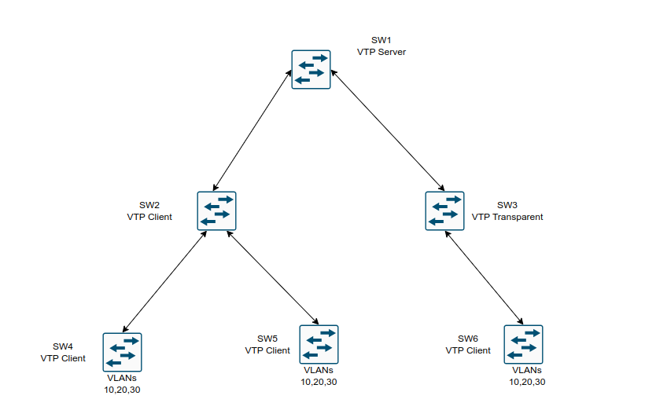

## VLAN Trunks and EtherChannel bundles

1. VLAN Trunking Protocol(VTP)

2. Dynamic Trunking Protocol(DTP)

3. EtherChannel bundle

### VLAN Trunking Protocol

- Before APIs were available on the Cisco platforms, configuring a switch was a manual process 

- Cisco created the proprietary protocol, VLAN Trunking Protocol (VTP) to reduce the burden of configuring VLANs on switches

- Adding a VLAN may seem like a simple task, but in an environment with 100 switches, adding a VLAN required logging into 100 switches to provision one VLAN

- Thanks to VTP, switches that participate in the same VTP domain can have a VLAN created once on a VTP server and propagated to other VTP client switches in the same VTP domain

- There are four roles in a VTP architecture:

	- **Server**: The server switch is responsible for creation, modification, and deletion of VLANs within the VTP domain
	
	- **Client**: The client switch receives VTP advertisements and modify the VLANs on that switch. VLANs cannot be configured locally on a VTP client
	
	- **Transparent**: VTP transparent switches receive and forward VTP advertisements but do not modify the local VLAN database. VLANs are configured only locally
	
	- **Off**: A switch does not participate in VTP advertisements and does not forward them out of any ports either. VLANs are configured only locally
	


- In the above topology SW1 is the VTP Server

- SW2, SW4, SW5 and SW6 are VTP Clients

- SW3 is in transparent mode and and does not update it's VLAN database as changes are propagated through the VTP domain

- SW3 forwards the VTP changes to SW6

- There are three versions of VTP, and Version 1 is the default. At its simplest, VTP Version 1 and 2 limited propagation to VLANs numbered 1 - 1005

- VTP version 3 allows for the full range of VLANs: 1 to 4094. Most switches should be capable of running VTP Version 3

- VTP supports having multiple VTP servers in a domain

- These servers process updates from other VTP servers just as a client does

- If a VTP domain is Version 3, the VTP primary server must be set with the privileged exec mode command:

```
vtp primary
```

### VTP Communication

- VTP advertises updates by using a multicast address across the trunk links for advertising updates to all the switches in the VTP domain (01:00:0c:cc:cc:cc) ()

- There are three main types of advertisements:

	- **Summary**: This advertisement occurs every 300 seconds or when a VLAN is added, removed, or changed
	
	- It includes VTP version, domain, configuration revision number, and timestamp
	
	- **Subset**: This advertisement occurs after a VLAN configuration change occurs 
	
	- It contains all the information for the switches to make changes to the VLANs on them
	
	- **Client requests**: This advertisement is a request by a client to receive the more detailed subset advertisement
	
	- Typically, this occurs when a switch with a lower revision number joins the VTP domain and observes summary advertisement with a higher revision that it haves stored locally
	
### VTP Configuration

- Steps required for VTP configuration:

	1. Define the VTP version:
		```
		conf t
		 vtp version <version> # 1, 2 or 3
		```
	2. Define the VTP domain:
		```
		conf t
		 vtp domain <name>
		```
	- Changing the VTP domain resets the local switch's version to 0
	
	3. Define the VTP switch role:
		```
		conf t
		 vtp mode <server|transparent|client|none>
		```
	4. (Optional) Secure the VTP domain:
		```
		conf t
		 vtp password <password>
		```
	- (This step is optional but recommended because it helps prevent unauthorized switches from joining the VTP domain)
	
- Configuring a switch as VTP primary server (VTP version 3):

	- First configure the switch as VTP server:
	```
	conf t
	 vtp mode server
	 exit
	```
	
	- Now configure the switch as VTP primary server from privileged exec mode:
	
	```
	vtp primary
	```
### VTP verification

- Verifying the VTP status

```
show vtp status

show vtp status | i version run|Operating|VLANS|Revision
```

- The most important information displayed is: VTP Version, VTP Domain name, VTP mode, the number of VLANs (standard and extended) and configuration revision

- Creating VLANs

```
conf t
 vlan 10
 name PCs 
 vlan 20
 name VoIP
 vlan 30
 name Guest
```

- Creating VLANs 10, 20, 30 on the server and viewing the output of `show vtp status` command we can see that the revision number incremented from 1 to 4(because 3 VLANs have been added)

- SW6 has received the VTP update messages from SW3 which is operating in transparent mode

- Notice that SW6 shows a configuration revision of 4, which matches the configuration revision number from SW1

- The VLAN database confirms that all three VLANs were created on the switch without needing to be configured through the CLI

```
show vlan
```

- **Important**

- It is very important that every switch that connects to a VTP domain has the VTP revision number reset to 0

- Failing to reset the revision number on a switch could result in a switch providing an update to the VTP server

- This is not an issue if VLANs are added, but is catastrophic if VLANs are removed because these VLANs will be removed throughout the domain

- When a VLAN is removed from a switch, the access port is moved to VLAN 1

- It is then necessary to reassign VLANs to every port associated to the VLANs that were removed


