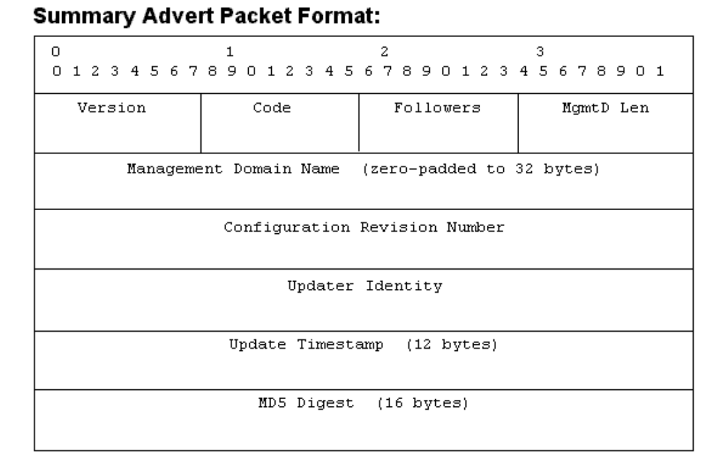
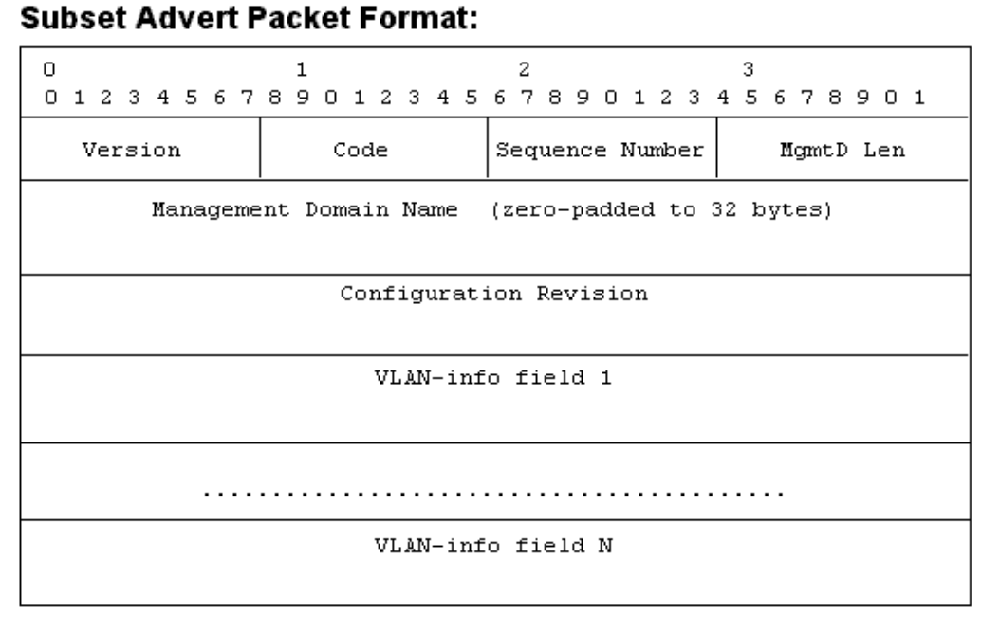
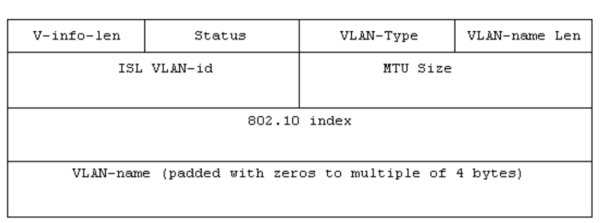
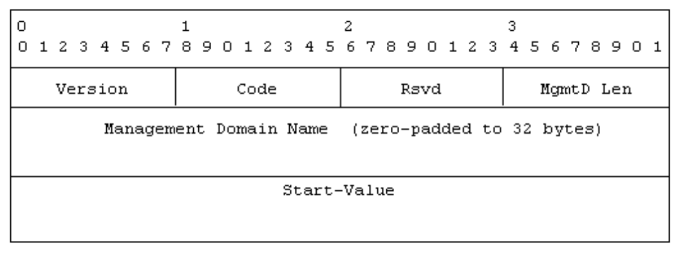
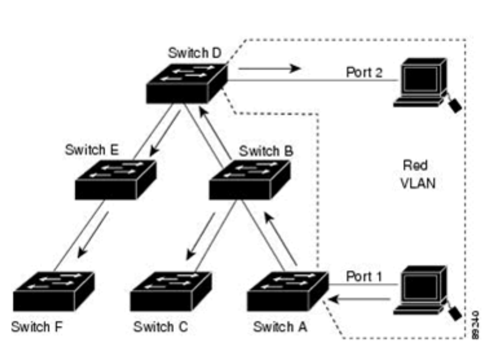
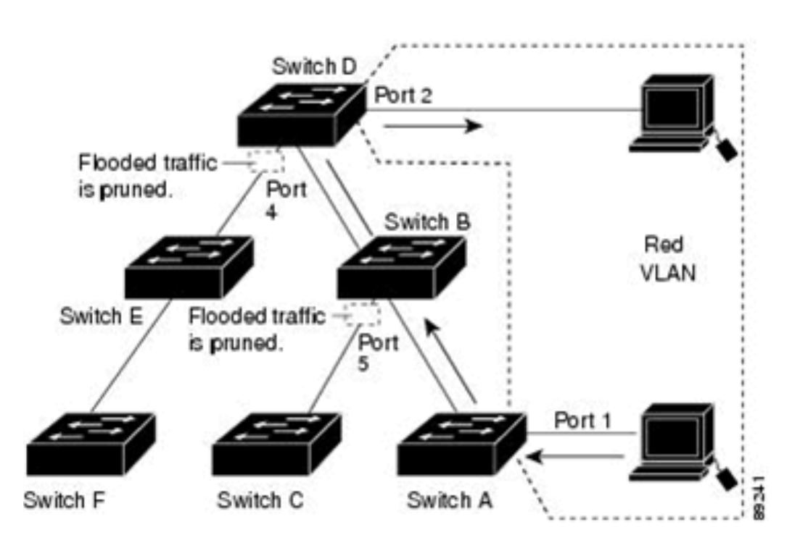

## VLAN Trunks and EtherChannel bundles

1. VLAN Trunking Protocol(VTP)

2. Dynamic Trunking Protocol(DTP)

3. EtherChannel bundle

## VLAN Trunking Protocol

- Before APIs were available on the Cisco platforms, configuring a switch was a manual process 

- Cisco created the proprietary protocol, VLAN Trunking Protocol (VTP) to reduce the burden of configuring VLANs on switches

- Adding a VLAN may seem like a simple task, but in an environment with 100 switches, adding a VLAN required logging into 100 switches to provision one VLAN

- Thanks to VTP, switches that participate in the same VTP domain can have a VLAN created once on a VTP server and propagated to other VTP client switches in the same VTP domain

- There are four roles in a VTP architecture:

	- **Server**: The server switch is responsible for creation, modification, and deletion of VLANs within the VTP domain

	- VTP servers advertise their VLAN configuration to other switches based on advertisements received over **trunk links**
	
	- **Client**: The client switch receives VTP advertisements and modify the VLANs on that switch. VLANs cannot be configured locally on a VTP client
	
	- **Transparent**: VTP transparent switches receive and forward VTP advertisements but do not modify the local VLAN database. VLANs are configured only locally

	- They forward the VTP advertisements to other switches in VTP version 2
	
	- **Off**: A switch does not participate in VTP advertisements and does not forward them out of any ports either. VLANs are configured only locally
	


- In the above topology SW1 is the VTP Server

- SW2, SW4, SW5 and SW6 are VTP Clients

- SW3 is in transparent mode and and does not update it's VLAN database as changes are propagated through the VTP domain

- SW3 forwards the VTP changes to SW6

- There are three versions of VTP, and Version 1 is the default. At its simplest, VTP Version 1 and 2 limited propagation to VLANs numbered 1 - 1005

- VTP version 3 allows for the full range of VLANs: 1 to 4094. Most switches should be capable of running VTP Version 3

- VTP supports having multiple VTP servers in a domain

- These servers process updates from other VTP servers just as a client does

- If a VTP domain is Version 3, the VTP primary server must be set with the privileged exec mode command:

```
vtp primary
```

### VTP Communication

- VTP advertises updates by using a multicast address across the trunk links for advertising updates to all the switches in the VTP domain (01:00:0c:cc:cc:cc) ()

- There are three main types of advertisements:

	- **Summary**: This advertisement occurs every 300 seconds or when a VLAN is added, removed, or changed
	
	- It includes VTP version, domain, configuration revision number, and timestamp
	
	- When a switch receives a summary advertisement packet, the switch compares the VTP domain name to it's own domain name 
	
	- If the name is different, the switch simply ignores the packet
	
	- If the name is the same, the switch then compares the the configuration revision to it's own revision
	
	- If it's own configuration revision is higher or equal, the packet is ignored
	
	- If it is lower, an advertisement request is send

	- Summary advertisement packet format:

	

	- The `Followers` field indicates that this packet is followed by a Subset Advertisement packet

	- The `Updater Identity` is the IP address of the switch that is the last to have incremented the configuration revision

	- The `Update Timestamp` is the date and time of the last increment of the configuration revision

	- `Message digest 5` (MD5) carries VTP password, if MD5 is comnfigured and used to authenticate the validation of a VTP packet
	
	- **Subset**: This advertisement occurs after a VLAN configuration change occurs 
	
	- It contains all the information for the switches to make changes to the VLANs on them

	- One or several subset advertisements go with the summary advertisement

	- A subset advertisement contains a list of VLAN information

	- If there are several VLANs, more than one subset advertisement can be required in order to advertise all the VLANs

	- Subset advertisement packet format:

	

	- Each VLAN information field contains information for a different VLAN

	- It is ordered so that lowered-valued ISL VLANs occur first

	

	- Subset packet fields:

	- `Code` - The format is 0x02 for subset advertisement

	- `Sequence number` - This is the sequence of the packet in the stream of packets that go with a summary advertisement. The sequence starts with 1

	- **Client requests**(Advertisement requests): This advertisement is a request by a client to receive the more detailed subset advertisement
	
	- Typically, this occurs when a switch with a lower revision number joins the VTP domain and observes summary advertisement with a higher revision that it haves stored locally

	- It also is send when the switch resets or when the VTP domain name was changed

	- When an Advertisement request is received, a VTP device sends a summary advertisement

	- One or more subset advertisements go with the summary advertisement

	- Structure of the advertisement request message:

	

	- `Code` - The format 0x03 is for an advertisement request

	- `Start-Value` - This is used in cases in which there are several subsequent advertisements

	- If the first (n) subset advertisement has been received and the subsequent one (n+1) has not be received, the switch only requests advertisements from the (n+1)-th one
	
	- **VTP join**: 

- Configuration revision number is a 32-bit value that indicates the level of revision for the VTP packet

- Each VTP device tracks the VTP configuration revision number that is assigned to it

- Most of the VTP packets contain the VTP configuration revision number of the sender

- This information is used in order to determine wether the received information is more recent than the current version

- Each time an VLAN change is made on a VTP device, the configuration revision is incremented by one

- In order to reset the configuration revision of a switch change the VTP domain name, and then change the name back to the original name

### VTP version 2

- VTP V2 is not much different than VTP V1

- The major difference is that version 2 introduces support for Token Ring VLANs

- If you use Token Ring VLANs you must use VTP v2, otherwise there is no reason to use it

- Change of VTP version from 1 to 2 does not cause a switch to reload

### VTP Configuration

- Steps required for VTP configuration:

	1. Define the VTP version:
		```
		conf t
		 vtp version <version> # 1, 2 or 3
		```
	2. Define the VTP domain:
		```
		conf t
		 vtp domain <name>
		```
	- Changing the VTP domain resets the local switch's version to 0
	
	3. Define the VTP switch role:
		```
		conf t
		 vtp mode <server|transparent|client|none>
		```
	4. (Optional) Secure the VTP domain:
		```
		conf t
		 vtp password <password>
		```
	- (This step is optional but recommended because it helps prevent unauthorized switches from joining the VTP domain)
	
- Configuring a switch as VTP primary server (VTP version 3):

	- First configure the switch as VTP server:
	```
	conf t
	 vtp mode server
	 exit
	```
	
	- Now configure the switch as VTP primary server from privileged exec mode:
	
	```
	vtp primary
	```

### VTP Password

- If you require a password for the VTP switches, then you must configure the password on all switches in the VTP domain

- The password must be the same password on all those switches

- The VTP password that you configure is translated by algorithm into a 16-byte word (MD5 value) that is carried in all summary advertisements VTP packets 

### VTP verification

- Verifying the VTP status

```
show vtp status

show vtp status | i version run|Operating|VLANS|Revision
```

- The most important information displayed is: VTP Version, VTP Domain name, VTP mode, the number of VLANs (standard and extended) and configuration revision

- Creating VLANs

```
conf t
 vlan 10
 name PCs 
 vlan 20
 name VoIP
 vlan 30
 name Guest
```

- Creating VLANs 10, 20, 30 on the server and viewing the output of `show vtp status` command we can see that the revision number incremented from 1 to 4(because 3 VLANs have been added)

- SW6 has received the VTP update messages from SW3 which is operating in transparent mode

- Notice that SW6 shows a configuration revision of 4, which matches the configuration revision number from SW1

- The VLAN database confirms that all three VLANs were created on the switch without needing to be configured through the CLI

```
show vlan
```

- **Important**

- It is very important that every switch that connects to a VTP domain has the VTP revision number reset to 0

- Failing to reset the revision number on a switch could result in a switch providing an update to the VTP server

- This is not an issue if VLANs are added, but is catastrophic if VLANs are removed because these VLANs will be removed throughout the domain

- When a VLAN is removed from a switch, the access port is moved to VLAN 1

- It is then necessary to reassign VLANs to every port associated to the VLANs that were removed

### VTP Pruning

- VTP ensures that all swithes in the VTP domain are aware of all VLANs

- However there are ocasions when VTP can create unnecessary traffic

- All unknown unicasts and broadcasts are flooded over the entire VLAN

- All switches in the network receive all broadcasts, even in situations in which few users are connected in that VLAN

- VTP Pruning is a feature that you can use in order to eliminate or prune this unnecessary traffic

- Broadcast traffic in a switched network without pruning:



- The figure shows a switched network without VTP pruning enabled

- Port 1 on Switch A and Port 2 on Switch D are assigned to the Red VLAN

- If a broadcast is send from the host connected to Switch A, Switch A floods the broadcast to every switch in the network receives it, even though Switches C, E and F have no ports in the Red VLAN

- Broadcast traffic in a switched network with pruning:



- This is the same figure as above but with VTP pruning enabled

- The broadcast traffic from Switch A is not forwarded to switches C, E and F because traffic for Red VLAN has been pruned on the links shown (Port 5 on Switch D and Port 4 on Switch D)

- When the VTP Pruning is enabled on a VTP Server, pruning is enabled for the entire management domain

- This feature makes VLANs pruning-eligible or pruning-ineligible and affects pruning eligibility for those VLANs on that trunk only (not in all switches in the VTP domain)

- VTP pruning takes effect several seconds after you enable it

- VTP pruning does not prune traffic from VLANs that are pruning-ineligible

- VLAN 1 and VLANs 1001-1005 are always pruning-ineligible; traffic from these VLANs cannot be pruned

- Extended-range VLANs (VLAN IDs greater than 1005) are also pruning-ineligible

### Using VTP in a network

- By default all switches are configured to be VTP servers

- This configuration is suitable for small-scale networks in which the size of the VLAN information is small and the information is easily stored in all switches (in NVRAM)

- In a large network, the network administrator should make a judgement call at some point when the NVRAM storage that is necessary is wasteful because it is duplicated on every switch

- At this point, the network administrator must choose a few well-equipped switches and keep them as VTP servers

- Everything else that participates in VTP, can be turned into a client

- The number of VTP servers must be chosen in order to provide the degree of redundancy that is desired in the network

### VTP considerations

- You can configure VLANs without the VTP Domain name configured on the switch which runs Cisco IOS

- If a new Catalyst switch is attached in the border of two VTP domains, the new Catalyst keeps the domain name of the first switch that sends it a summary advertisement

- The only way to attach this switch to another VTP domain is to manually set a different domain name

- Dynamic Trunking Protocol (DTP) sends the VTP domain name in a DTP packet

- Therefore if you have two ends of a link that belongs to a different VTP domain, the trunk does not come up if you use DTP

- In this special case, you must configure the trunk mode as on or nonegotiate, on both sides in order for the trunk to come up without DTP negotiation  agreement

- If the domain has a single VTP server and it crashes, the best and easiest way to restore the operation is to configure any of the VTP clients in that domain to a VTP server

- The configuration revision is still the same in the rest of the clients, even if the server crashes

- Another recommendation is to avoid as much as possible to have a VLAN that spans the entire network

## Dynamic Trunking Protocol


