## Virtualization

1. Server Virtualization

2. Network Functions Virtualization

- Server virtualization is the process of using software to create multiple independent virtual servers (virtual machines) or multiple containerized operating systems (containers) on a phyisical x86 server

- Network functions virtualization (NFV) is the process of virtualizing specific network functions, such as a firewall function into a virtual machine (VM) so that they can be run in common x86 hardware instead of a dedicated appliance

- Server virtualization and NFV and the benefits they bring to an enterprise network

- Virtualization using containers is also known as containerization

### Server Virtualization

- One of the main drivers behind server virtualization was that server hardware resources were being underutilized; physical servers were typically each running a single operating system with a single application and using only about 10% to 25% of the CPU resources

- VMs and containers increase the overall efficiency and cost-effectiveness of a server by maximizing the use of the available resources

- Physical servers running a single operating system and dedicated to a single user are referred to as bare-metal servers

#### Virtual Machines

- A virtual machine (VM) is a software emulation of a physical server with an operating system

- From an application's point of view, the VM provides the look and feel of a real phyisical server, including all it's components, such as CPU, memory and network interface cards (NICs)

- The virtualization software that allows that creates VMs and performs the hardware abstraction, that allows multiple VMs to run concurently is known as a hypervisor

- VMWare vSphere, Microsoft Hyper-V, Citrix XenServer, and Red Hat Kernel-based Virtual Machine (KVM) are the most popular hypervisors in the server virtualization market

- Below is provided a side-by-side comparison of a bare-metal server and a server running virtualization software

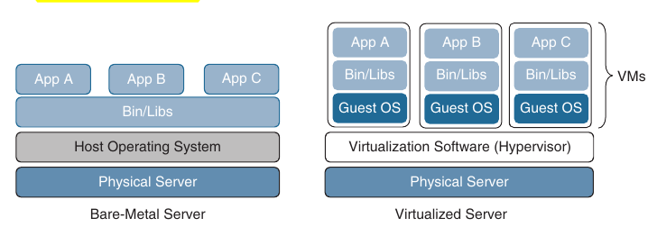

- There are two types of hypervisors:

    - **Type 1**: This type of hypervisor runs directly on the system hardware

    - It is commonly referred to as 'bare metal' or 'native'

    - **Type 2**: This type of hypervisor (for example VMWare Fusion) requires a host OS to run

    - This is the type of hypervisor that is typically used by client devices

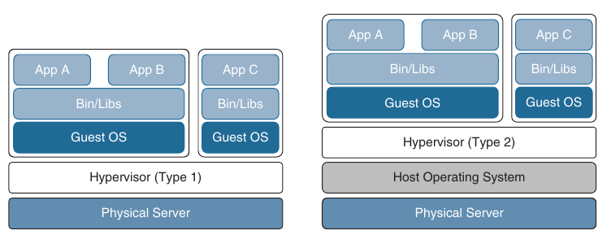

- One key capability of VMs is that they can be migrated from one server to another while preserving transactional integrity during movement

- This can enable many advantages; for example if the physical server needs to be upgraded (for example a memory upgrade), the VMs can be migrated to other servers with no downtime

- Another advantage is that it provides high availability; for example, if a server fails, the VMs can be spun up on other servers in the network

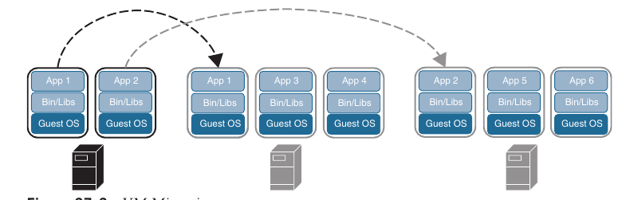

#### Containers

- A container is an isolated environment where containerized applications run

- It contains the application, along with the dependencies for the application to run

- Even though they have these and many other similarities to VMs, containers are not the same as VMs, and they should not be referred to as "lightweight VMs"

- Below is shown a side-by-side comparison of VMs and containers

- Notice that each VM requires an OS an that containers all share the same OS while remaining isolated from each other

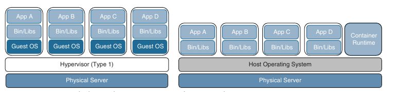

- A VM includes a guest OS, which typically comes with a large number of components (including executables, libraries, and dependencies) that they are really not required for the application to run; it's up to the developer to strip any unwanted services or components from it to make it as lightweight as possible

- Remember that a VM is basically a virtualized physical server, which means it includes all the components of a physical server but in a virtual fashion

- Containers, on the other hand, share the underlying resources of the host operating system and do not include a guest OS, as VMs do; containers are therefore lightweight (small in size)

- The application, along with the specific dependencies (binary files and libraries) that it needs to run are included within the container

- Containers originate from container images

- A container image is a file created by a container engine that includes the application code along with it's dependencies

- Container images become containers when they are run by the container engine

- Because a container image contains everything the application code within it needs to run, it is extremely portable (easy to move/migrate)

- Container images eliminate some typical problems, such as applications working on one machine but not another and applications failing to run because the necessary libraries are not part of the operating system and need to be downloaded to make it run

- A container does not try to virtualize a physical server as a VM does; instead, the abstraction is the application or the components that make up the application

- One more example with the differences between VMs and containers: 

- When a VM starts, the OS needs to load first, and once it's operational, the application in the VM can then start and run

- This whole process usually takes minutes

- When a container starts, it leverages the kernel of the host OS, which is already running and it typically takes a few seconds to start

- Many container engines used to create, run, and manage containers are available

- The most popular container engine is the docker engine

- Here is a list with some of the other container engine options available:

    - rkt (pronounced 'rocket')

    - Open Container Initiative

    - LXD (pronounced 'lexdi'), from Canonical Ltd.

    - Linux-VServer

#### Virtual Switching

- A virtual switch (vSwitch) is a software-based Layer 2 switch that operates like a physical Ethernet switch

- A vSwitch enables VMs to communicate with each other within a virtualized server and with external physical networks through the physical network interface cards (pNICs)

- Multiple vSwitches can be created under a virtualized server, but network traffic cannot flow dirrectly from one vSwitch to another vSwitch within the same host, and the vSwitches cannot share the same pNIC

- The most popular vSwitches include the following:

    - Open vSwitch (OVS)

    - VMWare's vSphere Standard Switch (VSS), the vSphere Distributed Switch (VDS), and the NSX vSwitch

    - Libvirt Virtual Network Switch

- Below is shown a virtualized server with three vSwitches connected to the virtual network interface cards (vNICs) of the VMs as well as the pNICs

- vSwitch1 and vSwitch3 are linked to pNIC1 and pNIC3, respectively, to access the physical network, whereas vSwitch2 is not linked to any pNICs

- Since network traffic cannot flow from one vSwitch to another, network traffic from VM1, destined to the external network, or VM0, needs to flow through the virtual next-generation firewall (NGFWv)

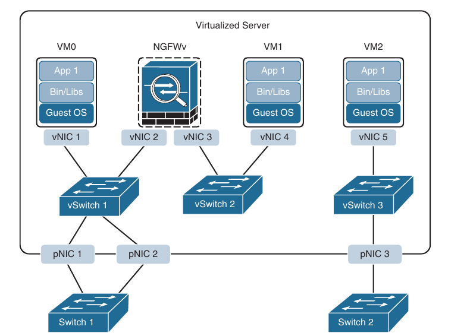

- One of the downsides of standard vSwitches is that every vSwitch that is part of virtualized servers needs to be configured individually in every virtual host

- This problem is solved by using distributed virtual switching, a feature that aggregates vSwitches together from a cluster of virtualized servers and treats them as a single distributed virtual switch

- These are some of the benefits of distributed switching:

    - Centralized management of vSwitch configuration for multiple hosts in a cluster, which simplifies administration

    - Migration of networking statistics and policies with virtual machines during a live VM migration

    - Configuration consistency across all the hosts that are part of the distributed switch

- Like VMs, containers rely on vSwitches (also known as virtual bridges) for communication within a node (server) or the outside world

- Docker, for example, by default creates a virtual bridge called docker0, and it is assigned the default subnet block 172.17.0.0/16

- This default subnet can be customized, and user defined custom bridges can also be used

- Below we can see how every container created by Docker is assigned a virtual Ethernet interface (veth) on docker0

- Veth interface appears to the container as eth0

- The eth0 interface is assigned an IP address from the bridge's subnet block

- As more containers are created by docker within the node, they are each assigned an eth0 interface and an IP address from the same private address space

- All containers can then communicate with each other only if they are within the same node

- Containers in the other nodes are not reachable by default, and this can be managed using routing at the OS level or by using an overlay network

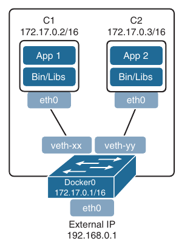

- If Docker is installed on another node using the default configuration, it ends up with the same IP addressing as the first node, and this needs to be resolved on a node-by-node basis

- A better way to manage and scale containers and the networking connectivity between them within and across nodes is to use a container orchestrator such as Kubernetes

### Network Functions Virtualization

- Network functions virtualization (NFV) is an architectural framework created by the European Telecomunications Standards Institute (ETSI) that defines standards to decouple network functions from proprietary hardware-based applicances and have them run in software on standard x86 servers

- It also defines how to manage and orchestrate the network functions

- Network functions (NF) refers to the functions performed by a physical applicance, such as a firewall or a router function

- Some of the benefits of NFV are similar to the benefits of server virtualization and cloud environments:

    - Reduced capital expediture (capex) and operational expenditure (opex) through reduced equipment cost and efficiencies in space, power and cooling

    - Faster time to market (TTM) because VMs and containers are easier to deploy than hardware

    - Improved return on investment (ROI) from new services

    - Ability to scale up/out and down/in capacity demand (elasticity)

    - Openness to the virtual appliance market and pure software networking vendors

    - Opportunities to test and deploy new innovative services virtually and with lower risk

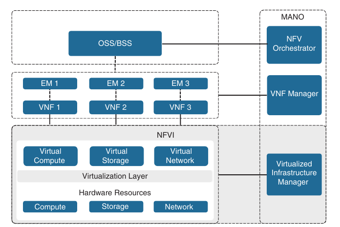

#### NFV Infrastructure

- NFV infrastructure (NFVI) is all the hardware and software components that comprise the platform environment in which Virtual Network Functions (VNFs) are deployed

#### Virtual Network Functions

- A virtual network function (VNF), as it's name implies, is the virtual or software version of an NF, and it typically runs on an hypervisor as a VM

- VNFs are commonly used for Layer 4 through Layer 7 functions, such as those provided by load balancers (LBs) and application delivery controllers (ADCs), firewalls, intrusion detection systems (IDS), and WAN optimization appliances

- However, they are not limited to Layer 4 through Layer 7 functions; they can also perform lower level Layer 2 and Layer 3 functions, such as those provided by routers and switches

- Some example of Cisco's VNFs include the following:

    - Cisco Catalyst 8000V

    - Cisco Secure Firewall ASA Virtual

    - Cisco Secure FIrewall Threat Defense Virtual

#### Virtualized Infrastructure Manager

- The NFVI Virtualized Infrastructure Manager (VIM) is responsible for managing and controlling the NFVI hardware resources (compute, storage and network) and the virtualized resources

- It is also responsible for the collection of performance measurements and fault information

- In addition, it performs lifecycle management (setup, maintenaince and teardown) of all NFVI resources as well as VNF service chaining

- Service chaining refers to connecting two or more VNFs to provide an NFV service or solution

- Below we can see the "physical" and the logical view of VNFs connected to a service chain

- External switch 1 provides connectivity to the external network and connects the virtual load balancer to the virtual firewall; vSwitch1 connects the virtual firewall to the virtual WAN optimization VNF; pNIC4 connects the virtual WAN optimization VNF to the virtual router; and the virtual router connects to the external network via External Switch 2

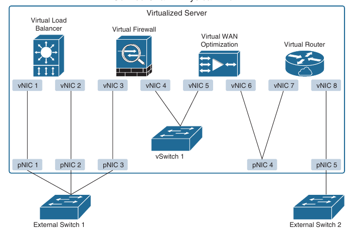

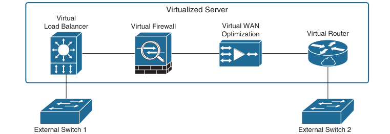

#### Element Managers

- Element Managers (EMs), also known as element management systems (EMSs), are responsible for the functional management of VNFs; in other words, they perform fault, configuration, accounting, performance, and security (FCAPS) functions for VNFs

- A single EM can manage one of multiple VNFs, and an EM can also be a VNF

#### Management and Orchestration

- The NVF orchestrator is responsible for creating, maintaining, and tearing down VNF network services

- If multiple VNFs are part of a network service, the NVF orchestrator enables the creation of an end-to-end network service over multiple VNFs

- The VNF manager manages the lifecycle of one or multiple VNFs as well as FCAPS for the virtual components of a VNF

- The NVM orchestrator and VNF manager together are known as NVF management and orchestration (MANO)

#### Operations Support System (OSS)/ Business Support System (BSS)

- OSS is a platform typically operated by service providers (SPs) and large enterprise networks to support all their network systems and services

- The OSS can assist them in maintaining network inventory, provisioning new services, configuring network devices, and resolving network issues

- For SPs, OSS typically operates in tandem with BSS to improve the overall customer experience

- BSS is a combination of product management, customer management, revenue management (billing), and order management systems that are used to run the SPs business operations

#### VNF Performance

- In NVF solutions, the data traffic has two different patterns: north-south and east-west

- North-south traffic comes into the hosting server through a physical NIC (pNIC) and is sent to a VNF; then it is sent from the VNF back onto the physical wire through the pNIC

- East-west traffic comes into the hosting server through a pNIC and is sent to a VNF

- From there it could be sent out to another VNF (service chained) and possible service chained to more VNFs and then sent back up to the physical wire through a pNIC

- There can also be combinations of the two, where a VNF uses a north-south traffic pattern for user data and an an east-west traffic pattern to send traffic to a VNF that is just collecting statistics or that is just being used for logs or storage

- These patterns and the purpose of the VNFs are important to understand when deciding which technology to use to switch traffic between VNFs as well as the outside world

- Picking the right technologies will ensure that the VNFs achieve optimal throughput and performance

- The most popular technologies used to achieve optimal VNF performance and throughput are described below, but until there, it is important to understand the following terminology:

    - **Input/Output (I/O)**: The communication between a computing system (such as a server) and the outside world

    - Input is the data received by the computing system, and output is the data sent from it

    - **I/O device**: A peripheral device such as a mouse, keyboard, monitor, or network interface card (NIC)

    - **Interrupt request (IRQ)**: A hardware signal sent to the CPU by an I/O device (such as a NIC) to notify the CPU when it has data to transfer

    - When the CPU receives the interrupt (IRQ), it saves it's current state, temporarily stops what it's doing, and runs an interrupt handler routine associated with the device

    - The interrupt hander determines the cause of the interrupt, performs the necessary processing, performs a CPU state restore, and issues a return-from-interrupt instruction to return control to the CPU so that it can resume what it was doing before the interrupt

    - Each I/O device that generates IRQs has an associated interrupt handler that is part of the device's driver

    - **Device driver**: A computer program that controls an I/O device and allows the CPU to communicate with the I/O device

    - A NIC is an example of an I/O device that requires a driver to interface and operate with the CPU

    - **Direct Memory Access (DMA)**: A memory access method that allows an I/O device to send and receive data directly to or from the main memory, bypassing the CPU, to speed up overall computer operations

    - **Kernel and user space**: The core part of an operating system (OS) and a memory area where applications and their associated libraries reside

    - The kernel ("core" in German) is a program that is the central (core) part of an OS

    - It directly manages the computer hardware components (such as RAM and CPU), and provides system services to applications that need to access any hardware components, including NICs and internal storage

    - Because it is the core of an OS, the kernel is executed in a protected area of the main memory (kernel space) to prevent other processes from affecting it

    - Non-kernel processes are executed in a memory area called the user space, which is where applications and their associated libraries reside

    - Below is shown an operating system's kernel and user space as well as typical I/O devices that interface with the operating system

    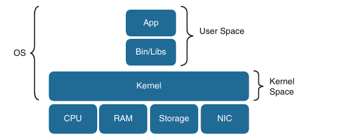

    - In non-virtualized environments, data traffic is received by a pNIC and then sent through the kernel space to an application in the user space

    - In a virtual environment, there are pNICs and virtual NICs (vNICs) and a hypervisor with a virtual switch in between them

    - The hypervisor and the virtual switch are responsible from taking the data from the pNICs and sending it to the vNIC of the VN/VNF and finally to the application

    - The addition of the virtual layer introduces additional packet processing and virtualization overhead, which creates bottlenecks and reduces I/O packet throughput

    - The packet flow for a virtualized system with an Open vSwitch (OVS) architecture is shown below

    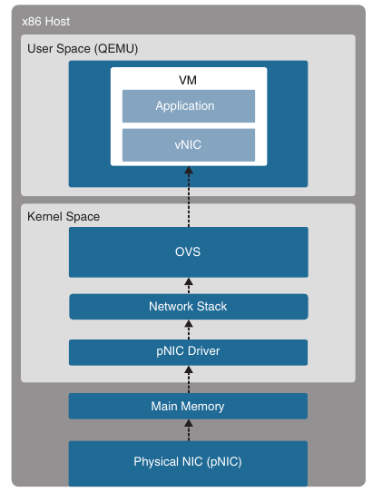

- The high level packet flow steps for packets received by the pNIC and delivered to the application in the VM are as follows:

    1. Data traffic is received by the pNIC and placed into a Rx queue (ring buffers) within the pNIC

    2. The pNIC sends the packet and a packet descriptor to the main memory buffer through DMA. The packet descriptor includes only the memory location and the size of the packet

    3. The pNIC sends an IRQ to the CPU

    4. The CPU transfers control to the pNIC driver, which services the IRQ, receives the packet, and moves it into the network stack, where it eventually arrives in a socket and is placed into a socket receive buffer

    5. The packet data is copied from the socket receive buffer to the OVS virtual switch

    6. OVS processes the packet and forwards it to the VM. This entais switching the packet between the kernel and user space, which is expensive in terms of CPU cycles

    7. The packet arrives at the virtual NIC (vNIC) of the VM and is placed into an Rx queue

    8. The vNIC sends the packet and a packet descriptor to the virtual memory buffer through DMA

    9. The vNIC sends an IRQ to the vCPU

    10. The vCPU transfers control to the vNIC driver, which services the IRQ, receive the packet, and moves it into the network stack, where it eventually arrives in a socket and is placed into a socket receive buffer

    11. The packet data is copied and sent to the application in the VM

- Every packet received needs to go through the same process, which requires the CPU to be continuously interrupted

- The number of interrupts increases when using high-speed NICs (for example, 40 Gbps) and the packet size is small because more packets need to be processed per second

- Interrupts add a lot of overhead because any activity the CPU is doing must be stopped, the state must be saved, the interrupt must be processed, and the original process must be restored so it can resume what it was doing before the interrupt

- To avoid all the overhead and increase packet throughput, multiple I/O technologies have been developed

- The most prevalent of these technologies are the following:

    - OVS Data Plane Development Kit (OVS-DPDK)

    - PCI Passthrough

    - Single-root I/O Virtualization (SR-IOV)

- To be able to implement these I/O technologies, physical NICs that support them are required

#### OVS-DPDK

- To overcome the performance impact on throughput due to interrupts, OVS was enhanced with the Data Plane Development Kit (DPDK)

- OVS with DPDK operates entirely in user space

- The DPDK Poll Mode Driver (PMD) in OVS polls for data that comes into the pNIC and processes it, bypassing the network stack and the need to send an interrupt to the CPU when a packet is received - in other words, bypassing the kernel entirely

- To be able to do this, DPDK PMD requires one ore more CPU cores dedicated to polling and handling the incoming data

- Once the packet is in OVS, it's already in user space, and it can then be switched directly to the appropriate VNF, resulting in huge performance benefits

- Below we can see an x86 host with a standard OVS compared to an x86 host with an OVS with DPDK

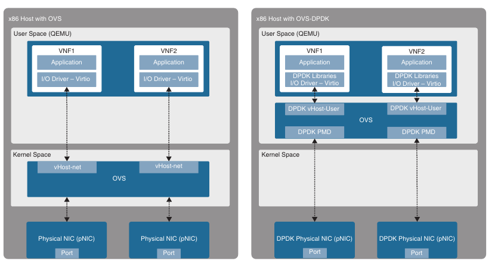

#### PCI Passthrough

- PCI passthrough allows VNFs to have direct access to physical PCI devices, which appear and behave as if they were physically attached to the VNF

- This technogy can be used to map a pNIC to a single VNF, and from the VNFs perspective, it appears as if it is directly connected to the pNIC

- PCI passthrough offers many performance advantages:

    - Exclusive one-to-one mapping

    - Bypassed hypervisor

    - Direct access to I/O resources

    - Reduced CPU utilization

    - Reduced system latency

    - Increased I/O throughput

- The downside of PCI passthrough is that the entire pNIC is dedicated to a single VNF and cannot be used by other VNFs, so the number of VNFs that can use this technology is limited by the number of pNICs available in the system

- Below we can see an x86 host with a standard OVS and an x86 host with PCI passthrough

#### SR-IOV

- SR-IOV is an enhancement to PCI passthrough that allows multiple VNFs to share the same pNIC

- SR-IOV emulates multiple PCIe devices on a single PCIe device (such as a pNIC)

- In SR-IOV, the emulated PCIe devices are called virtual functions (VFs), and the physical PCIe devices are called physical functions (PFs)

- The VNFs have direct access to the VFs, using PCI passthrough technology

- An SR-IOV enabled pNIC supports two different modes for switching traffic between VNFs:

    - **Virtual Ethernet Bridge (VEB)**: Traffic between VNFs attached to the same pNIC is hardware switched directly by the pNIC

    - **Virtual Ethernet Port Aggregator (VEPA)**: Traffic between VNFs connected to the same pNIC is switched by an external switch

- Below we can see an x86 host with standard OVS compared to an x86 host with SR-IOV

### Cisco Enterprise Network Functions Virtualization (ENFV)

- Enterprise branch offices require multiple physical networking devices to perform network functions such as WAN acceleration, firewall protection, wireless LAN controller, intrusion prevention, collaboration services, and routing and switching

- Sometimes these physical devices are deployed with redundancy, further increasing the number of devices installed an operated in the branch

- An enterprise typically has multiple branches, and needing to manage so many different devices can create many challenges

- The Cisco ENFV solution is a Cisco solution based on the ETSI NFV architectural framework

- It reduces the operational complexity of enterprise branch environments running the required networking functions as virtual networking functions (VNF) on standard x86 hosts

- In other words, it replaces physical firewalls, routers, WLC, load balancers, and so on with virtual devices running in a single x86 platform

- The Cisco ENFV solution provides the following benefits:

    - Reduces the number of physical devices to be managed at the branch, resulting in efficiencies in space, power, maintenaince, and cooling

    - Reduces the need for truck rolls and technician site visits to perform hardware installations or upgrades

    - Offers operational simplicity that allows it to roll out new services, critical updates, VNFs, and branch locations in minutes

    - Centralizes management through Cisco DNA Center, which greatly simplifies designing, provisioning, updating, managing, and troubleshooting network services and VNFs

    - Enhances network operations flexibility by taking full advantage of virtualization techniques such as virtual machine moves, snapshots, and upgrades

    - Supports Cisco SD-WAN cEdge and vEdge virtual router onboarding

    - Supports third-party VNFs

#### Cisco ENFV Solution Architecture

- Cisco ENFV delivers a virtualized solution for network and application services for branch offices

- It consists of four main components that are based on the ETSI NFV architectural framework:

    - **Management and Orchestration (MANO)**: Cisco DNA Center provides the VNF management and NVF orchestration capabilities

    - It allows for easy automation of the deployment of virtualized network services, consisting of multiple VNFs

    - **VNFs**: VNFs provide the desired virtual networking functions

    - **Network Functions Virtualization Infrastructure Software (NFVIS)**: An operating system that provides virtualization capabilities and facilitates the deployment and operation of VNFs and hardware components

    - **Hardware Resources**: x86-based compute resources that provide the CPU, memory, and storage required to deploy and operate VNFs and run applications

- Managed service providers (MSPs) have the option of adding an OSS/BSS component using the Cisco Network Service Orchestrator (NSO) or Cisco Managed Services Accelerator (MSX)

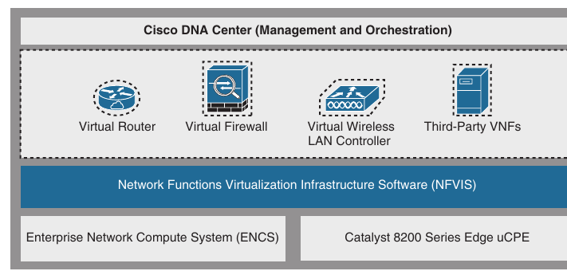

##### Management and Orchestration

- Cisco DNA Center provides the MANO functionality to the Cisco Enterprise NFV solution

- It includes a centralized dashboard and tools to design, provision, manage, and monitor all branch sites across the enterprise

- Two of the main functions of DNA Center are to roll out new branch locations and deploy new VNFs and virtualized services

- Cisco DNA center provides centralized policies, which enables consistent network policies across the enterprise branch offices

- Centralized policies are created by building network profiles

- Multiple network profiles can be created, each with specific design requirements and virtual services

- Once they are created, branch sites are then assigned to network profiles that match the branch requirements

- Network profiles include information such as the following:

    - Configuration for LAN and WAN virtual interfaces

    - Services or VNFs to be used, such as firewall or WAN optimizer, and their requirements such as service chaining parameters, CPU, and memory requirements

    - Device configuration required for VNFs, which can be customized by using custom configuration templates created through a template editor tool

- Below we can see the Cisco DNA Center Add Services window, where services of VNFs can be added and services can be service chained to each other using multiple interface types, such as LAN, management, and services interface

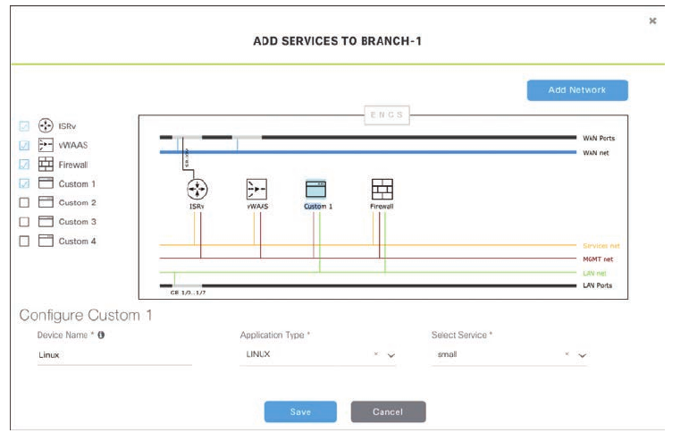

- Plug and Play provisioning provides a way to automatically and remotely provision and onboard new network devices

- When a new ENVF platform is brought up for the first time, you can use Plug and Play to register with DNA center

- Then DNA Center matches the site to the network profile assigned for the site and then provisions and onboards the device automatically

##### Virtual Network Functions and Applications

- The Cisco Enterprise NFV solution provides an environment for virtualization of both network functions and applications in the enterprise branch

- Both Cisco and third-party VNFs can be onboarded into the solution

- Application running in a Linux server or Windows server environment can also be instantiated on top of NFVIS and can be supported by DNA center

- Cisco supported VNFs include the following:

    - Cisco Catalyst 8000V Edge for Viptela SD-WAN and virtual routing

    - Cisco vEdge SD-WAN Cloud router for Viptela SD-WAN

    - Cisco Secure Firewall ASA Virtual for a virtual firewall

    - Cisco Secure Firewall Threat Defense Virtual for integrated firewall and intrusion detection and prevention

    - Cisco virtual Wide Area Application Services (vWAAS) for virtualized WAN optimization

    - Cisco Catalyst 9800-CL Cloud Wireless Controller for virtualized wireless LAN controllers

    - ThousandEyes

    - Meraki vMX

- VNFs from the following third-party vendors are supported:

    - Microsoft Windows Server

    - Linux Server

    - Accedian

    - AVI Networks

    - Check Point

    - Citrix

    - CTERA

    - F5

    - Fortinet

    - Info Vista

    - NETSCOUT

    - Palo Alto Networks

    - Riverbed Technology

##### Network Functions Virtualization Infrastructure Software (NFVIS)

- NFVIS is based on standard Linux packages with additional functions for virtualization

- VNF lifecycle management, monitoring, device programability, and hardware acceleration

- The components and functionality delivered by NFVIS are shown below:

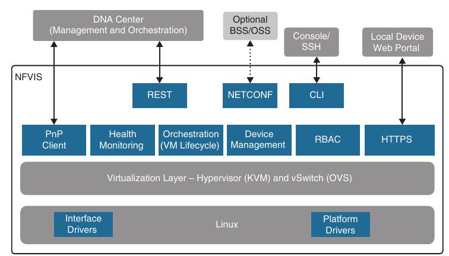

- **Linux**: Linux drives the underlying hardware platforms (such as ENCS, Cisco UCS servers, or x86 enhanced network devices) and hosts the virtualization layer for VNFs, virtual switching API interfaces, interface drivers, platform drivers, and management

- **Hypervisor**: The hypervisor for virtualization is based on Kernel-based Virtual Machine (KVM) and includes Quick Emulator (QEMU), Libvirt, and other associated processes

- **Virtual Switch (vSwitch)**: The vSwitch is Open vSwitch (OVS), and it enables communication between different VNFs (service chaining) and to the outside world

- **VM Lifecycle Management**: NFVIS provides the VIM functionality as specified in the NFV architectural framework through the NFVIS embedded Elastic Services Controller (ESC) Lite

- ESC-Lite supports dynamic bringup of VNFs - creating and deleting VNFs and adding CPU cores, memory and storage

- It also includes build-in VNF monitoring capability that allows for auto restart of VNFs when they are down and sending alarms (SNMP or syslog)

- **Plug and Play client**: This client automates the bringing up of any NFVIS-based host

- The Plug and Play client communicates with a Plug and Play server running in Cisco DNA Center and is provisioned with the right host configuration

- It also enables a true zero-touch deployment model (that is, no human intervention) and allows for quick and error-free deployment of network services

- **Orchestration**: REST, CLI, HTTPS, and NETCONF/YANG communication models are supported for orchestration and management

- **HTTPS web server**: The web server can enable connectivity into NFVIS through HTTPS to a local device's web portal

- From this portal it is possible to upload VNF packages, implement full lifecycle management, turn services up and down, connect to VNF consoles, and monitor critical parameters, without the need for complex commands

- **Device Management**: Tools are packaged into NFVIS to support device management, including a resource manager, to get information on the number of CPU cores allocated to VMs and the CPU cores that are already used by the VMs

- **Role-based access control (RBAC)**: Users accessing the system are authenticated using RBAC

##### x86 Hosting Platforms

- Cisco Enterprise NFVIS is supported on the following Cisco x86 hosting platforms:

    - Cisco Enterprise Network Compute System (ENCS)

    - Cisco Catalyst 8200 Series Edge uCPE

- Which platform to choose depends on the requirements and features needed, such as voice over IP (VOIP), requirements for non-Ethernet-based interfaces (such as T1 or DSL), 4G-LTE, I/O technologies supported (for example, SR-IOV), and the number of CPU cores needed to suport the existing service requirements (VNFs and services) as well as future requirements

- 

