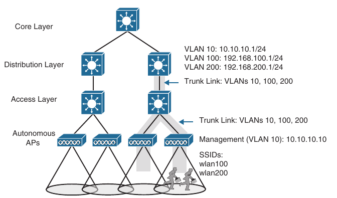
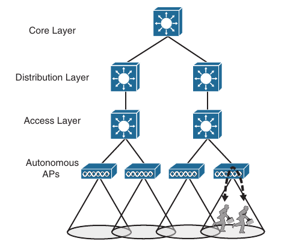
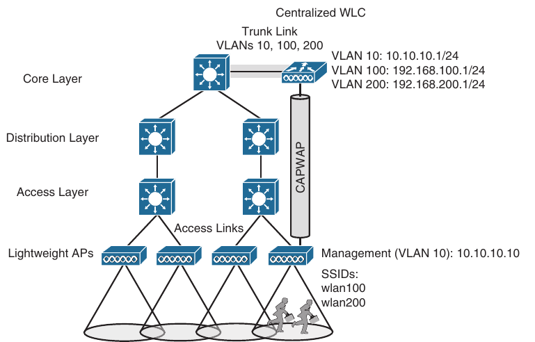
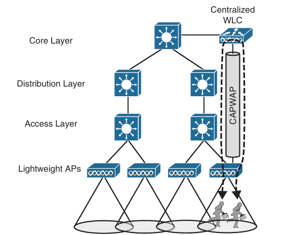
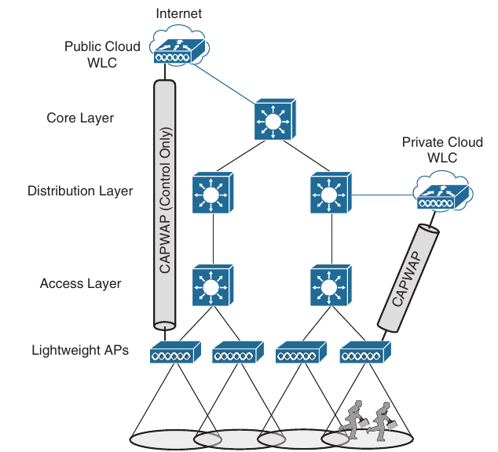

## Wireless Infrastructure

- Wireless Deployment Models

- Pairing Lightweight APs and WLCs

- Segmenting Wireless Configurations

- Leveraging Antennas for Wireless Configuration

### Wireless Deployment Models

- Traditional APs operate autonomously, because they are self sufficient and standalone

- Cisco APs operate in a "lightweight" mode and require something bigger to complete their purpose

- The lightweight mode is interesting because it can support several different network topologies, depending on where the companion wireless LAN controllers (WLCs) are located

- You should be aware that Cisco was offered two WLC platforms

- The most recent is based on hardware that runs the IOS-XE operating system, while it's predecesor was based on the AireOS operating system

- From the APs perspective, both platforms connect to it via CAPWAP tunnels, while IOS-XE offers more scalability, higher performance, higher availability, and more seamless maintainability

#### Autonomous Deployment

- Autonomous APs are self-contained, each offering one or more fully functional, standalone basic service sets (BSSs)

- They are also a natural extension of a switched network, connecting wireless service set identifiers (SSIDs) to wired virtual LANs (VLANs) at the access layer

- Below is shown the basic architecture; even though, only four APs are shown across the bottom, a typical enterprise network could consist of hundreds or thousands of APs

- Notice that the autonomous APs present two wireless LANs with SSIDs wlan100 and wlan200 to the wireless users

- The APs also forward traffic between the wireless LANs and two wired VLANs 100 and 200

- That means the wired VLANs must be trunked from the distribution layer, where routing occurs for each subnet, all the way down to the access layer switches where VLANs touch the APs

- An autonomous AP must also be configured with a management IP address (10.10.10.10 - on our scheme), to enable remote management

- After all, you will want to configure SSIDs, VLANs, and many RF parameters like the channel and transmit power to be used

- The management address is not normally part of any data VLANs, so a dedicated management VLAN (in this case, VLAN10) must be added to the trunk links to reach the APs

- Because the data and management VLANs may need to reach every autonomous AP, the network configuration and efficiency can become cumbersome as the network scales

- For example, you will likely want to offer the same SSID on many APs so that wireless clients can associate with that SSID in most any location or while roaming between any two APs

- You might also want to extend the corresponding VLAN (and IP subnet) to each and every AP so that clients do not have to request a new IP address for each new association

- This process might seem straightforward until you have to add a new VLAN and configure every switch and AP in your network to carry and support it

- Even worse, suppose your network has redundant links between the layers of switches

- Spanning Tree Protocol (STP) running on each switch becomes a vital ingredient to prevent bridging loops from forming and corrupting the network

- For these reasons, client roaming across autonomous APs is typically limited to the Layer 2 domain, or the extent of a single VLAN

- As the wireless network expands, the infrastructure becomes more difficult to configure correctly and becomes less efficient

- A topology using autonomous APs does have one nice feature; a short and simple path for data to travel between the wireless and wired networks

- Consider the two wireless users shown above, which are associated with the same autonomous AP

- One can reach the other through the AP, without having to pass up to the wired network

- That should come as no great surprise if you remember that wireless users in a BSS must pass through the AP first

- This is not always the case with lightweight AP topologies

### Cisco AP Operation

- As a "lightweight" device, a Cisco AP loses it's self-suficiency to provide a working BSS for wireless users

- Instead, it can join a WLC to become fully functional

- This cooperation is known as a split-MAC architecture, where the AP handles most of the real time 802.11 processes and the WLC performs the management functions

- An AP and a WLC are joined by a logical pair of CAPWAP tunnels that extends through the wired network infrastructure

- Control and data traffic are transported across the tunnels

- Many APs can join the same WLC, each with it's own pair of CAPWAP tunnels

- A wireless network can scale in this fashion, provided that WLC can support the maximum number of APs in use

- Beyond that, additional WLCs would be needed

- From the WLC, you can configure a Cisco AP to operate in one of the following special purpose modes:

    - **Local**: The default lightweight mode that offers one or more functioning BSSs on a specific channel

    - In other words, an AP in local mode serves wireless clients

    - During times when it is not transmitting, the AP scans the other channels to measure the level of noise, measure interference, discover rogue devices, and match against intrusion detection systems (IDS)

    - **FlexConnect**: An AP at a remote site maintains a control CAPWAP tunnel to a central WLC while forwarding data normally, without a CAPWAP tunnel

    - If the remote site's WAN link goes down, taking the control CAPWAP tunnel down too, the AP can still switch traffic locally between an SSID and a connected VLAN

    - **Monitor**: The AP does not transmit at all, but it's receiver is enabled to act as a dedicated sensor

    - The APs checks for IDs events, detect rogue access points, and determines the position of stations through location-based services

    - **Sniffer**: An AP dedicates it's radios to receiving 802.11 traffic from other sources, much like a sniffer or packet capture device

    - The captured traffic is then forwarded to a PC running a network analyzer software such as Wireshark, where it can be analyzed further

    - **Rogue Detector**: An AP dedicates itself to detecting rogue devices by correlating MAC addresses heard on the wired network with those heard over the air

    - Rougue devices are those that appear on both networks

    - **Bridge**: An AP becomes a dedicated bridge (point-to-point or point-to-multipoint) between two networks

    - Two APs in bridge mode can be used to link two locations separated by a distance

    - Multiple APs in bridge mode can form an indoor or outdoor mesh network 

    - **Flex + Bridge**: FlexConnect operation is enabled on a mesh AP

    - **SE-Connect**: The AP dedicates it's radios to spectrum analyzis on all wireless channels

    - You can remotely connect a PC running software such as MetaGeek Chanalyzer or Cisco Spectrum Expert to the AP to collect and analyze the spectrum analyzis data to discover sources of interference

- Remember that a lightweight AP is normally in local mode when it is providing BSSs and allowing client devices to associate to wireless LANs

- When an AP is configured to operate in one of the other modes, local mode (and the BSSs) are disabled

### Cisco Wireless Deployments

- Several topologies can be built from a WLC and a collection of APs

- These topologies differ according to where the WLC is located 

- For example, a WLC can be placed in a central location, usually in a data center or near the network core, so that you can maximize the number of APs joined to it

- This is known as a centralized wireless LAN deployment

- This tends to follow the concept that most of the resources users need to reach are located in a central location, such as a data center or the Internet

- Traffic to and from wireless users travel from the APs over CAPWAP tunnels that reach to the center of the network

- A centralized WLC also provides a convenient place to enforce security policies that affect all wireless users

- Above, four APs joined to a single WLC, but your network might have more APs, many, many more

- A large enterprise network might have thousands of APs in it's access layer

- Scalability then becomes an important factor in the centralized design

- Each Cisco WLC model supports a maximum number of APs

- If you have more APs than the maximum, you need to add more WLCs to the design, each located centrally

- A typical centralized WLC meant for large enterprise can support up to 6000 APs and up to 64000 wireless clients

- The latest two schemes, both have the same topology

- The only difference is that on the latest scheme the APs are running in lightweight mode, and there is a WLC present high in the topology

- The latest scheme shows one of the CAPWAP tunnels connecting one AP to the WLC, although each AP would have it's own tunnels to the controller

- The Layer 3 boundary for each data VLAN is handled at or near the WLC, so the VLANs need only exist at that location, indicated by the shared link

- Each AP still has it's own unique management IP address, but it connects to an access layer switch via an access link rather than a trunk link

- Even if multiple VLANs and WLANs are involved, they are carried over the same CAPWAP tunnel to and from the AP

- Therefore, the AP needs only a single IP address to terminate the tunnel

- The centralized architecture also affects wireless user mobility

- For example, as a wireless user moves throug the coverage area of the four APs from our figure, that user might associate with many different APs at the access layer

- Because all the APs are joined to a single WLC, that WLC can easily maintain the users connectivity to all other areas of the network as the user moves arround

- Locating the WLC centrally also affects the path that wireless data must take

- Recall that two wireless users can reach each other through the AP

- In contrast the path between wireless users in a centralized network is shown below

- The traffic from one client must pass through the AP, where it is encapsulated in the CAPWAP tunnel, and then travel high up into the network to reach the WLC, where it is unencapsulated and examined

- The process then reverses, and the traffic goes back down through the tunnel to reach the AP and back up into the air to other client

- The length of the tunnel path can be a great concern for lightweight APs

- The round trip time (RTT) between an AP and a controller should be less than 100 ms so that wireless comunication can be maintained in near real time

- If the path has more latency than that, the APs may decide that the controller is not responding fast enough, so they may disconnect and find another more responsive controller

- A centralized controller can also be located in a public cloud, remotely situated in relation to the enterprise, or in a private cloud within an enterprise data center

- In either case, the controller depoyment is called cloud-based rather than centralized

- Below is shown the public and private cloud controller deployments in relation to the enterprise they support

