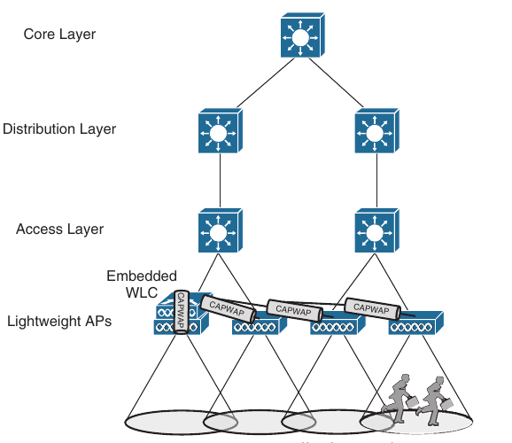
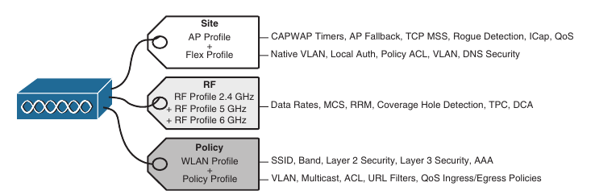

## Wireless Infrastructure

- Wireless Deployment Models

- Pairing Lightweight APs and WLCs

- Segmenting Wireless Configurations

- Leveraging Antennas for Wireless Configuration

### Wireless Deployment Models

- Traditional APs operate autonomously, because they are self sufficient and standalone

- Cisco APs operate in a "lightweight" mode and require something bigger to complete their purpose

- The lightweight mode is interesting because it can support several different network topologies, depending on where the companion wireless LAN controllers (WLCs) are located

- You should be aware that Cisco was offered two WLC platforms

- The most recent is based on hardware that runs the IOS-XE operating system, while it's predecesor was based on the AireOS operating system

- From the APs perspective, both platforms connect to it via CAPWAP tunnels, while IOS-XE offers more scalability, higher performance, higher availability, and more seamless maintainability

#### Autonomous Deployment

- Autonomous APs are self-contained, each offering one or more fully functional, standalone basic service sets (BSSs)

- They are also a natural extension of a switched network, connecting wireless service set identifiers (SSIDs) to wired virtual LANs (VLANs) at the access layer

- Below is shown the basic architecture; even though, only four APs are shown across the bottom, a typical enterprise network could consist of hundreds or thousands of APs


- Notice that the autonomous APs present two wireless LANs with SSIDs wlan100 and wlan200 to the wireless users

- The APs also forward traffic between the wireless LANs and two wired VLANs 100 and 200

- That means the wired VLANs must be trunked from the distribution layer, where routing occurs for each subnet, all the way down to the access layer switches where VLANs touch the APs

- An autonomous AP must also be configured with a management IP address (10.10.10.10 - on our scheme), to enable remote management

- After all, you will want to configure SSIDs, VLANs, and many RF parameters like the channel and transmit power to be used

- The management address is not normally part of any data VLANs, so a dedicated management VLAN (in this case, VLAN10) must be added to the trunk links to reach the APs

- Because the data and management VLANs may need to reach every autonomous AP, the network configuration and efficiency can become cumbersome as the network scales

- For example, you will likely want to offer the same SSID on many APs so that wireless clients can associate with that SSID in most any location or while roaming between any two APs

- You might also want to extend the corresponding VLAN (and IP subnet) to each and every AP so that clients do not have to request a new IP address for each new association

- This process might seem straightforward until you have to add a new VLAN and configure every switch and AP in your network to carry and support it

- Even worse, suppose your network has redundant links between the layers of switches

- Spanning Tree Protocol (STP) running on each switch becomes a vital ingredient to prevent bridging loops from forming and corrupting the network

- For these reasons, client roaming across autonomous APs is typically limited to the Layer 2 domain, or the extent of a single VLAN

- As the wireless network expands, the infrastructure becomes more difficult to configure correctly and becomes less efficient

- A topology using autonomous APs does have one nice feature; a short and simple path for data to travel between the wireless and wired networks

- Consider the two wireless users shown above, which are associated with the same autonomous AP

- One can reach the other through the AP, without having to pass up to the wired network

- That should come as no great surprise if you remember that wireless users in a BSS must pass through the AP first

- This is not always the case with lightweight AP topologies


### Cisco AP Operation

- As a "lightweight" device, a Cisco AP loses it's self-suficiency to provide a working BSS for wireless users

- Instead, it can join a WLC to become fully functional

- This cooperation is known as a split-MAC architecture, where the AP handles most of the real time 802.11 processes and the WLC performs the management functions

- An AP and a WLC are joined by a logical pair of CAPWAP tunnels that extends through the wired network infrastructure

- Control and data traffic are transported across the tunnels

- Many APs can join the same WLC, each with it's own pair of CAPWAP tunnels

- A wireless network can scale in this fashion, provided that WLC can support the maximum number of APs in use

- Beyond that, additional WLCs would be needed

- From the WLC, you can configure a Cisco AP to operate in one of the following special purpose modes:

    - **Local**: The default lightweight mode that offers one or more functioning BSSs on a specific channel

    - In other words, an AP in local mode serves wireless clients

    - During times when it is not transmitting, the AP scans the other channels to measure the level of noise, measure interference, discover rogue devices, and match against intrusion detection systems (IDS)

    - **FlexConnect**: An AP at a remote site maintains a control CAPWAP tunnel to a central WLC while forwarding data normally, without a CAPWAP tunnel

    - If the remote site's WAN link goes down, taking the control CAPWAP tunnel down too, the AP can still switch traffic locally between an SSID and a connected VLAN

    - **Monitor**: The AP does not transmit at all, but it's receiver is enabled to act as a dedicated sensor

    - The APs checks for IDs events, detect rogue access points, and determines the position of stations through location-based services

    - **Sniffer**: An AP dedicates it's radios to receiving 802.11 traffic from other sources, much like a sniffer or packet capture device

    - The captured traffic is then forwarded to a PC running a network analyzer software such as Wireshark, where it can be analyzed further

    - **Rogue Detector**: An AP dedicates itself to detecting rogue devices by correlating MAC addresses heard on the wired network with those heard over the air

    - Rougue devices are those that appear on both networks

    - **Bridge**: An AP becomes a dedicated bridge (point-to-point or point-to-multipoint) between two networks

    - Two APs in bridge mode can be used to link two locations separated by a distance

    - Multiple APs in bridge mode can form an indoor or outdoor mesh network 

    - **Flex + Bridge**: FlexConnect operation is enabled on a mesh AP

    - **SE-Connect**: The AP dedicates it's radios to spectrum analyzis on all wireless channels

    - You can remotely connect a PC running software such as MetaGeek Chanalyzer or Cisco Spectrum Expert to the AP to collect and analyze the spectrum analyzis data to discover sources of interference

- Remember that a lightweight AP is normally in local mode when it is providing BSSs and allowing client devices to associate to wireless LANs

- When an AP is configured to operate in one of the other modes, local mode (and the BSSs) are disabled

### Cisco Wireless Deployments

- Several topologies can be built from a WLC and a collection of APs

- These topologies differ according to where the WLC is located 

- For example, a WLC can be placed in a central location, usually in a data center or near the network core, so that you can maximize the number of APs joined to it

- This is known as a centralized wireless LAN deployment

- This tends to follow the concept that most of the resources users need to reach are located in a central location, such as a data center or the Internet

- Traffic to and from wireless users travel from the APs over CAPWAP tunnels that reach to the center of the network

- A centralized WLC also provides a convenient place to enforce security policies that affect all wireless users


- Above, four APs joined to a single WLC, but your network might have more APs, many, many more

- A large enterprise network might have thousands of APs in it's access layer

- Scalability then becomes an important factor in the centralized design

- Each Cisco WLC model supports a maximum number of APs

- If you have more APs than the maximum, you need to add more WLCs to the design, each located centrally

- A typical centralized WLC meant for large enterprise can support up to 6000 APs and up to 64000 wireless clients

- The latest two schemes, both have the same topology

- The only difference is that on the latest scheme the APs are running in lightweight mode, and there is a WLC present high in the topology

- The latest scheme shows one of the CAPWAP tunnels connecting one AP to the WLC, although each AP would have it's own tunnels to the controller

- The Layer 3 boundary for each data VLAN is handled at or near the WLC, so the VLANs need only exist at that location, indicated by the shared link

- Each AP still has it's own unique management IP address, but it connects to an access layer switch via an access link rather than a trunk link

- Even if multiple VLANs and WLANs are involved, they are carried over the same CAPWAP tunnel to and from the AP

- Therefore, the AP needs only a single IP address to terminate the tunnel

- The centralized architecture also affects wireless user mobility

- For example, as a wireless user moves throug the coverage area of the four APs from our figure, that user might associate with many different APs at the access layer

- Because all the APs are joined to a single WLC, that WLC can easily maintain the users connectivity to all other areas of the network as the user moves arround

- Locating the WLC centrally also affects the path that wireless data must take

- Recall that two wireless users can reach each other through the AP

- In contrast the path between wireless users in a centralized network is shown below

- The traffic from one client must pass through the AP, where it is encapsulated in the CAPWAP tunnel, and then travel high up into the network to reach the WLC, where it is unencapsulated and examined

- The process then reverses, and the traffic goes back down through the tunnel to reach the AP and back up into the air to other client


- The length of the tunnel path can be a great concern for lightweight APs

- The round trip time (RTT) between an AP and a controller should be less than 100 ms so that wireless comunication can be maintained in near real time

- If the path has more latency than that, the APs may decide that the controller is not responding fast enough, so they may disconnect and find another more responsive controller

- A centralized controller can also be located in a public cloud, remotely situated in relation to the enterprise, or in a private cloud within an enterprise data center

- In either case, the controller depoyment is called cloud-based rather than centralized

- Below is shown the public and private cloud controller deployments in relation to the enterprise they support


- In a public cloud deployment, the controller can be quite a distance from the APs that join to it

- The APs maintain a CAPWAP control tunnel to the controller, but all wireless data passing through the APs must be locally switched in and out of the VLANs directly connected to the APs

- Therefore, the APs must operate only in FlexConnect mode

- Private cloud controllers are located within the enterprise, so the APs can operate in local or FlexConnect mode

- Cloud-based controllers typically support up to 6000 APs and 64000 wireless clients

- Now imagine that a WLC can be located further down in the network hierarchy

- Perhaps the network is made up of many remote sites or distributed locations

- In that case, one large WLC might not be the best choice

- Instead, smaller, appropriately sized WLCs can be placed at each site, forming a distributed wireless deployment

- Distributed controllers are commonly smaller standalone models that can support up to 250 APs and 5000 wireless clients


- Notice that the centralized, cloud and distributed deployments all involve standalone WLCs

- As you might expect, these are called controller-based deployments

- At the smallest scale, distributed deployments can involve embedded wireless controllers (EWCs), which are regular APs that also run WLC software

- Cisco describes this as a controller-less deployment because there is no descrete WLC involved; rather the controller is embedded in an AP itself

- This deployment can be useful in small-scale environments, such as small, mid size or multi site branch locations, where you might not want to invest in dedicated WLCs at all

- As you can see below, the AP that hosts the WLC forms a CAPWAP tunnel with the WLC, as do any other APs at the same location

- EWC usually supports up to 100 APs and up to 2000 wireless clients

- Remember that when APs and WLCs are located in the same local network infrastructure, the CAPWAP tunnels can be easily maintained and latency minimized

- In those cases, the APs operate in local mode, where both AP control and user data are tunneled to the WLC

- In scenarios where the APs and their WLCs must be located remotely from each other, the APs should operate in FlexConnect mode



### Pairing Lightweight APs and WLCs

- A Cisco lightweight wireless AP needs to be paired with a WLC to function

- Each AP must discover and bind itself with a controller before wireless clients can be supported

- Cisco lightweight APs are designed to be 'touch free', so that you can simply unbox a new one and connect it to the wired network, without any need to configure it first

- Naturally, you have to configure the switch port where the AP connects. with the correct access VLAN, access mode and inline power settings

- From that point on, the AP can power up and use a variety of methods to find a viable WLC to join

#### AP states

- From the time it powers up until it offers a fully functional basic service set (BSS), a lightweight AP operates in a variety of states:

- Each of the possible states is well defined as part of the Control and Provisioning of Wireless Access Points (CAPWAP) specification, but they are simplified here for clarity

- The AP enters the states in a specific order; the sequence of states is called a state machine

- You should become familiar with the AP state machine so that you can understand how an AP forms a working relationship with a WLC

- If an AP cannot form that relationship for some reason, your knowledge of the state machine can help you troubleshoot the problem

- CAPWAP is defined in RFC 5415 and a few other RFCs

- The terms used in the RFC differ somewhat from the ones that Cisco uses

- For example, access controller (AC) refers to a WLC, whereas wireless termination point (WTP) refers to the AP

- The sequence of the most common states is as follows:

    1. **AP boots**: After an AP receives power, it boots on a small IOS image so it can work through the remaining states and communicate over it's network connectiom

    - The AP must also receive an IP address from either an Dynamic Host Configuration Protocol (DHCP) server or a static configuration so that it can communicate over the network

    2. **WLC Discovery**: The AP goes through a series of steps to find one or more controllers that it might join

    3. **CAPWAP Tunnel**: The AP attepts to build a CAPWAP tunnel with one or more controllers

    - The tunnel will provide a secure Datagram Transport Layer Security (DTLS) channel for subsequent AP-WLC control messages

    - The AP and WLC authenticate each other through an exchange of digital certificates

    4. **WLC join**: The AP selects a WLC from a list of candidates and then sends a CAPWAP Join Request message to it

    - The WLC replies with a CAPWAP Join Response message

    5. **Download Image**: The WLC informs the AP of it's software release

    - If the APs own software is a different release, the AP downloads a matching image from the controller, reboots to apply the new image, and then returns to step 1

    - If the two are running identical releases, no download is needed

    6. **Download config**: The AP pulls configuration parameters from the WLC and can update existing values with those sent from the controller

    - Settings include RF, service set identifier (SSID), security and Quality of Service (QoS) parameters

    7. **Run state**: Once the AP is fully initialized, the AP places it in the "run" state

    - The AP and WLC then begin providing a BSS and begin accepting wireless clients

    8. **Reset**: If an AP is reset by the WLC, it tears down existing client associations and any CAPWAP tunnels to the WLC

    - The AP then reboots and starts through the entire state machine again


- Be aware that you cannot control which software image release that an lightweight AP runs

- Rather, the WLC that the AP joins determines the release, based on it's own software version

- Downloading a new image can take a considerable amount of time, especially if a larger AP is waiting for the same download from one WLC

- That might not matter when a newly installed AP is booting and downloading code because it does not have yet any wireless clients to support

- However, if an existing, live AP happens to reboot or join a different controller, clients can be left hanging with no AP while the image downloads

- Some careful planning with your controller and their software releases will pay off later in terms of minimized downtime

- Consider the following scenarios when an AP might need to download a different release:

    - The AP joins a WLC and has a version mismatch

    - A code upgrade is performed on the WLC itself, requiring all associated APs to upgrade too

    - The WLC fails, causing all asociated APs to be dropped and to join elsewhere

- If there is a chance that one AP could rehome one WLC to another, you should make sure that both controllers are running the same code release

- Otherwise the AP move should happen under controlled circumstances, such as during a maintenaince window

- Fortunately, if you have downloaded a new code release to a controller but not yet rebooted it to run the new code, you can predownload a new release to the controller's APs

- The APs will download the new image but will keep running the previous release

- When it comes time to reboot the controller on the new image, the APs will already have the new image staged without having to take time to download it

- The APs can reboot on their new image and join the controller after it has booted and become stable

#### Discovering a WLC

- An AP must be very diligent to discover any controllers that it can join - all without any preconfiguration from your part

- To accomplish this feat, several methods of discovery are used

- The goal of discovery is just to build a list of live candidate controllers that are available, using the following methods:

    - Prior knowledge of WLCs
    
    - DHCP and DNS information to suggest some controllers
    
    - Broadcast on local subnet to solicit controllers
    
    - Plug-and-play with Cisco DNA center
    
- To discover a WLC, an AP sends an unicast CAPWAP Discovery Request to a controller's IP address over UDP port 5246 or a broadcast to the local subnet

- If the controller exists and is working, it returns a CAPWAP Discovery Response to the AP

- The sequence of discovery steps used is as follows:

    1. The AP broadcasts a CAPWAP Discovery Request on it's local wired subnet
    
    - Any WLCs that also exist on the subnet answer with a CAPWAP Discovery Response
    
    - If the AP and controllers lie on different subnets, you can configure the local router to relay any broadcast requests on UDP port 5246 to specific controller addresses
    
    - Use the following configuration commands:
    
    ```
    conf t
     ip forward-protocol udp 5246
      interface vlan <vlan-nr>
       ip helper-address <WLC1-MGMT-ADDR>
       ip helper-address <WLC2-MGMT-ADDR>
    ```

    2. An AP can be "primed" with up to three controllers - a primary, a secondary and a tertiarry
    
    - These are stored in nonvolatile memory so that the AP can remember them after a reboot or power failure
    
    - Otherwise, if an AP was previously joined with a controller, it should have stored up to 8 out of a list of 32 WLC addresses that it received from the last controller it joined
    
    - The AP attempts to contact as many controllers as possible to build a list of candidates
    
    3. The DHCP server that supplies the AP with an IP address can also send DHCP option 43 to suggest a list of WLC controllers
    
    4. The AP attempts to resolve the name CISCO-CAPWAP-CONTROLLER.localdomain with a DNS request (where localdomain is the domain name learned from DHCP)
    
    - If the name resolves to an IP address, the AP attempts to contact a WLC at that address
    
    5. If none of the steps have been successful, the AP resets itself and starts the discovery process all over again
    
#### Selecting a WLC

- When an AP has finished the discovery process, it should have built a list of live candidate controllers

- Now it must begin a separate process to select a WLC and attempt to join it

- Joining a WLC involves sending a CAPWAP Join Request and waiting for it to return a CAPWAP Join Response

- From that point on, the AP and WLC build a DTLS tunnel to secure their CAPWAP control messages

- The WLC selection process consists of the following three steps:

    1. If the AP has previously joined a controller and has been configured or "primed" with a primary, secondary and tertiary controller, it tries to join these controllers in a succession
    
    2. If the AP does not known of any candidate controller, it tries to discover one
    
    - If a controller has been configured as a master controller, it responds to the APs request
    
    3. The AP attempts to join the least-loaded WLC, in an effort to load-balance APs across a set of controllers
    
    - During the discovery phase, each controller reports it's load - the ratio of the number of currently joined APs to the total AP capacity
    
    - The least-loaded WLC is the one with the lowest ratio
    
- If an AP discovers a controller but gets rejected when it tries to join it, what might be the reason?

- Every controller has a set maximum number of APs that it can support

- This is defined by platform or by license

- If the controller already has the maximum number of APs joined to it, it rejects any additional APs

- To provide some flexibility in supporting APs over an oversubscribed controller, where more APs are trying to join than a license allows, you can configure the APs with a priority value

- All APs begin with a default priority of low

- You can change the value to low, medium, high or critical

- A controller tries to accommodate as many higher-priority APs as possible

- After a controller is full of APs, it rejects an AP with the lowest priority to make room for a new one that has a higher priority

#### Maintaining WLC Availability

- After an AP has discovered, selected and joined a controller, it must stay joined to that controller to remain functional

- Consider that a single controller might support as many as 1000 or even 6000 APs - enough to cover a very large building or an entire enterprise

- If something ever causes the controller to fail, a large number of APs will also fail

- In the worst case, where a single controller carries the enterprise, the entire wireless network will become unavailable, which might be catastrophic

- Fortunately, a Cisco AP can discover multiple controllers, not just the one that it chooses to join

- If the joined controller becomes unavailable, the AP can simply select the next least-loaded controller and request to join to it

- That sounds simple but is not very deterministic

- If a controller full of 1000 APs fails, all 1000 APs must detect the failure, discover other candidate controllers, and then select the least-loaded one to join

- During that time, wireless clients can be left stranded with no connectivity

- You might envision the controller failure as a commercial airline flight that has just been canceled; everyone that purchased a ticket suddenly a mad rush to find another flight out

- The most deterministic approach is to leverage the primary, secondary and tertiary controller fields that every AP stores

- If any of these fields are configured with a controller name or address, the AP knows which three controllers to try in sequence before restoring to a more generic search

- After an AP joins a controller, it sends keepalive (also called heartbeat) message to the controller over the wired network at regular intervals

- By default, keepalives are sent every 30 seconds

- The controller is expected to answer each keepalive as evidence that it is still alive and working

- If a keepalive is not answered, an AP escalates the test by sending four more keepalives at 3-second intervals

- If the controller answers, all is well; if it does not answer, the AP presumes that the controller has failed

- The AP then moves quickly to find a successor to join

- Using the default values, an AP can detect a controller failure in as little as 35 seconds

- You can adjust the regular keepalive timer between 1 and 30 seconds and the escalated, or "fast" heartbeat timer between 1 and 10 seconds

- When the minimum values are used, a failure can be detected after only 6 seconds

- To make the process much more efficient, WLCs also support high availability (HA) with stateful switchover (SSO) redundancy

- SSO groups controllers into high availability pairs, when one controller takes on the active role and the other is in a hot standby mode

- The APs need to know only the primary controller that is the active unit

- Because each active controller has it's own standby controller, there really is no need to configure a secondary or tertiary controller on the APs unless you need an aditional layer of redundancy

- Each AP learns of the HA pair during a CAPWAP discovery phase and then builds a CAPWAP tunnel to the active controller

- The active unit keeps CAPWAP tunnels, AP states, client states, configurations, and image files all in sync with the hot standby unit

- The active controller also synchronizes the state of each associated client that is in the RUN state with the hot standby controller

- If the active controller fails, the standby will already have the current state information for each AP and client, making the failover process transparent to the end users

### Segmenting Wireless Configurations

- After APs discover a controller and join it, they must be configured with a variety of parameters so that they can support wireless clients in the enterprise

- APs download their configuration from the controller so that they can be managed from a common source

- The parameters that define AP operation fall into three general categories:

    - Things that affect the AP controller and CAPWAP relationship and FlexConnect behavior on a per-site basis

    - Things that define the RF operation on each wireless band

    - Things that define each wireless LAN and security policies

- Ideally you should be able to configure the APs throughout the enterprise site in a granular fashion

- For example, your enterprise might consist of many buildings 

- You might want that the APs in one building to offer WLANs on only one band

- Perhaps you want a group of APs to offer only a subset of the entire list of WLANs

- In other buildings you might need to support a different set of constranints

- When APs are joined to legacy Cisco AireOS WLCs, you have only a limited amount of customization because most AP parameters are configured on a global basis

- You can group APs that are located into the same geographical areas into logical AP groups that share a common set of WLANs and RF parameters

- To have granular control, you have to configure many granular AP groups and duplicate the same configuration changes to many groups

- Each AP can be a member of only one AP group so granular configuration becomes a challenge, especially if you need to support conflicting AP configurations within the same area

- In addition, changes to an AP group oftem force the APs to reset their radios or reboot themselves to pick up the new configuration

- Cisco completely redesigned AP configuration in the IOS-XE based WLCs with an object-oriented approach

- You can customize parameters that affect the categories of site-based CAPWAP operation, RF operation, and WLAN and security operation, independently and in a very granular manner

- In fact, each of these three categories is applied to each AP in the network through configuration profiles and tags

- You can define site, RF, and policy profiles that contain the desired customizations

- Then each AP is tagged to identify which site, RF, and policy profiles it should use

- The concept is illustrated below, along with a list of the relevant parameters you can customize in each profile type



- Notice that a site tag maps to two different profiles - an AP profile (sometimes called an AP join profile) that is used when the AP is operating in local client-serving mode, and a Flex profile that is used for FlexConnect mode

- Site tags use profiles that affect overall AP-controller CAPWAP and VLAN connectivity for APs located within a single site

- The RF tag maps to RF profiles that affect the radio operation on each frequency band that an AP supports

- You can customize things like data rates and MCS, the dynamic transmit power and channel assignment algorithms, and the coverage hole detection

- You can tune each band independently because each has it's own RF profile mapped by the RF tag

- The policy tag maps two different profiles - a WLAN profile that defines a list of SSIDs and WLAN security that an AP will offer, and a policy profile that define how the AP will handle various types of traffic

- By default all APs will be assigned the following three default tags:

    - *default-site-tag*: Maps to default profiles named "default-ap-profile" and "default-flex-profile"

    - *default-rf-tag*: Maps to the controller's global RF configuration

    - *default-policy-tag*: Does not map to anything by default, because there is no default WLAN and SSID configuration for any network

- Of course, you could make all of your custom changes to the controller's default profiles, but that would affect all APs globally unless they have been assigned non default tags and profiles

- Ideally, you should create your own set of custom profiles and tags to take full advantage of the granularity and to set the stage for future policy adjustments and custom tunning

- The customization process is simple:

    1. Configure AP and Flex profiles and map them to site tags

    2. Configure RF profiles and map them to RF tags

    3. Configure WLAN and policy profiles and map them to policy tags

    4. Assign the appropriate site, RF and policy tags to the APs

- To accomplish step 4, you can manually select APs, import a CSV file containing a list of APs, select by location or use a regular expression to search for AP names

- After you select the APs, you can select the tags to assign them

- Below the profile and tag concept is illustrated further

- Notice how the site, RF and policy tags have been assigned to groups of APs and customized for each group

- All of the APs belong to the same enterprise site or location, so they will have been assigned the site tag named Site-1

- Two groups of APs share common RF and radio requirements, so they have been assigned the RF tag named RF-x, while another group is using RF tag RF-y

- All three groups of APs have unique WLAN and policy requirements, so each is using a different policy tag name that maps to unique WLAN and policy profiles

- Remember that AP configuration isn't limited to just groups of APs; you can define profiles and tags that get mapped to a single AP if you want


### Leveraging Antennas for Wireless Coverage

- The world of wireless LANs would be rather simple - too simple, in fact - if all antennas were created equal

- To provide good wireless LAN coverage in a building, in an outdoor area, or between two locations, you might be faced with a number of variables

- For example, an office space might be arranged as a group of open cubicles or as a strip of clossed offices down a long hallway

- You might have to cover a large open lobby, a large open classroom, a section of a crouded sports area, an oblong portion of a hospital roof where helicopters land, a large expanse of an outdoor park, city streets where public safety vehicles travel and so on

- In other words, one type of antenna cannot feet every application

- Instead, antennas comes in many sizes and shapes, each with it's own gain value and intended purposes

- Below you will see the antenna characteristics and considerations in more detail

- **Client density** is essentially the number of devices per AP

- Where a single client is associated to an AP, it may take advantage of the full bandwidth available through the AP

- No other device is present to contend for the airtime on the channel

- The more active the clients are on the channel, the less airtime is available for any of them to use

- The end results are poor performance and unsatisfactory user experience

- A good wireless design should provide RF coverage everywhere it is needed

- It should also consider client density so that it can support the desired capacity through each AP

- In other words, the design should provide an adequate number of APs such that the user population is distributed across the APs, giving more capacity to each

- You can limit the number of clients served by an AP by selecting an antenna that has a more constrained coverage pattern where the clients are located

#### Radiation Patterns

- From the previous chapter we know that antenna gain is normally a comparison of one antenna against a isotropic antenna and is measured in dBi (decibel-isotropic)

- An isotropic antenna does not actually exist because it is ideal, perfect and impossible to construct

- It is also the simplest, most basic antenna possible, which makes it a good starting place for antenna theory

- An isotropic antenna is shaped like a tiny round point

- When an alternating current is applied, an RF signal is produced, and the electromagnetic waves are radiated equally in all directions 

- The energy produced by the antenna takes the form of an ever-expanding sphere

- If you were to move all around a isotropic antenna at a fixed distance, you would find that the signal strength is the same

- To describe the antenna's performance, you might draw a sphere with a diameter that is proportional to the signal strength

- Most likely you would draw the sphere on a logarithmic scale so that very large and very small numbers could be shown on the same linear plot

- A plot that shows the relative signal strength around the antenna is known as the radiation pattern


- It is rather difficult to show a three-dimensional plot or shape a two-dimensional document, especially if the shape is unusual or complex

- After all, most physical antennas are not ideal, so their radiation pattern is not a single sphere

- Instead, you could slice through the three-dimensional plot with two orthogonal planes and show the two outlines that are formed from the plot

- Below, the sphere is cut by two planes

- The XY plane, which lies flat along the horizon, is known as the H plane, or the horizontal (azimuth) plane, and it usually shows a top-down view of the radiation pattern through the center of the antenna

- The XZ plane, which lies vertically along the elevation of the sphere, is known as the E plane, or elevation plane, and shows a side view of the same radiation pattern

- The outline of each plot can be recorded on a polar plot, as shown by the heavy dark lines below

- It might be hard to see the plots of an isotropic antenna, because they are perfect cycles that correspond with the outline of each cycle shown


- A polar plot contains concentric cycles that represent relative changes in the signal strength, as measured at a constant distance from the antenna

- The outermost cycle usually represents the strongest signal strength, and the inner cycles represent weaker signal strength

- Although the cycles are labelled with numbers like 0, -5, -10, -15 and so on, they do not necessarily repredent any absolute dB values

- Instead they are measurements that are relative to the maximum value at the outside cycle

- If the maximum is shown at the outer rig, everything else will be less than the maximum and will lie further inward

- The cycles are also divided into sectors so that a full sweep of 360 degrees can be plotted

- This allows measurements to be taken at every angle around the antenna in the plane shown

- Antenna pattern plots can be a bit confusing to interpret

- The E and H polar plots of the radiation pattern are presented here because most antenna manufacturers include them in their product literature

- The antenna is always placed at the center of the polar plots, but you will not always be able to figure out how the antenna is oriented with respect to the E and H planes

- Cisco usually includes a small picture of the antenna at the center of the plots as a handy reference

- As you decide to place the APs in their actual locations, you might have to look at various antenna patterns and try to figure out whether the antenna is a good match for the environment you are trying to cover with an RF signal

- You will need a good bit of imagination to merge the two plots into a 3D picture in your mind

#### Gain

- Antennas are passive devices; they do not amplify a transmitter's signal with any circuitry or external power

- Instead, they amplify or add gain to the signal by shaping the RF energy as it is propagated into the free space

- In other words, the gain of an antenna is a measure of how effectively it can focus RF energy in a certain direction

- Because an isotropic antenna radiates RF energy in all direction equally, it cannot focus the energy in any certain direction

- Remember that the gain of an antenna in dBi is measured relative to an isotropic antenna

- When an isotropic antenna is compared with itself, the result is a gain of 10log(10)(1), or 0 dBi

- Think of a 0 gain antenna producting a perfect sphere

- If the sphere is made of rubber, you could press on it in various locations and change it's shape

- As the sphere is deformed, it expands in other directions

- Below are shown some examples, along with some examples of gain values

- Notice that the gain is lower for omnidirectional antennas, which are made to cover a widespread area, and higher for directional antennas, which are built to cover more focused areas


- The gain is typically not indicated on either E or H plane radiation pattern plots

- The only way to find an antenna's gain is to look at the manufacturer's specifications

#### Beamwidth

- The antenna gain can be an indicator of how focused an antenna's pattern might be, but it is really more suited for link budget calculations

- Instead, many manufacturers list the beamwidth of an antenna as a measure of antenna's focus

- Beamwidth is normally listed in degrees for both the H and E planes

- The beamwidth is determined by finding the strongest point on the plot, which is usually somwehere on the outer cycle

- Next, the plot is followed in either direction until the value decreases by 3 dB, indicating the point where the signal is one-half of the strongest power

- A line is drown from the center of the plot to intersect each 3dB point, and then the angle between the two lines is measured

- Below is shown a simple example

- The H plane has a beamwidth of 30 degrees and the E plane has a beam of 55 degrees


#### Polarization

- When an alternating current is applied to an antenna, an electromagnetic wave is produced

- The wave has two components: an electrical field wave and a magnetic field wave

- The electrical portion of the wave will always leave the antenna in a certain orientation

- For example, a simple length of wire that was pointing vertically will produce a wave that oscilates up and down in a vertical direction as it travels through free space
