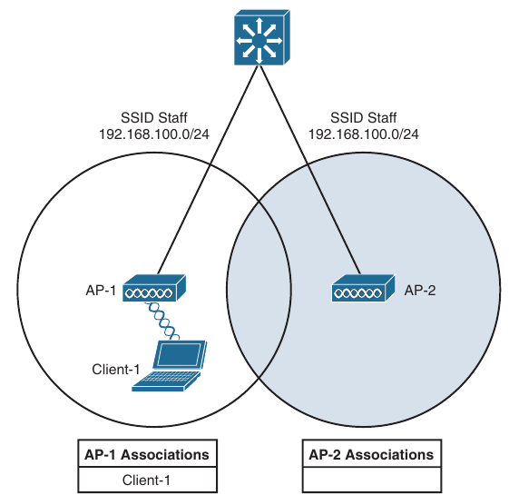

## Understanding Wireless Roaming and Location Services

- Roaming Overview

- Intercontroller Roaming

- Locating Devices in a Wireless Network

- Wireless client devices are inherentely mobile, so you should expect them to move around

- Here is discussed the client mobility from the AP and controller perspectives

- When a wireless client moves about, the expectations are simple: good, seamless coverage wherever the client goes

- Clients know how to roam between access points (APs), but they are ignorant about the wireless network infrastructure

- Even in a large network, roaming should be easy and quick, and it should not disrupt the client's service

- Cisco wireless networks offer several roaming strategies

- From the perspective of a network professional, roaming configuration is straightforward

- The inner workings can be complex, depending on the size of the wireless network, as measured as the number of APs and controllers

- Review roaming fundamentals and learn more about how Cisco wireless controllers handle client roaming

- Network design aspects and functions that can be used to track and locate wireless client devices

### Roaming Overview

- Roaming between access points when no controller is present and when only one controller is present

#### Roaming Betweeen Autonomous APs

- Recall that a wireless client must associate and authenticate with an AP before it can use the APs basic service set (BSS) to access the network

- A client can also move from one BSS to another by roaming between APs

- A client continuously evaluates the quality of it's wireless connection whether it's moving around or not

- If the signal quality degrades, perhaps as the client moves away from the AP, the client will begin looking for a different AP that can offer a better signal

- The process is usually quick and simple, the client actively scans channels and sends probe requests to discover candidate APs, and then the client selects one and tries to reassociate with it

- A client can send Association Request and Reassociation Request frames to an AP when it wants to join the BSS

- Association Requests are used to roam from one AP to another, perserving the client's original association status

- Below is shown a simple scenario with two APs and one client

- The client begins with an association to AP-1

- Because the APs are running in autonomous mode, each one maintains a table of it's associated clients

- AP-1 has one client, AP-2 has none

- Suppose that the client then begins to move into AP-2's cell

