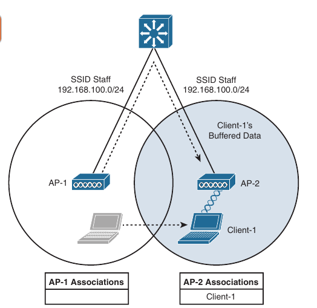
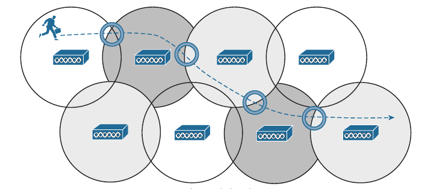
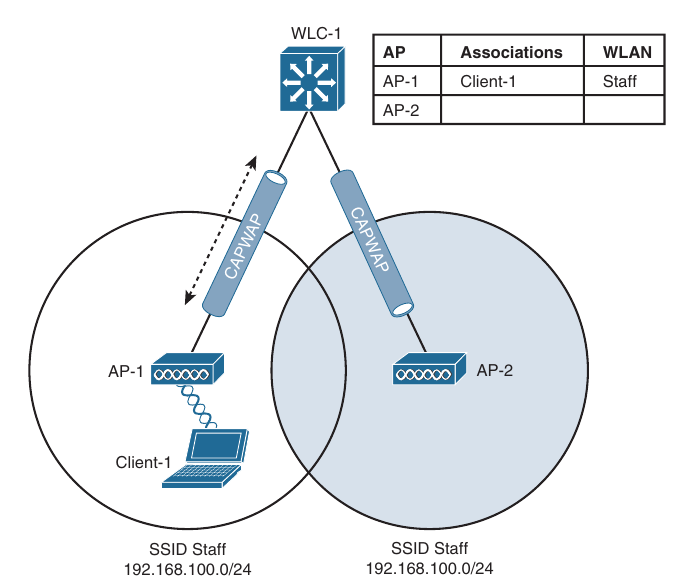
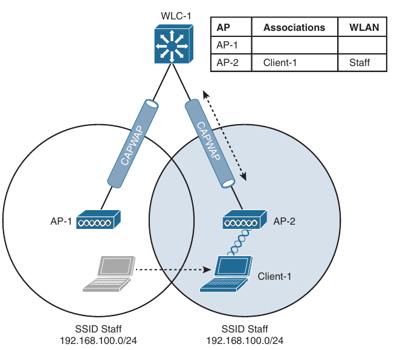
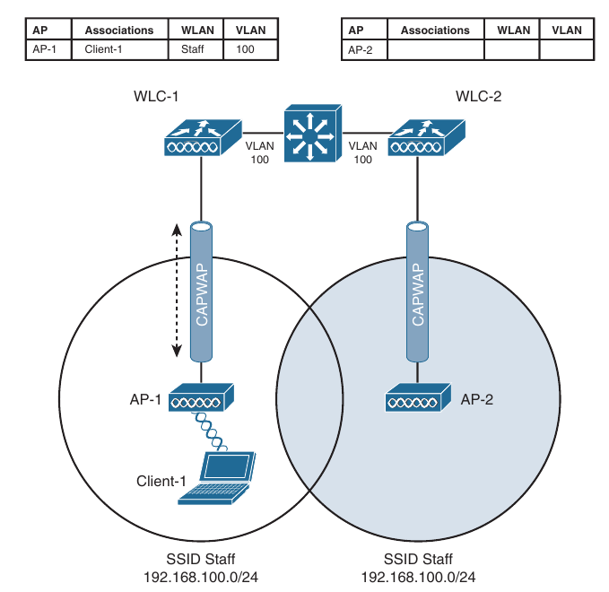
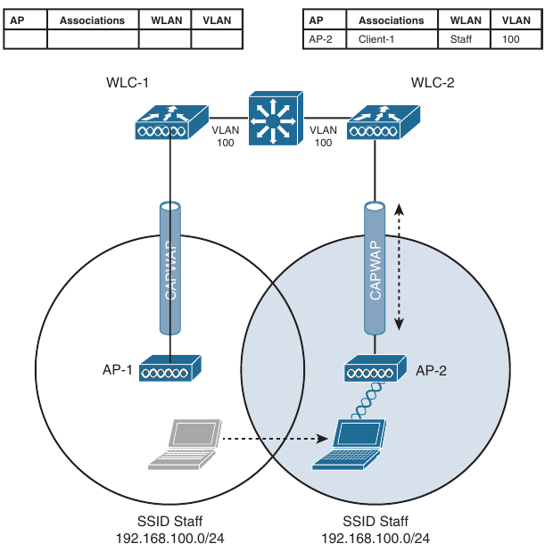
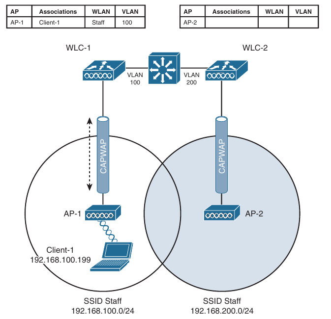
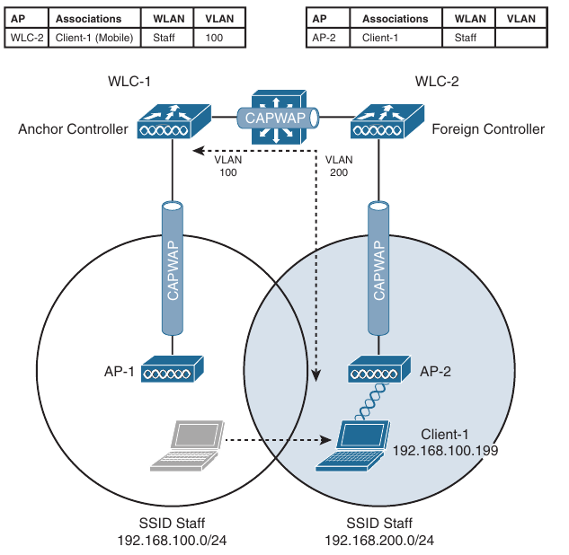
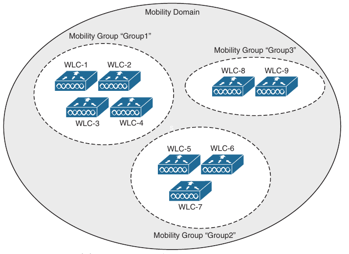
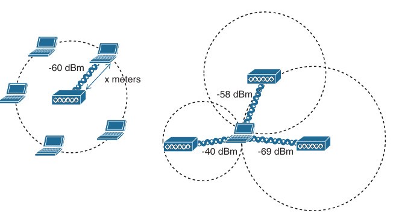

## Understanding Wireless Roaming and Location Services

- Roaming Overview

- Intercontroller Roaming

- Locating Devices in a Wireless Network

- Wireless client devices are inherentely mobile, so you should expect them to move around

- Here is discussed the client mobility from the AP and controller perspectives

- When a wireless client moves about, the expectations are simple: good, seamless coverage wherever the client goes

- Clients know how to roam between access points (APs), but they are ignorant about the wireless network infrastructure

- Even in a large network, roaming should be easy and quick, and it should not disrupt the client's service

- Cisco wireless networks offer several roaming strategies

- From the perspective of a network professional, roaming configuration is straightforward

- The inner workings can be complex, depending on the size of the wireless network, as measured as the number of APs and controllers

- Review roaming fundamentals and learn more about how Cisco wireless controllers handle client roaming

- Network design aspects and functions that can be used to track and locate wireless client devices

### Roaming Overview

- Roaming between access points when no controller is present and when only one controller is present

#### Roaming Betweeen Autonomous APs

- Recall that a wireless client must associate and authenticate with an AP before it can use the APs basic service set (BSS) to access the network

- A client can also move from one BSS to another by roaming between APs

- A client continuously evaluates the quality of it's wireless connection whether it's moving around or not

- If the signal quality degrades, perhaps as the client moves away from the AP, the client will begin looking for a different AP that can offer a better signal

- The process is usually quick and simple, the client actively scans channels and sends probe requests to discover candidate APs, and then the client selects one and tries to reassociate with it

- A client can send Association Request and Reassociation Request frames to an AP when it wants to join the BSS

- Association Requests are used to roam from one AP to another, perserving the client's original association status

- Below is shown a simple scenario with two APs and one client

- The client begins with an association to AP-1

- Because the APs are running in autonomous mode, each one maintains a table of it's associated clients

- AP-1 has one client, AP-2 has none

- Suppose that the client then begins to move into AP-2's cell

- Somewhere near the cell boundary, the client decides that the signal from AP-1 has degraded so it should look elsewhere for a stronger signal

- The client decides to roam and reassociate with AP-2

- Below is the new scenario after roaming occurs

- Notice that both APs have updated their list of associated clients to reflect Client1's move from AP-1 to AP-2

- If AP-1 still has any other leftover wireless frames destined for the client after the roam, it forwards them to AP-2 over the wired infrastructure - simply because that is where the client's MAC address now resides

- Naturally, roaming is not limited to only two APs; instead, it occurs between any two APs as the client moves between them, at any given time

- To cover a large area, you will probably install many APs in a pattern such that their cell overlap

- Below is shown a typical pattern 

- When a wireless client begins to move, it might move along an arbitrary path

- Each time the client decides that the signal from one AP has degraded enough, it attempts to roam to a new, better signal belonging to a different AP and cell

- The exact location of each roam depends on the client's roaming algorithm

- To illustrate typical roaming activity, each roam in the below figure is marked with a dark ring

#### Intracontroller Roaming

- In a Cisco wireless networks, lightweight APs are bound to a wireless LAN controller through CAPWAP tunnels

- The roaming process is similar to that of Autonomous APs; client must still reassociate to new APs as they move about

- The only real difference is that the controller handles the roaming process, rather than the APs, because of the split-MAC architecture

- Below is shown a two-AP scenario where both APs connect to a single controller

- Client 1 is associated with AP-1, which has a Control And Provisioning of Wireless Access Points (CAPWAP) tunnel to controller WLC 1

- The controller maintains a client database that contains detailed information about how to reach and support each client

- For simplicity, the figure from below shows a database as a list of controller's APs, associated clients, and the wireless LAN (WLAN) being used

- The actual database also contains client MAC and IP addresses, quality of service (QoS) parameters, and other information

- When Client 1 starts moving, it eventually roams to AP2, as shown below

- Not much has changed except that the controller has updated the client association from AP-1 to AP-2

- Because both APs are bound to the same controller, the roam occurs entirely within the controller

- This is known as **intracontroller roaming**

- If both APs involved in a client roam are bound to the same controller, the roaming process is simple and efficient

- The controller has to update it's association table so that it knows which CAPWAP tunnel to use to reach the client

- Thanks to the simplicity, an intracontroller roam takes less than 10ms to complete - the amount of processing time needed for the controller to switch the client entry from AP-1 to AP-2

- From the client's perspective, an intracontroller roam is no different from any other controller roam

- The client has no knowledge that the two APs are communicating with a controller over CAPWAP tunnels; it simply decides to roam between two APs based on it's own signal analysis

- Efficient roaming is especially important when time-critical applications are being used over the wireless network

- For example, wireless phones need a consistent connection so that the audio stream is not garbled or interrupted

- When a roam occurs, there could be a brief time when the client is not fully associated with either AP

- So long as the time is held to a minimum, the end user probably will not even notice that the roam occured

- Along with the client reassociation, a couple other processes can occur:

    - **DHCP**: The client may be programmed to renew the DHCP lease on it's IP address or to renew a new address

    - **Client authentication**: The controller might be configured to use an 802.1X method to authenticate each client on a WLAN

- To achieve efficient roaming, both of these processes should be streamlined as much as possible

- For example, if a client roams and tries to renew it's IP address, it is essentially cut off from the network until Dynamic Host Configuration Protocol (DHCP) server responds

- The client authentication process presents the biggest challenge because the dialog between a controller and a RADIUS server, in addition to the cryptographic keys that need to be generated between the client and an AP or controller, can take a customizable amount of time to accomplish

- Cisco controllers offer three techniques to minimize the time and effort spent on key exchanges during roams:

- **Cisco Centralized Key Management (CCKM)**: One controller maintains a database of clients and keys on behalf of it's APs and provides them to other controllers and their APs as needed during client roam

- CCKM requires Cisco Compatible Extensions (CCX) support from clients

- **Key Caching**: Each client maintains a list of keys used with prior AP associations and presents them as it roams

- The destination AP must be present on the list, which is limited to eight AP/key entries

- **802.11r**: The 802.11 amendment addresses fast roaming or fast BSS transition; a client can cache a portion of the authentication server's key and present that to future APs as it roams

- The client can also maintain it's QoS parameters as it roams

- Each of the fast-roaming strategies requires help on the part of the wireless client

- That means that the client must have a supplicant or driver software that is compatible with fast roaming and can cache the necessary pieces of authentication credentials

#### Intercontroller Roaming

- As a wireless network grows, one controller might not suffice

- When two or more controllers support the APs in an enterprise, the APs can be distributed across them

- As always, as clients become mobile, they roam from one AP to another - except they could also be roaming from one controller to another, depending on how the neighboring APs are assigned to the controllers

- As a network grows, AP roaming can scale too by organizing controllers into mobility groups 

- Intercontroller roaming, mobility groups and the mechanisms used to coordinate roaming

##### Layer 2 Roaming

- When a client roams from one AP to another and those APs lie on two different controllers, the client makes an intercontroller roam

- Below is a simple scenario prior to a roam 

- Controller WLC1 has one association in it's database - That of Client 1 on AP-1

- The second-next picture shows the result of the client roaming to AP-2

- The roam itself is fairly straightforward

- When the client decides to roam and reassociate itself with AP-2, it actually moves from one controller to another, and the two controllers must coordinate the move

- One subtle detail involves the client's IP address

- Before the roam, Client 1 is associated with AP-1 and takes one IP address from the VLAN and subnet that are configured on the WLAN supplied by controller WLC 1

- In the image above, WLAN Staff is bound to VLAN 100 so the client uses an address from the 192.168.100.0/24 subnet

- When the client roams to a different AP, it can try to continue using it's existing IP address or work with a DHCP server to either renew or request an IP address

- Below is shown the client roaming to AP-2, where WLAN Staff is also bound to the same VLAN 100 and 192.168.100.0/24 subnet

- Because the client has roamed between APs but stayed on the same VLAN and subnet, it has made a Layer 2 intercontroller roam

- Layer 2 roams (commonly called local-to-local roams) are nice for two reasons: The client can keep it's same IP address, and the roam is fast (usually less than 20 ms)

##### Layer 3 Roaming

- What if a wireless network grows even more, such as WLAN interfaces on each controller are assigned to different VLANs and subnets? 

- Breaking up a large WLAN into individual subnets seems like a good idea from a scalability viewpoint, it could easily end up on a different subnet from the original one

- Clients will not usually be able to detect that they have changed subnets

- They will be aware of the AP roam but little else

- Only clients that aggresively contact a DHCP server after each and every roam will continue to work properly

- But to make roaming seamless and efficient, time consuming processes, such as DHCP should be avoided

- No worries - the Cisco wireless network has a clever trick up it's sleeve

- When a client initialtes a intercontroller roam, the two controllers involved can compare the VLAN numbers that are assigned to their respective WLAN interfaces 

- If the VLAN IDs are the same, nothing special needs to happen; the client undergoes a Layer 2 intercontroller roam and can continue to use it's original IP address on the new controller

- If the controller VLAN IDs differ, the controller arrange a Layer 3 roam (also known as a local-to-foreign roam) that will allow the client to keep using it's IP address

- Below is illustrated a simple wireless network containing two APs and two controllers

- Notice that the two APs offer different IP subnets in their BSSs: 192.168.100.0/24 and 192.168.200.0/24 

- The client is associated with AP-1 and is using IP address 192.168.100.199

- On the surface, it looks like the client will roam into subnet 192.168.200.0/24 if it wanders into AP-2's cell and will lose connectivity if it tries to keep using it's same IP address

- A Layer 3 intercontroller roam consists of an extra tunnel that is built between the client's original controller and the controller it has roamed to

- The tunnel carries data to and from the client as if it is still associated with the original controller and IP subnet

- Below is shown the result of a Layer 3 roam

- The original controller (WLC 1) is called the **anchor controller**, and the controller with the roamed client is called the **foreign controller**

- Think of the client being anchored to the original controller no matter where it roams later

- When the client roams away from it's anchor, it moves into foreign teritory

- Recall that Cisco controllers use CAPWAP tunnels to connect to lightweight APs, CAPWAP tunnels are also built between controllers for Layer 3 roaming

- The tunnel tethers the client to it's original anchor controller (and original IP subnet), regardless of it's location or how many controllers it roams through

- Anchor and foreign controllers are normally determined automatically

- When a client first associates with an AP and a controller, that controller becomes it's anchor controller

- When the client roams to a different controller, that controller can take on the foreign role

- Sometimes you may not want a client's first controller to be it's anchor

- For example, guest users should not be allowed to associate with just any controller in your network

- Instead, you might want guests to be forced into a specific controller that is situated behind a firewall or contained in a protected environment

- You might configure one controller to be a static anchor for a WLAN so that other controllers will direct clients toward it through Layer 3 roaming tunnels

#### Scaling Mobility with Mobility Groups

- Cisco controllers can be organized into mobility groups to facilitate intercontroller roaming

- Mobility groups become important as a wireless network scales, and there are more centralized controllers cooperating to provide coverage over a large area

- If two centralized controllers are configured to belong to the same mobility group, clients can roam quickly between them

- Layer 2 and Layer 3 are both supported, along with CCKM, key catching, and 802.11r credential caching

- If two controllers are assigned to the same mobility groups, clients can still roam between them, but the roam is not very efficient

- Credentials are not cached and shared, so client must go through a full authentication during the roam

- A mobility group can contain up to 24 controllers

- Mobility groups have an implied hierarchy, as shown below

- Each controller maintains a mobility list that contains it's own MAC address and the MAC address of other controllers

- Each controller in the list is also assigned to a mobility group name

- In effect, the mobility list defines a mobility domain and gives a controller it's view to the outside world; it knows of and trusts only the other controllers configured in the list

- If two controllers are not listed in each other's mobility list, they are unknown to each other, and clients will not be able to roam between them

- Clients will have to associate and authenticate from scratch

- A mobility list can contain up to 72 different controller entries

### Locating Devices in a Wireless Network

- Wireless networks are usually designed to provide coverage and connectivity in all areas where client devices are expected to be located

- For example, a hospital building will likely have seamless wireless coverage in all floors and in all areas where users might go

- Usually, a user's exact location is irrelevant, as long as wireless coverage exists there

- Locating a user or device is important in several use cases, and a wireless network can be leveraged to provide that information

- Device location can be an important part of tracking assets in a business

- For instance, a large store might be interested in tracking potential customers as they walk around and shop

- The store might like to offer online advertising as customers enter various areas or walk near certain product displays

- The same could be true of a museum that wants to present relevant online content as people move to each exhibit

- A healthcare enterprise might want to track critical (and valuable) medical devices and patients as they move about the facility so that they can be quickly located

- By tracking user's locations, a large venue can provide wayfinding information on mobile devices to help people navigate through buildings

- Recall that before each wireless client can use the network, it must first be authenticated by and associated with an AP

- At the most basic level, a client can be located according to the AP and to which it is currently joined

- That may not be granular enough for every use case because one AP can cover a large area

- In addition, a client device might not roam very aggresively, so it could well be associated with one AP that is now far away, even though another AP with a better signal is very near

- To locate a device more accurately, an AP can use the received signal strength (RSS) of a client device as a measure of the distance between the two

- Free space path loss causes an RF signal to be attenuated or diminished exponentially as a function of it's frequency and the distance it travels

- That means a client's distance from an AP can be computed from it's received signal strength

- If the distance is measured from a single AP only, it is difficult to determine where the client is situated in the relation to the AP

- In case of an indoor AP with an omnidirectional antenna, the client could be located anywhere along a circular path of fixed distance because the received signal strength would it be fairly consistent at all points of the cycle

- A better solution is to obtain the same measurement from three or more APs, and then correlate the results and determine where they intersect

- Below is illustrated the difference in determining a client's location with a single and multiple APs

- The components of a wireless network can be coupled with additional resources to provide real time location services (RTLS)

- Cisco APs and WLCs can integrate with management platforms like DNA Center or Cisco Prime Infrastructure, along with location servers like Cisco Spaces, Cisco Mobility Services Engine (MSE), or Cisco Connected Mobile Experiences(CMX) to gather location information in real time and present that information in a relevant way

- Real-time location is not something inherent to a wireless network infrastructure

- Through the familiar split-MAC architecture, the APs interface directly with the client devices at the lowest real-time layer, while the WLCs learn about the clients from the APs and handle normal data forwarding to and from them

- The WLCs must keep a management platform like Cisco DNA Center or Cisco Prime Infrastructure informed as clients probe, join, and leave the network, and pass along wireless statistics such as each client's RSS value

- The actual real-time location for each device must be computed on a separate location server platform

- The simple location example shown below is intuitive, but it is based on the assumption that the APs and client devices are located in open free space, with nothing but free space path loss to attenuate the client's RF signal

- In a normal environment, 