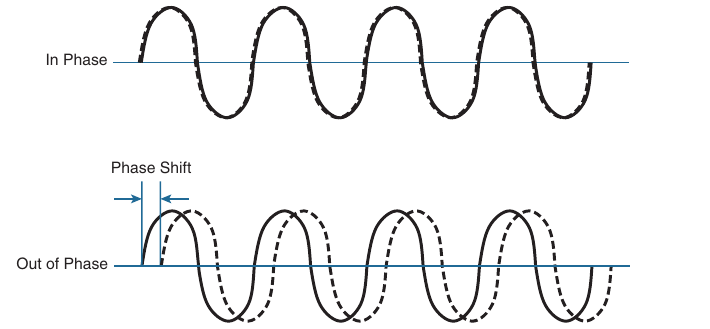
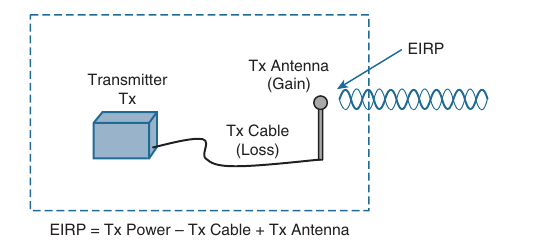
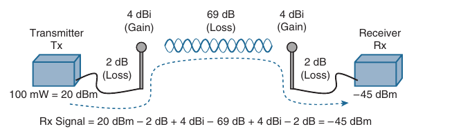
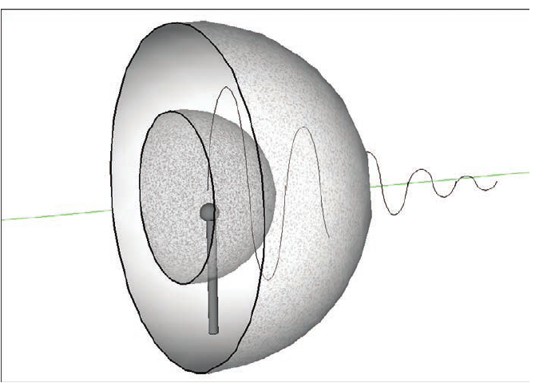
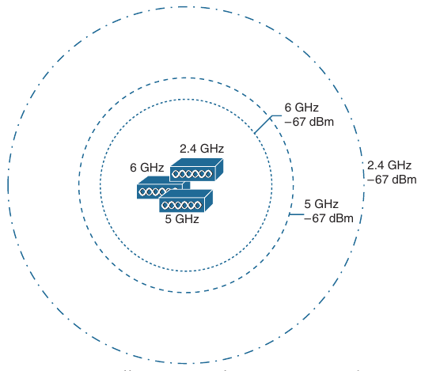

## Wireless Signals and Modulation

- Understanding Basic Wireless Theory

- Carying Data Over an RF Signal

- Wireless LANs must transmit a signal over radio frequencies to move data from one device to another

- Transmitters and receivers can be fixed in consistent locations, or they can be free to move around

- The basic theory behind wireless signals and the methods used to carry data wirelessly

### Understanding Basic Wireless Theory

- To send data across a wired link, an electrical signal is applied at one end and is carried to the other end

- The wire itself is continuous and conductive, so the signal can propagate rather easily

- A wireless link has no phisical strands of anything to carry the signal along

- How then can an electrical signal be sent across the air, or free space?

- Consider an analogy of people standing far appart, and one person wants to signal something to the other

- They are connected by a long and somewhat loose rope; the rope represents free space

- The sender on one end decides to lift it's end of the rope high and hold it there so that the other end of the rope will also raise and notify the partner

- After all, if the rope were a wire, he knows that he could apply a steady voltage at one end of the wire and it would appear at the other end

- Below is the end result; the rope falls back down after a tiny distance and the receiver never notices a change at all


- The sender decides to try a different strategy. He cannot push the rope towards the receiver, but when it begins to wave it up and down, in a steady, regular motion, a curious thing happens

- A continuous wave pattern appears along the entire length of the rope

- In fact, the waves (each representing one up and down cycle of the sender's arm), actually travel from the sender to the receiver


- In free space, a similar principle occurs

- The sender (a transmitter) can send an alternating current into a section of wire (an antenna), which sets up the moving electric or magnetic fields that propagate out and away from the wire as traveling waves

- The electric and magnetic fields travel along together and are always at right angles to each other

- The signal must keep changing or alternating, by cycling up and down to keep the electric and magnetic fields cycling and pushing over outward


- Electromagnetic waves do not travel strictly in a straight line

- Instead, they travel by expanding in all direction away from the antenna

- To get a visual image, think of dropping a pebble into a pond when the surface is still

- Where it drops in, the pebble sets the water's surface into a cyclic motion

- The waves that result begin small and expand outward, only to be replaced by new waves

- In free space, the electromagnetic waves expand outward in all three dimensions

- Below we can see a simple, idealistic antenna that is a single point, which is connected at the end of the wire

- The waves produced from the tiny point antenna expand outward in a spherical shape

- The waves will eventually reach the receiver, in addition to many other locations in other directions


- The idealistic antenna does not really exist but serves as a reference point to understand wave propagation

- In the real world, antennas can be made in various shapes and forms that can limit the direction that the waves are sent

- At the receiving end of a wireless link, the process is reversed

- As the electromagnetic waves reach the receiver's antenna, they induce an electrical signal

- If everything works right, the received signal will be a reasonable copy of the original transmitted signal

#### Understanding Frequency

- The waves involved in a wireless link can be measured and described in several ways

- One fundamental property is the *frequency* of the wave, or the number of times the signal makes one complete up and down cycle in one second

- Below we can see how a cycle of a wave can be identified

- A cycle can begin as the signal rises from the center line, falls through the center line and rises again to meet the center line

- A cycle can also ve measured from the center of one peak to the center of the next peak

- No matter where you start measuring a cycle, the signal must make a complete sequence back to it's starting position where it is ready to repeat the same cyclic pattern again


- In the above scheme, during that 1 second the signal progressed through 4 complete cycles

- Therefore, it's frequency is four cycles per second, or four hertz

- A hertz (Hz) is the most commonly used frequency unit and is nothing other than one cycle per second

- Frequency can vary over a very wide range

- As frequency increases by orders of magnitude, the numbers can become quite large

- To keep things simple, the frequency unit name can be modified to denote an increasing number of zeros

```
Unit                    Abbreviation                                    Meaning

Hertz                   Hz                                              Cycles per second

Kilohertz               kHz                                             1000 Hz

Megahertz               MHz                                             1.000.000 Hz

Gigahertz               GHz                                             1.000.000.000 Hz
```

- Below is a simple representation of the continuous frequency spectrum ranging from 0 Hz to 10 ^ 22 (or 1 followed by 22 zeros)

- At the low end of the spectrum are frequencies that are too low to be heard by the human ear, followed by audible sounds

- The highest range of frequencies contains light, follwed by X, gamma and cosmic rays


- The frequency range from around 3 kHz to 300 GHz is commonly called radio frequency (RF)

- It includes many different types of radio communication, such as low-frequency radio, AM radio, shortwave radio, television, FM radio, microwave and radar

- The microwave category also contains three main frequency ranges that are used for wireless LAN communication: 2,4, 5 and 6 GHz

- Because a range of frequencies might be used for the same purpose, it is customary to refer to the range as a band of frequencies

- For example, the range from 530 kHz to arround 1710 kHz is used by AM radio stations; therefore, it is commonly called the AM band or the AM broadcast band

- One of the three main frequency ranges used for wireless LAN communication lies between 2.400 and 2.4835 Ghz. This is usually called the 2.4 GHz band, even though it does not encompass the entire range between 2.4 and 2.5 GHz

- It is much more convenient to refer to the band name instead of the specific range of frequencies included

- The 2.4 GHz band is also known as one of the industrial, scientific, and medical (ISM) bands that is available for use without a license

- Another wireless LAN range is usually called the 5GHz band because it lies between 5.150 and 5.825 GHz

- The 5GHz band actually contains the following four separate and district bands, which are also known as Unlicenssed National Information Infrastructure (U-NII)

    - 5150 to 5250 GHz - U-NII-1

    - 5250 to 5350 GHz - U-NII-2A

    - 5470 to 5725 GHz - U-NII-2C

    - 5725 to 5825 GHz - U-NII-3

- From above we can notice that most of the 5 GHz bands are contiguous except for a gap between 5350 and 5470 (also known as U-NII-2B)

- This gap exist and cannot be used for wireless LANs

- However, some government agencies have moved to reclaim the frequencies and repurpose them for wireless LANs

- Efforts are also underway to add 5825 through 5925 GHz (also known as U-NII-4)

- The 6 GHz band lies between 5925 and 7125 GHZ

- It is broken up in four smaller bands, which are also part of the U-NII structure:

    - 5925 to 6425 GHz - U-NII-5

    - 6425 to 6525 GHZ - U-NII-6

    - 6425 to 6825 GHz - U-NII-7

    - 6825 to 7125 GHz - U-NII-8

- It is interesting that the 5 GHz and 6 GHz bands can contain several smaller bands

- The term band is simply a relative term that is used for convenience

- A frequency band contains a continuous range of frequencies

- If two devices require a single frequency for a wireless link between them, which frequency they can use?

- Beyond that, how many unique frequencies can be used within a band?

- To keep everything orderly and compatible, bands are usually divided into a number of distinct channels

- Each channel is known by a channel number and it is assigned to a specific frequency

- As long as the channels are defined by a national or international standards body, they can be used consistently in all locations

- Below is the channel assignment for 2.4 GHz band that is used for wireless LAN communication

- The band contains 14 channels, numbered 1 through 14, each assigned a specific frequency

- First notice how much easier is to refer to channel numbers than the frequencies

- Second, notice that the channels are spaced at regular intervals that are 0.005 GHz (or 5 MHz) apart, except for channel 14

- The channel spacing is known as the channel separation or channel width


- If devices use a specific frequency for a wireless link, why do the channels need to be spaced apart at all?

- The reason lies with the practical limitations of RF signals, the electronics involved in transmitting and receiving the signals, and the overhead needed to add data to the signal efficiently

- In practice, an RF signal is not infinitely narrow, instead it spills above and below a center frequency to some extent, occupying neighboring frequencies too

- It is the center frequency that defines the channel location within the band

- The actual frequency range needed for the transmitted signal is known as the signal bandwidth

- As the name implies, bandwidth refers to the width of frequency space required within the band

- For example, a signal with a 22 MHz bandwidth is bounded at 11 MHz above and below the center frequency

- In wireless LANs, the signal bandwidth is defined as part of a standard

- Even if the signal might extend farther above and below the center frequency than the bandwidth allows, wireless devices will use something called a spectral mask to ignore parts of the signal that fall outside the bandwidth boundaries


- Ideally the signal bandwidth should be less than the channel width so that a different signal could be transmitted on every possible channel with no change that two channels would overlap and interfere with each other

- Below we can see that such a channel spacing, where the signals on adjacent channels do not overlap

- A signal can exist on every possible channel without overlapping with others


- However you should not assume that the signals centered on the standardized channel assignments will not overlap with each other

- It is entirely possible that the channels in a band are narrower than the signal bandwidth

- Notice how two signals have been centered on two adjacent channel numbers 1 and 2, but they almost entirely overlap each other

- The problem is that the signal bandwidth is slightly wider than four channels

- In this case, signals centered on adjacent channels cannot possibly coexist without overlapping and interfering

- Instead, the channels must be placed on more distant channels to prevent overlapping, thus limiting the number of channels that can be used in the band

- How can channels be numbered such that signals overlap?

- Sometimes the channels in a band are defined and numbered for a specific use

- Later on, another technology might be developed to use the same band and channels, only the newer signals might require more bandwidth than the original channel numbering supported

- Such is the case with 2.4 GHz Wi-Fi band


- The 2.4 GHz band is made up of channels that are 5 MHz wide with Wi-Fi signals that have a 22 MHz bandwidth

- Adjacent channel numbers are not spaced far enough apart to be non-overlapping

- However, in the 5GHz and 6GHz bands, channels are non-overlapping because they are spaced every 20 MHz apart to support signals that are just about 20 MHz wide 

- That means every channel can be used without interfering with adjacent channels, maximizing the number of channels that are available for use

#### Understanding Phase

- RF signals are very dependent upon timing because they are always in motion

- By their very nature, the signals are made up by electrical and magnetic forces that vary over time

- The phase of a signal is a measure of shift in time relative to the start of a cycle

- Phase is normally measured in degrees, where 0 degrees is at the start of a cycle, and one complete cycle equals 360 degrees

- A point that is halfway along the cycle is at the 180-degree mark

- Because an oscilating signal si cyclic, you can think of the phase traveling along a cycle again and again

- When two identical signals are produced at exactly the same time, their cycles match up and they are said to be in phase with each other

- If one signal is delayed from the other, the two signals are said to be out of phase



- Phase becomes important as RF signals are received

- Signals that are in phase tend to add together, whereas signals that are 180 degrees out of phase, tend to cancel each other

#### Measuring Wavelength

- RF signals are usually described by their frequency; however, it is difficult to get a feel for their physical size as they move through the free space

- The wavelength is a measure of the physical distance that a wave travels over one complete cycle

- Wavelength is usually designated by the Greek lambda (λ)

- To get the feel for the dimensions of a wireless LAN sygnal, assuming that you could see it travels in front of you, a 2.4 GHz signal would have of 4.92 inches, a 5 GHz sygnal would be 2.36 inches, and a 6 GHz signal would be 1.97 inches

- Below we can see the wavelength of two different waves

- The waves are arranged in order of increasing frequency, from top to bottom

- Regardless of the frequency, RF travels at a constant speed

- In a vacuum, radio waves travel at exactly the speed of light; in air the velocity is slightly less than the speed of light

- Notice that the wavelength decreases as the frequency increases

- As the wave cycles get smaller, they cover less distance

- Wavelength becomes useful in the design and placement of antennas


#### Understanding RF Power and dB

- For an RF signal to be transmitted, propagated through the free space, received and understood with any certainty, it must be sent with enough strength or energy to make the journey

- Think about the first picture from the document, where two people are trying to signal each other with a rope

- If the sender continuously moves his arm up and down a small distance, he will produce a wave in the rope

- However, the wave will dampen out only a short distance away because of factors such as weight of the rope, gravity and so on

- To move the wave all the way down the rope to reach the receiver, the sender must move his arm up and down with a much greater range of motion and with greater force or strength

- This strength can be measured as the amplitude or the height from the top peak to the bottom peak of the signal's waveform


- The strength of an RF signal is usually measured by it's power, in watts (W)

- For example, a typical AM radio station broadcasts at a power of 50.000 watts (W); an FM radio station might use 16.000 W

- In comparison, a wireless LAN transmitter usually has a signal strength between 0.1 W (100 mW) and 0.001 W (1 mW)

- When power is measured in watts or milliwatts, it is considered to be an absolute power measurement

- In other words, something has to measure exactly how much energy is present in the RF signal

- This is fairly straightforward when the measurement is taken at the output of a transmitter because the transmit power level is usually known ahead of time

- Sometimes you might need to compare the power levels between two different transmitters

- For example, suppose that device T1 is transmitting at 1 mW, while T2 is transmitting at 10 mW

- Simple substraction tells you that T2 is 9 mW stronger than T1

- You might also notice that T2 is 10 times stronger than T1


- Now compare transmitters T2 and T3, which use 10 mW and 100 mW respectively

- Using subtraction, T2 and T3 differ by 90 mW, but T3 is again 10 times stronger than T1

- In each instance, substraction yelds a different result than division

- Which method should you use?

- Quantities like absolute power values can differ by orders of magnitude

- A more surprising example is the one below, where T4 is 0.00001 mW, and T5 is 10 mW - values you might encounter with wireless access points

- Substracting the two values gives their difference as 9.99999 mW 

- However, T5 is 1.000.000 times stronger than T4


- Because absolute power values can fall anywhere within a huge range, from a tiny decimal number of hundreds, thousants or greater values, we need a way to transform the exponential range into a linear one

- The logarithm function can be leveraged to do just that

- In a nutshell, a logarithm takes values that are orders of magnitude apart (0.001, 0.01, 0.1, 1, 10, 100, and 1000), for example, and spaces them evenly within a resonable range

- The base 10 logarithm (log(10)), computes how many times 10 can be multiplied by itself to equal a number

- For example, log(10) (10) equals 1, because 10 can be used only once to get the result of 10

- The log(10) (100) is 2, because 10 is multiplied twice (10 X 10) to reach the result of 100

- Computing the other log(10) values is difficult, requiring the use of a calculator

- Get a better understanding of power comparisons and measurements

- The decibel (dB) is a handy function that uses logarithms to compare one absolute measurement to another

- It was originally developed to compare sound intensity levels, but it applies directly to power levels too

- After each power value has been converted to the same logarithmic scale, the two values can be substracted to find the difference

- The following equation is used to calculate a dB value, where P1 and P2 are the absolute power levels of two sources


- P2 represents the source of interest, and P1 is usually called the reference value or the source of comparison

- The difference between the two logarithmic functions can be rewritten as a single logarithm of P2 divided by P1 as follows:


- Here the ratio of two absolute power values is computed first; then the result is converted into a logarithmic scale

- Oddly enough, we end up with the same two methods to compare power levels with dB: a substraction and a division

- Thanks to the logarithm, both methods arrive at identical dB values

- Be aware that the ratio or the division form of the equation is the most commonly used in wireless engineering world

- Important dB laws to remember:

- There are three cases where you can use mental math to make power-level comparisons using dB

- By adding or substracting fixed dB amounts, you can compare two power levels through multiplication or division

- You should memorize the following three laws, which are based on dB changes of 0, 3 and 10 respectively:

    - **Law of Zero**: A value of 0 dB means that the two absolute power values are equal

    - If the power values are equal, the ratio inside the logarithm is 1 - log(10)(1) is 0

    - This law is intuitive; if two power levels are the same, one is 0 dB greater than the other

    - **Law of 3s**: A value of 3 dB means that a power value of interest is double the reference value; a value of -3 dB means the power value of interest is half the reference

    - When P2 is twice P1, the ratio is always 2, therefore, 10log(10)(2) = 3 dB

    - When the ratio is 1/2, 10log(10)(1/2) = -3 dB

    - The law of 3s is not very intuitive but is still easy to learn

    - Whenever a power level doubles, it increases by 3 dB

    - Whenever it is cut in half, it decreases by 3 dB

    - **Law of 10s**: A value of 10 dB means that the power value of interest is 10 times the reference value; a value of 10 dB means the power value of interest is 1/10 of the reference

    - When P2 is 10 times P1, the ratio is always 10

    - Therefore, 10log(10)(10) = 10 dB

    - When P2 is one tenth of P1, then the ratio is 1/10 and 10log(10)(1/10) = -10 db

    - The law of 10s is intuitive because multiplying or dividing by 10 adds or substracts 10 dB respectively

- Notice another handy rule of thumb: When the absolute power values multiply, the dB value is positive and can be added

- When the power values divide, the dB value is negative and can be substracted

- The useful dB comparisons:

```
Power Change                                    dB value

=                                               0 dB

x2                                              +3 dB

/2                                              -3 dB

x10                                             +10 dB

/10                                             -10 dB
```

- Below, sources A, B and C transmit at 4, 8 and 16 mW respectively

- Source B is double the value of A, so it must be 3 dB greater than A

- Likewise, source C is double the value of B, so it must be 3 dB greater than B


- You can also compare sources A and C

- To get from A to C you have to double A, and then double it again

- Each time you double a value, just add 3 dB

- Therefore C is 3 dB + 3 dB = 6 dB greater than A

- Next try the example below

- Keep in mind that the dB values can be added or substracted in succession (in case several multiplication and division operation involving 2 and 10 are needed)


- Sourced D and E have power levels 5 and 200 mW

- Find a way to go from 5 to 200 using only x2 or x10 operations

- You can double 5 to get 10, then double 10 to get 20, and then multiply by 10 to get 200 mW

- Now use the dB laws to replace the doubling and x10 with the dB equivalents

- The result is E = D + 3 + 3 + 10 or E = D + 6 dB

- You may also find other ways to reach the same result

- For example you can start with 5 mW, then multiply by 10 to get 50, then double 50 to get 100, then double 100 to get 200 mW

- This time the result is E = D + 10 + 3 + 3 or E = D + 16 dB

- **Comparing Power Against a Reference (dBm)**

- Beyond comparing two transmitting sources, a network engineer must be concerned about the RF signal propagating from a tranceiver to a receiver

- After all, transmitting a signal is meaningless unless someone can receive it and make use of that signal

- Below is a simple scenario with a transmitter and a receiver. Nothing in the real world is ideal, so assume that something along the path of the signal will induce a net loss

- At the receiver, the signal strength will be degraded by the same amount

- Suppose that you are able to measure the power level leaving the transmitter, which is 100 mW

- At the receiver you measure the power level of the receiving signal Is an incredibily low 0.000031623 mW


- Wouldn't it be nice to quantify the net loss over the signal's path?

- After all, you might want to try several other transmit power levels or change something about the path between the transmitter and the receiver

- To design the signal path properly, you would like to make sure that the signal strength arriving at the receiver is at an optimum level

- You could leverage the handy dB formula to compare the received signal strength to the transmitted signal strength, as long as you can remember the formula and have a calculator nearby

db = 10log(10)(0.000031623 mW/100 mW) = -65 dB

- The net loss over the signal path turns out to be a decrease of 65 dB

- Knowing that, you decide to try a different transmit power level to see what would happen at the receiver

- It does not seem very straightforward to use the new transmit power to find the new signal strength at the receiver

- That may require more formulas and more time at the calculator

- A better approach is to compare each absolute power along the signal path to one common reference value

- The regardless of the absolute power values, you should just focus on the changes to the power values that are ocurring at various stages along the signal path

- In other words, you could convert every power level along the path to a dB value and simply add them up along the path

- Recall that the dB formula puts the power level of interest on the top of the ratio, with a reference power level at the bottom

- In wireless networks, the reference power level is usually 1 mW, so the units are designated by dBm (dB-miliwatt)

- Returning to the above scenario, the absolute power values at the transmitter and receiver can be converted to dBm, the results of which are shown below

- Notice that the dBm values can be added along the path. The transmitter dBm plus the net loss in dB equals the transmitter signal dBm


- **Measuring Power Changes Along the Signal Path**

- In reality, a transmitter, it's antenna and the cable that connects them are all discrete components that don't only propagate an RF signal but also affect it's absolute power level

- When an antenna is connected to a transmitter, it provides some amount of gain to the resulting RF signal

- This effectively increases the dB value of the signal above that of the transmitter alone

- Antennas provide positive fain

- By itself, the antenna does not generate any amount of absolute power

- In other words, when an antenna is disconnected, no milliwats of power are being pushed out of it

- That makes it impossible to measure the antenna's gain in dBm

- Instead, the antenna's gain is measured by comparing it's performance with that of a reference antenna, then computting a power in dB

- Usually, the reference antenna is an isotropic antenna, so the gain is measured in dBi (dB-isotropic)

- An isotropic antenna does not actually exist because it is ideal in every way

- It's size is a tiny point, and it radiates RF equally in every direction

- No physical antenna can do that

- The isotropic antenna's performance can be calcualated according to RF formulas making it a universal reference for any antenna

- Because of the physical qualities of the cable that connects an antenna to a transmitter, some signal loss always occur

- Cable vendors supply the loss in dB per foot or meter of cable length for each type of cable manufactured

- Once you know the complete combination of transmitter power level, the length of cable and the antenna gain, you can figure out the actual power level that will be radiated from the antenna

- This is known as the effective isotropic radio power (EIRP), measured in dBm

- EIRP is a very important parameter because it is regulated by government agencies in most countries

- In those cases, a system cannot radiate signals higher than a maximum allowable EIRP

- To find the EIRP of a system, simply add the transmitter power level to the antenna gain to substract the cable loss, as can be seen below



- EIRP = Tx Power - Tx Cable + Tx Antenna

- Suppose a transmitter is configured for a power level of 10 dBm (10 mW)

- A cable with 5 dB loss connects the transmitter to an antenna with an 8 dBi gain

- The resulting EIRP of the system is 10 dBm - 5 dB + 8 dBi, or 13 dBm

- You might notice that the EIRP is made up of decibel-miliwatt (dBm), and dB relative to an isotropic antenna (dBi), and plain decibel (dB) values

- Even though the units appear to be different, you can combine them you can safely combine them for the purpose of calculating the EIRP

- The only exception to this is when an antenna's gain is measured in dBd (dB-dipole)

- In that case, a dipole antenna has been used as the reference antenna rather than an isotrophic antenna

- A dipole is a simple actual antenna, which has a gain of 2.14 dBi

- If an antenna has it's gain shown as dBd, you can add 2.14 dB to that value to get it's gain in dBi units instead

- Power-level considerations do not have to stop with the EIRP

- You can also be concerned with the complete path of a signal, to make sure that the transmitted signal has sufficient power so it can effectively reach and be understood by a receiver

- This is known as the link budget

- The dB values of gain and losses can be combined over any number of stages along a signal's path

- Below, every component of signal loss or gain along the path from transmitter to receiver


- At the receiving end, an antenna provides gain to increase the received signal power level

- A cable connecting the antenna to the receiver also introduces some loss

- Below there are some sample dB values, as well as the resulting sum of the component parts across the entire signal path

- The signal begins at 20 dBm at the transmitter, has an EIRP value of 22 dBm at the transmitting antenna (20 dBm - 2 dB + 4 dBi), and arrives at the receiver with a level of -45 dBm

- Notice that every signal gain or loss used below is given except for the 69 dB loss between the two antennas

- In this case, the loss can be quantified based on the other values given

- In reality, it can be calculated as a function of distance and frequency

- For perspective, you might see a 69 dB Wi-Fi loss over a distance of about 13 to 28 meters



- If you always begin with the transmitter power expressed in dBm, it is a simple matter to add or substract the dB components along the signal path to find the signal strength that arrives at the receiver

- **Free Space Path Loss**:

- Whenever an RF signal is transmitted from an antenna, it's amplitude decreases as it travels through free space

- Even if there are no obstacles in the path between the transmitter and the receiver, the signal strength will weaken

- This is known as free space path loss

- What is about free space that causes an RF signal to be degraded? Is it the air or maybe the earth's magnetic field?

- No, even signals sent to and from a space craft in the vacuum of outer space are degraded

- Recall that an RF signal propagates through free space as a wave, not as a ray or straight line

- The wave has a three-dimensional curved shape that expands as it travels

- It is this expansion that causes the signal strength to weaken

- Below is a cutaway view of the free space loss principle

- Suppose the antenna is a tiny point, such as the transmitted RF energy travels in every direction

- The wave that is produced would take the form of a sphere; as the wave travels outwart, the sphere increases in size

- Therefore, the same amount of energy coming out of the tiny point is soon spread over an ever-expanding sphere in free space

- The concentration of that energy gets weaker as the distance from the antenna decreases



- Even if you could devise the antenna that could focus the transmitted energy into a tight beam, the energy would still travel as a wave and would spread out over a distance

- Regardless of the antenna used, the amount of signal strength loss through free space is consistent

- For reference, the free space path loss (FSPL) in dB can be calculated according to the following equation

```
FSPL(dB) = 20log(10)(d) + 20 log(10)(f) + 32.44

where d is the distance in kilometers, and f is the frequency in megahertz
```

- Interesting facts related to free space path loss:

    - Free space path loss is an exponential function; the signal strength falls of quickly near the transmitter and but more slowly farther away

    - The loss is a function of distance and frequency only

- With the formula you can calculate the free space path loss for any given scenario

- Just be aware that the free space path loss is always an important component of the link budget, along with the antenna gain and cable loss

- You might have noticed that the distance d is given in kilometers

- In most indoor locations, wireless clients are usually less than 50 meters away from the access point they are using

- Does that mean that the free space path loss over a short indoor path is negligible?

- Not at all. Even at 1 meter away, the effects of free space cause a loss around 46 dBm!

- You should also be aware that the free space path loss is greater in the 5GHz band that it is in the 2.4 GHz band

- The loss is also greater in the 6GHz band than in the 5GHz band

- In the equation, as the frequency increases, so does the loss in dB

- This means that 2.4 GHz devices have a greater effective range that 5GHz and 6 GHz devices, assuming an equal transmitted signal strength

- Below we can see the range differences when both transmitters have an equal EIRP

- The dashed cycles show where the effective range ends, at the point where the signal strength of each transmitter is equal



- To get a feel for the actual range difference between different bands, an impromptu test was performed by carying a test receiver away from colocated 2,4, 5, and 6 GHz transmitters until the received signal strength reached -67 dBm

- On a 2.4 GHz channel, the range has measured to be 140 feet, whereas at 5GHz it was reduced to 80 feet and at 60 GHz to 50 feet

- While the free space path loss is the largest contributor to the difference, other factors like antenna size and receiver sensitivity that differ between the 2.4, 5 and 6 GHz radios has some effect too

- **Understanding Power Levels At the Receiver**

- When you work with wireless LAN devices, the EIRP levels leaving the transmitter's antenna normally range from 100 mW down to 1 mW

- This corresponds to the range +20 dBm down to 0 dBm

- At the receiver the power levels are much, much less, ranging from 1 mW all the way down to tiny fractions of miliwatt, approaching 0 mW

- The corresponding range of received signal levels is from 0 dBm down to about -100 dBm

- Even so, a receiver expects to find a signal on a predetermined frequency, with enough power to contain useful data

- Receivers usually measure a signal's power level according to the received signal strength indicator (RSSI) scale

- The RSSI value is defined in the 802.11 standard as an internal 1-byte relative value ranging from 0 to 255, where 0 is the weakest and 255 is the strongest 

- As such, the value has no useful units, and the range of RSSI values can vary between one hardware manufacturer and another

- In reality, you will likely see RSSI values that are measured in dBm after they have been converted and scaled to correlate the same dBm values

- Be aware that the results are not standardized across all receiver manufacturers, so an RSSI value can vary from one receiver hardware to another

- Assuming that a transmitter is sending an RF signal with enough power to reach a receiver, what received signal strength value is good enough?

- Every receiver has a sensitivity level, or a threshold that divides inneligible, useful signals from unintelligible ones

- As long as a signal is received with a power level that is greater than the sensitivity level, chances are that the data from the signal can be understood correctly

- Below is an example of how the signal strength at a receiver might change over time

- The receiver's sensitivity level is -82 dBm


- The RSSI value focuses on the expected signal alone, without regard of any other signals that may also be received

- All other signals that are received as the same frequency as the one you are trying to receive are simply viewed as noise

- The noise level, or the average signal strength of the noise, is called the noise floor

- It is easy to ignore noise as long as the noise floor is well below what you are trying to hear

- For example, two people can effectively wisper in a library because there is very little competing noise

- The same two people would become very frustrated if they tried to wisper to each other in a crowded sports area

- Similarly, with an RF signal, the signal strength should be greater than the noise floor by a decent amount so that they can be understood correctly

- The difference between the signal and the noise is called the signal-to-noise-ratio (SNR), measured in dB

- A higher SNR value is preferred

- Below, the received signal strength of a signal is compared with the noise floor that is received

- The signal strength averages around -54 dBm

- On the left side of the graph, the noise floor is -90 dBm

- The resulting SNR is -54 dBm - (-90 dBm) or 36 dB

- Toward the right side of the graph, the noise floor gradually increases to -65 dBm, reducing the SNR to 11 dB

- The signal is so close to the noise that it might not be usable


### Carying Data over an RF Signal

- Before now, only the RF characteristics of wireless signals have been discussed

- The RF signals presented have existed only as simple oscilations in the form of a sine wave

- The frequency, amplitude and phase have all been constant

- The steady, predictable frequency is important because a receiver needs to tune a known frequency to find the signal in the first place

- This basic RF signal is called carrier signal because it is used to carry other useful information

- With AM and FM radio signals, the carrier signal also transports audio signals

- TV carrier signals have to carry both audio and video

- Wireless LAN carrier signals must carry data

- To add data to the RF signal, the frequency of the original carrier signal must be preserved

- Therefore there must be some scheme of altering some characteristics of the carrier signal to distinguish a 0 from a 1 bit

- Whatever scheme is used by the transmitter must also be used by the receiver so that the data bits can be correctly interpreted

- Below is shown a carrier signal that has a constant frequency

- The data bits 1001 are to be sent over the carrier signal, but how?

- One idea might be to simply use the value of the data bit to turn the carrier signal on or off

- The Bad Idea 1 plot shows the resulting RF signal

- A receiver might be able to notice when the signal is present and has an amplitude, thereby correctly interpreting 1 bits, but there is no signal to receive during 0 bits

- If the signal becomes weak or is not available for some reason, the receiver will incorrectly think that a long string of 0's has been transmitted

- A different might be to transmit only the upper half of the carrier signal during a 1 bit and the lower half during a 0 bit, as shown in the Bad Idea 2 plot

- This time a portion of the signal is always available for the receiver, but the signal becomes impractical to receive because important pieces of each cycle are missing

- In addition, it is very difficult to transmit an RF signal with disjoint alternating cycles


- Such naive approaches might not be successful, but they do have the right idea: to alter the carrier signal in a way that indicates the information to be carried

- This is known as modulation, where the carrier signal is modulated or changed according to some other source

- At the receiver the process is reversed; demodulation interprets the added information based on changes in the carrier signal

- RF modulation schemes generally have the following goals:

    - Carry data at a predefined rate

    - Be reasonably immune to interference and noise

    - Be practical to transmit and receive

- Due to the physical properties of an RF signal, a modulation scheme can alter only the following attributes:

    - Frequency, but only by varying slightly above or below the carrier frequency

    - Phase

    - Amplitude

- The modulation techniques require some amount of bandwidth centered on the carrier frequency

- This additional bandwidth is partly due to the rate of the data being carried and partly due to the overhead from encoding the data and manipulating the carrier signal

- If the data has a relatively low bit rate, such as an audio signal carried over AF or FM radio, the modulation can be straight forward and requires little extra bandwidth

- Such signals are called narrowband transmissions

- In contrast, wireless LANs must carry data at high bit rates, requiring more bandwidth for modulation

- The end result is that the data being sent is spread out across a range of frequencies

- This is known as spread spectrum

- At the physical layer, modern wireless LANs can be broken down into the following two common spread-spectrum categories:

    - **Direct Squence Spread Spectrum (DSSS)**: Used in the 2.4 GHz band, where a small number of fixed, wide channels support complex phase modulation schemes and somehow scalable data rates

    - Typically these channels are wide enough to augment the data by spreading it out and making it more resilient to disruption

    - **Orthogonal Frequency Division Multiplexing (OFDM)**: Used in 2.4, 5 and 6 GHz bands, where a single 20 MHz channel contains data that is sent in parallel over multiple frequencies

    - Each channel is divided into many subcarriers (also called subchannels or tones); both phase and amplitude are modulated with quadrature amplitude modulation (QAM) to move the most data efficiently

#### Maintaining Ap-Client Compatibility

- To provide wireless communication that works, an AP and any client device that associates with it must use wireless mechanisms that are compatible

- The IEEE 802.11 standard defines these mechanisms in a standardized fashion

