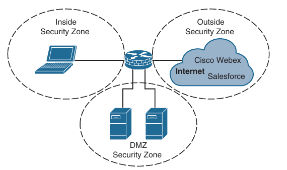

## Zone Based Firewall (ZBFW)

- ACLs control access based on protocol, source IP address, destination IP address and ports

- Unfortunately they are stateless, and do not inspect a packets's payload to detect whether attackers are using a port that they have found open

- Stateful firewalls are capable of looking into Layer 4 through 7 of a network packet to verify the state of the transmission

- A stateful firewall can detect whether a port is being piggybacked and can mitigate DDoS intrusions

- Cisco **Zone-Based Firewall (ZBFW)** is the latest integrated stateful firewall technology included in IOS XE

- ZBFW reduces the need for a firewall at a branch site to provide stateful network security

- ZBFW uses a flexible and straightforward approach to providing security by establishing security zones

- Router interfaces are assigned to specific zones, which can maintain a one-to-one or many-to-one relationship

- A zone establishes a security border on the network and defines acceptable traffic that is allowed to pass between zones

- By default, interfaces in the same security zone can communicate freely with each other, but interfaces in different zones cannot communicate with each other without passing the configured policy

- Below is illustrated the concept of ZBFW and the association of interfaces to a security zone



- Within the ZBFW architecture, there are two system-built zones: self and default

### The Self Zone

- The Self zone is a system-level zone and includes all the router's IP addresses

- By default, traffic to and from this zone is permitted to support management (for example, SSH protocol, SNMP) and control plane (for example EIGRP, BGP functions)

- After a policy is applied to the self zone and another security zone, interzone communication must be explicitly defined

### The Default Zone

- The default zone is a system-level zone, and any interface that is not member of an another security zone is placed in this zone automatically

- When an interface that is not in a security zone sends traffic to an interface that is in a security zone, the traffic is dropped

- Most network engineers assume that a policy cannot be configured to permit these traffic flows, but it can, if you enable the default zone

- Upon initialization of this zone, any interface not associated with a security zone is placed in this zone

- When the unassigned interfaces are in the default zone, a policy map can be created between the two security zones

### ZBFW configuration

- Process for configuring a ZBFW outside zone on an Internet-facing router interface

- ZBFW is configured in five steps:

    1. Configure the security zones:

    ```
    conf t
     zone security <zone-name>
      descriptiom <zone-description>     
    ```

    - A zone needs to be created for the outside zone (the Internet)

    - The self zone is defined automatically

    2. Define the inspection class map

    - The class map for inspection defines a method for classification of traffic
    
    - Can be configured as follows:

    ```
    conf t
     class-map type inspect <match-all|match-any> <class-name>
    ```

    - The `match-all` keyword requires that network traffic match all the conditions listed in the class map to qualify (Boolean AND), whereas `match-any` requires that network traffic match only one of the conditions in the class map to qualify (Boolean OR)

    - If neither keyword is specified, the `match-all` function is selected

    - Below is shown an example of inspection class maps configuration and their associated ACLs:

    ```
    conf t
     ip access-list extended ACL-IPSEC
      permit udp any any eq non500-isakmp
      permit udp any any eq isakmp

     ip access-list extended ACL-PING-AND-TRACEROUTE
      permit icmp any any echo
      permit icmp any any echo-reply
      permit icmp any any ttl-exceeded
      permit icmp any any port-unreachable
      permit udp any any range 33434 33463 ttl eq 1

     ip access-list extended ACL-ESP
      permit esp any any 

     ip access-list extended ACL-DHCP-IN
      permit udp any eq bootps any eq bootpc

     ip access-list extended ACL-GRE
      permit gre any any
    
     class-map type inspect match-any CLASS-OUTSIDE-TO-SELF-INSPECT
      match access-group name ACL-IPSEC
      match access-group name ACL-PING-AND-TRACEROUTE

     class-map type inspect match-any CLASS-OUTSIDE-TO-SELF-PASS
      match access-group name ACL-ESP
      match access-group name ACL-DHCP-IN
      match access-group name ACL-GRE
    ```

    - The configuration of inspect class maps can be verified:

    ```
    show class-map type inspect [class-name]
    ```

    ```
    R1-ZBFW#show class-map type inspect 
    Class Map type inspect match-any CLASS-OUTSIDE-TO-SELF-PASS (id 2)
     Match access-group name ACL-ESP
     Match access-group name ACL-DHCP-IN
     Match access-group name ACL-GRE

    Class Map type inspect match-any CLASS-OUTSIDE-TO-SELF-INSPECT (id 1)
     Match access-group name ACL-IPSEC
     Match access-group name ACL-PING-AND-TRACEROUTE
    ```

    3. Define the inspection policy map, which applies firewall policy actions to the class maps defined in the policy map

    - The policy map is then associated with a zone pair

    - The inspection policy map is defined with the command:

    ```
    conf t
     policy-map type inspect <policy-name>
    ```

    - After the policy map is defined, the various class maps are defined as part of it as follows:

    ```
    conf t
     policy-map type inspect <name>
      class type inspect <class-name>
    ```

    - Under the class map, the firewall action is defined with these commands:

        - **drop [log]**: The default action silently discards packets that match the class map

        - The `log` keyword adds syslog information that includes source and destination (IP address, port, and protocol)

        - **pass [log]**: This action makes the router forwards packets from source zone to the destination zone

        - Packets are forwarded in only one direction

        - A policy must be applied for traffic to be forwarded in the oposite direction

        - The pass action is useful for protocols like IPsec, Encapsulating Security Payload (ESP), and other inherently secure protocols with predictable behavior

        - The optional `log` keyword adds syslog information that includes source and destination IP addresses

        - **inspect**: The `inspect` action offers state-based traffic control

        - The router maintains connection/session information and permits return traffic from the destination zone without the need to specify it in a second policy

    - The inspect policy map has an implicit class default that uses the default drop action

    - This provide the same implicit 'deny all' as an ACL

    - Adding it to the configuration may simplify troubleshooting for junior network engineers

    - Below we can see the configuration of the inspect policy map

    - Notice that class-default class, the drop command does not include the log keyword because of the potential to fill up the syslog

    ```
    conf t
     policy-map type inspect POLICY-OUTSIDE-TO-SELF
      class type inspect CLASS-OUTSIDE-TO-SELF-INSPECT
       inspect
      class type inspect CLASS-OUTSIDE-TO-SELF-PASS
       pass
      class class-default
       drop
    ```

    - The inspect policy map can be verified as follows:

    ```
    show policy-map type inspect <policy-name>
    ```

    ```
    R1-ZBFW(config)#do sh policy-map type inspect
  Policy Map type inspect POLICY-OUTSIDE-TO-SELF
    Class CLASS-OUTSIDE-TO-SELF-INSPECT
      Inspect 
    Class CLASS-OUTSIDE-TO-SELF-PASS
      Pass
    Class class-default
      Drop
    ```

    4. Apply a policy map to a traffic flow source to a destination by using the command:

    ```
    conf t
     zone-pair security <zone-pair-name> source <source-zone-name> destination <destination-zone-name>
    ```

    - The inspection policy map is then applied to the zone mair with the command:

    ```
      service-policy type inspect <policy-name>
    ```

    - Traffic is statefully inspected between the source and destination, and return traffic is allowed

    - Below are defined the zone pairs and associates the policy map with the zone pair:

    ```
    conf t
     zone-pair security OUTSIDE-TO-SELF source EXTERN destination self
      service-policy type inspect POLICY-OUTSIDE-TO-SELF
    ```

    - The order of the zone pair is significant; the first zone indicates the source zone, and the second zone indicates the destination zone

    - A second zone pair needs to be created with bidirectional traffic patterns and then the `pass` action is selected

    5. Apply the security zone to the appropriate interfaces:

    ```
    conf t
     interface <name>
      zone-member security <zone-name>
    ```

    - Below we can see the EXTERN zone being associated with the internet facing interface G0/2

    ```
    conf t
     interface g0/2
      zone-member security EXTERN
    ```

- Now that the OUTSIDE-TO-SELF policy has been fully defined, traffic statistics can be viewed with the following command:

```
show policy-map type inspect zone-pair <zone-pair-name>
```

```
R1-ZBFW#show policy-map type inspect zone-pair 

policy exists on zp OUTSIDE-TO-SELF
  Zone-pair: OUTSIDE-TO-SELF 

  Service-policy inspect : POLICY-OUTSIDE-TO-SELF

    Class-map: CLASS-OUTSIDE-TO-SELF-INSPECT (match-any)  
      Match: access-group name ACL-IPSEC
        0 packets, 0 bytes
        30 second rate 0 bps
      Match: access-group name ACL-PING-AND-TRACEROUTE
        0 packets, 0 bytes
        30 second rate 0 bps

   Inspect
        Session creations since subsystem startup or last reset 0
        Current session counts (estab/half-open/terminating) [0:0:0]
        Maxever session counts (estab/half-open/terminating) [0:0:0]
        Last session created never
        Last statistic reset never
        Last session creation rate 0
        Maxever session creation rate 0
        Last half-open session total 0
        TCP reassembly statistics
        received 0 packets out-of-order; dropped 0
        peak memory usage 0 KB; current usage: 0 KB
        peak queue length 0


    Class-map: CLASS-OUTSIDE-TO-SELF-PASS (match-any)  
      Match: access-group name ACL-ESP
        0 packets, 0 bytes
        30 second rate 0 bps
      Match: access-group name ACL-DHCP-IN
        0 packets, 0 bytes
        30 second rate 0 bps
      Match: access-group name ACL-GRE
        0 packets, 0 bytes
        30 second rate 0 bps
      Pass
        0 packets, 0 bytes

    Class-map: class-default (match-any)  
      Match: any 
      Drop
        0 packets, 0 bytes
```

- Making the class maps more explicit and thereby adding more of the explicit class maps to the policy map provides more visibility to the metrics

- Even though the ACLs are not used for blocking traffic, the counters do increase as packets match the ACL entries for the inspect class maps

- Traffic matched for inspect class maps:

```
R1-ZBFW#show ip access
Extended IP access list ACL-DHCP-IN
    10 permit udp any eq bootps any eq bootpc (2 matches)
Extended IP access list ACL-ESP
    10 permit esp any any
Extended IP access list ACL-GRE
    10 permit gre any any
Extended IP access list ACL-IPSEC
    10 permit udp any any eq non500-isakmp
    20 permit udp any any eq isakmp
Extended IP access list ACL-PING-AND-TRACEROUTE
    10 permit icmp any any echo
    20 permit icmp any any echo-reply (5 matches)
    30 permit icmp any any ttl-exceeded
    40 permit icmp any any port-unreachable
    50 permit udp any any range 33434 33461 ttl eq 1
```

#### Verifying ZBFW

- After the OUTSIDE-TO-SELF policy has been defined, it is time to verify connectivity to the Internet

- The ping from R1 to Google's public DNS IP address 8.8.8.8 is failing

```
R1-ZBFW(config-if)#do ping 8.8.8.8
Type escape sequence to abort.
Sending 5, 100-byte ICMP Echos to 8.8.8.8, timeout is 2 seconds:
.....
Success rate is 0 percent (0/5)
```

- The reason for the packet failure is that the router needs to allow locally originated packets within a SELF-TO-OUTSIDE policy

- Below is the configuration for the SELF-TO-OUTSIDE policy

- ACL-IPSEC and ACL-ESP are reused from the OUTSIDE-TO-SELF policy

```
conf t
 ip acess-list extended ACL-DHCP-OUT
  permit udp any eq bootpc any eq bootps

 ip access-list extended ACL-ICMP
  permit icmp any any

 class-map type inspect match any CLASS-SELF-TO-OUTSIDE-INSPECT
  match access-group name ACL-IPSEC
  match access-group name ACL-ICMP

 class-map type inspect match any CLASS-SELF-TO-OUTSIDE-PASS
  match acess-group name ACL-ESP
  match access-group name ACL-DHCP-OUT

 policy-map type inspect POLICY-SELF-TO-OUTSIDE
  class type inspect CLASS-SELF-TO-OUTSIDE-INSPECT
   inspect
  class type inspect CLASS-SELF-TO-OUTSIDE-PASS
   pass 
  class class-default
   drop log

 zone-pair security SELF-TO-OUTSIDE source self destination EXTERN
  service-policy type inspect POLICY-SELF-TO-OUTSIDE
```

```
R1-ZBFW#show zone-pair security 
Zone-pair name OUTSIDE-TO-SELF
    Source-Zone EXTERN  Destination-Zone self 
    service-policy POLICY-OUTSIDE-TO-SELF
Zone-pair name SELF-TO-OUTSIDE
    Source-Zone self  Destination-Zone EXTERN 
    service-policy POLICY-SELF-TO-OUTSIDE
```

```
R1-ZBFW(config)#do sh policy-map type inspect zone-pair

policy exists on zp OUTSIDE-TO-SELF
  Zone-pair: OUTSIDE-TO-SELF 

  Service-policy inspect : POLICY-OUTSIDE-TO-SELF

    Class-map: CLASS-OUTSIDE-TO-SELF-INSPECT (match-any)  
      Match: access-group name ACL-IPSEC
        0 packets, 0 bytes
        30 second rate 0 bps
      Match: access-group name ACL-PING-AND-TRACEROUTE
        5 packets, 400 bytes
        30 second rate 0 bps

   Inspect
        Session creations since subsystem startup or last reset 0
        Current session counts (estab/half-open/terminating) [0:0:0]
        Maxever session counts (estab/half-open/terminating) [0:0:0]
        Last session created never
        Last statistic reset never
        Last session creation rate 0
        Maxever session creation rate 0
        Last half-open session total 0
        TCP reassembly statistics
        received 0 packets out-of-order; dropped 0
        peak memory usage 0 KB; current usage: 0 KB
        peak queue length 0


    Class-map: CLASS-OUTSIDE-TO-SELF-PASS (match-any)  
      Match: access-group name ACL-ESP
        0 packets, 0 bytes
        30 second rate 0 bps
      Match: access-group name ACL-DHCP-IN
        2 packets, 616 bytes
        30 second rate 0 bps
      Match: access-group name ACL-GRE
        0 packets, 0 bytes
        30 second rate 0 bps
      Pass
        2 packets, 616 bytes

    Class-map: class-default (match-any)  
      Match: any 
      Drop
        23 packets, 4002 bytes
          
policy exists on zp SELF-TO-OUTSIDE
  Zone-pair: SELF-TO-OUTSIDE 

  Service-policy inspect : POLICY-SELF-TO-OUTSIDE

    Class-map: CLASS-SELF-TO-OUTSIDE-INSPECT (match-any)  
      Match: access-group name ACL-IPSEC
        0 packets, 0 bytes
        30 second rate 0 bps
      Match: access-group name ACL-ICMP
        0 packets, 0 bytes
        30 second rate 0 bps

   Inspect
        Session creations since subsystem startup or last reset 0
        Current session counts (estab/half-open/terminating) [0:0:0]
        Maxever session counts (estab/half-open/terminating) [0:0:0]
        Last session created never
        Last statistic reset never
        Last session creation rate 0
        Maxever session creation rate 0
        Last half-open session total 0
        TCP reassembly statistics
        received 0 packets out-of-order; dropped 0
        peak memory usage 0 KB; current usage: 0 KB
        peak queue length 0


    Class-map: CLASS-SELF-TO-OUTSIDE-PASS (match-any)  
      Match: access-group name ACL-ESP
        0 packets, 0 bytes
        30 second rate 0 bps
      Match: access-group name ACL-DHCP-OUT
        0 packets, 0 bytes
        30 second rate 0 bps
      Pass
        0 packets, 0 bytes

    Class-map: class-default (match-any)  
      Match: any 
      Drop
        0 packets, 0 bytes
```

- Now the ping is successful:

```
R1-ZBFW#ping 8.8.8.8
Type escape sequence to abort.
Sending 5, 100-byte ICMP Echos to 8.8.8.8, timeout is 2 seconds:
!!!!!
Success rate is 100 percent (5/5), round-trip min/avg/max = 20/20/23 ms
```
