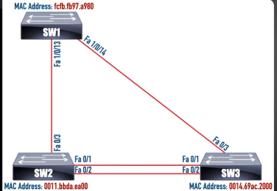
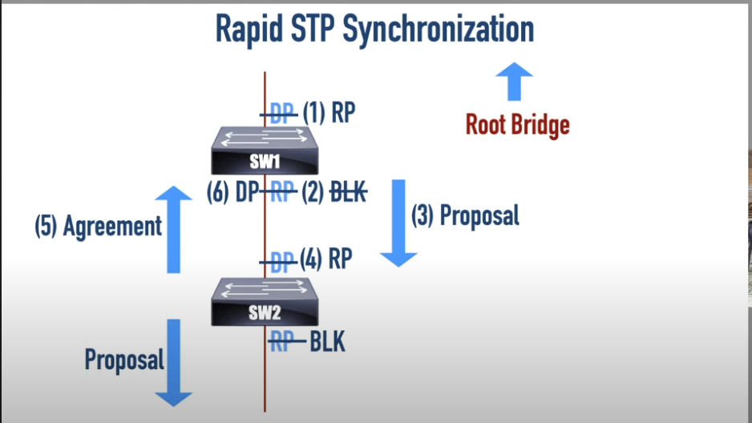
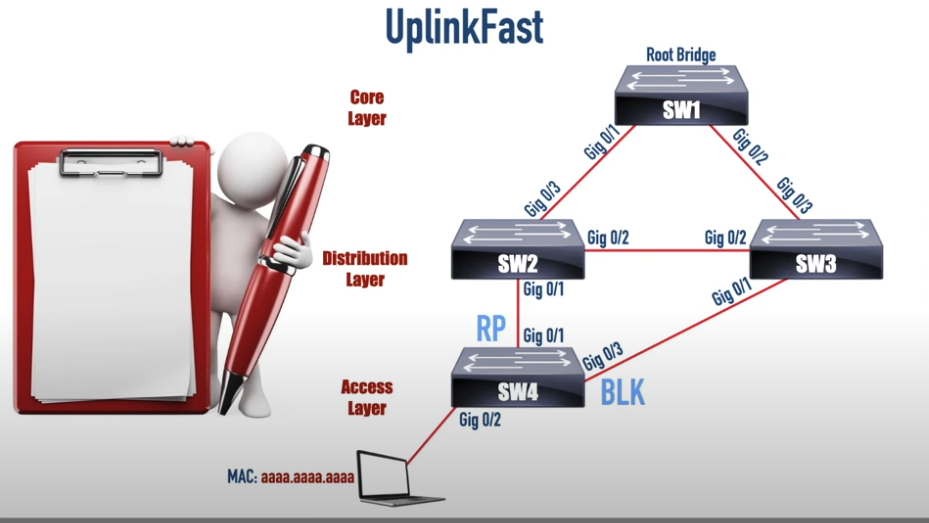
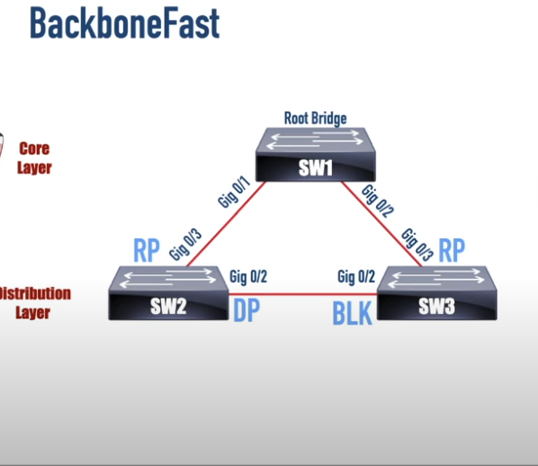
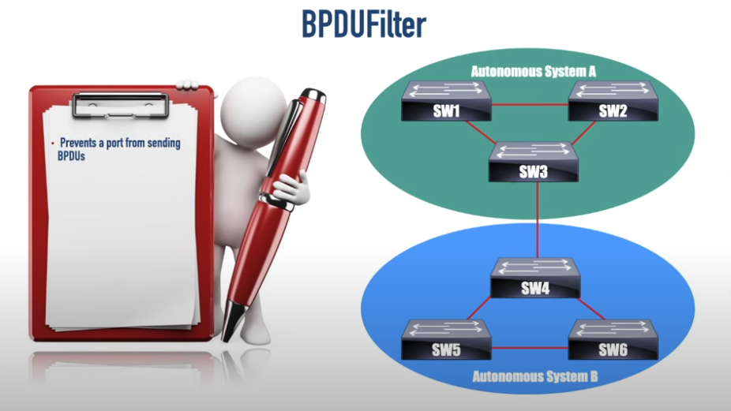
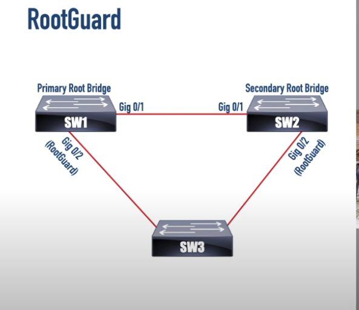
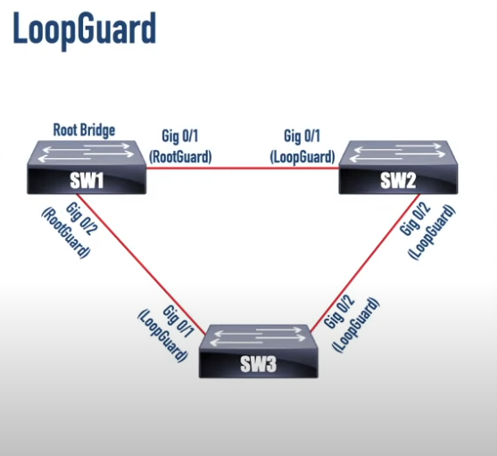

## Spanning Tree Protocol - Influencing Root bridge election process

- Topology



- Make SW3 the root for the STP topology for VLAN 1

```
conf t
 spanning-tree vlan 1 root ?
  primary
  secondary
  
 OR
 
 spanning-tree vlan 1 priority ? # in increments of 4096 - you can also have 0 priority
 
 spanning-tree vlan 1 root primary # this sets the priority to 24576 (+ vlan id)
```

- The root primary command will be looking to who is the root bridge now and decrement it's priority by 25% (in the default priority case) (32768 x 0.75)

- If the priority is lower on the root bridge is going to lower the priority with 4096 less than the root's bridge current priority


- Making a bridge the secondary root for VLAN 1 (SW2)

```
conf t
 spanning-tree vlan 1 root secondary

```

- This sets the bridge priority to 28672 on SW2. We reduced the priority by 1/8. (32768 x 0,875)

- It does not check who the root bridge is right now


- Influcence which port we are using when we have more than one connection (f0/1 or f0/2)

```
conf t
 int f0/2
  spanning-tree vlan 1 port-priority 32
```

## Configure multiple spanning-tree (MST/MSTP) on switches (same topology as above)

- Configure MST on SW2 

```
conf t
 spanning-tree mst configuration
  instance 1 vlan 100,300
  instance 2 vlan 200
  exit
 spanning-tree mode mst
```

- Configure MST on SW1 - root for instance 1 and secondary for instance 2

```
conf t
 spanning-tree mst configuration
  instance 1 vlan 100,300
  instance 2 vlan 200 
  exit
 spanning-tree mst 1 priority 8192 # for the primary root switch for the first instance
 spanning-tree mst 2 priority 16384 # for the secondary root swith for the second instance
 spanning-tree mode mst
```

- Configure MST on SW3

```
conf t
 spanning-tree mst configuration
  instance 1 vlan 100,300
  instance 2 vlan 200 
  exit
 spanning-tree instance 1 priority 16384
 spanning-tree instance 2 priority 8192
 spanning-tree mode mst
```

- Show commands

```
show spanning-tree
show spanning-tree vlan 1
show spanning-tree summary
```

## Fast convergence states for Rapid PVST+ 

- Topology and steps



- Configure PVST + - These are the steps for the convergence types

    - SW1 learned from an upstream neighbor that the root bridge changed
    
    - 1. SW1 will transition the designated port into a root port

    - 2. SW1 temporarly changes the state of port connected to SW2 to a blocked port
    
    - 3. SW1 sends a proposal message down to SW2, telling it the cost to the root bridge that is now lower on that path
    
    - 4. SW2 changes it's designated port to a root port
    
    - 5. SW2 sends an Agreement message to it's neighbor SW1, agreeing the topology change
    
    - 6. SW1 transition the temporarly blocked port to a designated port
    
- SW1 configuration - Topology is the one from the beginning of the document

```
conf t
 spanning-tree mode rapid-pvst
 spanning-tree vlan 200 priority 28672
 spanning-tree vlan 100,300 root primary
```

- SW2 configuration

```
conf t
 spanning-tree mode rapid-pvst
```

- SW3 configuration

```
conf t
 spanning-tree mode rapid-pvst
 spanning-tree vlan 200 root primary
 spanning-tree vlan 100,300 priority 28672
```

- Show commands

```
show spanning-tree
show spanning-tree vlan 1
show spanning-tree summary
```

## Set link types for some ports

- The topology is the same from the beginning of the document

- SW1 - F1/0/1 will be an edge port - port connected to a PC

```
int f1/0/1
 spanning-tree portfast # this makes the port an edge port 
```

- Change the link type:

```
int f1/0/1
 spanning-tree link-type
    point-to-point # connected to another switch
    shared # connected to a hub
```

## Spanning-tree features

### Portfast

- It will help transition the ports connected to end hosts to forwarding state almost imediately.

- If you enable it globally it will just enable it for all ports that are not in trunking state

- Enable portfast on port

```
conf t
 interface f1/0/1
  spanning-tree portfast 
```

- Enable portfast globally

```
conf t
 spanning-tree portfast default
```

- Show commands

```
show spanning-tree interface f1/0/1 portfast
```

### Uplinkfast



- Enabled globally on access-layer switches

- It will react to a direct link failure

- If the root port from g0/1 will fail, then g0/3 will transition to root port after 15 seconds

- Now after the convergence, we have incorrect MAC address tables on switches

- SW1 can send some frames to a L2 multicast address (Cisco proprietary solution) - Is a multicast address that all switches belong to

    - Source PC's MAC address - (aaaa.aaaa.aaaa)
    
    - Destination Multicast MAC address - (0100.0ccd.cdcd) 

- Configure uplinkfast - Only for access layer switches

```
conf t
 spanning-tree uplinkfast
```

- Show commands

```
show spanning-tree uplinkfast 
```

### Backbonefast



- This helps with an indirect link failure

- Typically configured on all network switches

- Globally enabled on a switch

- When the link to the root fails, the switch (SW2 in this case) thinks it is the new root

- SW2 sends an **Inferior BPDU**(SW2 bridge ID is less atractive than SW1's) announcing that it is the root bridge

- SW3 sends a **Root Link Query(RLQ)** to SW1 to to confirm SW1 is still the root bridge

- SW1 sends a **Root Link Reply(RLR)** to SW2 to confirm that SW1 is still the root

- SW3 sends a **Superior BPDU** to SW2 to announce that SW1 is still the root bridge

- SW3 transitions it's blocked port to a designated port and SW2 admits that SW1 is still the root

- Configure Backbonefast

```
conf t
 spanning-tree Backbonefast
```
- Show commands

```
show spanning-tree Backbonefast
```

## Features that can increase STP stability

1. BPDUGuard

2. BPDUFilter

3. RootGuard

4. LoopGuard

### BPDUGuard

- Should be enabled on ports with PortFast enabled

- Can be enabled globally or on a port-by-port basis(for ports with PortFast enabled)

- Causes a port to go into an Error-Disabled state if a BPDU is received

- Configuring BPDUGuard

```
conf t
 interface f1/0/1
  spanning-tree bpduguard enable
 exit
 # Global configuration
 spanning-tree portfast bpduguard enable
```

### BPDUFilter



- Prevents a port from sending BPDUs (for example do not send BPDUs on the port between the 2 Autonomous Systems)

- Can be enabled on a port-by-port basis or globally for ports with PortFast enabled

- Only use it when necessary(can be dangerous and can produce loops)

- Most dangerous when enabled at the port level

- Configure BPDUFilter

```
conf t
 interface f1/0/1
  spanning-tree bpdufilter enable
  exit
 # Global configuration
 spanning-tree portfast bpdufilter default
```

- Show commands

```
show spanning-tree interface f1/0/1 detail
```

### RootGuard



- This can prevent a malicious attempt for a switch to take the root role

- Configured on the ports off of which the Root Bridge is unexpected

- Ports enabled for RootGuard enter on a **Root Inconsistent state** when receiving **Superior BPDUs**

- Configured on an interface by interface basis

```
conf t
 int f1/0/2
  spanning-tree guard root
```

- Show commands

```
show spanning-tree inconsistentports
```

### LoopGuard



- Causes an non-designated port to enter the Loop Inconsistent state if it stops receiving BPDUs

- If the port is transmitting only in one direction but not in the other direction

- Can be enabled on a port-by-port basis (typically on ports not configured for RootGuard) or globally(on all point-to-point links).

- Recommended to be enabled on all core and distribution switches but not on the access switches

- Configuration

```
conf t
 interface fa1/0/1
  spanning-tree guard loop
  exit
 # Global configuration
 spanning-tree loopguard default
```

- Show commands

```
show spanning-tree summary
```
