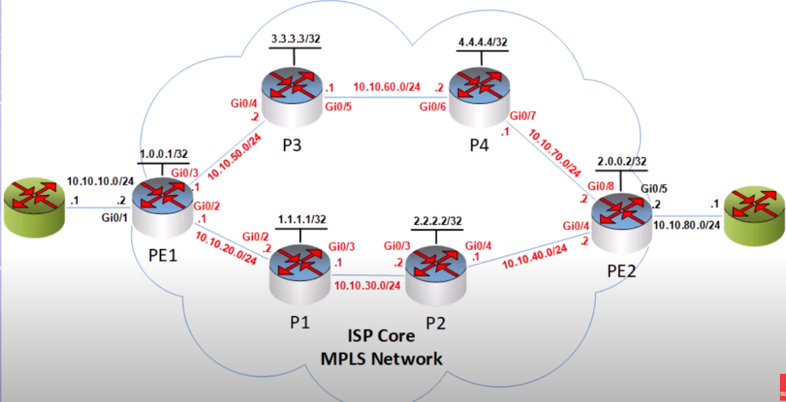
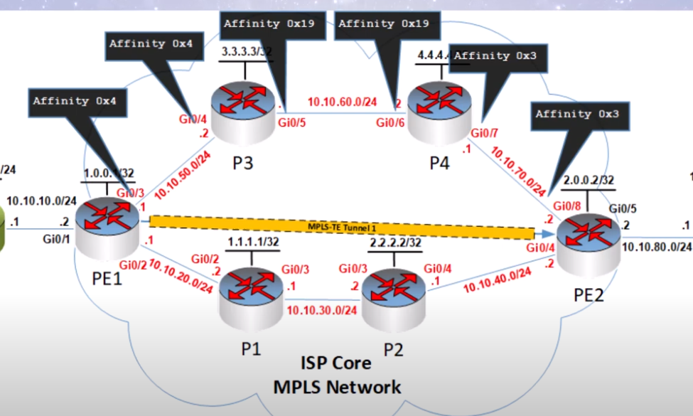
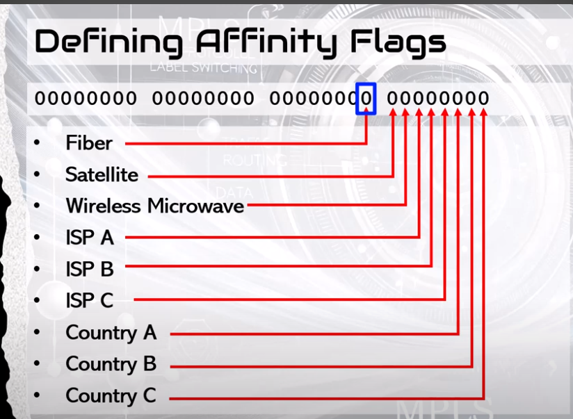
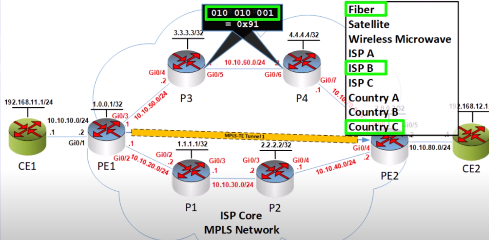
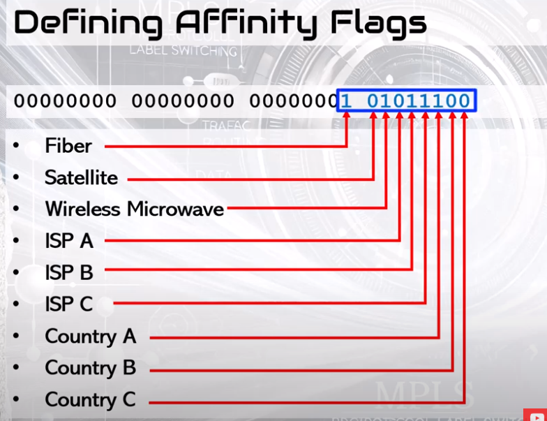
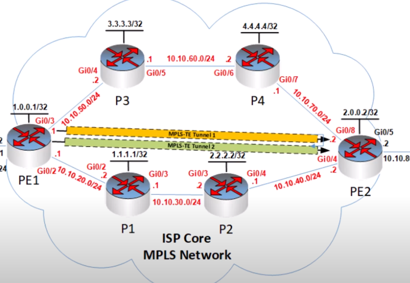

# MPLS configurations using Cisco IOS routers

- See mpls-network-topology.png for the used topology

## EBGP peerings between the CE and PE routers

- CE1 router:

```
router bgp 1
 neighbor 10.10.10.2 remote-as 100
 network 192.168.11.0 mask 255.255.255.0
```

- PE1 router:

```
router bgp 100
 neighbor 10.10.10.1 remote-as 1
```

- CE2 router:

```
router bgp 2
 neighbor 10.10.50.1 remote-as 100
 network 192.168.12.0 mask 255.255.255.0
```

- PE2 router:

```
router bgp 100
 neighbor 10.10.50.2 remote-as 2
```

## OSPF configuration between PE and P routers

### Do not advertise the networks between CE and PE routers in OSPF

- PE1:

```
router ospf 1
 network 10.10.20.0 0.0.0.255 area 0
 network 1.1.1.1 0.0.0.0 area 0
 passive-interface g0/1
```

- P1:

```
router ospf 1
 network 10.10.20.0 0.0.0.255 area 0
 network 10.10.30.0 0.0.0.255 area 0
 network 2.2.2.2 0.0.0.0 area 0
```

- P2:

```
router ospf 1
 network 10.10.30.0 0.0.0.255 area 0
 network 10.10.40.0 0.0.0.255 area 0
 network 3.3.3.3 0.0.0.0 area 0
```

- PE2:

```
router ospf 1
 network 10.10.40.0 0.0.0.255 area 0
 network 4.4.4.4 0.0.0.0 area 0
 passive-interface g0/1
```

## iBGP peerings between all PE routers to exchange the information about the customer IP address prefixes

- PE1: 
```
router bgp 100
 neighbor 4.4.4.4 remote-as 100
 neighbor 4.4.4.4 update-source lo 0
 neighbor 4.4.4.4 next-hop-self
```
- PE2:

```
router bgp 100
 neighbor 1.1.1.1 remote-as 100
 neighbor 1.1.1.1 update-source lo 0
 neighbor 1.1.1.1 next-hop-self
```

- Do the same for all other PE routers - enable iBGP peerings between them

## Enable MPLS on the interfaces of PE and P routers

- PE1:

```
interface g0/2
 mpls ip
```

- P1:

```
interface g0/2
 mpls ip
interface g0/3
 mpls ip
```

- P2:
```
interface g0/3
 mpls ip
interface g0/4
 mpls ip
```

- PE2:

```
interface g0/4
 mpls ip
```

- You can also enable MPLS on all OSPF-participating interfaces

  - PE1, PE2, P1, P2

```
router ospf 1
 mpls ldp autoconfig
```

## Configure VRFs and on PE routers

- PE1:
    - RD 100:1 should be configured on both PE routers and associated with VRF GREEN
```
ip vrf GREEN
 rd 100:1
 route-target import 100:1
 route-target export 100:1
interface g0/2
 ip vrf forwarding GREEN
 
```

## Enable VPNv4 address-family in BGP for exchanging of VPNv4 routes

- PE1 - Enable vpnv4 address-family routes, and disable IPv4 routes to be exchanged:
```
router bgp 100
 address-family vpnv4
  neighbor 4.4.4.4 activate
 exit address-family
 address-family ipv4
  no neighbor 4.4.4.4 activate
 exit address-family
```

- PE2 - enable vpnv4 address-family, and disable IPv4 routes to be exchanged

```
router bgp 100
 address-family vpnv4
  neighbor 1.1.1.1 activate
 exit address-family
 address-family ipv4
  no neighbor 1.1.1.1 activate
 exit address-family
```

- Verify BGP shared information

```
show bgp vpnv4 unicast all summary
```

## Configure CE routers to exchange vpnv4 routes:

- CE1:

```
interface lo 0 
 ip address 192.168.11.1 255.255.255.0
router bgp 1
 neighbor 10.10.10.2 remote-as 100
 network 192.168.11.0 mask 255.255.255.0
```

- PE1 - activate the VRF BGP peering and neighbor

```
router bgp 100
 address-family ipv4 vrf GREEN
 neighbor 10.10.10.1 remote-as 1
```

- CE2:

```
interface l0
 ip address 192.168.12.1 255.255.255.0
router bgp 2
 neighbor 10.10.50.2 remote-as 100
 network 192.168.12.0 mask 255.255.255.0
```

- PE2 - activate the VRF BGP peering and neighbor

```
router bgp 100
 address-family ipv4 vrf GREEN
 neighbor 10.10.50.1 remote-as 2
```

- Verify BGP peering on PE1:

```
show bgp vpnv4 unicast vrf GREEN

show bgp vpnv4 unicast all 192.168.12.0

show ip cef vrf GREEN 192.168.12.0
```

- Verifying MPLS forwarding table on P1 or P2:

    - These 2 routers does not have any knowledge of VPN labels added by PEs 

```
show mpls forwarding-table
```

- Traceroute in my lab:

```
CE1#traceroute 192.168.12.1
Type escape sequence to abort.
Tracing the route to 192.168.12.1
VRF info: (vrf in name/id, vrf out name/id)
  1 10.10.10.2 2 msec 2 msec 1 msec
  2 10.10.20.2 [MPLS: Labels 17/21 Exp 0] 2 msec 4 msec 2 msec
  3 10.10.40.1 [AS 65002] [MPLS: Label 21 Exp 0] 2 msec 1 msec 1 msec
  4 10.10.40.2 [AS 65002] 1 msec 5 msec * 
CE1#
```

## MPLS layer 2 VPNs

- Configure AToM to transport Ethernet frames over MPLS

    - BGP is not needed to be configured between PE routers
    
    - PE1 configuration for EoMPLS (Ethernet over MPLS)
        
        - xconnect command creates a pseudowire (a virtual layer 2 circuit) on that interface
        
        - 4.4.4.4 is the loopback address of PE2
        
        - 20 is the virtual circuit ID (or VCID)
    
```
interface g0/0
 xconnect 4.4.4.4 20 encapsulation mpls
```
    - PE2 configuration for EoMPLS 
    
```
interface g0/5
 xconnect 1.1.1.1 20 encapsulation mpls
```

- CE1 and CE2 configuration

- CE1
    
```
interface g0/1
 ip address 192.168.10.1 255.255.255.0
```

- CE2:

```
interface g0/1
 ip address 192.168.10.2 255.255.255.0
```
- In the case of AToM EoMPLS VPN - the PE routers become LDP neighbors directly between them

- Show commands:

```
show mpls ldp neighbor 4.4.4.4

show mpls l2transport binding
```

## MPLS EVPN configuration (Ethernet VPN over MPLS)

- Configure MP BGP on the PE routers

- PE1 router 

```
router bgp 100
 neighbor 4.4.4.4 remote-as 100
 neighbor 4.4.4.4 update-source l0
 neighbor 4.4.4.4 next-hop-self
 address-family l2vpn evpn
  neighbor 4.4.4.4 activate
 exit address-family
```
- Enable customer-facing interfaces to operate in a bridge domain at layer 2 - PE1

```
conf t
bridge-domain 10
 member g0/1 service-instance 10
interface g0/1
 service instance 10 ethernet
  encapsulation dot1q 10
```


- PE2 router

```
router bgp 100
 neighbor 1.1.1.1 remote-as 100
 neighbor 1.1.1.1 update-source l0
 neighbor 1.1.1.1 next-hop-self
 address-family l2vpn evpn
  neighbor 4.4.4.4 activate
 exit address family
bridge-domain 10
 member g0/1 service-instance 10
 interface g0/1
 service instance 10 ethernet
  encapsulation dot1q 10
```

- Enable the CE routers to send traffic with vlan tag 10

- CE1:

```
interface g0/1
 no shutdown
interface g0/1.10
 encapsulation dot1q 10
 ip address 192.168.11.1 255.255.255.0
```

- CE2:

```
interface g0/1
 no shutdown
interface g0/1.10
 encapsulation dot1q 10
 ip address 192.168.11.5 255.255.255.0
```
## Configuring OSPF underlay config for MPLS TE (TE = Traffic Engineering)

- Please check the mpls-te-topology.png for the topology information

- First make sure you configured the routers (IP addresses, loopback addresses), enable OSPF between routers, enable MPLS on the router's interfaces

    - 1. Enable MPLS TE support globally and on all relevant interfaces(on all routers that do MPLS)
    
    - 2. Configure OSPF underlay and enable TE extensions(on all routers that do MPLS)
    
    - 3. Enable and configure RSVP-TE for TE signalling(on all MPLS-enabled interfaces)
    
    - 4. Create TE tunnel interface
    
- 1.
    
```
conf t
mpls traffic-eng tunnels

interface g0/2
 mpls traffic-eng tunnels
 
interface g0/3
 mpls traffic-eng tunnels
```

- 2.

```
conf t
router ospf 1
 mpls traffic-eng area 0
 mpls traffic-eng router-id l0
```

- 3.

```
interface g0/2
 ip rsvp bandwidth 500000 # in kilobytes per second
 
interface g0/3
 ip rpvp bandwidth 500000 # in kylobites per second
```
- 4.

- PE1: - Tunnel is unidirectional - you can create the tunnel only on one end 

```
interface tunnel 1
 ip unnumbered l0
 tunnel-mode mpls traffic-eng
 tunnel destination 2.0.0.2
 tunnel mpls traffic-eng bandwidth 1000 # in kylobites per second
 tunnel mpls traffic-eng path-option 1 dynamic # USE CSPF algorithm to calculate the best path based on OSPF topology
```

- PE2: - This is made only if you want to route the traffic back using the tunnel also

```
interface tunnel 1
 ip unnumbered l0
 tunnel-mode mpls traffic-eng
 tunnel destination 1.0.0.1
 tunnel mpls traffic-eng bandwidth 1000
 tunnel mpls traffic-eng path-option 1 dynamic
```

- Show commands for OSPF in MPLS TE

- OSPF uses an Type 10 LSA (Opaque LSA) for MPLS TE

```
show ip ospf mpls traffic-eng link

show ip ospf database opaque-area

show mpls traffic-eng topology 1.0.0.1

show ip rsvp interface

show mpls traffic-eng tunnels
```

## Static routing in MPLS TE

- See mpls-te-topology-full.png for more information

- Configure OSPF between CE and PE routers:

- CE1:

```
router ospf 1
 network 192.168.11.0 0.0.0.255 area 0
 network 10.10.10.0 0.0.0.255 area 0
```

- PE1:

```
router ospf 1
 network 10.10.10.0 0.0.0.255 area 0
ip route 192.168.12.0 255.255.255.0 tunnel 1
ping 192.168.12.1 # return traffic does not come through the tunnel) - routed back using regular ospf
```

- CE2:

```
router ospf 1
 network 192.168.12.0 0.0.0.255 area 0
 network 10.10.80.0 0.0.0.255 area 0
```

- PE2:

```
router ospf 1
 network 10.10.80.0 0.0.0.255 area 0
ip route 192.168.11.0 255.255.255.0 tunnel 1
```

- Show commands:

- PE1:

```
show interfaces tunnel 1
show mpls forwarding-table
show mpls forwarding-table 192.168.12.0 detail
```

## MPLS TE autoroute anounce

- On PE1 router - full tunnel interface configuration:

```
interface tunnel 1
 ip unnumbered l0
 tunnel mode mpls traffic-eng
 tunnel destination 2.0.0.2
 tunnel mpls traffic-eng bandwidth 1000
 tunnel mpls traffic-eng path-option 1 dynamic
 tunnel mpls traffic-eng autoroute anounce
  # influence which metric is taked by default in consideration when routing traffic through the tunnel
 tunnel mpls traffic-eng path-selection metric ?
  igp    te
```

- On PE2 - to make the tunnel bidirectional

```
interface tunnel 1
 ip unnumbered l0
 tunnel mode mpls traffic-eng
 tunnel destination 1.0.0.1
 tunnel mpls traffic-eng bandwidth 1000
 tunnel mpls traffic-eng path-option 1 dynamic
 tunnel mpls traffic-eng autoroute anounce
```

- Show commands:

```
show mpls forwarding-table
```
## MPLS TE autoroute destination

- On PE1 router - full interface tunnel 1 configuration

```
interface tunnel 1
 ip unnumbered l0
 tunnel mode mpls traffic-eng
 tunnel destination 1.0.0.1
 tunnel mpls traffic-eng bandwidth 1000
 tunnel mpls traffic-eng path-option 1 dynamic
 tunnel mpls traffic-eng autoroute destination
```

- On PE2 - to make the tunnel bidirectional

```
interface tunnel 1
 ip unnumbered l0
 tunnel mode mpls traffic-eng
 tunnel destination 1.0.0.1
 tunnel mpls traffic-eng bandwidth 1000
 tunnel mpls traffic-eng path-option 1 dynamic
 tunnel mpls traffic-eng autoroute destination
```
- Show commands

```
show mpls forwarding-table

show ip route | in tunnel 1

show running-config interface tunnel1
```

## Set routes using policy based routing to announce routes in MPLS TE

- Create a route map that matches the traffic destined to 192.168.12.0/24 and set the exit interface tunnel 1 on PE1

```
ip access-list extended CE2Customer
 permit ip any 192.168.12.0 0.0.0.255
 exit
 
route-map PBR_CE2Customer_Tu1 permit 10
 match ip address CE2Customer
 set interface Tunnel 1
 exit

interface g0/1
 ip policy route-map PBR_CE2Customer_Tu1
```

- Show commands:

```
show route-map
```

## Set metric for MPLS TE routes to influence the path taken by MPLS TE traffic

- PE1 (g0/3) + P3 (g0/5) + P4 (g0/7)

```
interface g0/3
 mpls traffic-eng administrative-weight 1
```

- PE1 - verify the path taked by the tunnel traffic

```
show mpls traffic-eng tunnels tunnel 1
```

### Set explicit paths in MPLS TE

- Topology:



- Existing configuration for MPLS TE tunnel

```
interface tunnel1
 ip unnumbered loopback 0
 tunnel mode mpls traffic-eng
 tunnel destination 2.0.0.2
 tunnel mpls traffic-eng bandwidth 1000
 tunnel mpls traffic-eng path-option 1 dynamic
```

- PE1 verify the path the MPLS tunnel takes

```
show mpls traffic-eng tunnels tunnel 1
```

- The above command show the RSVP information and the underlying IGP path chosen based on the underlying IGP metric

- Configuring an explicit path to exclud router P1 from the MPLS TE tunnel 

```
ip explicit-path name P1_EXCLUDE enable
 exclude-address 1.1.1.1
 exit
 
interface tunnel 1
 tunnel mpls traffic-eng path-option 1 explicit name P1_EXCLUDE
```

- Include g0/7 interface of P4 (10.10.70.1/24) in an MPLS tunnel path

- First remove the above explicit path configured:


```
interface tunnel 1
 no tunnel mpls traffic-eng path-option 1 explicit name P1_EXCLUDE
```

- Create a new explicit path

```
ip explicit-path name P4Gi07_INCLUDE enable
 next-address ? 
    loose # somewhere along the path
    strict # directly connected
    
 next-address loose 10.10.70.1
 exit
 
interface tunnel 1
 tunnel mpls traffic-eng path-option 1 explicit name P4Gi07_INCLUDE 
```

### MPLS-TE and Affinity Attributes

- Each link in the network is assigned an affinity

- Applied on the interfaces of the PE and P routers



- Next we can define a series of Affinity Attributes constraints on the tunnel

- Constrained Shortest Path First (CSPF) algorithm will determine the path the tunnel will take

- The algorithm applies an Bitwise AND Operation between the configured values for affinity attributes configured on the link and the affinity constraints defined

- CSPF evaluates each link independently

- Bitwise AND is performed between each link's affinity values and our affinity constraints

- **Affinity Attributes Mask**

    - We may not want to take all 32 flags into account for our particular tunnel

    - We may want for our tunnel to match last 5 right bits only and ignore the others (for example)
  
    - 00000000 00000000 00000000 000**10001**
    
    - We can use the following mask in order to match only the latest bits
    
    - 00000000 00000000 00000000 000**11111**
    
- Affinity flags and affinity mask are written in hex like:

    - Affinity flags: 0x11
    
    - Affinity mask: 0x1F

- **Defining Affinity Flags**



- Assigning affinity flags to a link



- Configuring affinity attributes

- P3:

```
interface G0/5
 mpls traffic-eng attribute-flags 0x91
```

- P4:

```
interface G0/6
 mpls traffic-eng attribute-flags 0x91
```

- You should configure attributes in all interfaces in all of your topology

- If there are no affinity flags configured on a link it is taken that you have all affinity flags set to 0

- Defining affinity constraints



- Affinity constraints: 0x15c

- Affinity mask: 0x1FF

- Configuring the affinity constraints for the tunnel:

```
interface tunnel 1
 tunnel mpls traffic-eng affinity 0x15C mask 0x1FF
```

### MPLS-TE Class-Based Tunnel selection

- CBTS (Class Based Tunnel Selection) is used when there are more than 1 tunnel from the same head-end router to the same tail-end router

- CBTS examines the EXP field into from the MPLS header of the packet to decide which tunnel should be used to forward the traffic

- EXP field is used for Quality of Service (3 bits- range from 0 to 7)

- All tunnels participating in CBTS are known as a bundle



- Paths taken by each tunnel in the bundle can be the same or can be different based on the constraints on each tunnel

- CBTS is more a QoS mechanism than a routing mechanism

- To configure CBTS we configure a Master Tunnel

- We create the Master Tunnel and assign the underlying TE tunnels to it as member tunnels

- The Master Tunnel is configured in the Headend Router (PE1)

- CBTS will distribute routed traffic to the appropriate tunnel based on the EXP value 

- Tunnels configuration

```
interface tunnel 1
 ip unnumbered loopback 0
 tunnel mode mpls traffic-eng
 tunnel destination 2.0.0.2
 tunnel mpls traffic-eng bandwidth 1000
 tunnel mpls traffic-eng path-option 1 dynamic
 exit
 
interface tunnel 2
 ip unnumbered loopback 0
 tunnel mode mpls traffic-eng
 tunnel destination 2.0.0.2
 tunnel mpls traffic-eng bandwidth 750
 tunnel mpls traffic-eng path-option 1 dynamic
```

- Assign EXP values for each tunnel

```
interface tunnel 1
 tunnel mpls traffic-eng exp 1
 exit

interface tunnel 2
 tunnel mpls traffic-eng exp 2
 exit
```

- Creating the Master Tunnel

```
interface tunnel 3
 ip unnumbered loopback 0
 tunnel mode mpls traffic-eng
 tunnel destination 2.0.0.2
 tunnel mpls traffic-eng autoroute announce
 tunnel mpls traffic-eng exp-bundle master
 tunnel mpls traffic-eng exp-bundle member tunnel 1
 tunnel mpls traffic-eng exp-bundle member tunnel 2
```

- Routing should be configured on the master tunnel, only when the routing is configured on the master tunnel, only then will CBTS work

- Viewing the master tunnel information

```
show mpls traffic-eng tunnels tunnel 3
```

- Test with ping setting a ToS value (used for QoS marking)

- ToS value when used in MPLS are mapped inside the EXP values

- From CE1 router

```
ping 2.0.0.2 tos 32 repeat 50
```

- ToS 32 is mapped to a EXP value of 1

- Viewing which tunnel was used

```
show interfaces tunnel 1 | include packets

# should see 50 output packets
```

- ToS 64 is mapped to a EXP value of 2

```
ping 2.0.0.2 tos 64 repeat 40
```

- Viewing the result on tunnel 2

```
show interface tunnel 2 | include packets

# should see 40 output packets
```


