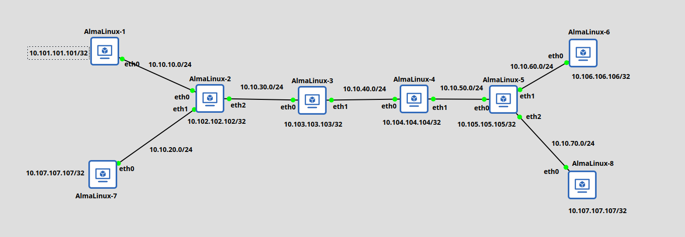

## MPLS L3 VPN with almalinux VMs in GNS3



- Install required software

```
dnf makecache
dnf install -y epel-release kernel-modules-extra
dnf install -y frr
```

- Modprobe MPLS kernel modules

```
cat >/etc/modules-load.d/mpls.conf <<EOF
mpls_router
mpls_iptunnel
mpls_gso
dummy
EOF
```

- Patch sysctl for MPLS forwarding

```
modprobe mpls_router
modprobe mpls_iptunnel
cat >/etc/sysctl.d/90-mpls-router.conf <<EOF
net.ipv4.ip_forward=1
net.ipv6.conf.all.forwarding=1
net.ipv4.conf.all.rp_filter=0
net.mpls.platform_labels=1048575
net.ipv4.tcp_l3mdev_accept=1
net.ipv4.udp_l3mdev_accept=1
net.mpls.conf.lo.input=1
EOF
sysctl -p /etc/sysctl.d/90-mpls-router.conf
```

- Load daemons and start frr

```
sed -i "s/=no/=yes/g" /etc/frr/daemons
systemctl enable frr
systemctl restart frr
```

- Create a dummy interface on each VM

- Alma7:

```
nmcli conn add type dummy con-name dummy0 ifname dummy0 ipv4.method manual ipv4.address 10.107.107.107/32
nmcli conn up dummy0
nmcli conn add type ethernet ifname eth0 con-name eth0 ipv4.method manual ipv4.address 10.10.20.1/24
nmcli conn up dummy0
```

- Alma1: 

```
nmcli conn add type dummy con-name dummy0 ifname dummy0 ipv4.method manual ipv4.address 10.101.101.101/32
nmcli connection up dummy0
nmcli conn add type ethernet ifname eth0 con-name eth0 ipv4.method manual ipv4.address 10.10.10.1/24
nmcli conn up eth0
```

- Alma2:

```
nmcli conn add type dummy con-name dummy0 ifname dummy0 ipv4.method manual ipv4.address 10.102.102.102/32
nmcli conn up dummy0
nmcli conn add type ethernet ifname eth2 con-name eth2 ipv4.method manual ipv4.address 10.10.30.1/24
nmcli conn up eth2

nmcli connection add type vrf ifname vrf1 con-name vrf1 table 155 ipv4.method disabled ipv6.method disabled
nmcli conn up vrf1

nmcli conn add type ethernet ifname eth0 con-name eth0 master vrf1 ipv4.method manual ipv4.address 10.10.10.2/24
nmcli conn up eth0

nmcli connection add type vrf ifname vrf2 con-name vrf2 table 165 ipv4.method disabled ipv6.method disabled
nmcli conn up vrf2

nmcli conn add type ethernet ifname eth1 con-name eth1 master vrf2 ipv4.method manual ipv4.address 10.10.20.2/24
nmcli conn up eth1

ip vrf exec vrf1 ping 10.10.10.1
ip vrf exec vrf2 ping 10.10.20.1
```

- Alma3:

```
nmcli conn add type dummy con-name dummy0 ifname dummy0 ipv4.method manual ipv4.address 10.103.103.103/32
nmcli conn up dummy0
nmcli conn add type ethernet ifname eth0 con-name eth0 ipv4.method manual ipv4.address 10.10.30.2/24
nmcli conn up eth0
nmcli conn add type ethernet ifname eth1 con-name eth1 ipv4.method manual ipv4.address 10.10.40.1/24
nmcli conn up eth1
```

- Alma4:

```
nmcli conn add type dummy con-name dummy0 ifname dummy0 ipv4.method manual ipv4.address 10.104.104.104/32
nmcli conn up dummy0
nmcli conn add type ethernet ifname eth0 con-name eth0 ipv4.address 10.10.40.2/24 ipv4.method manual
nmcli conn up eth0
nmcli conn add type ethernet ifname eth1 con-name eth1 ipv4.address 10.10.50.1/24 ipv4.method manual
nmcli conn up eth1
```

- Alma5:

```
nmcli conn add type dummy con-name dummy0 ifname dummy0 ipv4.method manual ipv4.address 10.105.105.105/32
nmcli conn up dummy0
nmcli conn add type ethernet ifname eth0 con-name eth0 ipv4.address 10.10.50.2/24 ipv4.method manual
nmcli conn up eth0

nmcli connection add type vrf ifname vrf1 con-name vrf1 table 155 ipv4.method disabled ipv6.method disabled
nmcli conn up vrf1

nmcli conn add type ethernet ifname eth1 con-name eth1 master vrf1 ipv4.method manual ipv4.address 10.10.60.1/24
nmcli conn up eth1

nmcli connection add type vrf ifname vrf2 con-name vrf2 table 165 ipv4.method disabled ipv6.method disabled
nmcli conn up vrf2

nmcli conn add type ethernet ifname eth2 con-name eth2 master vrf2 ipv4.method manual ipv4.address 10.10.70.1/24
nmcli conn up eth2

ip vrf exec vrf1 ping 10.10.60.2
ip vrf exec vrf2 ping 10.10.70.2
```

- Alma6:

```
nmcli conn add type dummy con-name dummy0 ifname dummy0 ipv4.method manual ipv4.address 10.106.106.106/32
nmcli conn up dummy0
nmcli conn add type ethernet ifname eth0 con-name eth0 ipv4.method manual ipv4.address 10.10.60.2/24
nmcli conn up eth0
```

- Alma8:

```
nmcli conn add type dummy con-name dummy0 ifname dummy0 ipv4.method manual ipv4.address 10.108.108.108/32
nmcli conn up dummy0
nmcli conn add type ethernet ifname eth0 con-name eth0 ipv4.method manual ipv4.address 10.10.70.2/24
nmcli conn up eth0
```
