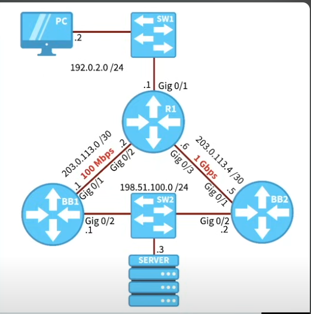

## PBR on Cisco routers

- Topology:




- Traffic from the PC  to the server will be taking the path to BB2 (instead to BB1)

```
access-list 100 permit ip host 192.0.2.2 host 198.51.100.3 

route-map CLIENT-TO-SERVER 
 match ip address 100
 set ip next-hop 203.0.113.1
 
interface g0/1
 ip policy route-map CLIENT-TO-SERVER 
```

